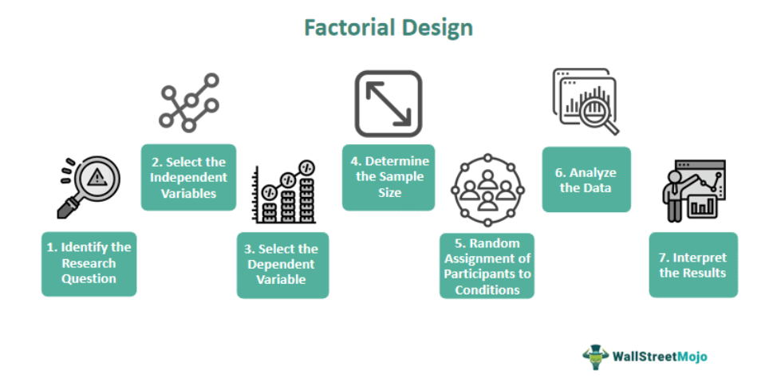

The exploration of economic theories has undergone significant evolution, with experimental and behavioral economics playing crucial roles in this transformative journey. As traditional economic models often rely on abstract mathematical frameworks, the advent of experimental economics, pioneered by Vernon Smith, has introduced a more empirical approach to studying economic phenomena. By creating controlled experimental settings, researchers can observe human behavior and market mechanisms, thereby providing valuable insights that contrast with conventional theoretical predictions.

Behavioral economics complements this by considering the psychological elements influencing economic decisions. Unlike classical models that assume rational behavior, behavioral economics recognizes that individuals often display irrational tendencies due to cognitive biases. This understanding is pivotal for developing models that more accurately reflect consumer behavior, thus enhancing market predictions and policy designs.



Within financial markets, these economic insights have profound applications. Economic experiments have been instrumental in simulating market conditions and assessing the implications of potential policy interventions. Such methodologies are invaluable for policy-making, offering a predictive lens through which to gauge the effectiveness of new economic strategies. Additionally, the rise of algorithmic trading represents a direct application of these economic understandings, where computational methods utilize behavioral and experimental economics to refine trading strategies.

Algorithmic trading has become an essential component of modern financial markets, enhancing liquidity and efficiency by leveraging advanced computational techniques. Machine learning and statistical analysis, informed by economic experiments, aid in optimizing these algorithmic systems, ensuring they adapt to complex market dynamics. Thus, the interplay between experimental and behavioral economics and technology like algorithmic trading signifies an exciting frontier in economic and financial analysis.

By exploring these intertwined fields, this article aims to provide readers with a comprehensive understanding of how experimental and behavioral economics contribute to financial market strategies. Moreover, it highlights the integration of algorithmic trading as a catalyst for innovation in market practices. Through this exploration, we seek to demonstrate the vital role these disciplines play in informing and shaping economic and financial landscapes.

## Table of Contents

## What is Experimental Economics?

Experimental economics examines human behavior in controlled settings, presenting an alternative to traditional mathematical models by emphasizing empirical observation. This field was pioneered by Vernon L. Smith, whose groundbreaking work established scientific experiments as vital tools for analyzing market mechanisms and validating economic theories. Unlike conventional economics, which often relies on abstract models and assumptions, experimental economics focuses on real-world behaviors, providing insights that can more accurately reflect market realities.

Vernon Smith's contributions laid the groundwork for evaluating how theoretical equilibrium prices compare with actual market behaviors. His experiment-based approach provided new methodologies to observe market dynamics, moving beyond mere theoretical prediction. For instance, Smith's work on double auction markets demonstrated how actual transaction prices tend to converge towards equilibrium prices predicted by theory, despite the presence of information asymmetry and other real-world complexities.

Key methodologies in experimental economics involve creating controlled environments where variables can be manipulated to observe outcomes. These experiments often simulate market conditions, allowing researchers to isolate specific factors influencing decision-making. An example of this is the use of laboratory markets to analyze auction designs, market entry and [exit](/wiki/exit-strategy) strategies, and pricing mechanisms. Such experimental setups help unravel the implications of different economic policies and assumptions.

In terms of applications, experimental economics has significantly impacted policy-making and market assessments. By replicating market environments within a laboratory setting, researchers can forecast the effects of policy changes before implementation. This has been particularly useful in areas like emissions trading schemes, where experiments have helped in designing systems that effectively reduce pollution while minimizing economic disruption.

Smith's experimental approach reshaped the understanding of market mechanics, emphasizing the need to consider human behavior in economic modeling. This perspective acknowledges that individuals may not always act rationally, as traditional models suggest. Such insights are crucial for developing more robust economic theories that account for behavioral nuances. Ultimately, experimental economics bridges the gap between theoretical constructs and practical applications, providing valuable tools for economists and policymakers.

## Understanding Behavioral Economics

Behavioral economics explores the psychological underpinnings of economic decision-making, challenging the tenets of classical economics which often assumes that individuals act in rational and self-interested ways. This field combines insights from psychology and economics to understand how cognitive biases and emotional influences can lead to systematic deviations from optimal decision-making processes.

One of the core concepts in behavioral economics is the recognition of cognitive biases, which are systematic patterns of deviation from norm or rationality in judgment. These biases affect market predictions and the design of economic policies. For instance, the anchoring effect demonstrates how individuals tend to rely heavily on the first piece of information encountered (the "anchor") when making decisions. This can significantly impact pricing strategies and consumer expectations in financial markets.

Additionally, loss aversion, a principle identified through prospect theory developed by Daniel Kahneman and Amos Tversky, highlights that individuals are more sensitive to losses than to equivalent gains. This insight can explain various market phenomena, such as why investors might hold onto losing stocks longer than rational models would predict.

Behavioral economics also emphasizes the importance of bounded rationality, a concept introduced by Herbert Simon, which suggests that while individuals aim to make rational decisions, cognitive limitations and time constraints often lead to suboptimal choices. This recognition fosters more accurate modeling of consumer behavior by taking into account the limited processing capability of human minds when faced with complex financial choices.

By integrating these psychological dimensions, behavioral economists can create models that better predict actual consumer behaviors, especially in contexts where traditional economic theories may fall short. For example, understanding that people may prioritize perceived fairness over pure monetary gain can help design more effective public policies and market interventions.

Moreover, behavioral economics provides a framework for nudge theory, which involves subtly guiding people's behavior in beneficial directions without restricting their freedom of choice. This approach, as popularized by Richard Thaler, can be applied in areas such as retirement savings plans, where automatically enrolling employees increases participation rates significantly compared to requiring individuals to opt-in actively.

In summary, behavioral economics offers a robust framework for comprehending the complexities of human decision-making and its repercussions on economic activities. By accounting for irrational behaviors and cognitive limitations, it provides valuable insights that enhance market predictions and inform the design of more effective economic policies.

## Economic Experiments and Real-World Applications

Economic experiments are crucial in translating economic theories into practical applications. By simulating controlled environments, researchers can analyze market behavior and test the viability of economic policies before any real-world implementation. One prominent area where economic experiments have shown substantial impact is in the design and evaluation of emissions trading schemes. These schemes are critical components of global efforts to reduce greenhouse gas emissions and combat climate change.

Emissions trading schemes (ETS), often referred to as cap-and-trade systems, serve as a policy tool to control pollution by providing economic incentives for reducing emissions. Through economic experiments, policymakers can test the effectiveness of various ETS designs. For example, experiments may vary the cap levels or the allocation of permits to simulate different market conditions. These pre-implementation analyses are vital for understanding potential market reactions and ensuring the policy's environmental and economic objectives are met.

An important case study is the European Union Emissions Trading System (EU ETS), the world's largest carbon market. Experimental economics played a significant role in fine-tuning the system's components, such as auctioning permits and managing market [volatility](/wiki/volatility-trading-strategies). Through simulations, researchers could predict the system's impact on both emissions and economic outputs, allowing for adjustments that increased both compliance and economic efficiency.

Moreover, economic experiments extend beyond environmental policy, influencing numerous facets of global economic policy. For instance, auction theory and experiments have been extensively utilized in spectrum auctions for telecommunications. These experiments help determine the optimal auction format, thereby maximizing revenue while ensuring fair competition. By testing various auction designs in a controlled setting, policymakers can anticipate potential bidder strategies and market dynamics.

Another illustrative application is in labor market policies. Experiments have been conducted to assess the impacts of minimum wage increases, job training programs, and other labor market interventions. By simulating these scenarios, stakeholders can identify unintended consequences, such as unemployment rises or skill mismatches, and refine policy designs accordingly.

The insights gained from economic experiments are not limited to economic policies but extend to political frameworks as well. For instance, voting experiments have been conducted to understand electoral behaviors and the effects of different voting systems on political representation and stability. These experiments provide empirical evidence that can guide electoral reform and enhance democratic processes.

Overall, economic experiments offer a robust framework for testing hypotheses and evaluating policy implications in a controlled, risk-free environment. By bridging theoretical models with empirical data, they significantly inform policy decisions, improve economic outcomes, and ensure that implemented policies are both effective and efficient. As economic challenges evolve, the role of economic experiments in shaping policy and market strategies becomes increasingly indispensable.

## Algorithmic Trading: The Intersection with Economics

Algorithmic trading harnesses computational and statistical techniques derived from economic theories, notably experimental and behavioral economics, to optimize trading strategies and enhance market [liquidity](/wiki/liquidity-risk-premium). At its core, [algorithmic trading](/wiki/algorithmic-trading) involves the use of algorithms—sequential sets of operations executed to perform calculations, process data, and automate reasoning tasks—to execute trades based on pre-defined criteria. This reduces human intervention, improves transaction speed, and potentially decreases trading costs.

Economic insights play a crucial role in algorithm development. For instance, algorithms can be designed using concepts from experimental economics, which explores market mechanisms through controlled experiments, to simulate and anticipate market behaviors. Behavioral economics, which examines the effects of psychological factors on economic decisions, informs the development of algorithms that account for human biases and irrationalities. By integrating these insights, algorithms can detect anomalies or patterns not accounted for in traditional models, thereby enhancing strategy formulation.

Machine learning significantly elevates the predictive capabilities of algorithmic trading systems. Machine learning, a subset of [artificial intelligence](/wiki/ai-artificial-intelligence), allows systems to learn from and make predictions based on data. In algorithmic trading, [machine learning](/wiki/machine-learning) models can analyze vast datasets to identify patterns predictive of market movements. For example, neural networks can be employed to forecast stock prices or detect [arbitrage](/wiki/arbitrage) opportunities, learning and refining strategies continuously with the influx of new data.

```python
# Example of a basic machine learning model using Python to predict stock prices
import numpy as np
from sklearn.model_selection import train_test_split
from sklearn.linear_model import LinearRegression
import yfinance as yf

# Download historical stock prices
data = yf.download('AAPL', start='2020-01-01', end='2021-01-01')

# Feature engineering: Use historical closing prices to predict the next closing price
data['Next_Day_Close'] = data['Close'].shift(-1)
data.dropna(inplace=True)

X = data[['Close']].values[:-1]
y = data['Next_Day_Close'].values[1:]

# Train-test split
X_train, X_test, y_train, y_test = train_test_split(X, y, test_size=0.2, random_state=42)

# Linear Regression model
model = LinearRegression()
model.fit(X_train, y_train)

# Making predictions
predictions = model.predict(X_test)
```

Automated trading has significant implications for market stability and efficiency. On one hand, it enhances liquidity by executing trades more swiftly than human traders can. Moreover, algorithms help minimize market impact by optimally timing trades to avoid price disruption. On the other hand, automated trading raises concerns regarding market volatility and the potential for systemic risk. Events like the 2010 Flash Crash highlight how poorly designed or mismanaged algorithms can disrupt markets, leading to rapid price fluctuations or cascading effects. Regulatory frameworks have thus evolved to monitor algorithmic trading practices, ensuring these systems enhance rather than compromise market integrity.

The integration of experimental and behavioral economics with advanced computational techniques like machine learning positions algorithmic trading as a sophisticated, dynamic contributor to modern financial markets. As these disciplines continue to advance, their confluence promises ever more refined trading systems that leverage comprehensive economic insights.

## Conclusion

Experimental and behavioral economics offer crucial insights into market behavior and contribute significantly to shaping financial strategies. These fields address the complexities that traditional economic models might overlook by factoring in the realities of human behavior and response to market stimuli. Experimental economics employs structured experiments to test theoretical models, particularly in conditions reflecting real-world market environments. This approach helps identify deviations from expected rational behaviors, enabling economists to refine their models and predictions.

Economic experiments are instrumental in unraveling complex market dynamics, forming the foundation for developing technologies like algorithmic trading. By simulating market interactions and participant behavior under controlled conditions, researchers can identify patterns and inform the algorithms used in trading systems. Algorithmic trading systems benefit from the insights of behavioral economics, as understanding cognitive biases and decision-making processes allows for more accurate market forecasts and risk assessments.

Integrating knowledge from these economic disciplines empowers market participants and policymakers to make more data-driven, effective decisions. The synergy between economic research and technological advancement is essential, as it enhances the precision of financial models and improves market outcomes. With continual technological progress, this collaboration is expected to further advance financial markets, driving them toward greater stability and efficiency. The iterative process of refining economic theories through experimental and behavioral insights ensures that financial strategies remain robust and adaptive to changing market conditions.

## References & Further Reading

[1]: Smith, V. L. (2007). ["Rationality in Economics: Constructivist and Ecological Forms."](https://core.ac.uk/download/pdf/215740251.pdf) Cambridge University Press.

[2]: Kahneman, D. (2011). ["Thinking, Fast and Slow."](https://psycnet.apa.org/record/2011-26535-000) Farrar, Straus and Giroux.

[3]: Thaler, R. H., & Sunstein, C. R. (2008). ["Nudge: Improving Decisions About Health, Wealth, and Happiness."](https://www.researchgate.net/publication/257178709_Nudge_Improving_Decisions_About_Health_Wealth_and_Happiness_RH_Thaler_CR_Sunstein_Yale_University_Press_New_Haven_2008_293_pp) Yale University Press.

[4]: Tversky, A., & Kahneman, D. (1979). ["Prospect Theory: An Analysis of Decision under Risk."](http://web.mit.edu/curhan/www/docs/Articles/15341_Readings/Behavioral_Decision_Theory/Kahneman_Tversky_1979_Prospect_theory.pdf) Econometrica, 47(2), 263-291.

[5]: Simon, H. A. (1955). ["A Behavioral Model of Rational Choice."](https://psycnet.apa.org/record/1956-00801-001) The Quarterly Journal of Economics, 69(1), 99–118.

[6]: Jarrow, R. A., & Protter, P. (2012). ["A Dysfunctional Role of High Frequency Trading in Electronic Markets."](https://papers.ssrn.com/sol3/papers.cfm?abstract_id=1781124) Annual Review of Financial Economics, 4, 143-160.

[7]: Shiller, R. J. (2000). ["Irrational Exuberance."](https://press.princeton.edu/books/paperback/9780691173122/irrational-exuberance) Princeton University Press.