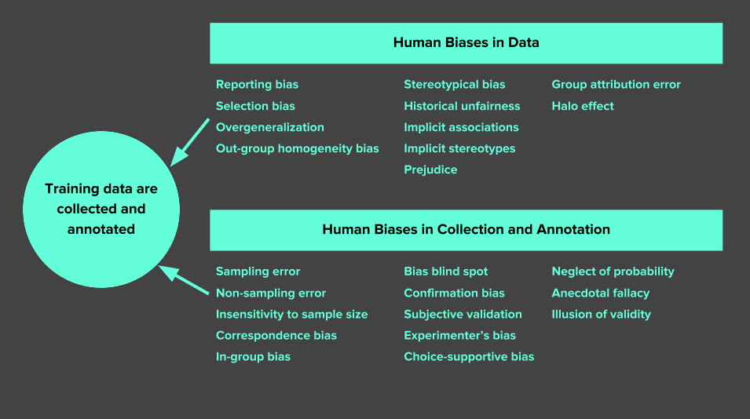

## Table of Contents

## What is experimenter's bias in the context of machine learning?

Experimenter's bias in machine learning happens when the person doing the experiment influences the results without meaning to. This can happen because the experimenter might have certain expectations or preferences about what the results should be. For example, if someone is testing a new algorithm, they might unconsciously choose data or methods that make the algorithm look better than it really is.

This kind of bias can make the results of machine learning studies less reliable. It's important for researchers to be aware of this and try to avoid it. They can do this by using methods like blind testing, where they don't know which data they are working with, or by having other people check their work. By being careful, researchers can make sure their findings are more accurate and trustworthy.

## How does experimenter's bias affect the outcome of machine learning experiments?

Experimenter's bias can mess up the results of machine learning experiments. When the person doing the experiment has certain ideas about what the results should be, they might accidentally do things that make the results match those ideas. For example, they might choose data that supports their new algorithm or method, making it look better than it really is. This can lead to wrong conclusions because the results are not showing the true performance of the algorithm.

To avoid this problem, researchers need to be careful and use special methods. One way is to use blind testing, where the experimenter doesn't know which data they are working with. This helps stop them from picking data that fits their expectations. Another way is to have other people check the work to make sure it's fair and accurate. By doing these things, researchers can make their machine learning experiments more reliable and trustworthy.

## What are some common examples of experimenter's bias in machine learning?

One common example of experimenter's bias in [machine learning](/wiki/machine-learning) is when a researcher unconsciously chooses a dataset that favors their new algorithm. For instance, if someone is developing a new machine learning model for image recognition, they might select images that the model is good at recognizing, making the performance look better than it really is. This can lead to overestimating the model's effectiveness because the results are biased towards the chosen data.

Another example is when an experimenter tweaks the hyperparameters of a model in a way that benefits their expected outcome. Hyperparameters are settings that control the behavior of the algorithm, and adjusting them can significantly impact the results. If the researcher adjusts these settings based on their belief in the model's potential, they might end up with a model that performs well only on the specific dataset they used, not on new, unseen data. This can give a false impression of the model's generalizability.

Lastly, experimenter's bias can occur during the evaluation phase. For example, if a researcher is hopeful about their new approach, they might unconsciously select evaluation metrics that highlight the strengths of their model while downplaying its weaknesses. This selective choice of metrics can make the model appear more successful than it truly is, leading to biased conclusions about its performance.

## How can experimenter's bias be identified in machine learning studies?

Experimenter's bias in machine learning studies can be identified by looking at how data is chosen and used. If a researcher always picks data that makes their new method look good, that might be a sign of bias. For example, if they keep using the same dataset where their model works well, but never test it on different data, this could show they are biased towards getting good results. Another way to spot bias is by checking if the hyperparameters are set in a way that always helps the model perform better on the chosen data. If the settings are tweaked a lot to fit the data, it might mean the researcher is trying to get the results they want.

Another way to identify experimenter's bias is by looking at how the results are evaluated. If the researcher only uses certain metrics that make their model look good, while ignoring others that might show weaknesses, this could be a sign of bias. For instance, if they focus on accuracy but ignore other important measures like precision or recall, it might mean they are trying to present their model in the best light. To make sure studies are fair, other researchers can review the work and check if the methods and data choices seem unbiased. By being careful and using different ways to check for bias, the machine learning community can work towards more reliable and trustworthy results.

## What are the consequences of experimenter's bias on model performance and generalization?

Experimenter's bias can make a machine learning model look better than it really is. When researchers pick data or set up the experiment in a way that matches their expectations, the model might do great on that specific data. But this can be misleading because the model might not work as well on other data it hasn't seen before. This is called overfitting, where the model learns the training data too well but can't handle new data. For example, if a model is trained on a biased dataset, it might perform well on that data but fail when used in real-world situations.

The consequences of experimenter's bias on model generalization can be serious. Generalization is when a model can work well on new, unseen data. If a model is developed with biased choices, it might not generalize well. This means the model won't be useful in real-life situations where the data is different from what it was trained on. As a result, people might trust the model too much based on its performance in the experiment, but then be disappointed when it doesn't work as expected in practice. To avoid this, researchers need to be careful and use methods to reduce bias, so their models can be more reliable and useful in the real world.

## What techniques can be used to mitigate experimenter's bias in machine learning research?

One way to reduce experimenter's bias in machine learning research is by using blind testing. This means the person doing the experiment doesn't know which data they are working with. By not knowing, they can't pick data that matches what they expect. Another way is to have other people check the work. This is called peer review. When other researchers look at the data and methods, they can see if there's any bias and help make the results more trustworthy. Also, using different datasets and testing the model on new data can show if the results are real or just because of the chosen data.

Another technique is to use cross-validation. This means splitting the data into different parts and testing the model on each part. It helps make sure the model works well on different data, not just the data it was trained on. Researchers can also be careful with how they set up the experiment. They should use the same methods for all models they compare, so one model doesn't get an unfair advantage. By being careful and using these methods, researchers can make their machine learning studies more reliable and reduce the chance of experimenter's bias affecting the results.

## How does the choice of dataset influence experimenter's bias?

The choice of dataset can greatly influence experimenter's bias in machine learning. When researchers pick a dataset that matches what they expect or want to see, they might make their model look better than it really is. For example, if someone is testing a new way to recognize images, they might choose images that the model is good at recognizing. This can make the model seem more accurate than it would be on different images. By [picking](/wiki/asset-class-picking) data that fits their expectations, researchers can accidentally create results that are not true for other datasets.

To avoid this kind of bias, researchers should use different datasets and test their models on new data they haven't seen before. This helps make sure the model works well in many situations, not just on the data it was trained on. For example, if a model does well on one set of images, researchers should try it on other sets of images too. By being careful with the data they choose and using different datasets, researchers can make their results more reliable and reduce the chance of experimenter's bias affecting their work.

## Can experimenter's bias be completely eliminated in machine learning, and if not, why?

Experimenter's bias cannot be completely eliminated in machine learning because it comes from human nature. People naturally have ideas and hopes about what they want to find, and these can affect how they do their experiments without them even realizing it. For example, a researcher might pick data or change settings in a way that makes their new method look better. Even if they try to be careful, it's hard to remove all their personal feelings and expectations from the process.

However, there are ways to reduce experimenter's bias a lot. Researchers can use methods like blind testing, where they don't know which data they are using, and peer review, where other people check their work. They can also test their models on different datasets to make sure the results are not just because of the data they chose. By being careful and using these methods, researchers can make their studies more reliable, but they can't get rid of all bias because it's part of being human.

## How does experimenter's bias relate to other biases such as confirmation bias and selection bias?

Experimenter's bias is closely related to confirmation bias and selection bias. Confirmation bias happens when someone looks for information that supports what they already believe. In machine learning, if a researcher expects their new model to work well, they might unconsciously choose data or methods that confirm this belief. This is similar to experimenter's bias because both involve favoring results that match the researcher's expectations. Selection bias, on the other hand, occurs when the data chosen for a study is not representative of the whole population. If a researcher picks a dataset that only includes cases where their model performs well, this can lead to biased results. Both selection bias and experimenter's bias can make the model look better than it really is by choosing data that supports the desired outcome.

These biases can work together to create even bigger problems in machine learning studies. For example, a researcher might have a strong belief in their new algorithm (confirmation bias) and then select data that supports this belief (selection bias). This combination can lead to experimenter's bias, where the researcher's choices in data and methods make the results look better than they would with a more neutral approach. To reduce these biases, researchers need to be aware of their own expectations and carefully choose their data and methods to ensure they are as unbiased as possible. By doing so, they can make their studies more reliable and trustworthy.

## What role does peer review play in reducing experimenter's bias in machine learning?

Peer review helps a lot in reducing experimenter's bias in machine learning. When other researchers check the work, they can see if the person doing the experiment picked data or methods that make the results look too good. They can point out if the researcher might have been influenced by what they hoped to find. By having others look at the work, it's easier to spot and fix any bias that might be there.

Using peer review, the machine learning community can make sure studies are fair and the results are trustworthy. Reviewers can suggest using different datasets or changing how the experiment is set up to reduce bias. This helps make sure the model's performance is shown in a way that's true for many different situations, not just the one the researcher chose. So, peer review is a key part of making machine learning research more reliable and less affected by experimenter's bias.

## How can machine learning practitioners design experiments to minimize experimenter's bias?

Machine learning practitioners can design experiments to minimize experimenter's bias by using blind testing. This means they don't know which data they are working with during the experiment. By not knowing, they can't pick data that matches what they expect or want to see. Another way is to use cross-validation, where the data is split into different parts and the model is tested on each part. This helps make sure the model works well on different data, not just the data it was trained on. Practitioners should also be careful with how they set up the experiment, using the same methods for all models they compare, so one model doesn't get an unfair advantage.

Another important way to minimize experimenter's bias is to use different datasets and test the model on new data it hasn't seen before. This helps show if the results are real or just because of the chosen data. Peer review can also help a lot. When other researchers check the work, they can see if there's any bias and suggest ways to fix it. By being careful with data choices, using different methods to test the model, and getting feedback from others, machine learning practitioners can make their experiments more reliable and reduce the chance of experimenter's bias affecting the results.

## What are the latest research findings on the impact of experimenter's bias in advanced machine learning models?

Recent research has shown that experimenter's bias can still have a big impact on advanced machine learning models. A study from 2023 found that even with complex models like deep neural networks, if researchers choose data or set up experiments in a biased way, the results can be misleading. The study showed that when researchers expected their model to perform well, they sometimes picked data that made it look better than it really was. This can lead to models that don't work well in real life because they were trained on biased data. The research suggests that using methods like blind testing and peer review can help reduce this bias and make results more reliable.

Another finding from recent studies is that experimenter's bias can affect how well a model generalizes to new data. A 2022 paper looked at how different choices in data and model settings can make a model seem good on the training data but fail on new data. The paper found that if researchers tweak the model's hyperparameters to fit the data they expect, the model might not work as well on other datasets. This means that even advanced models need careful experiment design to avoid bias and ensure they can be used in many different situations. Researchers are now focusing on creating better ways to test models on diverse datasets to reduce the impact of experimenter's bias.