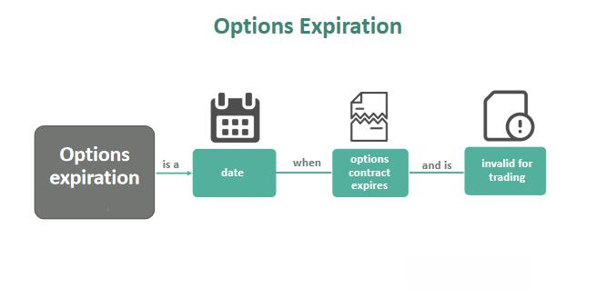

Understanding options expiration is crucial for both traders and investors engaged in financial markets. Options expiration holds significant influence over trading strategies and market dynamics, as it marks the point when option contracts either need to be exercised or allowed to expire. This article examines the various complexities associated with options expiration, highlighting its importance in stock options and the spheres of algorithmic trading.

Options function as derivatives that provide the right, but not the obligation, to buy or sell underlying assets at predetermined prices before a specified date. The termination of this contract at expiration determines whether the option will be exercised or expire worthless, depending on whether it is in or out of the money. This timing creates unique trading and investment challenges and opportunities.



Stock options are integral to financial markets, widely used for speculation and risk management. They enable traders to potentially benefit from estimated stock price movements without full exposure to equity investments. This flexibility allows for diversified investment strategies that can be tailored to individual market views and risk appetites.

Furthermore, algorithmic trading is transforming how strategies involving options are developed and implemented. By employing complex algorithms, traders can automate decisions, harness vast data sets, and monitor current market conditions more efficiently than with manual trading alone. This enhancement through technology paves the way for intricate strategies and effective risk management, leading to potentially better market outcomes.

With these advancements and understanding, navigating the complexities of options expiration becomes highly relevant to those involved. The dynamics of options and the introduction of algorithmic approaches offer new opportunities for both managing risks and enhancing returns. The following exploration aims to shed light on these aspects, providing insights into the evolving landscape of financial markets.

## Table of Contents

## Understanding Options Expiration

Options are financial derivatives that grant traders the right, but not the obligation, to buy or sell an underlying asset at a predetermined price, known as the strike price, before or on a specified date. This specified date is referred to as the expiration date, playing a crucial role in the life cycle of an option contract. The expiration date determines when the options contract ceases to exist, at which point decisions regarding exercise or expiration must be finalized.

As options approach expiration, traders face the decision of whether to exercise the option or let it expire. An option is considered "in the money" (ITM) if exercising it results in a favorable financial outcome. For call options, this occurs when the underlying asset's market price exceeds the strike price. For put options, it occurs when the market price falls below the strike price. If an option is "out of the money" (OTM), meaning it would not yield a profit if exercised, it generally expires worthless, and the holder is encouraged not to exercise it.

Handling options near their expiration date involves strategic decision-making. Traders may choose to exercise an option, which involves buying or selling the underlying asset at the strike price, or they may opt to close their position by selling the option. The decision hinges on various factors, including the current market conditions, the intrinsic and time value of the option, and the trader's market outlook.

Effective management of options nearing expiration can help traders maximize profits or minimize losses. This process often involves analyzing market trends, assessing the [volatility](/wiki/volatility-trading-strategies) of the underlying asset, and considering the potential for price movement before expiration. The choice between exercising, selling, or allowing the option to expire depends on comprehensive evaluation and timing, with the goal of optimizing financial outcomes and managing risks effectively.

## The Role of Stock Options in Financial Markets

Stock options are integral to the function and efficiency of financial markets, providing investors and traders with tools for flexibility and risk management. At their core, stock options are contracts that give the holder the right, but not the obligation, to buy or sell a stock at a predetermined price before the contract expires. This characteristic offers unique opportunities for both hedging and speculation.

One of the primary roles of stock options is the ability to speculate on stock price movements. Traders can take advantage of potential price increases or decreases by purchasing call or put options, respectively, without directly owning the underlying asset. This allows for participation in the market with potentially less capital outlay compared to buying the shares outright. For example, if a trader anticipates that a stock’s price will rise, they might purchase a call option rather than buying the stock itself, thereby leveraging their position.

Additionally, stock options are powerful tools for risk management through hedging. Investors often use options to protect their portfolios against adverse price movements. For instance, owning a put option on a stock within a portfolio can serve as insurance against a decline in the stock's price, thereby limiting potential losses and stabilizing overall portfolio performance. This capability is particularly valuable in volatile markets where price swings can be significant and unpredictable.

Beyond speculation and hedging, stock options enhance portfolio management by providing leverage. This is the ability to control a larger position with a relatively small amount of invested capital. For instance, by paying a premium for an option contract, traders can control shares worth significantly more than the premium paid. However, this leverage comes with increased risk, as options can expire worthless if market conditions turn unfavorable.

Options also play a significant role in enabling complex financial strategies. Strategies such as straddles, strangles, and spreads allow traders to express specific market views or volatility expectations. These strategies often involve buying and selling multiple options simultaneously and can be tailored to different market conditions, risk appetites, and investment horizons.

For those engaging with stock options, understanding their intricacies is crucial. It involves comprehending various factors such as implied volatility, the Greeks (Delta, Gamma, Theta, Vega, and Rho), and the impact of time decay on options pricing. Mastery of these elements can significantly enhance a trader's ability to make informed decisions and optimize their strategies.

In conclusion, stock options are a versatile financial instrument in the financial markets that offer both opportunities and challenges. They provide powerful means for speculation, risk management, and strategic financial maneuvering, making them indispensable tools for serious market participants. Understanding and effectively utilizing these instruments can considerably strengthen an investor's or trader's position in the financial landscape.

## Algorithmic Trading and Options

Algorithmic trading is a transformative approach in the financial industry, utilizing complex algorithms to automate decisions and streamline the execution of trades. In the context of options trading, algorithms excel at rapidly processing vast datasets, identifying profitable opportunities, and executing trades with precision. This is a substantial improvement over traditional manual methods, which are slower and prone to human error.

Algorithms used in options trading are designed to analyze a multitude of variables such as historical price data, volatility trends, and market depth. By processing this information, they can forecast market movements and execute trades at optimal moments. This capability allows traders to deploy intricate options strategies that were previously impractical on a large scale due to the time and computational resources required.

An example of such a strategy is the delta-neutral approach, which seeks to profit from volatility while maintaining a position that is theoretically unaffected by minor movements in the underlying asset's price. Algorithmic trading systems can maintain the balance of delta neutrality by continuously adjusting the positions as market conditions change, a task that would be labor-intensive and inefficient if done manually.

Moreover, [algorithmic trading](/wiki/algorithmic-trading) enhances risk management through mechanisms like dynamic hedging. For instance, options positions can be automatically adjusted in response to real-time market conditions, thereby minimizing potential losses and optimizing profit margins. This is crucial in managing the complex risk profiles inherent in options portfolios.

The integration of algorithmic trading into options markets also addresses inefficiencies and boosts market [liquidity](/wiki/liquidity-risk-premium). Algorithms can execute high-frequency trades, ensuring that buy and sell orders are swiftly matched. This activity not only facilitates smoother transactions but also narrows bid-ask spreads, making markets more efficient and accessible.

In essence, the fusion of algorithmic trading with options markets represents a significant leap forward. By leveraging technology, traders can manage risks more effectively, devise sophisticated strategies, and enhance liquidity. This synergy is a cornerstone in the evolution of modern financial markets, empowering traders to optimize outcomes and swiftly adapt to changing market dynamics.

## Strategies for Managing Options Expiration

Managing options as they approach expiration requires a thorough understanding of market conditions and a strategic approach to decision-making. As options near their expiration date, traders are faced with several choices: to exercise the option, sell it, or let it expire. These decisions can significantly impact the trader's financial outcome and are influenced by factors such as the option's intrinsic value, time decay, and market volatility.

### Exercising, Selling, or Letting Options Expire

Traders must evaluate whether to exercise, sell, or allow options to expire based on their position and market outlook. Exercising an option means executing the right to buy or sell the underlying asset at the strike price. This decision is often advantageous when the option is "in the money," meaning the market price of the asset is favorable compared to the strike price. Conversely, selling the option before expiration can be beneficial if it retains some time value or if the trader seeks to avoid potential losses from adverse price movements. Allowing an option to expire worthless is typically considered if it is "out of the money," wherein the strike price is less favorable than the current market price.

### Risk Management Techniques

Effective risk management is crucial during options expiration. Dynamic hedging, for instance, involves adjusting a portfolio to maintain a desired level of risk exposure as the market conditions change. It can reduce potential losses by creating positions that counterbalance the trader's exposure to adverse price movements. Portfolio adjustments, such as rebalancing the mix of assets, are also essential to optimize risk and return during expiration. These techniques help in safeguarding capital and ensuring that the portfolio aligns with the trader's risk tolerance and investment objectives.

### Algorithmic Strategies

Algorithmic trading plays a pivotal role in managing options expiration by leveraging computational algorithms to analyze vast amounts of market data quickly. Algorithms can be programmed to execute trades based on predefined market conditions, enabling traders to respond swiftly to changes and optimize decision-making concerning exercising, selling, or letting options expire. The automation provided by algorithms also helps in mitigating emotional biases and human errors, which can affect trading decisions.

Here is a simple example of how one might use a Python algorithm to make decisions based on certain criteria:

```python
def manage_option_expiration(current_price, strike_price, option_premium, market_volatility):
    # Calculate intrinsic value
    intrinsic_value = max(0, current_price - strike_price)

    # Decision making based on intrinsic value and market volatility
    if intrinsic_value > option_premium:
        decision = "Exercise"
    elif market_volatility > 0.2 and intrinsic_value < option_premium:
        decision = "Sell"
    else:
        decision = "Let Expire"

    return decision

# Example usage:
current_price = 105
strike_price = 100
option_premium = 4
market_volatility = 0.25

print(manage_option_expiration(current_price, strike_price, option_premium, market_volatility))
```

This code provides a basic framework for making decisions based on current market conditions, demonstrating how algorithmic strategies can aid in optimal decision-making around options expiration. By automating these decisions, traders can improve efficiency and capitalize on market opportunities effectively.

## The Impact of Timing on Options Trading

Timing in options trading is a crucial [factor](/wiki/factor-investing) affecting the valuation and outcome of trades, as it is intrinsically linked to an option's time value. The time value of an option represents the premium a trader is willing to pay over the intrinsic value, based on the potential for future gains up to the expiration date. This time value declines as the contract approaches its expiration, a phenomenon known as time decay or theta decay.

**Understanding Time Decay**

Time decay is the rate at which the value of an options contract erodes as it approaches its expiration date. Mathematically, this is often represented by the Greek letter theta ($\Theta$). Theta can be calculated using complex pricing models like the Black-Scholes model, which assesses factors such as the option's volatility, the current stock price, and the time to expiration. The formula for theta is generally derived from the Black-Scholes formula, as such:

$$
\Theta = -\frac{\partial P}{\partial t}
$$

where $P$ denotes the option's price and $t$ is the time remaining until expiration. This decay is not linear; it accelerates as the expiration date approaches, making timing a significant strategic consideration.

**Expiration Cycles and Settlement Price**

Options are subject to expiration cycles, which determine specific dates when contracts will expire. In the U.S., the common expiration cycle aligns with the third Friday of each month, although weekly and quarterly expirations are also available. Settlement prices are established based on the stock's closing price on the expiration day, which affects whether an option is exercised or expires worthless. Understanding these cycles and settlement dynamics can significantly influence trading strategies.

**Algorithmic Trading and Timing**

Algorithmic trading systems offer a powerful tool for managing timing in options trading. Leveraging real-time data, such systems can automatically adjust positions to capitalize on the diminishing time value or shifts in volatility. For example, algorithms can identify optimal moments to enter or [exit](/wiki/exit-strategy) trades based on anticipated changes in price movements or volatility spikes, thus enhancing profitability.

A Python implementation leveraging libraries such as NumPy or Pandas can efficiently handle these calculations and trading decisions:

```python
import numpy as np

def calculate_theta(stock_price, strike_price, time_to_expiration, volatility, risk_free_rate):
    # Simplified Black-Scholes theta calculation
    d1 = (np.log(stock_price / strike_price) + (risk_free_rate + 0.5 * volatility**2) * time_to_expiration) / (volatility * np.sqrt(time_to_expiration))
    theta = -(stock_price * volatility * np.exp(-risk_free_rate * time_to_expiration) * d1) / (2 * np.sqrt(time_to_expiration))
    return theta

# Usage example
theta_value = calculate_theta(stock_price=100, strike_price=100, time_to_expiration=30, volatility=0.2, risk_free_rate=0.05)
print("Theta:", theta_value)
```

**Competitive Advantage Through Timing**

Gaining an understanding of timing intricacies provides a distinct competitive advantage in options trading. Traders who accurately monitor and predict expiration cycles and settlement implications can optimize their strategies to effectively manage risk and enhance returns. Moreover, by integrating algorithmic strategies, traders can respond adeptly to market conditions, thus leveraging time decay and volatility for profitable outcomes. The ability to time trades precisely not only mitigates risk but also creates opportunities for substantial gains in the options market.

## Conclusion

Options expiration is a significant event in the lifecycle of an option, having substantial implications for strategy and decision-making within financial markets. As options near their expiration date, traders and investors must evaluate their positions to make informed choices regarding exercise, sale, or letting them expire. This period demands precise planning and execution to optimize outcomes, be it maximizing profits or minimizing potential losses.

Stock options and algorithmic trading have become integral components of the modern financial market landscape. Stock options provide traders with flexibility and the means to hedge, speculate, and manage risks more effectively. Algorithmic trading, on the other hand, employs advanced computing power and sophisticated algorithms to streamline and enhance trading operations. By exploiting market inefficiencies and improving liquidity, it helps traders execute complex strategies with greater efficiency and precision.

The union of stock options and algorithmic trading presents substantial opportunities for traders. By harnessing these capabilities, they can tactically manage options expiration, leveraging time decay and volatility shifts to their advantage. Algorithmic trading enables the swift processing of market data, facilitating timely and informed decision-making during the critical juncture of options expiration.

Success in options trading hinges on staying informed and adaptable. By continuously monitoring market conditions and utilizing advanced trading tools, traders can navigate the intricacies of options expiration more effectively. Engaging with educational resources and technological advancements ensures that traders remain competitive and ready to capitalize on any arising opportunities. Through a balanced approach that incorporates both traditional trading knowledge and modern technological aids, traders can achieve favorable results in the ever-evolving financial markets.

## References & Further Reading

[1]: Hull, J. C. (2017). ["Options, Futures, and Other Derivatives"](https://www.semanticscholar.org/paper/Options%2C-Futures%2C-and-Other-Derivatives-Hull/89bdee500c8623864fc9eb7a471546aa713acc44). Pearson Education. 

[2]: McMillan, L. G. (2012). ["Options as a Strategic Investment"](https://archive.org/details/optionsasstrateg0000mcmi). Prentice Hall Press.

[3]: Lopez de Prado, M. (2018). ["Advances in Financial Machine Learning"](https://www.amazon.com/Advances-Financial-Machine-Learning-Marcos/dp/1119482089). Wiley. 

[4]: Chan, E. P. (2009). ["Quantitative Trading: How to Build Your Own Algorithmic Trading Business"](https://github.com/ftvision/quant_trading_echan_book). Wiley.

[5]: Jansen, S. (2018). ["Machine Learning for Algorithmic Trading"](https://www.amazon.com/Hands-Machine-Learning-Algorithmic-Trading/dp/178934641X). Packt Publishing. 

[6]: Glasserman, P. (2003). ["Monte Carlo Methods in Financial Engineering"](https://link.springer.com/book/10.1007/978-0-387-21617-1). Springer.