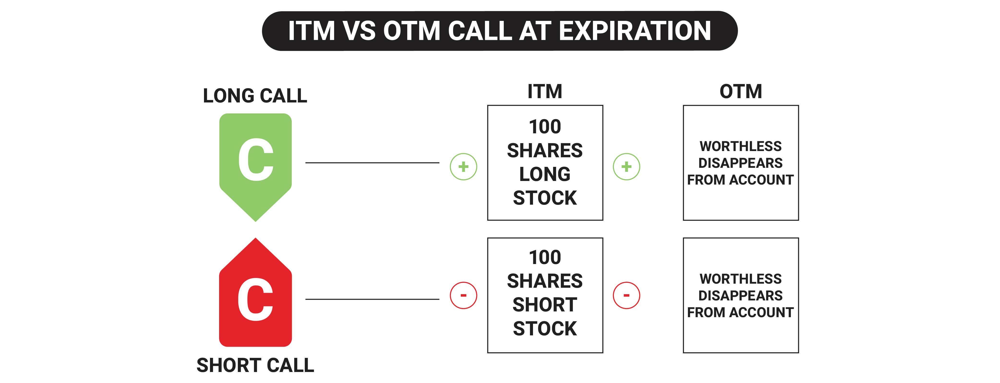

## Table of Contents

## What are stock options?

Stock options are a type of financial instrument that gives you the right, but not the obligation, to buy or sell a specific stock at a set price within a certain time period. They are often used by companies to attract and retain employees. When a company offers stock options to its employees, it's giving them the chance to buy company stock at a lower price than what it might be worth in the future. This can be a good deal for employees if the stock price goes up.

There are two main types of stock options: call options and put options. A call option lets you buy a stock at a certain price, while a put option lets you sell a stock at a certain price. Investors use these options to bet on whether a stock's price will go up or down. For example, if you think a stock's price will rise, you might buy a call option. If you think it will fall, you might buy a put option. This way, you can make money from changes in the stock's price without actually owning the stock.

## What does it mean for a stock option to expire?

When a stock option expires, it means the time period during which you can use the option to buy or sell the stock has ended. If you don't use the option before it expires, it becomes worthless and you can't use it anymore. This is important to remember because if you want to use the option, you need to do it before the expiration date.

The expiration date is set when the option is created, and it's usually the third Friday of the month for most options. If the stock price hasn't moved in the way you expected by the expiration date, you won't be able to make money from the option. That's why it's important to keep track of when your options are going to expire and decide if you want to use them or let them go.

## How long do stock options typically last before they expire?

Stock options usually last for a certain amount of time before they expire. Most stock options that people trade have an expiration date that is set when they are created. This expiration date is often the third Friday of the month, and the options can last anywhere from a few weeks to a few years. For example, some options might expire in a month, while others might last for a year or even longer.

When companies give stock options to their employees, these options often have a longer time before they expire. Employee stock options might last for 10 years from the date they are granted. This gives employees plenty of time to decide if they want to use their options to buy company stock. The length of time until expiration can affect how valuable the options are, because the longer they last, the more time there is for the stock price to change in a way that makes the options worth using.

## What happens to a stock option when it expires?

When a stock option expires, it means the time to use it is over. If you don't use the option by the expiration date, it becomes worthless. You can't buy or sell the stock with that option anymore. It's like a ticket that you didn't use before the event—it's no good after the date on it.

For people who trade options, this is important to know. If the stock price didn't move the way they hoped before the option expired, they lose the money they paid for the option. But if they think the stock will still move in their favor, they might buy a new option with a later expiration date. For employees with stock options, if they don't use them before they expire, they miss out on the chance to buy company stock at a lower price.

## Can you exercise a stock option right before it expires?

Yes, you can exercise a stock option right before it expires. Exercising an option means you use it to buy or sell the stock at the price set in the option. You need to do this before the expiration time, which is usually at the end of the trading day on the expiration date.

If you wait until the last moment, you need to be sure you can get your order in before the market closes. If you miss the deadline, even by a few minutes, the option will expire and you won't be able to use it. So, it's a good idea to plan ahead and not wait until the very last second to exercise your option.

## What are the consequences of letting a stock option expire without exercising it?

If you let a stock option expire without exercising it, you lose the right to buy or sell the stock at the price set in the option. The option becomes worthless, and you can't use it anymore. This means you lose any money you paid to buy the option, because you won't get it back.

For people who trade options, this can be a big deal. If they paid for an option hoping the stock price would move in their favor, but it didn't happen before the option expired, they lose the money they spent on the option. For employees with stock options, if they don't exercise them before they expire, they miss out on the chance to buy company stock at a lower price, which could have been valuable if the stock price went up later.

## How can one determine the expiration date of a stock option?

The expiration date of a stock option is set when the option is created. For most options that people trade, this date is the third Friday of the month. You can find out the exact expiration date by looking at the option's details on a trading platform or in the option contract. This information is important because you need to use the option before it expires, or it will become worthless.

When companies give stock options to their employees, the expiration date is usually listed in the option agreement. These options often last for a longer time, like 10 years from when they are granted. It's important for employees to know this date so they can decide when to use their options to buy company stock at a lower price. If they miss the expiration date, they lose the chance to use the options.

## What strategies can be used to manage stock options as they approach expiration?

As stock options get closer to their expiration date, you can use different strategies to manage them. One common strategy is to keep an eye on the stock's price and decide if you want to use the option before it expires. If the stock price has moved in a way that makes the option valuable, you might want to exercise it to buy or sell the stock at the set price. If the stock price hasn't moved in your favor, you might choose to let the option expire worthless and not lose more money by holding onto it.

Another strategy is to sell the option before it expires. If the option still has some value, you can sell it to someone else who might want to use it. This way, you can get some money back instead of letting the option expire and lose everything you paid for it. Some people also use a strategy called "rolling over" the option, where they sell the current option and buy a new one with a later expiration date. This gives them more time for the stock price to move in their favor, but it also costs more money.

It's important to think about your goals and how much risk you're willing to take when managing stock options as they approach expiration. If you're unsure, you might want to talk to a financial advisor who can help you make the best decision for your situation. Remember, the key is to act before the option expires, so you don't miss out on any potential gains or lose more than you need to.

## What are the tax implications of exercising a stock option near its expiration?

When you exercise a stock option near its expiration, there can be tax consequences depending on the type of option you have. If you have non-qualified stock options (NQSOs), exercising them means you'll have to pay ordinary income tax on the difference between the stock's market price and the price you paid for it when you exercised the option. This is considered part of your income for the year you exercised the option, so you'll need to report it on your tax return.

For incentive stock options (ISOs), the tax rules are a bit different. If you exercise ISOs and hold onto the stock for at least one year after exercising and two years after the option was granted, you might qualify for a more favorable tax treatment. You won't have to pay ordinary income tax right away, but you might have to pay alternative minimum tax (AMT) in the year you exercise the options. If you sell the stock after meeting the holding period, any profit you make is taxed at the lower long-term capital gains rate. But if you sell the stock before meeting the holding period, you'll have to pay ordinary income tax on the profit, just like with NQSOs.

It's important to understand these tax rules because they can affect how much money you keep after exercising your stock options. If you're not sure about the tax implications, it's a good idea to talk to a tax professional who can help you plan the best time to exercise your options and manage your taxes.

## How do market conditions influence the decision to exercise or let a stock option expire?

Market conditions can have a big impact on whether you decide to exercise a stock option or let it expire. If the stock's price is higher than the price set in your option, it might be a good time to exercise it. You can buy the stock at the lower option price and then sell it at the higher market price, making a profit. But if the stock's price is lower than your option price, exercising the option might not be worth it. You could end up losing money if you have to buy the stock at a higher price than it's worth in the market.

Another thing to think about is how the market might change in the future. If you think the stock's price will keep going up, you might want to hold onto the option and exercise it later, or even sell the option to someone else for a profit. But if you think the stock's price will go down, it might be better to let the option expire and not lose more money. It's all about guessing what will happen next in the market and making the best choice based on that guess.

## What are the differences between American and European style options in terms of expiration?

American style options and European style options are different in how you can use them before they expire. With an American style option, you can exercise it any time before the expiration date. This means if the stock price moves in a way that makes the option valuable, you can use it right away to buy or sell the stock. Most stock options that people trade in the U.S. are American style options, so you have more flexibility to decide when to use them.

On the other hand, European style options can only be exercised on the expiration date, not before. This means you have to wait until the very end to use the option, no matter what the stock price does. This can be riskier because if the stock price doesn't move in your favor by the expiration date, you can't do anything about it. European style options are less common in the U.S., but they are used in some markets and for certain types of options.

## How do professional traders typically handle stock options expiration?

Professional traders often have specific strategies for handling stock options as they approach expiration. They keep a close eye on the stock's price and market conditions to decide whether to exercise the option, sell it, or let it expire. If the stock price is favorable, they might exercise the option to buy or sell the stock at the set price and make a profit. If the option still has value but the stock price isn't ideal, they might sell the option to someone else, getting some money back instead of letting it expire worthless. Sometimes, they might also "roll over" the option by selling it and buying a new one with a later expiration date, giving them more time for the stock price to move in their favor.

Another common approach is to use a strategy called "pinning," where traders try to keep the stock price close to the option's strike price as it nears expiration. This can be done through buying and selling the stock to influence its price. Professional traders also pay attention to the "options expiration week," which can be a time of higher trading [volume](/wiki/volume-trading-strategy) and [volatility](/wiki/volatility-trading-strategies). During this week, they might adjust their positions to take advantage of these market conditions. Overall, professional traders use a mix of analysis, timing, and strategic moves to manage their options effectively as they approach expiration.

## What is the Impact of Timing on Options Trading?

Timing in options trading is a crucial [factor](/wiki/factor-investing) affecting the valuation and outcome of trades, as it is intrinsically linked to an option's time value. The time value of an option represents the premium a trader is willing to pay over the intrinsic value, based on the potential for future gains up to the expiration date. This time value declines as the contract approaches its expiration, a phenomenon known as time decay or theta decay.

**Understanding Time Decay**

Time decay is the rate at which the value of an options contract erodes as it approaches its expiration date. Mathematically, this is often represented by the Greek letter theta ($\Theta$). Theta can be calculated using complex pricing models like the Black-Scholes model, which assesses factors such as the option's volatility, the current stock price, and the time to expiration. The formula for theta is generally derived from the Black-Scholes formula, as such:

$$
\Theta = -\frac{\partial P}{\partial t}
$$

where $P$ denotes the option's price and $t$ is the time remaining until expiration. This decay is not linear; it accelerates as the expiration date approaches, making timing a significant strategic consideration.

**Expiration Cycles and Settlement Price**

Options are subject to expiration cycles, which determine specific dates when contracts will expire. In the U.S., the common expiration cycle aligns with the third Friday of each month, although weekly and quarterly expirations are also available. Settlement prices are established based on the stock's closing price on the expiration day, which affects whether an option is exercised or expires worthless. Understanding these cycles and settlement dynamics can significantly influence trading strategies.

**Algorithmic Trading and Timing**

Algorithmic trading systems offer a powerful tool for managing timing in options trading. Leveraging real-time data, such systems can automatically adjust positions to capitalize on the diminishing time value or shifts in volatility. For example, algorithms can identify optimal moments to enter or [exit](/wiki/exit-strategy) trades based on anticipated changes in price movements or volatility spikes, thus enhancing profitability.

A Python implementation leveraging libraries such as NumPy or Pandas can efficiently handle these calculations and trading decisions:

```python
import numpy as np

def calculate_theta(stock_price, strike_price, time_to_expiration, volatility, risk_free_rate):
    # Simplified Black-Scholes theta calculation
    d1 = (np.log(stock_price / strike_price) + (risk_free_rate + 0.5 * volatility**2) * time_to_expiration) / (volatility * np.sqrt(time_to_expiration))
    theta = -(stock_price * volatility * np.exp(-risk_free_rate * time_to_expiration) * d1) / (2 * np.sqrt(time_to_expiration))
    return theta

# Usage example
theta_value = calculate_theta(stock_price=100, strike_price=100, time_to_expiration=30, volatility=0.2, risk_free_rate=0.05)
print("Theta:", theta_value)
```

**Competitive Advantage Through Timing**

Gaining an understanding of timing intricacies provides a distinct competitive advantage in options trading. Traders who accurately monitor and predict expiration cycles and settlement implications can optimize their strategies to effectively manage risk and enhance returns. Moreover, by integrating algorithmic strategies, traders can respond adeptly to market conditions, thus leveraging time decay and volatility for profitable outcomes. The ability to time trades precisely not only mitigates risk but also creates opportunities for substantial gains in the options market.

## References & Further Reading

[1]: Hull, J. C. (2017). ["Options, Futures, and Other Derivatives"](https://www.semanticscholar.org/paper/Options%2C-Futures%2C-and-Other-Derivatives-Hull/89bdee500c8623864fc9eb7a471546aa713acc44). Pearson Education. 

[2]: McMillan, L. G. (2012). ["Options as a Strategic Investment"](https://archive.org/details/optionsasstrateg0000mcmi). Prentice Hall Press.

[3]: Lopez de Prado, M. (2018). ["Advances in Financial Machine Learning"](https://www.amazon.com/Advances-Financial-Machine-Learning-Marcos/dp/1119482089). Wiley. 

[4]: Chan, E. P. (2009). ["Quantitative Trading: How to Build Your Own Algorithmic Trading Business"](https://github.com/ftvision/quant_trading_echan_book). Wiley.

[5]: Jansen, S. (2018). ["Machine Learning for Algorithmic Trading"](https://www.amazon.com/Hands-Machine-Learning-Algorithmic-Trading/dp/178934641X). Packt Publishing. 

[6]: Glasserman, P. (2003). ["Monte Carlo Methods in Financial Engineering"](https://link.springer.com/book/10.1007/978-0-387-21617-1). Springer.