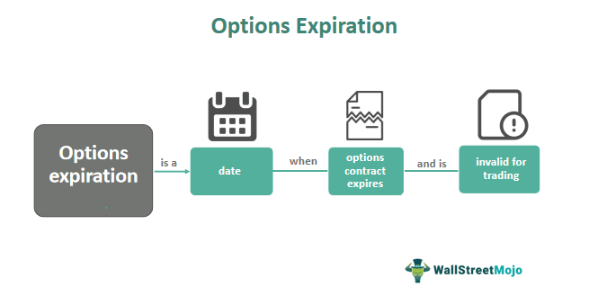

Algorithmic trading, often referred to as algo trading, involves using computer algorithms to execute various trading tasks at speeds and frequencies that are impossible for a human trader. This technological advancement in the financial markets has led to increased efficiency and a significant reduction in human errors. One of the critical components in mastering algorithmic trading, particularly in options trading, is a thorough understanding of expiration time.

In the context of options trading, expiration time is a vital factor influencing market behavior and trading outcomes. It marks the exact moment when a derivative contract ceases to exist, and all associated obligations from the contract must be settled. This contrasts with the expiration date, which is the last day an option can be exercised by the holder. The distinction between these two terms is crucial, as it affects the strategic calculations and timing decisions traders have to make.



Understanding the nuances of expiration time is fundamental for formulating effective trading strategies. It significantly impacts how traders manage their positions as contracts approach their expiration, often leading to market movements due to the unwinding or rolling over of positions. These movements can affect pricing and volatility, elements which traders must anticipate and integrate into their algorithmic systems to maximize potential gains and minimize losses.

Throughout this article, we focus on the importance of expiration time mechanisms within algorithmic trading. Highlighting its substantial influence, we explore real-world scenarios and examples which illustrate how expiration considerations can shape trading strategies. By doing so, we aim to present how traders can harness these insights to better navigate the complexities of market dynamics and leverage them towards improved trading outcomes.

## Table of Contents

## Understanding Expiration Time

Expiration time is a critical concept in derivative trading, marking the exact moment when a derivative contract ceases to exist, necessitating the fulfillment of all trader obligations. This point is distinct from the expiration date, which is the last day the option holder can make decisions regarding the contract. Understanding the difference between expiration time and expiration date is crucial for traders, as it affects both the strategy and timing of trades.

In options trading, the expiration date is the deadline by which option holders must decide whether to exercise the option or let it expire worthless. However, the expiration time specifies the precise cutoff point, often at the end of the trading session on the expiration date. For instance, in the U.S. options market, the expiration time is typically the close of trading on the third Friday of the contract month.

In derivatives such as options and futures, the approach of expiration can lead to notable market movements. These movements are often attributed to the need for traders to roll over positions to maintain their market exposure. Rolling over involves closing an existing position that is about to expire and opening a new position in a contract with a later expiration date. This activity can lead to fluctuations in prices and volumes, particularly as large institutional investors adjust their holdings.

Traders must be aware of the implications of expiration time as it directly affects option pricing, primarily through the Greeks, notably theta. Theta, or time decay, measures the rate at which an option's value decreases as the expiration approaches. The theta decay is particularly pronounced as expiration nears, influencing traders' decisions on whether to execute, close, or roll over their positions.

Mathematically, the theta decay can be represented as:

$$
\Theta = \frac{\partial V}{\partial t}
$$

where $\Theta$ is the theta, $V$ is the option's value, and $t$ is time until expiration. The negative sign indicates that the option loses value as time progresses towards expiration.

Comprehending expiration time and its effects on the market is essential for traders employing algorithmic strategies. By automating trades that consider expiration, algorithmic systems can better manage risk and maximize returns by executing precise roll strategies and optimizing timing around the expiration of contracts.

## Importance in Algorithmic Trading

Algorithmic trading systems significantly benefit from an in-depth understanding of expiration time. These platforms automate decision-making processes, thereby reducing human error and increasing efficiency in trading operations. In options trading, expiration time plays a pivotal role in influencing the pricing of options, notably through the phenomenon known as theta decay. As the expiration time of an option approaches, its extrinsic value diminishes at an accelerated rate, a process quantitatively described by the theta component in options pricing models.

In a mathematical context, theta ($\Theta$) can be expressed as follows:

$$
\Theta = - \frac{\partial V}{\partial t}
$$

where $V$ is the price of the option and $t$ represents time. This negative value indicates the erosion of an option's price as time progresses toward expiration.

Algorithmic trading systems can be programmed to execute roll strategies, which involve closing out positions in soon-to-expire options and opening new positions in options with later expiration dates. This strategy effectively manages the risks tied to expiration by mitigating the adverse effects of theta decay. Python code for a simple roll strategy could involve replacing options in a portfolio when nearing expiration:

```python
def roll_strategy(current_options, market_data):
    rolled_options = []
    for option in current_options:
        if is_near_expiration(option):
            new_option = find_new_option(option, market_data)
            rolled_options.append(new_option)
        else:
            rolled_options.append(option)
    return rolled_options

def is_near_expiration(option):
    expiration_threshold = 5  # days
    return option.days_to_expiration < expiration_threshold

def find_new_option(old_option, market_data):
    new_expiration_date = old_option.expiration_date + timedelta(days=30)
    return find_option_with_new_expiration(market_data, old_option, new_expiration_date)

```

Rolling strategies are designed to optimize portfolio performance by managing the decline in option values due to approaching expirations. By automating these processes, [algorithmic trading](/wiki/algorithmic-trading) systems can swiftly adapt to changing market conditions, adjust positions timely, and potentially drive better trading outcomes.

## Popular Expiry Day Trading Strategies

Strategies such as Short Straddle and Short Strangle are frequently employed on expiration days, primarily due to their potential to leverage theta decay—a measure of the decrease in an option’s value as the expiration date approaches. These strategies involve betting on minimal price movement for the underlying securities within a specified timeframe.

The Short Straddle strategy is constructed by selling both a call and a put option with the same strike price and expiration date. Profits are maximized if the underlying security remains at the strike price, causing both options to expire worthless and allowing the trader to retain the premiums collected. However, significant movement in either direction can lead to substantial losses, necessitating careful risk management.

Mathematically, Short Straddle positions benefit from theta decay, as expressed by:

$$
\Theta_{\text{{Straddle}}} = \Theta_{\text{{Call}}} + \Theta_{\text{{Put}}}
$$

This formula represents the combined rate of theta decay for both sold options.

Similarly, the Short Strangle strategy involves selling out-of-the-money call and put options, typically with the same expiration date but different strike prices. This strategy provides a wider range for the underlying price movement compared to a Short Straddle, with the profit zone spanning between the two strike prices. Short Strangles offer slightly lower premiums but also reduce the risk of substantial losses due to extreme price movements.

In addition to these non-directional strategies, directional strategies like bear spreads (an option spread strategy used to profit from a decline in the price of the underlying asset) are also popular. Bear spreads involve purchasing and selling options of the same class and expiration date but different strike prices. Execution of such strategies can hedge risks while targeting profitable outcomes.

Algorithmic trading systems are invaluable in [backtesting](/wiki/backtesting) and refining these approaches. Through backtesting, traders can simulate the deployment of straddles, strangles, and bear spreads across historical data to evaluate performance and fine-tune strategy parameters. Algorithmic systems, implemented in languages like Python, can automate the backtesting process—allowing traders to iterate on strategies quickly. 

For example, a Python-based backtesting situation might involve the following code snippet using the library `Backtrader`:

```python
import backtrader as bt

class ExpiryStrategy(bt.Strategy):
    def __init__(self):
        self.short_calls = None
        self.short_puts = None

    def next(self):
        # example to demonstrate strategy logic placement
        if self.short_calls and self.short_puts:
            if self.position.size == 0:
                self.short_calls = self.sell(data=self.data0, size=1)
                self.short_puts = self.sell(data=self.data1, size=1)

cerebro = bt.Cerebro()
strategy = ExpiryStrategy
cerebro.addstrategy(strategy)
cerebro.run()
```

The goal of using algorithmic systems in these strategies is to enhance profitability while managing the risks associated with option trading around expiration days. Advanced algorithms can utilize [machine learning](/wiki/machine-learning) tools to predict [volatility](/wiki/volatility-trading-strategies), thus enabling optimal strike selection and position sizing, maximizing the benefits of missing opportunities and mitigating adverse market conditions.

## Case Studies and Backtesting

Backtesting using platforms such as Quantman is crucial for evaluating how trading strategies perform under various market conditions. This process involves simulating a strategy's trades over a historical dataset to analyze its potential effectiveness. By re-creating past market environments, traders can observe how different strategies would have fared, enabling them to refine and enhance their approaches for future trading.

Quantman and similar platforms allow traders to input their algorithmic strategies and run simulations on historical data. These simulations can expose vulnerabilities, inefficiencies, or unexpected outcomes within a strategy that might not be evident through theoretical assessment alone. Backtesting provides statistical measures, including profit and loss calculations, drawdown analysis, and risk-reward ratios, essential for understanding a strategy's performance.

Case studies from real-life trading scenarios demonstrate how backtesting aids in the development of robust strategies. For instance, in one notable case, a trading strategy that initially showed promise in low-volatility markets was backtested across periods of high market volatility. The results revealed significant potential losses during these volatile periods, prompting traders to implement risk management mechanisms such as stop-loss orders. These adjustments helped in maintaining a consistent performance trajectory across varying market conditions.

Backtested results are indispensable for calibrating trading strategies, allowing traders to configure parameters for optimal performance. For example, parameter optimization can be achieved through iterative testing, where different values for key variables such as moving averages or threshold levels are tested to identify those that yield the highest return with acceptable risk.

Python programming is frequently used to conduct backtesting due to its flexibility and the availability of comprehensive libraries like pandas and [backtrader](/wiki/backtrader). A sample Python code snippet for a simple moving average crossover strategy might look like this:

```python
import backtrader as bt

class SmaCross(bt.SignalStrategy):
    def __init__(self):
        sma1, sma2 = bt.ind.SMA(period=10), bt.ind.SMA(period=30)
        crossover = bt.ind.CrossOver(sma1, sma2)
        self.signal_add(bt.SIGNAL_LONG, crossover)

cerebro = bt.Cerebro()
cerebro.addstrategy(SmaCross)
data = bt.feeds.YahooFinanceData(dataname='AAPL',
                                 fromdate=datetime(2020, 1, 1),
                                 todate=datetime(2021, 1, 1))
cerebro.adddata(data)
cerebro.run()
cerebro.plot()
```

This code sets up a simple moving average crossover strategy, where buy/sell signals are generated based on the crossover of two moving averages. By running this code over historical data, a trader can visually and statistically evaluate whether this strategy is viable.

Through comprehensive analysis of backtested results, traders can identify which strategies are sustainable and scalable in real-world trading environments. The iterative process of backtesting and strategy adjustment is key to developing trading systems capable of consistently delivering returns, while adequately managing risk and adapting to shifts in market dynamics.

## Considerations and Risks

High market volatility on expiration days presents both opportunities and challenges for traders. This volatility arises mainly due to the convergence of derivatives' time decay and the adjustment of positions to align with the underlying asset's movements. As a result, the market displays erratic price behavior, necessitating adaptive trading strategies to navigate these conditions effectively.

To mitigate risks associated with expiration day volatility, traders employ stop-loss orders as a fundamental risk management tool. A stop-loss order sets a predetermined price at which a position is automatically closed to limit potential losses. This ensures that traders are protected against sudden adverse market movements, which are common on expiration days. Additionally, a thorough market analysis, incorporating both technical and [fundamental analysis](/wiki/fundamental-analysis), aids in understanding potential market trajectories and identifying optimal entry and [exit](/wiki/exit-strategy) points, further fortifying a trader's strategy.

Balancing risk and reward is another critical aspect of trading on expiration days. Traders must recognize that high potential returns often come with increased risk levels. Therefore, deploying robust risk management strategies is essential. This involves diversifying portfolios, employing hedging strategies—such as options spreads to offset potential losses—and maintaining a disciplined approach to both profit-taking and loss-cutting.

Successful trading on expiration days hinges on an ability to dynamically adjust trading strategies according to market conditions. It requires a comprehensive understanding of market mechanics and the disciplined application of risk management techniques to transform potential market volatility into profitable trading opportunities. Consequently, expiration days necessitate a strategic mindset focused on safeguarding investments while capitalizing on the dynamic market landscape.

## Conclusion

Expiration time is an essential [factor](/wiki/factor-investing) in trading, influencing market dynamics and shaping trading strategies. It determines the timeline of a derivative's life cycle, creating critical junctures for traders to manage positions effectively. In algorithmic trading, the precision and speed offered by automated systems enable traders to exploit expiration day scenarios more efficiently while mitigating associated risks. These systems allow for optimal decision-making based on predefined strategies, reducing human error and emotional biases.

Algorithmic systems can analyze vast datasets to recognize patterns and predict market movements, empowering traders to adapt quickly to expiration-induced volatility. They facilitate techniques such as options rolls, where traders transition from expiring options to future contracts, thereby managing risk and maintaining market exposure.

The key to harnessing expiration time lies in comprehensively understanding its implications on option decay, known as theta, and price volatility. Proper identification and application of expiration time strategies can convert temporary market disruptions into profitable opportunities. By integrating meticulous risk management and strategic execution into their toolkit, traders can transform the challenges of expiration day into substantial financial gains.

## References & Further Reading

- Girish, S. (2020). 'Algorithmic Trading: A Comprehensive Beginner's Guide.' DataCamp. This guide provides a foundational understanding of algorithmic trading, covering the essential strategies, market dynamics, and technology infrastructure necessary for beginners.

- Hull, J.C. 'Options, Futures, and Other Derivatives.' A staple in the study of financial derivatives, this book dives into the mechanics of options and futures, offering insights into the pricing and application of derivatives in various market contexts.

- Haug, E.G. 'The Complete Guide to Option Pricing Formulas.' This resource compiles a comprehensive list of option pricing models, providing both theoretical and practical perspectives on how to apply these formulas in different trading scenarios.

- Brogaard, J., Hendershott, T., & Riordan, R. 'High-Frequency Trading and Price Discovery.' Published in The Review of Financial Studies, this paper examines the role of high-frequency trading in markets, analyzing its impact on price formation and market efficiency.

- Harris, L. 'Trading and Exchanges: Market Microstructure for Practitioners.' This text explores the intricate details of market microstructure, offering practical insights for practitioners on how markets are structured and how trading occurs within these frameworks.

