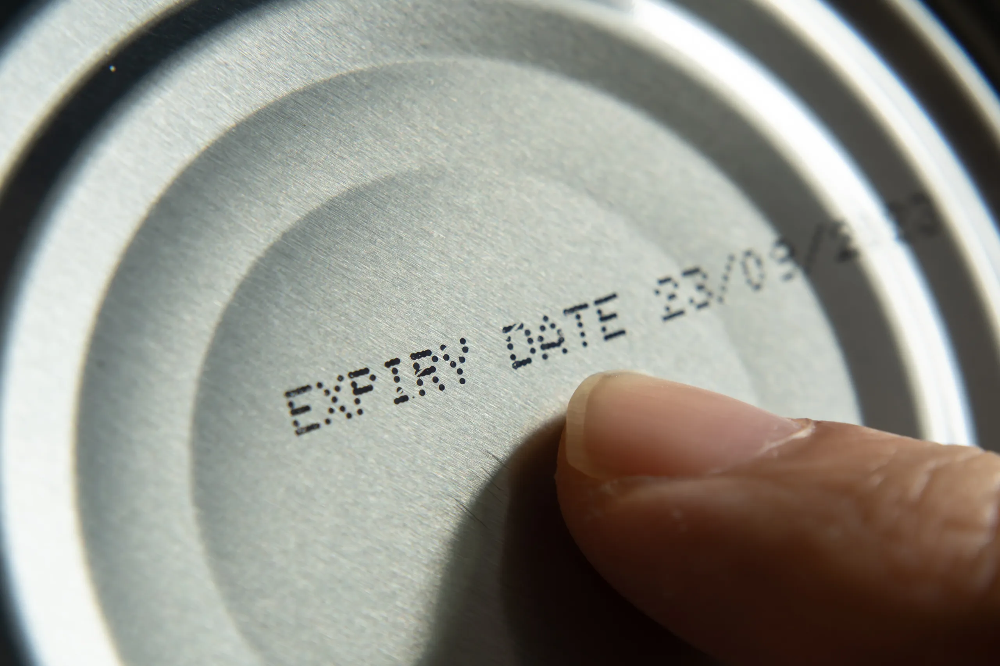

## Table of Contents

## What is an expiry date?

An expiry date is the date after which a product should not be used or consumed. It is printed on items like food, medicine, and cosmetics to tell you when they are no longer safe or effective. The expiry date helps to keep you safe by letting you know when a product might spoil or lose its strength.

Different products have different ways of showing expiry dates. Some use "use by," "best before," or "expiration date." "Use by" is for when a product might not be safe to eat after that date. "Best before" tells you when the product will start to lose its taste or quality, but it might still be safe to use. It's important to check these dates and follow them to stay healthy and get the best from your products.

## Why are expiry dates important?

Expiry dates are important because they help keep you safe and healthy. When you see an expiry date on food, medicine, or other products, it tells you the last day that item should be used. Using a product after its expiry date can be risky. For example, food might spoil and make you sick, and medicine might not work well or could even be harmful.

Expiry dates also help you get the best quality from what you buy. If you use a product before its expiry date, it will usually taste better, work better, and be more effective. For example, if you eat yogurt before its "best before" date, it will taste fresher. If you take medicine before its expiry date, it will be more likely to help you feel better. So, checking expiry dates can make a big difference in how much you enjoy and benefit from the things you use every day.

## How are expiry dates determined?

Expiry dates are set by the people who make the products. They do tests to find out how long their product stays good and safe to use. For food, they look at things like how fast it can go bad, how it is stored, and how it is packaged. They want to make sure the food stays fresh and safe to eat until the expiry date. For medicine, they test to see how long the medicine stays strong and works well. They check if the medicine can still help people even after being stored for a while.

Sometimes, the government has rules about expiry dates. They might say how long certain foods or medicines can be sold after they are made. These rules help keep people safe. But even with these rules, the company making the product has the final say on the expiry date. They use their tests and knowledge to pick a date that makes sure the product is good until that day. So, when you see an expiry date, it is the result of a lot of careful work to keep you safe and healthy.

## What is the difference between 'best before' and 'use by' dates?

'Best before' dates tell you when a product will be at its best taste and quality. If you eat or use the product after this date, it might not taste as good, but it is usually still safe to use. This date is often used for things like canned food, snacks, and frozen food. You can still enjoy these products after the 'best before' date, but they might not be as fresh or tasty.

'Use by' dates are more important because they tell you when a product might not be safe to eat or use after that date. This date is used for products that can spoil quickly, like fresh meat, dairy products, and some ready-to-eat meals. Eating or using these products after the 'use by' date can make you sick, so it's important to follow this date carefully. Knowing the difference between these dates helps you use your products safely and get the best quality from them.

## Can you still consume a product after its expiry date?

You can sometimes still use a product after its expiry date, but it depends on what the product is and what kind of date is on it. If it's a 'best before' date, the product might not taste as good or be as fresh, but it's usually still safe to eat. Things like canned food or snacks can often be okay to eat after the 'best before' date, but they might not be as tasty.

However, if it's a 'use by' date, it's not a good idea to use the product after that date. 'Use by' dates are for things that can go bad quickly, like fresh meat or milk. Eating these after the 'use by' date can make you sick. So, it's important to pay attention to the type of date on the product and use your best judgment.

## How should expiry dates be stored on products?

Expiry dates should be put on products in a way that is easy to see and read. They should be on the front or top of the package, not hidden away. The date should be in big, clear letters or numbers so people can find it quickly. It's also good to use words like "use by" or "best before" to make it clear what the date means.

Sometimes, expiry dates are printed right on the product, like on the bottom of a can or the side of a bottle. Other times, they might be on a sticker or label that is stuck on the package. No matter where the date is, it should stay easy to read even after the product has been stored for a while. This helps people know when the product is still good to use.

## What are the regulations regarding expiry dates in different countries?

Different countries have their own rules about expiry dates. In the United States, the Food and Drug Administration (FDA) says that baby formula must have an expiry date, but other foods don't have to. Some states in the U.S. have their own rules about what dates should be on food. In Europe, the European Union has rules that say food must have a 'use by' or 'best before' date. These rules help make sure food is safe and good to eat.

In Canada, all food that can go bad quickly must have a 'use by' or 'best before' date. Medicine in Canada must also have an expiry date. In Australia, food must have a 'use by' or 'best before' date, and medicine must have an expiry date too. Each country's rules are a bit different, but they all want to keep people safe and make sure products work well.

These rules are important because they help people know when to use or throw away their food and medicine. By following these rules, companies can make sure their products are safe and good to use until the expiry date. This helps keep people healthy and happy with what they buy.

## How do expiry dates impact food safety and waste?

Expiry dates help keep food safe. They tell you when food might not be good to eat anymore. If you eat food after its 'use by' date, it can make you sick. So, expiry dates are important for staying healthy. They help you know when to throw away food that might be bad. This way, you don't eat something that could hurt you.

But expiry dates can also cause food waste. Sometimes people throw away food that is still good just because it's past the 'best before' date. This date means the food might not taste as good, but it's usually still safe to eat. When people throw away food too soon, it can lead to a lot of waste. This is bad for the environment because it means more food needs to be made, which uses up resources. So, it's important to understand the difference between 'use by' and 'best before' dates to reduce waste and still stay safe.

## What technologies are used to track and manage expiry dates in supply chains?

Companies use special technology to keep track of expiry dates in their supply chains. They use computer systems called inventory management software. This software helps them see when products will expire. They can also use barcodes or RFID tags on the products. When these are scanned, the computer knows the expiry date and can tell the workers which products to move or sell first.

Another technology they use is called data analytics. This helps them look at a lot of information about their products. They can see patterns and know when to order new products before the old ones expire. This way, they can make sure they don't have too much old stock that might go to waste. Using these technologies helps companies keep their products fresh and safe for customers.

## How can consumers verify the authenticity of expiry dates?

Consumers can check if expiry dates are real by looking closely at the product packaging. The date should be easy to see and read, usually on the front or top of the package. It's good to compare the date with other similar products to see if it makes sense. If the date looks different or hard to read, it might be fake. Sometimes, you can use a smartphone app to scan the product and see if the expiry date is correct.

Another way to check is to know the type of date on the product. 'Use by' and 'best before' dates mean different things. If a product says 'use by' but looks like it should say 'best before', it might be a mistake or fake. Also, if you buy from trusted stores and brands, it's more likely the expiry date is real. Being careful and knowing what to look for can help you make sure the expiry date is right.

## What are the environmental impacts of expiry dates?

Expiry dates can lead to a lot of food waste. When people see a 'best before' date, they might throw away food that is still good to eat. This happens because they think the food will not taste as good after that date. But often, the food is still safe to eat. When food is thrown away, it ends up in landfills. This is bad for the environment because it makes gases that can harm the air we breathe.

On the other hand, expiry dates help keep people safe. They tell us when food might not be good to eat anymore. If we eat food after its 'use by' date, it can make us sick. So, expiry dates are important for our health. But if we can learn the difference between 'use by' and 'best before' dates, we can reduce waste and still stay safe. This way, we can help the environment by not throwing away food that is still good.

## How might expiry date policies evolve in the future to address global challenges?

In the future, expiry date policies might change to help with big problems like food waste and climate change. Governments and companies might start using clearer labels that tell people the difference between 'use by' and 'best before' dates. This way, people will know when food is still safe to eat, even if it's past the 'best before' date. They might also use new technology to track expiry dates better. This can help stores sell food before it goes bad, so less food is thrown away.

Another change could be rules that make companies think more about the environment. They might have to find ways to make food last longer or use less packaging. This can help reduce waste and save resources. By working together, governments, companies, and people can make sure expiry date policies help keep us safe and also take care of our planet.

## What are Expiry Dates in Financial Markets?

Expiry dates are crucial elements in financial markets, particularly impacting derivatives like options and futures. These dates define the point at which a contract ceases to exist, determining the final settlement between parties involved. Understanding expiry dates is vital for traders as it influences not only the pricing and value but also the [liquidity](/wiki/liquidity-risk-premium) and on-market strategies.

Options are financial derivatives that give the buyer the right, but not the obligation, to buy or sell an asset at a specified price before expiration. The expiry date for options is typically the last day the option can be exercised or traded. As the expiry date approaches, options experience time decay, meaning the time value portion of an option's premium decreases. This can significantly affect the pricing strategies of traders. The Greek parameter Theta is commonly used to measure time decay, represented mathematically as:

$$
\Theta = - \frac{\partial V}{\partial t}
$$

where $V$ is the option's price and $t$ is the time remaining until expiration. As expiry nears, Theta tends to increase, accelerating the decay of the option's time value. Traders often use this insight to make strategic decisions about holding or selling options.

Futures contracts are agreements to buy or sell assets at a predetermined price on a specified future date. Unlike options, futures necessitate the execution of the contract at expiration unless an offsetting trade occurs. The expiry date affects the futures market by determining delivery schedules and influencing liquidity as traders either close or roll over their positions nearing expiration.

Financial instruments like forward contracts, swaps, and warrants also have critical expiry dates affecting their valuation and trading dynamics. For instance, in the case of swaps, the expiration defines the end of the cash flow exchange period between parties, influencing the expected returns of the swap agreement.

For traders, understanding the implications of expiry dates is essential for risk management and strategy formulation. They must consider factors such as time decay in options and the potential need to roll over futures positions. Trading volumes generally increase near expiry dates due to the rolling over of contracts, leading to heightened market [volatility](/wiki/volatility-trading-strategies). This volatility can present both opportunities and risks, requiring traders to make well-informed decisions guided by market analysis and strategic planning.

In sum, expiry dates play a pivotal role in the valuation and trading strategies of financial instruments. Mastery of expiry date impacts enables traders to optimize their market activities, align strategies with market conditions, and ultimately improve financial outcomes.

## What are the factors influencing expiry date decision-making in algo trading?

In [algorithmic trading](/wiki/algorithmic-trading), the selection of optimal expiry dates for financial products is a critical decision-making aspect influenced by various factors including time decay, volatility, strategy, and specific events. Accurate assessment and strategic management of these factors can significantly enhance trading outcomes.

**Time Decay and Its Implications**

Time decay, also known as theta, refers to the reduction in the price of options and futures as they approach their expiration date. This decay accelerates as the expiry date nears, impacting the intrinsic value of the financial instrument. Traders use time decay to determine the best window for executing trades, balancing the costs of holding options against potential gains. Mathematically, time decay can be expressed as:

$$
\Theta = \frac{\partial V}{\partial t}
$$

where $V$ represents the option's price and $t$ indicates time. Understanding and predicting time decay allows traders to optimize their strategies by deciding whether to hold or sell options based on their remaining time value.

**Volatility and its Impact on Expiry Dates**

Volatility is a measure of how much the price of a financial instrument is expected to fluctuate. High volatility affects options pricing and could suggest closer expiry dates to capitalize on short-term price movements. Conversely, low volatility environments might encourage longer expiry selections to wait for potential price shifts. The Black-Scholes Model, frequently used to price options, includes volatility as a crucial parameter:

$$
C = S_0 \cdot N(d_1) - X \cdot e^{-rt} \cdot N(d_2)
$$

where:
- $C$ is the call option price,
- $S_0$ is the current stock price,
- $X$ is the strike price,
- $r$ is the risk-free interest rate,
- $t$ is the time to expiry,
- $N(d)$ signifies the cumulative normal distribution function.

**Strategic Planning and Event-Driven Decisions**

Choosing expiry dates also involves strategic planning concerning market analysis and trading objectives. Traders might align expiry dates with scheduled economic reports, corporate earnings, or geopolitical events that can significantly affect asset prices. This approach requires predictive analytics and historical data analysis to identify patterns and make informed decisions.

**Advanced Tools and Technologies**

The utilization of advanced tools and technologies, including [machine learning](/wiki/machine-learning) algorithms and predictive analytics, provides traders with deeper insights into optimal expiry date selection. These technologies analyze large datasets to forecast price movements and assess risk, potentially identifying opportunities that manual analysis might overlook.

A Python-based approach to analyze expiry date decision-making might involve using libraries such as NumPy for numerical computation and Pandas for data manipulation. A simple example of a function to compute potential expiry impact could look like this:

```python
import numpy as np

def estimate_expiry_impact(option_prices, time_days, volatility):
    time_decay_factor = np.exp(-time_days / 365)
    volatility_impact = np.std(option_prices) * volatility
    return time_decay_factor * volatility_impact

# Example usage:
option_prices = np.array([100, 102, 98, 105, 101])
estimated_impact = estimate_expiry_impact(option_prices, 30, 0.2)
print(f"Estimated Expiry Impact: {estimated_impact:.2f}")
```

In conclusion, by comprehensively analyzing time decay, volatility, strategic events, and leveraging modern analytical tools, traders can make informed decisions on expiry dates, optimizing their trading strategies to achieve better financial outcomes.

## References & Further Reading

[1]: Hull, J. C. (2018). ["Options, Futures, and Other Derivatives."](https://www.semanticscholar.org/paper/Options%2C-Futures%2C-and-Other-Derivatives-Hull/89bdee500c8623864fc9eb7a471546aa713acc44) Pearson Education.

[2]: Narang, R. K. (2013). ["Inside the Black Box: A Simple Guide to Quantitative and High Frequency Trading."](https://www.amazon.com/Inside-Black-Box-Quantitative-Frequency/dp/1118362411) Wiley. 

[3]: Chan, E. P. (2008). ["Quantitative Trading: How to Build Your Own Algorithmic Trading Business."](https://rickorford.com/quantitative-trading/) Wiley.

[4]: Lopez de Prado, M. (2018). ["Advances in Financial Machine Learning."](https://www.amazon.com/Advances-Financial-Machine-Learning-Marcos/dp/1119482089) Wiley.

[5]: Glasserman, P. (2004). ["Monte Carlo Methods in Financial Engineering."](https://link.springer.com/book/10.1007/978-0-387-21617-1) Springer. 

[6]: Pardo, R. (2011). ["The Evaluation and Optimization of Trading Strategies."](https://books.google.com/books/about/The_Evaluation_and_Optimization_of_Tradi.html?id=FXXOvV57mKcC) Wiley.

[7]: Kissell, R. (2013). ["The Science of Algorithmic Trading and Portfolio Management."](https://www.sciencedirect.com/book/9780124016897/the-science-of-algorithmic-trading-and-portfolio-management) Academic Press.