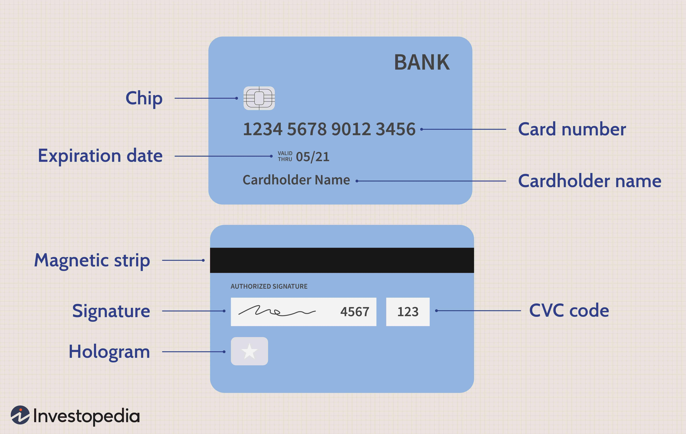

The intricate landscape of financial trading and product management is fundamentally influenced by the dynamics of product shelf life, expiry dates, and the increasing integration of algorithmic trading. Understanding the synergy between these elements is crucial for businesses and traders aiming to optimize market strategies, mitigate risks, and seize emerging opportunities. 

Product shelf life and expiry dates, traditionally associated with consumer goods, also play a pivotal role in financial markets, where they determine the longevity and viability of financial products like options and futures. These expiry dates have profound implications for the value and liquidity of such products, directly influencing trading decisions and strategy formulation. The expiration dynamics necessitate a comprehensive understanding by traders to prevent value depreciation and capitalize on timely opportunities.



Algorithmic trading, with its ability to process vast amounts of data at high speeds, is revolutionizing financial markets. It allows traders to execute complex strategies around expiry dates, manage volatilities, and react to market fluctuations with precision. Algorithms can assess various factors—such as time decay, market trends, and volatility—and adjust positions to maximize profits while minimizing potential risks. By automating these processes, algorithmic trading enhances the ability of traders to efficiently manage financial products approaching their expiry.

In essence, grasping the interconnectedness of product shelf life, expiry dates, and algorithmic trading is not merely beneficial but imperative. This understanding aids in informed decision-making, ensuring that both market participants and business managers remain competitive and resilient in the face of evolving market conditions. As algorithmic trading continues to advance, its application in managing expiry dates will likely expand, further transforming financial trading into a realm of high-tech precision and strategic foresight.

## Table of Contents

## Understanding Product Shelf Life and Expiry Dates

Product shelf life and expiry dates are critical concepts in both consumer goods and financial product management. The shelf life of a product refers to the period during which it remains safe to use, maintains its desired sensory, chemical, physical, and microbiological characteristics, and complies with any label claims. In contrast, the expiry date signifies the end point after which the product should not be used due to safety concerns or diminished quality.

In various industries, understanding the difference between shelf life and expiry dates is vital for safety and quality assurance. In pharmaceuticals, for instance, the expiry date is often determined through rigorous stability testing and is legally mandated to ensure consumer safety. By comparison, the shelf life might focus more on maintaining optimal efficacy or potency. Similarly, in the food industry, shelf life encompasses both the product's safety and quality in terms of taste, texture, and nutritional value. It is primarily determined by factors like ingredient stability, manufacturing processes, and packaging integrity. The expiry date, often marked as a "use by" date, provides a clear indicator for consumers regarding food safety.

Several factors influence the shelf life and expiry dates of products. Ingredients play a core role; products with preservatives may have longer shelf lives, while naturally derived products might be subject to quicker degradation. Processing methods, such as pasteurization in food production or sterilization in pharmaceuticals, can extend shelf life significantly by reducing microbial activity.

Storage conditions also critically impact both shelf life and expiry dates. Temperature is a crucial [factor](/wiki/factor-investing), with lower temperatures generally slowing down the chemical and microbiological changes that lead to product degradation. For instance, refrigerated or frozen products often have extended shelf lives compared to those stored at room temperature. Humidity and exposure to light or air can similarly affect product longevity, necessitating specific packaging solutions to mitigate these factors.

Lastly, regulatory frameworks guide the determination of shelf life and expiry dates. Compliance with local and international standards ensures that products meet safety requirements and serve their intended purposes. For many products, regulatory agencies require stability testing data to support claimed shelf lives and expiry dates, ensuring public health and safety.

By understanding these concepts, industries can ensure that products remain safe and effective throughout their intended lifespan, thereby protecting consumers and maintaining industry standards.

## Expiry Dates in Financial Markets

Expiry dates are crucial elements in financial markets, particularly impacting derivatives like options and futures. These dates define the point at which a contract ceases to exist, determining the final settlement between parties involved. Understanding expiry dates is vital for traders as it influences not only the pricing and value but also the [liquidity](/wiki/liquidity-risk-premium) and on-market strategies.

Options are financial derivatives that give the buyer the right, but not the obligation, to buy or sell an asset at a specified price before expiration. The expiry date for options is typically the last day the option can be exercised or traded. As the expiry date approaches, options experience time decay, meaning the time value portion of an option's premium decreases. This can significantly affect the pricing strategies of traders. The Greek parameter Theta is commonly used to measure time decay, represented mathematically as:

$$
\Theta = - \frac{\partial V}{\partial t}
$$

where $V$ is the option's price and $t$ is the time remaining until expiration. As expiry nears, Theta tends to increase, accelerating the decay of the option's time value. Traders often use this insight to make strategic decisions about holding or selling options.

Futures contracts are agreements to buy or sell assets at a predetermined price on a specified future date. Unlike options, futures necessitate the execution of the contract at expiration unless an offsetting trade occurs. The expiry date affects the futures market by determining delivery schedules and influencing liquidity as traders either close or roll over their positions nearing expiration.

Financial instruments like forward contracts, swaps, and warrants also have critical expiry dates affecting their valuation and trading dynamics. For instance, in the case of swaps, the expiration defines the end of the cash flow exchange period between parties, influencing the expected returns of the swap agreement.

For traders, understanding the implications of expiry dates is essential for risk management and strategy formulation. They must consider factors such as time decay in options and the potential need to roll over futures positions. Trading volumes generally increase near expiry dates due to the rolling over of contracts, leading to heightened market [volatility](/wiki/volatility-trading-strategies). This volatility can present both opportunities and risks, requiring traders to make well-informed decisions guided by market analysis and strategic planning.

In sum, expiry dates play a pivotal role in the valuation and trading strategies of financial instruments. Mastery of expiry date impacts enables traders to optimize their market activities, align strategies with market conditions, and ultimately improve financial outcomes.

## Algorithmic Trading and Expiry Date Management

Algorithmic trading has become integral to modern financial markets, leveraging complex algorithms to execute trades at speeds and frequencies that are impossible for human traders. Its application spans various assets, including stocks, futures, and options. The growing role of [algorithmic trading](/wiki/algorithmic-trading) is evident in its capacity to enhance trading strategies, particularly around the management of expiry dates for financial instruments.

The influence of algorithmic trading on expiry date management is profound, primarily because expiry dates critically affect the valuation and liquidity of financial products. For traders, understanding and predicting the impact of these dates can lead to significant profit opportunities or risk minimization. 

**Optimization of Strategies**

Algorithmic trading can optimize strategies regarding expiry dates by utilizing quantitative models to analyze historical data and market conditions. These models may incorporate factors such as time decay, volatility dynamics, and interest rates to derive optimal trading strategies. The algorithms continuously adjust positions as expiry dates approach, accounting for changes in market sentiment and underlying asset prices. This approach aids traders in maximizing their profits while minimizing potential losses associated with market movements around expiry dates.

For example, a popular strategy in options trading involves managing the time decay of options (also known as Theta), which is the rate at which an option's value decreases as it approaches its expiry. An algo-trader might use an algorithm that assesses the Theta of options in a position and adjusts holdings to optimize returns based on the anticipated price movement and time decay effects.

**Algorithms in Expiry Date Management**

Several algorithms are specifically designed for expiry date management in trading. These algorithms analyze various parameters, including implied volatility, historical price data, and market liquidity, to make data-driven decisions.

1. **Statistical Arbitrage Algorithms**: These are among the most prominent algorithms used in managing expiry dates. They identify correlations between financial assets and exploit pricing inefficiencies. By observing the expiry dates, traders can strategically position themselves to capitalize on predicted price movements.

2. **Delta Hedging Algorithms**: These algorithms help manage the risk associated with expiry dates, particularly in options trading. Delta hedging involves maintaining a neutral position by balancing the portfolio's Delta (the sensitivity of an option’s price to changes in the price of the underlying asset). As expiry dates approach, these algorithms adjust positions dynamically to maintain this balance, thereby mitigating potential losses from unfavorable price movements.

3. **Dynamic Algorithmic Hedging**: This involves real-time adjustments to hedge positions based on the evolving market conditions and time decay factors affecting derivatives nearing expiration. By automatically adjusting the hedging strategy as market variables change, traders can reduce the risks associated with expiry dates.

Algorithmic strategies around expiry dates are crucial for mitigating risks related to time decay and volatility, which often become pronounced as the expiry date of a financial product approaches. Consequently, integrating sophisticated algorithms into trading routines allows market participants to navigate the complexities of expiry date management effectively, leveraging technology to achieve enhanced trading outcomes.

## Case Study: The Role of Algorithms in Product Expiration Management

Spoiltracker is a tool specifically designed to address the challenges associated with managing expiration dates for perishable products. Its implementation illustrates the role of algorithms in enhancing inventory management and operational efficiency for businesses dealing with perishable goods. At its core, Spoiltracker employs sophisticated algorithms to monitor and predict the shelf life and expiration of products, thereby significantly reducing waste and improving resource allocation.

Businesses utilize Spoiltracker by integrating it into their inventory management systems. This allows for real-time tracking and analysis of product data, such as manufacturing dates, current storage conditions, and historical sales patterns. The tool leverages [machine learning](/wiki/machine-learning) algorithms to forecast the remaining shelf life of products. For instance, by using regression models, Spoiltracker can predict the degradation rate of perishable items based on factors like temperature, humidity, and handling practices.

A significant advantage of using Spoiltracker lies in its ability to optimize inventory turnover. By accurately predicting expiry dates, businesses can prioritize the sale of items nearing the end of their shelf life, reducing potential spoilage. This optimization is facilitated through predictive analytics that identify patterns and trends from historical data, enabling businesses to make informed decisions about stock levels and reorder points.

The real-world applications of such technology are vast. For example, in the retail sector, supermarkets can use Spoiltracker to dynamically adjust pricing strategies for perishables, offering discounts on items close to expiry to encourage sales and minimize waste. In the food production industry, manufacturers can utilize the tool to improve supply chain coordination, ensuring that products reach consumers while still fresh.

Implementing Spoiltracker also leads to enhanced operational efficiency. Businesses can automate the monitoring of expiry dates, freeing up resources previously dedicated to manual checks. This automation not only reduces labor costs but also minimizes human errors in inventory management processes.

In summary, Spoiltracker exemplifies how algorithmic solutions can transform expiration management from a reactive process to a proactive strategy. By harnessing data-driven insights, businesses can significantly decrease product waste, optimize inventory levels, and enhance overall operational performance, ultimately leading to increased profitability and sustainability.

## Factors Influencing Expiry Date Decision-Making in Algo Trading

In algorithmic trading, the selection of optimal expiry dates for financial products is a critical decision-making aspect influenced by various factors including time decay, volatility, strategy, and specific events. Accurate assessment and strategic management of these factors can significantly enhance trading outcomes.

**Time Decay and Its Implications**

Time decay, also known as theta, refers to the reduction in the price of options and futures as they approach their expiration date. This decay accelerates as the expiry date nears, impacting the intrinsic value of the financial instrument. Traders use time decay to determine the best window for executing trades, balancing the costs of holding options against potential gains. Mathematically, time decay can be expressed as:

$$
\Theta = \frac{\partial V}{\partial t}
$$

where $V$ represents the option's price and $t$ indicates time. Understanding and predicting time decay allows traders to optimize their strategies by deciding whether to hold or sell options based on their remaining time value.

**Volatility and its Impact on Expiry Dates**

Volatility is a measure of how much the price of a financial instrument is expected to fluctuate. High volatility affects options pricing and could suggest closer expiry dates to capitalize on short-term price movements. Conversely, low volatility environments might encourage longer expiry selections to wait for potential price shifts. The Black-Scholes Model, frequently used to price options, includes volatility as a crucial parameter:

$$
C = S_0 \cdot N(d_1) - X \cdot e^{-rt} \cdot N(d_2)
$$

where:
- $C$ is the call option price,
- $S_0$ is the current stock price,
- $X$ is the strike price,
- $r$ is the risk-free interest rate,
- $t$ is the time to expiry,
- $N(d)$ signifies the cumulative normal distribution function.

**Strategic Planning and Event-Driven Decisions**

Choosing expiry dates also involves strategic planning concerning market analysis and trading objectives. Traders might align expiry dates with scheduled economic reports, corporate earnings, or geopolitical events that can significantly affect asset prices. This approach requires predictive analytics and historical data analysis to identify patterns and make informed decisions.

**Advanced Tools and Technologies**

The utilization of advanced tools and technologies, including machine learning algorithms and predictive analytics, provides traders with deeper insights into optimal expiry date selection. These technologies analyze large datasets to forecast price movements and assess risk, potentially identifying opportunities that manual analysis might overlook.

A Python-based approach to analyze expiry date decision-making might involve using libraries such as NumPy for numerical computation and Pandas for data manipulation. A simple example of a function to compute potential expiry impact could look like this:

```python
import numpy as np

def estimate_expiry_impact(option_prices, time_days, volatility):
    time_decay_factor = np.exp(-time_days / 365)
    volatility_impact = np.std(option_prices) * volatility
    return time_decay_factor * volatility_impact

# Example usage:
option_prices = np.array([100, 102, 98, 105, 101])
estimated_impact = estimate_expiry_impact(option_prices, 30, 0.2)
print(f"Estimated Expiry Impact: {estimated_impact:.2f}")
```

In conclusion, by comprehensively analyzing time decay, volatility, strategic events, and leveraging modern analytical tools, traders can make informed decisions on expiry dates, optimizing their trading strategies to achieve better financial outcomes.

## Conclusion

Understanding and effectively managing shelf life and expiry dates are integral to both product management and financial trading. In product management, shelf life determines the period during which goods remain usable, valuable, or fit for consumption. Expiry dates are crucial in ensuring product safety and quality, particularly in industries like food, pharmaceuticals, and cosmetics. These expiration markers guide inventory control, reduce waste, and ensure customer satisfaction by preventing the distribution of products that are past their prime.

In the context of financial trading, especially with instruments like options and futures, expiry dates significantly influence pricing and liquidity. Knowing when a financial product will expire allows traders to develop strategies that capitalize on time decay and market movements. Algorithmic trading, utilizing precise mathematical models and data analysis, provides powerful tools for managing these expiry dates. Algorithms can swiftly process vast amounts of data, predict price movements, and execute trades at speeds impossible for human traders. This technical advantage enables traders to optimize their transactions around expiry dates, thereby enhancing potential returns and reducing exposure to risk.

Businesses and traders are therefore encouraged to harness technology and algorithmic strategies. By integrating advanced data analysis and automation, decision-making is not only improved but transformed, allowing for more agile and responsive operations. The application of algorithms in managing product expiration helps mitigate spoilage and leads to more efficient inventory practices. Meanwhile, in trading, these computational methods offer insights into market dynamics that can guide the selection of expiration dates for maximum profitability.

Success hinges on embracing these complex but essential facets of expiration management. As business environments and financial markets grow increasingly sophisticated, the adept use of algorithms and technological tools stands to offer a significant competitive edge. By effectively leveraging these strategies, businesses can enhance their operations, whilst traders can navigate the intricacies of financial instruments with greater confidence and foresight.

## References & Further Reading

[1]: Hull, J. C. (2018). ["Options, Futures, and Other Derivatives."](https://www.semanticscholar.org/paper/Options%2C-Futures%2C-and-Other-Derivatives-Hull/89bdee500c8623864fc9eb7a471546aa713acc44) Pearson Education.

[2]: Narang, R. K. (2013). ["Inside the Black Box: A Simple Guide to Quantitative and High Frequency Trading."](https://www.amazon.com/Inside-Black-Box-Quantitative-Frequency/dp/1118362411) Wiley. 

[3]: Chan, E. P. (2008). ["Quantitative Trading: How to Build Your Own Algorithmic Trading Business."](https://rickorford.com/quantitative-trading/) Wiley.

[4]: Lopez de Prado, M. (2018). ["Advances in Financial Machine Learning."](https://www.amazon.com/Advances-Financial-Machine-Learning-Marcos/dp/1119482089) Wiley.

[5]: Glasserman, P. (2004). ["Monte Carlo Methods in Financial Engineering."](https://link.springer.com/book/10.1007/978-0-387-21617-1) Springer. 

[6]: Pardo, R. (2011). ["The Evaluation and Optimization of Trading Strategies."](https://books.google.com/books/about/The_Evaluation_and_Optimization_of_Tradi.html?id=FXXOvV57mKcC) Wiley.

[7]: Kissell, R. (2013). ["The Science of Algorithmic Trading and Portfolio Management."](https://www.sciencedirect.com/book/9780124016897/the-science-of-algorithmic-trading-and-portfolio-management) Academic Press.