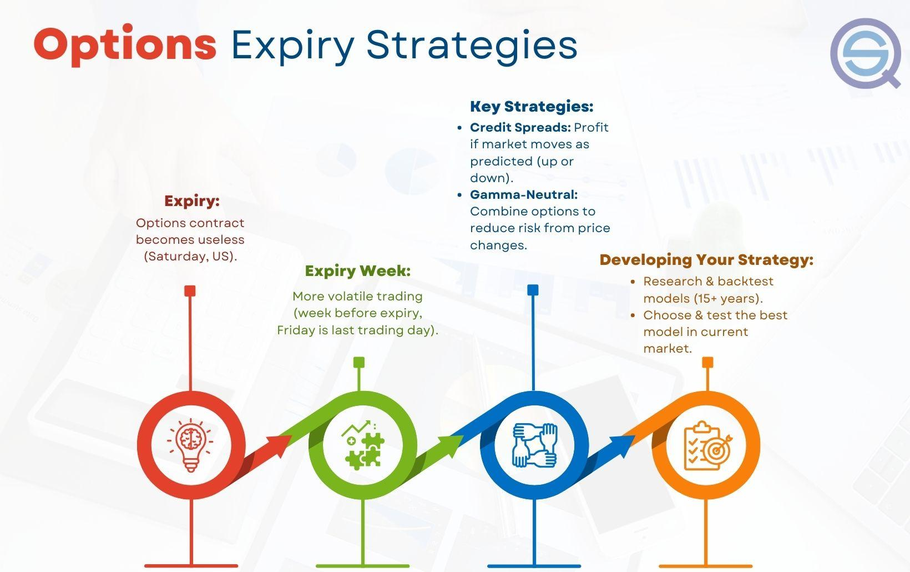

## Table of Contents

## What is expiry trading?

Expiry trading is when people buy and sell options contracts that are about to expire. Options are agreements that give you the right to buy or sell a stock at a certain price before a specific date. When that date comes, it's called the expiry date. Traders who do expiry trading try to make money by guessing what will happen to the stock price just before the options expire.

This type of trading can be risky but also exciting. Because the options are about to expire, their value can change a lot in a short time. Traders need to be very careful and watch the market closely. If they guess right, they can make a lot of money. But if they guess wrong, they can lose money quickly. It's important for anyone thinking about expiry trading to learn a lot about it first and be ready for big changes in the market.

## Why is understanding expiry dates important for trading?

Understanding expiry dates is really important for trading because it helps you know when your options will stop working. Options are like special tickets that let you buy or sell a stock at a certain price, but only until the expiry date. If you don't use your option before it expires, it becomes worthless, and you lose the money you spent on it. So, knowing the expiry date helps you plan when to make your move and not miss out.

Also, the expiry date can affect how much your option is worth. As the expiry date gets closer, the value of the option can change a lot. If you think the stock price will go up or down a lot before the expiry date, you might want to buy or sell the option at the right time to make money. Understanding this can help you make smarter choices and maybe even make more money from trading.

## What are the basic strategies for expiry trading?

One basic strategy for expiry trading is called "buying to close." This means you buy back the options you sold before they expire. If the price of the stock went the way you thought it would, you can buy back the options for less than you sold them for, making a profit. It's like guessing that the stock will go down, selling options that let others buy the stock at a higher price, and then buying those options back cheaper before they expire.

Another strategy is "selling to open," where you sell options that are about to expire. If you think the stock price won't move much before the expiry date, you can sell options and hope they expire worthless. This way, you keep the money people paid you for the options. It's a bit like betting that nothing big will happen to the stock price before the options run out of time.

A third strategy is "rolling over." If you have options that are about to expire but you still think the stock will move in your favor, you can "roll over" your options. This means you close your current options and open new ones with a later expiry date. It's like extending the time you have to be right about the stock's price, but it costs more money to do this.

## How does the timing of an option's expiry affect trading decisions?

The timing of an option's expiry really changes how traders make their decisions. As the expiry date gets closer, the value of the option can swing a lot. This is because there's less time for the stock price to move in the way the option holder wants. If a trader thinks the stock price will go up or down a lot before the expiry, they might decide to buy or sell options right before they expire to try and make money from those big changes. On the other hand, if they think the stock won't move much, they might sell options and hope they expire worthless, letting them keep the money they got for selling the options.

Also, traders need to keep an eye on the calendar because the expiry date sets a deadline for when they need to act. If they wait too long and the option expires without them using it, they lose the money they spent on the option. This makes timing really important. Some traders might choose to "roll over" their options to a later date if they still believe in their prediction about the stock's price but need more time. This gives them another chance to be right, but it costs more money. So, understanding when an option will expire helps traders plan their moves and manage their risks better.

## What are the risks associated with expiry trading?

Expiry trading can be risky because it involves guessing what will happen to a stock's price right before the options expire. If you guess wrong, you can lose the money you spent on the options. The closer you get to the expiry date, the faster the value of the options can change. This means you might see big gains or big losses in a short time. It's like trying to catch a fast-moving ball - if you time it right, you can win big, but if you miss, you can lose a lot.

Another risk is that options can become worthless if they expire without being used. If the stock price doesn't move the way you thought it would, and you don't sell or use your options before they expire, you lose the money you paid for them. This is why timing is so important in expiry trading. Also, rolling over options to a later date can help, but it costs more money, which adds to the risk. So, it's important to watch the market closely and be ready for big changes.

## Can you explain the concept of 'gamma scalping' in expiry trading?

Gamma [scalping](/wiki/gamma-scalping) is a strategy that some traders use in expiry trading. It involves buying and selling the stock that an option is based on to make money from small changes in the stock's price. The idea is to take advantage of the "gamma" of an option, which is how fast the option's "delta" (sensitivity to the stock's price) changes. When you use gamma scalping, you buy or sell the stock to balance out the changes in the option's value as the expiry date gets closer.

This strategy can be tricky because it requires you to watch the market very closely and make quick decisions. As the expiry date approaches, the option's gamma can get bigger, making the option's value change more quickly. Traders who do gamma scalping need to be ready to buy and sell the stock a lot to keep making small profits from these changes. It's a bit like trying to catch many small fish instead of waiting for one big one, and it can be exciting but also risky if the market moves against you.

## How do market conditions influence expiry trading strategies?

Market conditions play a big role in how traders approach expiry trading. If the market is very volatile, meaning the stock prices are moving a lot, traders might use strategies like gamma scalping to try to make money from these big swings. They might buy and sell options quickly, trying to catch the changes in the stock's price before the options expire. On the other hand, if the market is calm and the stock prices aren't moving much, traders might sell options and hope they expire worthless, keeping the money they got for selling them. This way, they can make money even if the stock price doesn't change a lot.

Another thing to think about is the overall direction of the market. If traders think the market will go up, they might buy call options, which give them the right to buy the stock at a certain price. If they think the market will go down, they might buy put options, which give them the right to sell the stock at a certain price. As the expiry date gets closer, traders need to keep an eye on these market trends and be ready to change their strategies if the market moves in a different way than they expected. Understanding how the market is behaving can help traders make better decisions and maybe even make more money from expiry trading.

## What are some advanced expiry trading strategies used by experienced traders?

Experienced traders often use a strategy called "straddle" in expiry trading. A straddle involves buying both a call option and a put option at the same strike price and expiry date for the same stock. This strategy works well when traders think the stock price will move a lot but aren't sure which way it will go. As the expiry date gets closer, if the stock price moves a lot in either direction, one of the options will gain value, hopefully making more money than the cost of both options. It's like betting on a big change without knowing if it will be up or down.

Another advanced strategy is called "iron condor." This is more complicated and involves selling an out-of-the-money call option and an out-of-the-money put option, while also buying a further out-of-the-money call and put to limit risk. The goal is to make money if the stock price stays within a certain range until the options expire. Experienced traders use this strategy when they think the market will be calm and the stock price won't move much. It's like betting that the stock price will stay in a safe zone, and if it does, the trader keeps the money from selling the options.

These strategies require a good understanding of the market and how options work. Traders need to watch the market closely and be ready to adjust their plans if the stock price moves unexpectedly. Both strategies can be profitable but also [carry](/wiki/carry-trading) risks, so it's important for traders to know what they're doing and be ready for different outcomes.

## How can one manage and mitigate risks when engaging in expiry trading?

Managing and mitigating risks in expiry trading starts with understanding the options market and knowing how much you can afford to lose. Before you start trading, set a budget for how much money you're willing to risk. This way, if things go wrong, you won't lose more than you can handle. It's also smart to diversify your investments, which means not putting all your money into one type of option or one stock. By spreading your money around, you can lower the chance that one bad trade will hurt you a lot.

Another way to manage risk is by using stop-loss orders. These are instructions you give to sell an option if it reaches a certain price, helping to limit your losses. Also, keep an eye on the market and be ready to change your plans if the stock price moves differently than you expected. Experienced traders often use strategies like "rolling over" their options to a later date if they need more time for their predictions to come true. This can help, but remember it costs more money, so use it carefully. By staying informed and being ready to adjust, you can better handle the ups and downs of expiry trading.

## What role does volatility play in expiry trading, and how can it be leveraged?

Volatility is how much a stock's price moves up and down. In expiry trading, high [volatility](/wiki/volatility-trading-strategies) means the stock price can change a lot in a short time, which can make options more valuable. Traders can use this to their advantage by buying options when they think the stock price will move a lot before the expiry date. For example, if a big news event is coming up that might affect the stock, traders might buy options to try to make money from the expected big changes in the stock price. This is like betting on a roller coaster ride, hoping to catch the highs and lows before the ride ends.

On the other hand, when the market is calm and the stock price isn't moving much, traders can sell options and hope they expire worthless. This way, they can keep the money they got for selling the options. Low volatility means the stock price is more likely to stay in a small range, so selling options can be a good strategy if you think nothing big will happen before the expiry date. It's like betting on a calm lake, hoping the water stays still until the end of the day. By understanding and watching volatility, traders can choose the right strategies to try to make money in expiry trading.

## How do professional traders approach the last hour before an option's expiry?

In the last hour before an option's expiry, professional traders are very focused and active. They watch the stock price closely because even small changes can make a big difference in the value of their options. If they think the stock price will move a lot in the final hour, they might buy or sell options quickly to try to make money from those last-minute swings. They might use strategies like gamma scalping, where they buy and sell the stock to take advantage of the fast changes in the option's value. It's a high-pressure time, and they need to be ready to make quick decisions.

Some traders might also decide to close their positions in the last hour to avoid the risk of the options expiring worthless. If they sold options, they might buy them back to lock in their profits or cut their losses. If they bought options, they might sell them if they think the stock price won't move enough to make them more money before expiry. It's all about timing and trying to guess what will happen in those final minutes. Professional traders know that the last hour can be unpredictable, so they stay alert and ready to act fast.

## What are the psychological factors one should consider when engaging in expiry trading?

When you're doing expiry trading, it's important to think about how your feelings can affect your choices. The excitement and stress of watching the stock prices change quickly can make you feel rushed or scared. This might make you want to make quick decisions without thinking them through. It's easy to get caught up in the moment and forget your plan, especially when you see the value of your options going up and down fast. Staying calm and sticking to your strategy, even when things get exciting or scary, is really important.

Another thing to keep in mind is how losing money can make you feel. If you lose money on a trade, you might feel sad or angry, and that can make you want to take bigger risks to try to win it back. This is called "revenge trading," and it can lead to even bigger losses. It's better to take a break and think clearly before making more trades. Also, feeling too confident after making money can make you think you can't lose, which might make you take risks you shouldn't. Keeping your emotions in check and making decisions based on what you know about the market, not how you feel, is key to doing well in expiry trading.

## References & Further Reading

[1]: Girish, S. (2020). ["Algorithmic Trading: A Comprehensive Beginner's Guide."](https://www.amazon.com/Algorithmic-Trading-Comprehensive-Beginners-Training/dp/1091263973) DataCamp.

[2]: ["Options, Futures, and Other Derivatives"](https://www.pearson.com/en-us/subject-catalog/p/options-futures-and-other-derivatives/P200000005938/9780136939917) by John C. Hull

[3]: ["The Complete Guide to Option Pricing Formulas"](https://pd.westernu.edu/textbooks/scholarship/_pdfs/The%20Complete%20Guide%20To%20Option%20Pricing%20Formulas.pdf) by Espen Gaarder Haug

[4]: Brogaard, J., Hendershott, T., & Riordan, R. (2014). ["High-Frequency Trading and Price Discovery."](https://www.jstor.org/stable/24465658) The Review of Financial Studies, 17(1), 223-270.

[5]: ["Trading and Exchanges: Market Microstructure for Practitioners"](https://www.amazon.com/Trading-Exchanges-Market-Microstructure-Practitioners/dp/0195144708) by Larry Harris