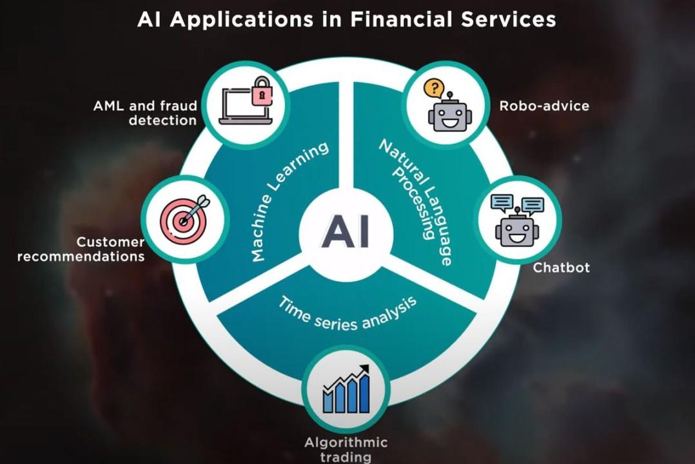

## Table of Contents

## What is Explainable AI (XAI) and why is it important in trading?

Explainable AI (XAI) is a type of artificial intelligence where the decisions and actions of the AI can be easily understood by humans. In trading, XAI helps traders see why an AI system made a certain trade or investment decision. This is important because it builds trust in the AI system. Traders can feel more confident using AI if they know the reasons behind its choices.

XAI is especially important in trading because financial markets can be unpredictable and complex. Being able to understand why an AI made a certain move can help traders learn from the AI's decisions and improve their own strategies. It also helps in identifying any mistakes or biases in the AI's decision-making process, making the trading system more reliable and safer to use.

## How does XAI differ from traditional AI in the context of trading?

In trading, traditional AI focuses on making decisions based on data and algorithms, but it often does so in a way that's hard for people to understand. It might predict stock prices or suggest trades, but it doesn't explain why it made those choices. This can make traders feel unsure about trusting the AI completely, especially when big money is on the line.

On the other hand, XAI in trading not only makes decisions but also explains them in a way that's easy to understand. For example, if XAI suggests buying a certain stock, it can tell you it's because the stock's price has been going up steadily and the company just reported good earnings. This transparency helps traders trust the AI more and learn from its decisions, making their own trading strategies better over time.

## What are the basic principles of XAI that traders should understand?

The first thing traders should know about XAI is that it's all about making AI decisions clear and easy to understand. Instead of just getting a suggestion to buy or sell a stock, XAI will tell you why it thinks that's a good idea. It might say something like, "I suggest buying this stock because its price has been going up and the company just had a good earnings report." This helps traders trust the AI more because they can see the reasoning behind each move.

Another important principle of XAI is that it helps traders learn and improve. By seeing why the AI made certain decisions, traders can start to understand the patterns and logic the AI uses. This can help them make better choices on their own, even when they're not using the AI. It's like having a smart friend who not only tells you what to do but also explains why, so you can get better at making decisions yourself.

## Can you explain some common XAI techniques used in trading algorithms?

One common XAI technique used in trading algorithms is called LIME, which stands for Local Interpretable Model-agnostic Explanations. LIME works by looking at a single trade decision and figuring out which parts of the data were most important for that decision. For example, if the AI decides to buy a stock, LIME can tell you that the decision was mostly based on the stock's recent price movements and the company's latest earnings report. This helps traders understand exactly why the AI made that choice, making it easier for them to trust and learn from the AI.

Another technique is SHAP, which stands for SHapley Additive exPlanations. SHAP looks at all the different pieces of data that the AI uses and figures out how much each piece contributed to the final decision. Imagine the AI is deciding whether to sell a stock. SHAP can show you that the decision was influenced by the stock's price dropping, negative news about the company, and a general downturn in the market. By breaking down the decision into these parts, SHAP helps traders see the full picture and understand the AI's reasoning step by step.

Both LIME and SHAP make the AI's decisions more transparent and understandable. This is really helpful in trading because the financial markets can be tricky and unpredictable. When traders can see why the AI is making certain moves, they feel more confident in using the AI and can also learn to make better trading decisions on their own.

## How can XAI help in improving the transparency of trading decisions?

XAI helps improve the transparency of trading decisions by explaining why an AI system makes certain choices. Instead of just telling traders to buy or sell a stock, XAI can say it's because the stock's price has been going up or the company just had good earnings. This makes it easier for traders to understand and trust the AI. When traders know the reasons behind each decision, they feel more confident in following the AI's suggestions.

By making AI decisions clear and understandable, XAI also helps traders learn and improve their own strategies. For example, if the AI suggests selling a stock because of negative news about the company, traders can see this pattern and start using it in their own decisions. This transparency not only builds trust but also makes trading safer and more reliable, as traders can spot any mistakes or biases in the AI's reasoning.

## What are the benefits of using XAI in trading for both novice and experienced traders?

For novice traders, XAI is like having a helpful teacher. When they use AI to make trading decisions, XAI explains why it suggests buying or selling a stock. This makes it easier for beginners to understand what's going on in the market. Instead of just following the AI blindly, they can learn from its decisions. Over time, this helps them get better at trading on their own. Plus, knowing why the AI makes certain choices can make novice traders feel more confident and less scared about making mistakes.

For experienced traders, XAI adds a new layer of insight to their existing knowledge. They can see the logic behind the AI's suggestions, which might show them patterns or reasons they hadn't thought of before. This can help them fine-tune their strategies and make even better decisions. XAI also helps them keep an eye on the AI's performance, spotting any errors or biases quickly. This makes their trading more reliable and safer, as they can trust the AI more and use it to their advantage.

## How can XAI be integrated into existing trading systems?

To integrate XAI into existing trading systems, you first need to understand how your current system works. Most trading systems use AI to analyze data and make decisions about buying or selling stocks. To add XAI, you can use special techniques like LIME or SHAP, which explain why the AI made those decisions. You'll need to connect these XAI tools to your trading system so that every time the AI makes a choice, it also gives a clear reason. This might mean updating your software or working with a tech team to make sure everything fits together smoothly.

Once XAI is part of your trading system, it can start making a big difference. Traders will be able to see why the AI suggests buying or selling a stock, like if it's because the stock's price is going up or the company had good earnings. This helps traders trust the AI more and learn from its decisions. Over time, this can make your trading system better because traders can spot any mistakes or biases in the AI's reasoning and fix them. Plus, it makes the whole process more open and easier to understand, which is great for both new and experienced traders.

## What are the challenges and limitations of implementing XAI in trading environments?

Adding XAI to trading systems can be tricky. One big challenge is that it takes a lot of work to make the AI explain its decisions in a simple way that traders can understand. This might mean changing the software a lot or hiring experts to help. Also, XAI can slow down the trading process because it needs extra time to explain each choice. In trading, every second counts, so this can be a problem. Another issue is that XAI might not always be able to explain everything perfectly. Sometimes, the reasons behind an AI's decisions can be too complex or unclear, which can make traders confused or unsure about what to do.

Another limitation is that XAI can be expensive to set up and maintain. You might need special tools and people who know a lot about both trading and AI to keep everything running smoothly. This can be tough for smaller trading firms or individual traders who don't have a lot of money to spend. Plus, even with XAI, there's always a chance that the AI might get things wrong. If the explanations aren't clear or if the AI makes a mistake, it can lead to bad trading decisions. So, while XAI can help a lot, it's not a perfect solution and needs to be used carefully.

## How does XAI contribute to regulatory compliance in the financial trading sector?

XAI helps with regulatory compliance in the financial trading sector by making it easier for traders and regulators to understand why certain trading decisions were made. When AI systems make choices about buying or selling stocks, they need to follow rules set by financial authorities. With XAI, these systems can explain their decisions clearly, so regulators can check if everything is being done correctly. This transparency helps make sure that trading is fair and honest, which is really important for keeping the financial markets safe and trustworthy.

Even though XAI is helpful, it's not a perfect solution for regulatory compliance. Sometimes, the explanations given by XAI might be too complex or unclear, which can make it hard for regulators to understand what's going on. Also, setting up and maintaining XAI can be expensive, and not all trading firms might have the resources to do it. But overall, XAI is a big step forward in making sure that trading decisions are more open and easier to check, which helps keep the financial world in line with the rules.

## What case studies or real-world examples demonstrate the successful application of XAI in trading?

One real-world example of XAI in trading is the work done by a company called S&P Global. They use XAI to help traders understand why their AI system suggests certain stock trades. For example, if the AI suggests buying a stock, it explains that it's because the company's earnings are good and the stock's price has been going up. Traders at S&P Global say this helps them trust the AI more and learn from its decisions. It also makes it easier for them to explain their trades to their bosses and to regulators, which is important for following the rules.

Another example is a project by a group of researchers at the University of Oxford. They created an XAI system that helps traders see why an AI decides to buy or sell stocks based on news articles. If the AI decides to sell a stock because of bad news about the company, the XAI system can show exactly which news articles influenced that decision. This helps traders understand how the AI thinks and makes their trading strategies better. It also helps them explain their trades more clearly to others, which is important for making sure everything is fair and honest in the financial markets.

## How can advanced XAI models predict and explain market trends and anomalies?

Advanced XAI models can help traders understand and predict market trends by looking at lots of different data, like stock prices, news, and economic reports. When the XAI model sees a trend, like a stock's price going up, it can explain why it thinks that's happening. For example, it might say the stock is going up because the company just had good earnings and people are buying more of its products. This helps traders see the big picture and make smarter decisions about when to buy or sell stocks.

XAI models are also good at spotting unusual things in the market, called anomalies. If a stock's price suddenly drops for no clear reason, the XAI model can look at all the data and figure out what might be causing it. Maybe there was a hidden problem with the company that the XAI found, or maybe it was just a mistake in the market. By explaining these anomalies, XAI helps traders understand what's going on and react quickly to protect their money or take advantage of new opportunities.

## What future developments can we expect in the field of XAI applied to trading?

In the future, we can expect XAI to get even better at explaining why it makes certain trading decisions. As technology improves, XAI models will be able to look at more data and understand more about what's happening in the market. This means they'll be able to give traders even clearer and more detailed reasons for buying or selling stocks. For example, instead of just saying a stock is going up because of good earnings, future XAI might also consider social media trends, global events, and even small changes in the company's operations. This will help traders make even smarter decisions and trust the AI more.

Another big change we might see is XAI becoming easier to use and more affordable for everyone. Right now, setting up XAI can be expensive and complicated, but as more people start using it, the tools and software will get better and cheaper. This means even small trading firms and individual traders will be able to use XAI to understand the market better. Plus, as XAI gets more common, it will help make trading fairer and more transparent, which is good for everyone in the financial world.

## References & Further Reading

[1]: ["MiFID II: Markets in Financial Instruments Directive"](https://eur-lex.europa.eu/eli/dir/2014/65/oj/eng) European Securities and Markets Authority.

[2]: López de Prado, M. (2018). ["Advances in Financial Machine Learning"](https://www.amazon.com/Advances-Financial-Machine-Learning-Marcos/dp/1119482089). Wiley.

[3]: Cartea, Á., Jaimungal, S., & Penalva, J. (2015). ["Algorithmic and High-Frequency Trading"](https://assets.cambridge.org/97811070/91146/frontmatter/9781107091146_frontmatter.pdf). Cambridge University Press.

[4]: ["The Impact of MIFID II on Algorithmic Trading"](https://fastercapital.com/content/MiFID-II-Algorithmic-Trading--Adapting-to-New-Market-Rules.html) by Wong, P. K. (2018), Journal of Financial Regulation and Compliance.

[5]: ["Artificial Intelligence in Financial Markets"](https://www.cftc.gov/media/2846/LabCFTC_PrimerArtificialIntelligence102119/download) by Christian L. Dunis et al.

[6]: Molnar, C. (2019). ["Interpretable Machine Learning"](https://christophm.github.io/interpretable-ml-book/).

[7]: ["Algorithmic Trading and DMA: An introduction to direct access trading strategies"](https://archive.org/details/algorithmictradi0000john) by Barry Johnson.

[8]: ["Explainable AI: Interpreting, Explaining and Visualizing Deep Learning"](https://link.springer.com/book/10.1007/978-3-030-28954-6) edited by Wojciech Samek et al.

[9]: Chen, L., et al. (2020). ["Transparency and Interpretability Design Guidance for AI Systems."](https://www.nature.com/articles/s41467-025-56606-2) arXiv preprint arXiv:2010.11035.