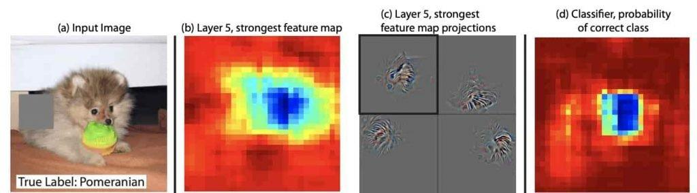

## Table of Contents

## What are Convolutional Neural Networks (CNNs) and how do they work?

Convolutional Neural Networks (CNNs) are a type of artificial neural network commonly used in image recognition and processing tasks. They are designed to automatically and adaptively learn spatial hierarchies of features, from low-level edges to high-level concepts, through a series of convolutional layers. Each convolutional layer applies several filters to the input, which helps the network detect specific features like edges, corners, or objects. These filters slide, or convolve, across the input data, performing element-wise multiplication and summing the results to create feature maps. This process reduces the number of parameters and computations needed, making CNNs efficient for processing large images.

The architecture of a CNN typically includes convolutional layers followed by pooling layers, which reduce the spatial size of the representation, decreasing the number of parameters and computation in the network. After several convolutional and pooling layers, the high-level reasoning in the neural network is done via fully connected layers, which are similar to traditional neural networks. The final layer often uses a softmax activation function to output probabilities for each class in classification tasks. During training, the network adjusts its weights using backpropagation and an optimization algorithm, like stochastic gradient descent, to minimize the difference between the predicted and actual outputs. This allows the CNN to improve its performance over time on tasks such as image classification, object detection, and more.

## Why is explainability important in the context of CNNs?

Explainability is important in the context of CNNs because it helps us understand how these networks make their decisions. When a CNN identifies an object in an image, it can be useful to know which parts of the image were most important for that decision. This understanding can build trust in the system, especially in critical applications like medical diagnosis or autonomous driving, where mistakes can have serious consequences. If people can see why a CNN made a certain prediction, they are more likely to trust and use the technology.

Moreover, explainability can help improve the performance of CNNs. By analyzing which features the network is focusing on, developers can identify and correct any biases or errors in the model. For example, if a CNN is meant to identify dogs but is focusing too much on backgrounds rather than the dogs themselves, this can be corrected. Explainability also aids in debugging and refining the model, making it more accurate and reliable. Overall, understanding the inner workings of CNNs through explainability is crucial for their effective and ethical use.

## What is XGrad-CAM and how does it help in explaining CNN decisions?

XGrad-CAM, or eXplanation Gradient-weighted Class Activation Mapping, is a technique used to make Convolutional Neural Networks (CNNs) more explainable. It helps us see which parts of an image the CNN is focusing on when it makes a decision. XGrad-CAM builds on an earlier method called Grad-CAM. It improves on Grad-CAM by using the gradients of the class scores with respect to the feature maps in a more precise way. This makes the explanation of the CNN's decision more accurate and detailed.

When you use XGrad-CAM, it creates a heatmap that shows which areas of the image are important for the CNN's prediction. The heatmap is made by taking the gradients of the output with respect to the last convolutional layer's feature maps, and then multiplying these gradients with the feature maps themselves. This process highlights the regions that contribute most to the final decision. By looking at this heatmap, people can understand why the CNN made a certain prediction, which is very helpful in fields like medicine or self-driving cars where understanding the decision-making process is crucial.

## How does PolyCAM differ from XGrad-CAM in terms of explainability?

PolyCAM and XGrad-CAM are both methods used to explain how Convolutional Neural Networks (CNNs) make decisions, but they work a bit differently. PolyCAM, or Polynomial Class Activation Mapping, focuses on creating a more detailed explanation of the CNN's focus by using polynomial functions to combine the feature maps. This method tries to capture more complex relationships between the feature maps, which can lead to a more accurate understanding of which parts of an image are important for the CNN's decision.

On the other hand, XGrad-CAM, or eXplanation Gradient-weighted Class Activation Mapping, uses the gradients of the class scores with respect to the feature maps to create its explanations. It improves on the earlier Grad-CAM method by making the explanations more precise. XGrad-CAM is good at showing exactly which areas of an image are crucial for the CNN's prediction, but it might not capture the complex relationships between feature maps as well as PolyCAM does. Both methods create heatmaps to visualize the important areas, but the way they calculate these heatmaps differs, leading to different levels of detail and accuracy in their explanations.

## Can you explain the process of generating an explanation using XGrad-CAM?

To generate an explanation using XGrad-CAM, you start by taking the last layer of the CNN that has feature maps. These feature maps are like different views of the image that the CNN uses to make its decision. You then calculate the gradients of the final class score with respect to these feature maps. The class score is the number that tells you how sure the CNN is about its prediction. By finding these gradients, you figure out how much each part of the feature maps affects the final decision. You multiply these gradients with the feature maps themselves to get a weighted sum, which shows which parts of the image are most important for the prediction.

After you have this weighted sum, you take the average of it across all the feature maps to create a single heatmap. This heatmap is then passed through a function called ReLU, which stands for Rectified Linear Unit. The ReLU function makes sure that only the positive values in the heatmap are kept, because negative values don't help explain the decision. The final heatmap shows you the areas of the image that the CNN focused on to make its prediction. By looking at this heatmap, you can understand why the CNN made a certain decision, which is very helpful in fields like medicine or self-driving cars where understanding the decision-making process is crucial.

## What are the key differences between traditional CAM and its extensions like XGrad-CAM and PolyCAM?

Traditional Class Activation Mapping (CAM) is a technique that helps us understand which parts of an image a Convolutional Neural Network (CNN) focuses on when making a decision. CAM works by using the last convolutional layer's feature maps and the weights of the fully connected layer to create a heatmap. This heatmap shows which areas of the image are important for the CNN's prediction. The formula for CAM is simple: you multiply the feature maps with the weights and then sum them up. CAM is great because it is easy to use and gives clear explanations, but it has some limits. For example, it can only be used with certain types of CNN architectures.

XGrad-CAM and PolyCAM are extensions of CAM that try to make the explanations even better. XGrad-CAM improves on CAM by using the gradients of the class scores with respect to the feature maps. This makes the heatmap more accurate and detailed. The process involves calculating the gradients, multiplying them with the feature maps, and then using a ReLU function to keep only the positive values. This gives a more precise understanding of which parts of the image are crucial for the CNN's decision. On the other hand, PolyCAM uses polynomial functions to combine the feature maps, which can capture more complex relationships between them. This method aims to provide a more detailed explanation by considering these complex interactions, making it useful for understanding the CNN's focus in a more nuanced way.

In summary, while traditional CAM provides a basic yet effective way to visualize a CNN's decision-making process, XGrad-CAM and PolyCAM enhance this by offering more detailed and accurate explanations. XGrad-CAM focuses on improving the precision of the heatmap using gradients, whereas PolyCAM tries to capture the intricate relationships between feature maps using polynomial functions. Both methods aim to improve the explainability of CNNs, making them more reliable and trustworthy in critical applications.

## How can XGrad-CAM and PolyCAM be applied in real-world scenarios?

XGrad-CAM and PolyCAM can be very useful in real-world situations where understanding how a Convolutional Neural Network (CNN) makes decisions is important. For example, in the medical field, doctors might use a CNN to help diagnose diseases from X-ray images. By using XGrad-CAM or PolyCAM, they can see exactly which parts of the X-ray the CNN is looking at to make its diagnosis. This helps doctors trust the CNN more because they can see why it made a certain decision. If the CNN points to a spot on the X-ray that the doctor also thinks is important, the doctor feels more confident in using the CNN's help. This can lead to better and faster diagnoses, which is really important for patients.

In another real-world scenario, self-driving cars use CNNs to recognize objects on the road, like other cars or pedestrians. XGrad-CAM and PolyCAM can help engineers check if the CNN is focusing on the right things. If the CNN is supposed to detect a pedestrian, these methods can show if it's looking at the whole person or just a part of them. This helps make sure the self-driving car can safely navigate the road. By understanding what the CNN is paying attention to, engineers can improve the system to make it more reliable and safe. This is crucial because self-driving cars need to make quick and accurate decisions to avoid accidents.

## What are the limitations of using XGrad-CAM for explainable CNNs?

XGrad-CAM helps explain how a CNN makes decisions by showing which parts of an image it focuses on. But it has some limits. One big limit is that it only looks at the last layer of the CNN. This means it might miss important details from earlier layers that also help the CNN make its decision. Imagine trying to understand a book by only reading the last chapter; you might miss important parts of the story. Also, XGrad-CAM can sometimes show too much focus on small details that aren't very important for the overall decision. This can make the explanation less clear and harder to trust.

Another limitation of XGrad-CAM is that it can be affected by noise in the image. If there's a lot of random stuff in the background, XGrad-CAM might think it's important and highlight it. This can lead to wrong explanations because the CNN might not really care about the noise. Also, XGrad-CAM needs the CNN to be able to calculate gradients, which not all CNN designs can do. So, it might not work with every type of CNN. Understanding these limits is important so we can use XGrad-CAM wisely and know when to look for other ways to explain how a CNN works.

## How can the effectiveness of PolyCAM be measured and compared to other methods?

To measure the effectiveness of PolyCAM and compare it to other methods like XGrad-CAM, researchers usually look at how well the method explains the CNN's decisions. They might use metrics like faithfulness, which checks if the explanation matches what the CNN is actually doing, and sensitivity, which looks at how the explanation changes when the image changes. They can also use human evaluations, where people look at the explanations and say how helpful they are. For example, they might show doctors the heatmaps from PolyCAM and ask if it helps them understand the CNN's diagnosis. By comparing these metrics and feedback across different methods, researchers can see if PolyCAM is better at explaining the CNN's focus than other techniques.

In addition to these metrics, researchers might also do experiments to see how PolyCAM performs in real-world situations. They could use PolyCAM on different types of images, like medical scans or road scenes for self-driving cars, and see how well it highlights the important parts. They might compare the results to what other methods like XGrad-CAM show. If PolyCAM's heatmaps are clearer and more accurate, it could be considered more effective. By testing PolyCAM in various scenarios and comparing it to other methods, researchers can get a good idea of its strengths and weaknesses and decide if it's a useful tool for making CNNs more explainable.

## What advanced techniques can be combined with XGrad-CAM to enhance model interpretability?

Combining XGrad-CAM with other advanced techniques can make the explanations of how a CNN works even better. One way to do this is by using Layer-wise Relevance Propagation (LRP). LRP helps show which parts of the input image are most important for the CNN's decision by looking at all the layers, not just the last one like XGrad-CAM does. By using LRP with XGrad-CAM, you can get a more complete picture of what the CNN is focusing on from start to finish. This can make the explanations more trustworthy because you see the whole process, not just the end result.

Another technique that can be used with XGrad-CAM is Integrated Gradients. Integrated Gradients works by looking at how the CNN's output changes as you slowly change the input image from a blank image to the real one. This helps show which parts of the image are most important for the CNN's decision. When you combine Integrated Gradients with XGrad-CAM, you get a more detailed and accurate explanation. The heatmap from XGrad-CAM can be fine-tuned with the information from Integrated Gradients, making it easier to understand why the CNN made a certain prediction.

## How do XGrad-CAM and PolyCAM handle multi-label classification tasks differently?

XGrad-CAM and PolyCAM handle multi-label classification tasks differently by how they create their heatmaps. XGrad-CAM uses the gradients of the class scores with respect to the feature maps to make its explanations. For multi-label tasks, where a CNN needs to identify several things in an image at once, XGrad-CAM calculates gradients for each label separately. It then combines these gradients to show which parts of the image are important for all the labels. This means XGrad-CAM can show a detailed heatmap for each label, helping us see which areas of the image are crucial for each thing the CNN is trying to identify.

PolyCAM, on the other hand, uses polynomial functions to combine the feature maps, which can capture more complex relationships between them. For multi-label classification, PolyCAM also looks at each label individually but tries to understand how the different labels might be related to each other. It creates a heatmap that not only shows which parts of the image are important for each label but also how these parts might interact with each other. This can give a more nuanced explanation of the CNN's focus, showing how different labels might depend on overlapping areas of the image.

## What future developments can we expect in the field of explainable CNNs beyond XGrad-CAM and PolyCAM?

In the future, we can expect new methods that make Convolutional Neural Networks (CNNs) even easier to understand. These new methods might look at all the layers of the CNN, not just the last one like XGrad-CAM does. They could use different ways to show how the CNN makes its decisions, like using more detailed heatmaps or even showing the process step-by-step. Researchers might also work on making these explanations faster and easier to use, so people in fields like medicine or self-driving cars can understand and trust the CNNs better. This could lead to CNNs that not only work well but also explain themselves in a way that everyone can understand.

Another area where we might see improvements is in making these explanations more accurate and useful for different types of tasks. For example, new methods might be better at handling images with lots of different things in them, or at showing how the CNN thinks about different parts of an image at the same time. These future developments could also focus on making the explanations more interactive, so users can ask questions and get more detailed answers about why the CNN made a certain decision. By making CNNs more explainable, we can use them in more places and make sure they are safe and reliable for important jobs.

## References & Further Reading

[1]: Selvaraju, R. R., Cogswell, M., Das, A., Vedantam, R., Parikh, D., & Batra, D. (2017). ["Grad-CAM: Visual Explanations from Deep Networks via Gradient-Based Localization."](https://ieeexplore.ieee.org/document/8237336) Proceedings of the IEEE International Conference on Computer Vision (ICCV).

[2]: Zhang, Q., & Zhu, S. C. (2018). ["Visual interpretability for deep learning: a survey."](https://arxiv.org/abs/1802.00614) International Journal of Computer Vision.

[3]: Guo, Y., Liu, Y., Oerlemans, A., Lao, S., Wu, S., & Lew, M. S. (2016). ["Deep learning for visual understanding: A review."](https://www.sciencedirect.com/science/article/abs/pii/S0925231215017634) Neurocomputing.

[4]: Montavon, G., Binder, A., Lapuschkin, S., Samek, W., & Müller, K. R. (2019). ["Layer-Wise Relevance Propagation: An Overview."](https://link.springer.com/content/pdf/10.1007/978-3-030-28954-6_10) Explainable AI: Interpreting, Explaining and Visualizing Deep Learning, Lecture Notes in Computer Science.

[5]: Sundararajan, M., Taly, A., & Yan, Q. (2017). ["Axiomatic Attribution for Deep Networks."](https://arxiv.org/abs/1703.01365) Proceedings of the 34th International Conference on Machine Learning.