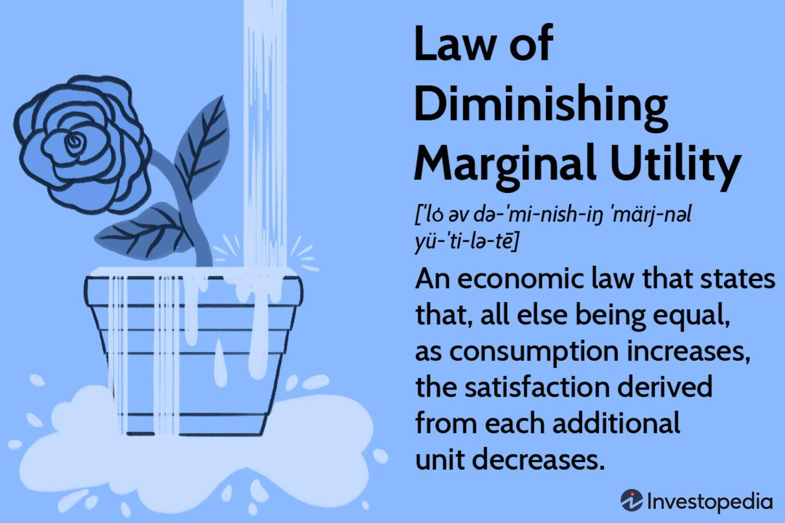

Diminishing marginal utility is a fundamental principle in economic theory describing how the additional satisfaction gained from consuming an extra unit of a good or service decreases as more units are consumed. Mathematically, it is often expressed as a function of utility, $U(x)$, where $U'(x) > 0$ but $U''(x) < 0$. This implies that while each additional unit consumed adds to total utility, the increase is smaller with each subsequent unit. This law underpins many economic models and consumer behavior analysis, as it influences decision-making and demand curves.

Consumer behavior is intrinsically linked to diminishing marginal utility, as it explains daily decisions about resource allocation. Consumers strive to maximize their total utility given budget constraints, and understanding this law helps explain why individuals diversify their consumption rather than continuously acquiring more of the same good. The marginal utility's decline helps shape preferences and guides how consumers value goods and services, impacting their choices in market transactions.



In today's financial markets, these concepts are increasingly relevant due to the rise of algorithmic trading, a method where computer algorithms execute trades at speeds and frequencies beyond human capabilities. Algorithms utilize a variety of data and economic principles, including diminishing marginal utility, to predict price movements and optimize trading strategies. There is a growing interest in applying consumer behavior theories to improve algorithmic models, allowing them to anticipate market trends and consumer responses more accurately.

This article explores the intersection of economic principles like diminishing marginal utility with algorithmic trading strategies. It aims to demonstrate how these foundational theories can enrich modern financial technologies. By unpacking this synergy, we seek to present insights for improving investment strategies and risk management, offering finance professionals and economists a comprehensive view of the evolving landscape. The subsequent sections will elucidate how these economic theories are integrated within algorithmic frameworks, offering potential pathways for innovation and enhanced market efficiency.

## Table of Contents

## Understanding Diminishing Marginal Utility

The law of diminishing marginal utility is a key principle in economics and consumer behavior, quantitatively expressing how the utility or satisfaction obtained from consuming additional units of a good or service decreases as consumption increases. Formally, the marginal utility $MU$ of consuming an additional unit can be expressed as:

$$
MU_n = U(Q_n) - U(Q_{n-1})
$$

where $U(Q_n)$ represents the total utility derived from consuming $Q_n$ units of a good.

An illustrative example is the consumption of food, such as slices of pizza. The first slice of pizza might provide a high level of satisfaction due to hunger, but by the fourth or fifth slice, the additional satisfaction decreases, reflecting a lower marginal utility.

This concept significantly informs consumer decision-making by influencing how consumers allocate their resources to maximize total utility. It suggests that consumers will only continue to purchase additional units of a good as long as the marginal utility derived from these units exceeds the cost. Thus, diminishing marginal utility is crucial in shaping demand curves, which typically slope downwards due to this decline in additional utility.

Diminishing marginal utility also affects the value consumers place on additional units. As the utility derived from consumption falls, consumers will be willing to pay less for each subsequent unit, aligning with the economic understanding of decreasing marginal benefit.

While this law is generally applicable, there are exceptions and limitations. Certain goods, such as addictive substances or collectibles, may not follow this diminishing pattern. For instance, the perceived value of collectible items may increase with rarity, contradicting the typical utility decline.

Importantly, these principles extend beyond tangible goods to financial assets. In investment, the perceived utility of acquiring more of a given asset typically decreases as portfolio risk increases. For instance, an investor might initially find substantial benefit in diversifying their portfolio with more stocks, but as the portfolio grows, the marginal utility of each additional stock diminishes due to increased risk exposure and diminished incremental gains.

Therefore, the law of diminishing marginal utility not only informs consumer behavior but also provides a lens through which to understand economic decision-making in various contexts, including financial markets.

## Consumer Behavior in Economic Theory

Consumer behavior in economic theory centers on understanding how individuals and groups make choices about the purchase and use of goods and services. It integrates various theories and models that explain consumer decision-making processes, preferences, and spending habits.

One of the critical theories affecting consumer behavior is the law of diminishing marginal utility. This law posits that as a consumer acquires additional units of a good or service, the added satisfaction (or utility) derived from consuming each subsequent unit decreases. Mathematically, if $MU_1, MU_2, MU_3, \ldots$ represent the marginal utilities of each unit, then $MU_1 > MU_2 > MU_3 \ldots$. This concept is crucial for understanding why consumers typically halt purchases beyond a certain point despite stable prices. For example, while the first slice of pizza provides substantial utility, following slices offer less utility until the consumer is satiated.

Diminishing marginal utility has a profound influence on consumer choices and preferences, dictating how they allocate their budgets across various goods and services. It is instrumental in shaping the demand curve, where higher quantities demanded lead to lower incremental utility and thus necessitate a lower price to drive additional purchases. This relationship underscores the downward slope of the demand curve in economic models.

Furthermore, psychological and socio-economic factors significantly influence consumer behavior. Psychological factors include perception, beliefs, attitudes, and motivation, which can dictate how utility is perceived and measured. For instance, a consumer’s lifestyle or social status might impact their preferences and the utility they gain from certain products. Socio-economic aspects such as income levels, cultural background, and social influences can alter spending patterns and demand elasticity, as consumers in different income brackets may react differently to price changes due to varying levels of utility derived from goods.

Case studies have demonstrated the pivotal role of diminishing marginal utility in consumer behavior. One notable example is the mobile phone industry, where companies frequently introduce new models. Despite technological advancements, consumers may resist upgrading because the utility gained from new features does not significantly surpass the utility from current models, especially after initial adoption.

Understanding these intricate details of consumer behavior assists economists and businesses in predicting market trends and tailoring strategies to meet consumer needs effectively. By recognizing both the limitations imposed by diminishing marginal utility and the broader psychological and socio-economic factors at play, firms can better anticipate shifts in demand and adjust offerings accordingly.

## Algorithmic Trading: A Modern Financial Strategy

Algorithmic trading, often referred to as algo trading, is the use of computer algorithms to automate trading strategies in financial markets. These algorithms are programmed to execute trades at speeds and frequencies that a human trader cannot achieve, thereby capitalizing on small price movements and improving market efficiency. Algorithmic trading has become a cornerstone of modern trading strategies due to its ability to systematically process large datasets and execute predefined instructions without emotional or psychological interference.

The evolution of [algorithmic trading](/wiki/algorithmic-trading) has been substantial, marking a significant shift from manual and floor-based trading. Initially, algorithmic trading started with simple strategies like [arbitrage](/wiki/arbitrage) and index fund rebalancing. With advancements in technology, these systems have expanded to include complex trading strategies such as [market making](/wiki/market-making), [statistical arbitrage](/wiki/statistical-arbitrage), and high-frequency trading. Algorithmic systems now represent a substantial portion of the trading [volume](/wiki/volume-trading-strategy) in equity markets worldwide.

Algorithms analyze markets by scanning a myriad of data points including price, volume, time, and order size across various markets to identify trading opportunities. They utilize techniques such as technical analysis, sentiment analysis, and [machine learning](/wiki/machine-learning) to predict future price movements. The decision-making process involves identifying trends or patterns in market data and executing buy or sell orders based on these insights. For instance, if an algorithm identifies a trading signal based on moving averages, it might automatically execute a trade once the short-term average crosses the long-term average.

Key technologies underpinning algorithmic trading include high-speed data feeds that provide real-time market information, state-of-the-art computing hardware capable of executing complex calculations in milliseconds, and robust communication networks that ensure instantaneous trade execution. Methodologies such as statistical models, quantitative analysis, and machine learning are integral to the design of effective algorithms. Python, due to its extensive libraries and ease of use, is frequently employed in developing and testing trading algorithms. 

For example, a simple moving average crossover strategy in Python could look like this:

```python
import pandas as pd

# Load data
data = pd.read_csv('market_data.csv')
data['Short_MA'] = data['Close'].rolling(window=50).mean()
data['Long_MA'] = data['Close'].rolling(window=200).mean()

# Generate signals
data['Signal'] = 0
data.loc[data['Short_MA'] > data['Long_MA'], 'Signal'] = 1  # Buy
data.loc[data['Short_MA'] < data['Long_MA'], 'Signal'] = -1  # Sell

# Execute trades
data['Trade'] = data['Signal'].diff()
```

The advantages of algorithmic trading are manifold. It allows for enhanced speed and accuracy in trade execution, and the capacity to backtest strategies using historical data. By eliminating human emotions, algorithms can consistently capitalize on trading opportunities. However, challenges include the risk of over-optimization, where a model performs well on past data but poorly in live markets. Additionally, algorithms are susceptible to market anomalies and rapid price changes that can lead to significant losses if not properly managed.

In conclusion, algorithmic trading remains a dynamic component of financial markets, driving innovation and efficiency. It offers significant opportunities but requires rigorous testing and risk management to navigate its inherent challenges effectively. As financial markets continue to evolve, the role of algorithmic trading is expected to grow, with ongoing enhancements to technology and trading strategies.

## Linking Economic Theory with Algorithmic Trading

Economic theories, such as diminishing marginal utility and consumer behavior, can significantly influence algorithmic trading by offering insights into market dynamics and investor decision-making processes. The incorporation of these principles within trading algorithms can enhance the accuracy and efficacy of predictions made in financial markets.

**Principles of Diminishing Marginal Utility in Trading Algorithms**

The law of diminishing marginal utility, a principle that describes the decrease in added satisfaction a consumer derives from consuming additional units of a good or service, can also be applied to financial assets. In trading, this concept allows algorithms to account for the decreasing marginal benefit of holding additional units of a security. For instance, an investor may experience diminishing returns as they acquire more of a particular stock, and thus, a trading strategy that recognizes this principle can optimize purchase and sale decisions to maximize portfolio efficiency. By integrating diminishing marginal utility into algorithms, traders can automate the decision process regarding optimal asset distribution, accounting for potential satiation effects on perceived value.

**Enhancing Algorithmic Predictions through Consumer Behavior**

A thorough understanding of consumer behavior provides valuable insights into market sentiment and demand elasticity, which can be leveraged to improve algorithmic trading models. Consumer behavior theories, such as the lifecycle hypothesis and the permanent income hypothesis, can aid algorithms in predicting long-term market trends by analyzing consumption patterns and saving behaviors. Furthermore, the integration of sentiment analysis and behavioral economics can help trading systems respond dynamically to shifts in consumer confidence and spending behavior, thereby refining predictive accuracy.

**Case Studies and Practical Integrations**

Several case studies underscore the successful embedding of economic theories in trading algorithms. For example, high-frequency trading models often use principles from behavioral finance to predict market fluctuations driven by trader psychology rather than pure market data. Another example is the use of utility theory in portfolio optimization algorithms, which seek to maximize expected utility rather than simply maximizing returns, aligning investment strategies with individual risk preferences.

**Impact on Investment Strategies and Risk Management**

The embedding of economic theories into algorithmic trading systems can have profound implications on investment strategies and risk management. By incorporating diminishing marginal utility, algorithms can facilitate more nuanced risk assessments by accounting for the diminishing perceived benefit of holding large quantities of a single asset. This can lead to more diversified portfolios and enhance risk mitigation strategies. Additionally, understanding consumer behavior can help identify market opportunities and threats, allowing traders to adjust their strategies proactively to navigate volatile market conditions.

**Emerging Trends and Innovations**

Recent advancements in technology and data analytics have led to innovations in algorithmic trading that leverage economic theories. Machine learning algorithms are increasingly used to model complex consumer behavior, enhancing the prediction of market trends. Additionally, [artificial intelligence](/wiki/ai-artificial-intelligence) systems employ economic principles to learn from historical data and adjust trading strategies in real-time based on observed patterns. Developments in natural language processing also allow algorithms to analyze social media and news feeds to gauge market sentiment effectively, thereby integrating behavioral finance insights into trading decisions.

In conclusion, the incorporation of economic principles into algorithmic trading provides a promising avenue for enhancing market predictions and investment strategies. By acknowledging theoretical insights such as diminishing marginal utility and consumer behavior, trading algorithms can operate with increased precision, offering potential benefits to traders and investors in navigating the complexities of modern financial markets.

## Challenges and Opportunities

Integrating economic theories such as diminishing marginal utility and consumer behavior into algorithmic trading presents several challenges and opportunities. The core challenge lies in quantifying and embedding these qualitative economic concepts into [quantitative trading](/wiki/quantitative-trading) systems. Translating consumer behavior, which is influenced by complex psychological and socio-economic factors, into algorithmic predictions requires sophisticated modeling techniques. Additionally, data limitations pose another hurdle, as the dynamic nature of markets demands real-time data processing and analysis, which often involves high costs and technical complexities.

Despite these challenges, there are substantial opportunities for enhancing market prediction and efficiency. By incorporating economic theories into algorithmic trading, algorithms can potentially offer more nuanced market analyses and predictions. For instance, understanding diminishing marginal utility can enhance an algorithm's ability to determine the value of assets beyond mere price movements, offering a comprehensive perspective on asset valuation. Furthermore, integrating consumer behavior models can improve the prediction of market dynamics, enabling algorithms to better anticipate shifts in demand and supply.

However, these integrations raise important regulatory and ethical considerations. Algorithmic trading must operate within frameworks established by financial regulatory bodies. There is a risk that automated systems could inadvertently manipulate markets or lead to unfair trading advantages, necessitating stringent oversight and ethical guidelines. Algorithm designers must ensure transparency and fairness, avoiding strategies that exploit market inefficiencies at the expense of broader market stability.

Looking ahead, the future landscape of finance will likely see a growing synergy between economic theories and algorithmic trading. Advances in machine learning and data analytics present opportunities to refine these integrations, enhancing their predictive accuracy and robustness. As algorithms become more intelligent, they will potentially reshape trading strategies, leading to more efficient markets and improved risk management. 

For investors and algorithm developers, the key recommendations include staying abreast of technological advancements and continually revising trading models to incorporate emerging economic insights. Investors should seek transparency from algorithm providers, ensuring that their investment strategies align with both economic principles and ethical standards. Meanwhile, developers should focus on creating adaptive algorithms that can learn from market feedback, leveraging economic theories to deliver superior performance while upholding regulatory compliance and ethical responsibilities.

## Conclusion

The interplay between diminishing marginal utility, consumer behavior, and algorithmic trading reflects a dynamic fusion of economic theory and modern financial strategies. Diminishing marginal utility, a cornerstone of economic thought, helps explain consumer decision-making and preferences, as well as how individuals allocate resources efficiently. By understanding the decrement in value placed on successive units of goods, economists and traders gain insights into demand patterns, which can be vital for predictive modeling in algorithmic trading.

Integrating these economic concepts into algorithmic trading provides both opportunities and challenges. One significant advantage is the potential for more accurate market predictions. By embedding consumer behavior theories into trading algorithms, financial models can more precisely anticipate market shifts driven by changing consumer demands and preferences. This aligns trading strategies with fundamental economic behaviors, enhancing both the efficiency and efficacy of trading operations.

However, the integration process is not without limitations. The unpredictable nature of markets, driven by numerous psychological and socio-economic factors, can challenge the reliability of models rooted purely in diminishing marginal utility. Additionally, the rapid technological advancements in algorithmic trading necessitate continuous adaptation of theories to keep pace with evolving market conditions.

For finance professionals and economists, these intersections provide fertile ground for research and development. Understanding how economic principles manifest in real-time trading environments allows for the refinement of strategies and the development of innovative tools that can manage risk more effectively. Moreover, continual research is crucial for enhancing the synergy between economic theory and technology, ensuring models remain relevant and efficient.

While the benefits of integrating economic theory with algorithmic trading are substantial, it is essential to consider broader economic and technological contexts. Ethical and regulatory challenges must be addressed to promote fair trading practices and secure financial system integrity. It is vital for investors and algorithm developers to remain informed of these intersections, acknowledging how ongoing innovations in algorithmic trading will shape the future landscape of finance. Through thoughtful exploration and adaptation, the interrelationship between economic theory and modern trading can lead to more robust financial markets, benefiting both individual investors and the global economy.

## References & Further Reading

[1]: Varian, H. R. (1992). "Microeconomic Analysis." W.W. Norton & Company.

[2]: Mankiw, N. G. (2014). "Principles of Economics." Cengage Learning.

[3]: Lopez de Prado, M. (2018). ["Advances in Financial Machine Learning."](https://www.amazon.com/Advances-Financial-Machine-Learning-Marcos/dp/1119482089) Wiley.

[4]: Chan, E. P. (2009). ["Quantitative Trading: How to Build Your Own Algorithmic Trading Business."](https://github.com/ftvision/quant_trading_echan_book) Wiley.

[5]: Sompolinsky, Y., Lass, P., & Nolan, N. (2017). "Slot-Based Aggregation of Competing Subchains." arXiv preprint arXiv:1710.09437.