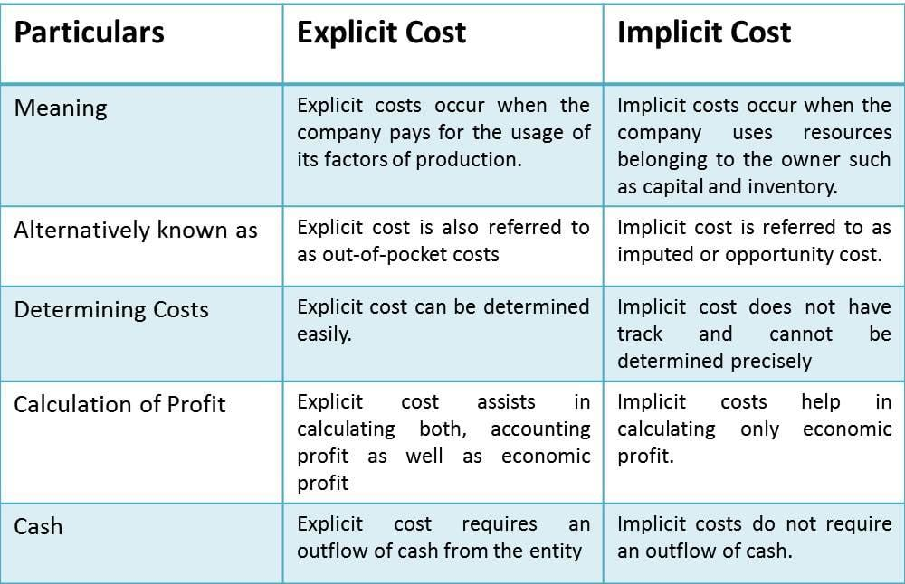

## Table of Contents

## What is an explicit cost?

An explicit cost is a direct payment made to others in the course of running a business. These are out-of-pocket expenses that a company incurs, such as wages paid to employees, rent for a building, or the cost of raw materials. Explicit costs are easily identifiable and recorded in the company's financial statements because they involve actual money transactions.

Understanding explicit costs is important for businesses because they directly affect the company's profitability. By tracking these costs, a business can better manage its budget and make informed decisions about where to allocate resources. For example, if the cost of raw materials increases, a company might look for cheaper suppliers or adjust its pricing strategy to maintain its profit margins.

## How do explicit costs differ from implicit costs?

Explicit costs and implicit costs are two types of costs that businesses face, but they are different in how they show up and what they mean. Explicit costs are the easy-to-see costs where money changes hands. These are things like paying for rent, salaries, or buying supplies. You can find these costs in the company's financial records because they involve actual payments.

Implicit costs, on the other hand, are not as easy to see because they don't involve direct payments. These costs are about the opportunities you give up when you choose to use your resources in a certain way. For example, if you use your own building for your business instead of renting it out, the rent you could have earned is an implicit cost. These costs are important but are not recorded in the financial statements because no money is spent.

Understanding both types of costs is important for a business to know its true profitability. Explicit costs show up in the profit and loss statement, while implicit costs help you understand the full economic cost of running your business. By considering both, a business owner can make better decisions about how to use their resources and plan for the future.

## Can you provide a simple example of an explicit cost in a business?

Imagine you own a small bakery. An explicit cost for your bakery would be the money you pay each month for rent. You have to write a check or make an online payment to the landlord to keep your bakery open. This is an explicit cost because it's a direct payment that comes out of your business's bank account.

Another example of an explicit cost in your bakery could be the wages you pay to your employees. Every week, you have to pay your workers for the hours they worked. This is money that goes directly from your business to the employees' pockets. These payments are easy to track because they involve actual money moving from one place to another.

## What are the common types of explicit costs a business might encounter?

Explicit costs are the costs a business has to pay directly with money. Some common explicit costs include wages that a business pays to its employees. Every time a business writes a check or does a direct deposit to pay its workers, that's an explicit cost. Another common explicit cost is rent. If a business rents a building or office space, the monthly payments to the landlord are explicit costs. Businesses also have to buy supplies or raw materials to make their products, and the money spent on these items is another type of explicit cost.

Other common explicit costs include utility bills like electricity, water, and gas. These are the bills a business pays each month to keep the lights on and the machines running. Advertising is another explicit cost; when a business pays for ads on TV, radio, or online, that money spent is an explicit cost. Finally, there are costs like insurance and taxes. Businesses have to pay for insurance to protect against risks, and they have to pay taxes to the government. All these payments are explicit costs because they involve spending actual money.

## How are explicit costs recorded in financial statements?

Explicit costs are recorded in a business's financial statements because they involve real money going out. These costs show up in the income statement, which is also called the profit and loss statement. This statement shows all the money coming into the business and all the money going out. The explicit costs are listed as expenses, like wages for employees, rent for the building, and the cost of supplies. These expenses are subtracted from the money the business makes, called revenue, to find out if the business made a profit or a loss.

In the balance sheet, explicit costs affect the cash account. When a business pays for something, like rent or utilities, the cash account goes down. The balance sheet shows what the business owns and what it owes at a certain time. So, when a business pays its explicit costs, it changes the numbers in the balance sheet. This helps everyone see how much money the business has and how it's being used.

## What role do explicit costs play in calculating a company's profit?

Explicit costs are important when figuring out a company's profit. Profit is what's left after you take away all the costs from the money the company makes. Explicit costs are the easy-to-see costs like paying for rent, salaries, or buying supplies. These costs are subtracted from the company's total revenue, which is all the money it makes from selling its products or services. So, if a company makes $100,000 in a year but spends $70,000 on explicit costs, its profit would be $30,000.

Understanding explicit costs helps a company know if it's making money or not. By keeping track of these costs, a business can see where its money is going and make better decisions. For example, if the cost of supplies goes up, the company might look for a cheaper supplier or raise its prices to keep making a profit. Without knowing the explicit costs, it would be hard for a company to plan and manage its money well.

## How can explicit costs affect a business's pricing strategy?

Explicit costs are important when a business decides how much to charge for its products or services. These costs include things like rent, salaries, and the price of supplies. If these costs go up, the business might need to raise its prices to make sure it still makes a profit. For example, if the cost of materials increases, the business might need to charge more for its products to cover the extra expense. By understanding explicit costs, a business can set prices that help it stay profitable.

On the other hand, if a business can lower its explicit costs, it might be able to offer lower prices to customers. For instance, if the business finds a cheaper supplier or moves to a less expensive location, it could save money on rent and materials. These savings could then be passed on to customers through lower prices, which might help the business attract more customers and increase sales. So, managing explicit costs carefully is key to setting a smart pricing strategy.

## What methods can be used to minimize explicit costs?

One way to minimize explicit costs is by finding cheaper suppliers. If a business can buy the things it needs for less money, it can save a lot. For example, a bakery might look for a new place to buy flour that costs less than what they are paying now. Another way is to negotiate better deals with current suppliers. Sometimes, if a business buys a lot from one supplier, it can ask for a discount. This can help lower the cost of supplies and other things the business needs to buy.

Another method is to cut down on expenses like rent and utilities. A business might move to a smaller or less expensive building to save on rent. It can also look for ways to use less electricity or water, like turning off lights when not in use or fixing leaks. By being smart about these costs, a business can keep more money in its pocket. It's also important to keep an eye on employee costs. Sometimes, a business can save money by hiring fewer people or finding ways for employees to work more efficiently. All these steps can help a business lower its explicit costs and stay profitable.

## How do explicit costs impact the decision-making process in business?

Explicit costs are the money a business spends on things like rent, salaries, and supplies. These costs are important when a business makes decisions because they show how much money is going out. If a business knows its explicit costs, it can make better choices about where to spend money. For example, if the cost of supplies goes up, the business might decide to find a cheaper supplier or change what it sells to keep making a profit. Understanding these costs helps a business plan and make smart choices.

Explicit costs also help a business decide on its prices. If these costs go up, the business might need to charge more for its products or services to cover the extra expense. On the other hand, if the business can lower its explicit costs, it might be able to offer lower prices to attract more customers. By keeping track of explicit costs, a business can see where it can save money and make decisions that help it stay profitable. This is why knowing and managing explicit costs is a big part of running a successful business.

## Can you explain how explicit costs are treated in economic theory?

In economic theory, explicit costs are the money that a business pays out for things like rent, wages, and supplies. These costs are easy to see because they involve real money changing hands. Economists use explicit costs to figure out a business's accounting profit. Accounting profit is what's left when you take all the explicit costs away from the total money the business makes. This number is important because it shows if a business is making money or losing it, according to its financial records.

But economists also look at another kind of profit called economic profit. To find economic profit, you start with accounting profit and then take away the implicit costs. Implicit costs are the opportunities a business gives up, like using your own building instead of renting it out. So, explicit costs are only part of the story in economic theory. They help economists understand the direct financial impact on a business, but to get the full picture of a business's performance, you need to consider both explicit and implicit costs together.

## What are the tax implications of explicit costs for a business?

Explicit costs have a big impact on a business's taxes. These costs are the money a business spends on things like rent, salaries, and supplies. When a business calculates its taxable income, it can subtract these explicit costs from its total earnings. This means the business will pay less in taxes because its profit, after subtracting these costs, is smaller. For example, if a business makes $100,000 but spends $60,000 on explicit costs, it only pays taxes on the $40,000 left over.

It's important for a business to keep good records of its explicit costs. This helps when it's time to file taxes because the business can show the government exactly what it spent money on. If a business doesn't keep track of these costs well, it might end up paying more in taxes than it needs to. So, by understanding and managing explicit costs, a business can save money on taxes and use that money for other things, like growing the business or paying employees.

## How do explicit costs influence the overall financial health and sustainability of a business?

Explicit costs are the money a business spends on things like rent, salaries, and supplies. These costs are important because they affect how much profit a business makes. If a business can keep its explicit costs low, it can make more money. This extra money can be used to grow the business, like buying new equipment or hiring more people. When a business manages its explicit costs well, it can stay strong and keep making money even when times are tough.

On the other hand, if explicit costs are too high, a business might struggle. If the business spends too much on rent or supplies, it might not make enough profit to stay open. This can make it hard for the business to pay its bills or invest in new things. By keeping an eye on explicit costs and finding ways to spend less, a business can stay healthy and keep going for a long time. This is why understanding and managing explicit costs is key to a business's overall financial health and sustainability.

## What are the differences between Explicit Costs and Implicit Costs?

Explicit costs are straightforward, tangible expenses that a business incurs, and they are recorded in the financial statements. These costs include direct payments such as wages for employees, lease payments for machinery, utilities, and purchase of raw materials. They contribute directly to a company’s accounting profit and are vital for budgeting, forecasting, and financial analysis.

In contrast, implicit costs are intangible and not documented in the company's financial records. These costs represent the opportunity cost of utilizing resources in one way rather than in another potentially profitable alternative. For example, if a firm owner uses a building they own as a store rather than renting it out, the implicit cost is the forgone rent income. Though not directly measurable through invoices or receipts, implicit costs play a substantial role in determining the true economic profit of a business, which is more comprehensive than accounting profit.

To thoroughly understand profitability and guide strategic business decisions, companies must assess both explicit and implicit costs. Economic profit, a more comprehensive measure than accounting profit, is calculated as follows:

$$
\text{Economic Profit} = \text{Total Revenue} - (\text{Explicit Costs} + \text{Implicit Costs})
$$

This dual consideration aids businesses in accurately evaluating potential investments and market entry strategies. Ignoring implicit costs can result in underestimating the true costs associated with business decisions. Therefore, while explicit costs inform operational budgeting and immediate financial planning, implicit costs are crucial for long-term strategic decisions, enabling firms to evaluate the full spectrum of their economic activities and resource allocations. Together, these costs ensure that decision-makers are equipped with a holistic understanding of the repercussions their financial and operational choices may entail.

## What is the role of explicit costs in algorithmic trading?

Algorithmic trading is fundamentally dependent on technological infrastructure, which brings about explicit costs that include software licenses, hardware maintenance, and subscriptions to market data. These costs are crucial and directly impact an [algorithmic trading](/wiki/algorithmic-trading) firm's financial statements.

Proper allocation and management of explicit costs can significantly improve the efficiency and profitability of trading operations. For instance, the strategic use of cost accounting processes allows firms to systematically track where their technological budget is being spent, identifying areas where expenses might be trimmed without compromising performance. By monitoring software licenses and market data subscriptions, firms can ensure they are only paying for necessary resources, thus avoiding redundant expenditures.

In the high-paced world of algorithmic trading, transaction costs become a focal point due to the sheer [volume](/wiki/volume-trading-strategy) of trades executed. Effective cost accounting is critical to managing these transaction costs, which include brokerage fees, exchange fees, and other financial charges associated with trading activities. An algorithmic trading firm must track these costs meticulously, as they can add up quickly and eat into profits.

For example, consider the total transaction cost (TTC) associated with trading activities:

$$
\text{TTC} = \sum (\text{Brokerage Fees} + \text{Exchange Fees} + \text{Other Charges})
$$

Reducing transaction costs without affecting the speed or reliability of trades requires a careful review of explicit costs. This involves choosing cost-effective brokerage services and leveraging volume discounts offered by exchanges. By minimizing these costs, firms can reduce slippage, which is the difference between the expected price of a trade and the actual price, thereby optimizing execution times and improving overall trading performance.

Moreover, with advancements in [machine learning](/wiki/machine-learning) and [artificial intelligence](/wiki/ai-artificial-intelligence), algorithmic trading platforms continue to evolve, necessitating periodic updates and new capabilities. This leads to a recurring explicit cost in terms of updating software and installing new hardware. Efficient management of these costs ensures that the technology stack remains robust enough to handle sophisticated trading algorithms while staying within budgetary constraints.

Effective explicit cost management in algorithmic trading involves a multidisciplinary approach that combines cost accounting, strategic financial planning, and technological insight. The ability to balance these factors allows traders not only to maintain a competitive edge but also to guarantee sustainable financial health in an ever-evolving market landscape.

## What are Cost Accounting Strategies for Optimizing Explicit Costs?

To optimize explicit costs, businesses can employ several cost accounting strategies. These strategies, including activity-based costing, lean accounting principles, and marginal costing, allow firms to allocate and manage their costs effectively, thereby driving profits and efficiency.

**Activity-Based Costing (ABC)**

Activity-Based Costing is a precise strategy that assigns costs to specific activities or projects within an organization. By mapping out all the processes and determining the resources they consume, companies can identify cost drivers for each activity. This granular approach provides a deep understanding of where costs stem from and enables firms to target inefficiencies directly. Implementing ABC involves these steps:

1. **Identify Activities**: Outline all significant activities required to produce goods or offer services.
2. **Assign Costs to Activities**: Allocate direct expenses, like labor and materials, to each activity based on consumption.
3. **Determine Cost Drivers**: Establish factors that cause costs to increase or decrease, such as machine hours or units produced.
4. **Calculate Activity Rates**: Divide total activity costs by total cost drivers to establish cost per unit of activity.
5. **Allocate Activity Costs to Products/Services**: Use the calculated rates to assign costs to specific products or services.

Using the equation:

$$
\text{Activity Cost} = \text{Activity Rate} \times \text{Cost Driver Quantity}
$$

ABC helps businesses track costs with precision, providing the basis for strategic decisions such as pricing and product discontinuation.

**Lean Accounting Principles**

Lean accounting concentrates on eliminating waste, thereby increasing value creation. This approach aligns cost accounting practices with lean manufacturing philosophies, focusing on creating value for customers by reducing non-value-added activities. For tech-driven fields such as algorithmic trading, lean accounting minimizes unnecessary processes and supports efficient workflows by:

- Simplifying accounting processes to eliminate time-consuming transactions and reports.
- Encouraging continuous improvement and streamlined processes to reduce waste.
- Supporting lean decision-making by providing clear, relevant financial data for managing daily operations.

By integrating lean principles, companies ensure that their financial practices support the broader goal of efficiency and customer satisfaction.

**Marginal Costing**

Marginal costing is invaluable for decision-making regarding production levels and pricing strategies. It involves assessing the additional cost incurred from producing one more unit of output. This method considers only variable costs—expenses that vary directly with the level of production—while fixed costs remain constant. The formula for calculating marginal cost is:

$$
\text{Marginal Cost} = \frac{\Delta \text{Total Costs}}{\Delta \text{Quantity}}
$$

Where $\Delta \text{Total Costs}$ represents the change in total cost and $\Delta \text{Quantity}$ signifies the change in output quantity. Marginal costing helps firms decide optimal production levels and assess the impact of changes in output on overall profitability.

**Conclusion**

By integrating cost accounting strategies such as ABC, lean accounting, and marginal costing, businesses can better allocate and manage explicit costs. These approaches not only streamline operations but also enhance financial performance, paving the way for competitive advantage and sustained profitability.

## References & Further Reading

Explore texts like *Cost Accounting: A Managerial Emphasis* authored by Charles T. Horngren, Srikant M. Datar, and Madhav V. Rajan, which provides foundational insights into cost management principles. This comprehensive resource covers various dimensions of cost accounting, including cost behavior, planning, and control, essential for understanding explicit costs in businesses ranging from manufacturing to service industries.

Further, case studies such as those on Lean Accounting implementations at Toyota provide practical applications and valuable outcomes. Toyota’s integration of Lean Accounting principles showcases how the minimization of waste and enhancement of process value contribute to more accurate and efficient financial management. Lean Accounting emphasizes the use of value streams and simplifies the accounting processes, making it highly relevant for sectors that prioritize efficiency and waste reduction.

Additionally, personal development in understanding cost accounting methods is vital to enriching analytical skills and strategic business acumen. Engaging with professional courses and certifications, such as those offered by the Chartered Institute of Management Accountants (CIMA) or the Institute of Management Accountants (IMA), can provide deeper insights into cost structures and enhance one’s capability to make informed and strategic decisions. Further, online platforms like Coursera and LinkedIn Learning offer courses tailored to contemporary cost accounting challenges and methodologies, helping professionals stay updated with industry standards and innovations. 

These resources collectively support the enhancement of one's understanding of cost accounting and how such knowledge can be applied strategically within a business to optimize explicit costs and improve overall financial performance.

