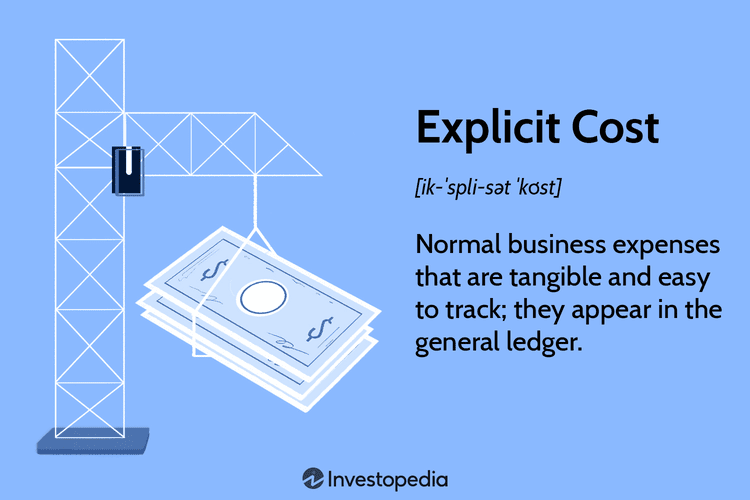

Cost accounting is a fundamental aspect of modern business operations that enables companies to effectively capture and analyze the costs involved in producing goods and services. This discipline is critical across various industries, from manufacturing, where costs can include raw materials and labor, to algorithmic trading, which involves specific costs associated with technology and data processing. Understanding and managing explicit costs, which are direct, tangible expenses such as wages, lease payments, and utilities, is crucial for optimizing operations and enhancing profitability.

Explicit costs are easily identifiable and recorded in financial statements, making them a vital component in the calculation of accounting profits. These costs have a direct impact on a company's bottom line and are essential for precise budgeting and forecasting. In algorithmic trading, for example, explicit costs include transaction fees, technology infrastructure expenses, and data feed subscriptions. By tracking and controlling these costs, firms can enhance their trading efficiency and overall profitability.



A robust cost accounting framework is integral to strategic decision-making and competitive positioning. It allows businesses to allocate resources effectively, price products or services competitively, and identify cost-saving opportunities. In the fast-paced environment of algorithmic trading, where millions of decisions are made within fractions of a second, the ability to manage explicit costs effectively can significantly impact performance outcomes. Thus, integrating cost accounting principles with advanced trading strategies presents opportunities for improved business results and sustained competitive advantage.

## Table of Contents

## Understanding Explicit Costs

Explicit costs represent the clear and concrete expenses a business faces during regular operations. These costs are straightforward to identify and document in financial statements, and they play a vital role in determining a company's profitability. They consist of payments made for wages, lease payments, utilities, raw materials, and other direct expenses.

For example, wages are a primary explicit cost, encompassing salaries, bonuses, and employee benefits. These are paid regularly and are easily traceable through payroll records. Similarly, lease payments for office or manufacturing space are fixed and contractual, making them another straightforward explicit cost. Utilities, such as electricity and water, are recurring expenses essential for maintaining business operations. Lastly, raw materials represent a critical explicit cost for manufacturing companies, directly impacting production costs and influencing pricing strategies.

Understanding and managing explicit costs are crucial for accurate calculation of accounting profit, defined as total revenue minus explicit costs. Accounting profit provides a clear picture of the financial health of a business and influences key decisions such as pricing, investment, and cost-cutting strategies.

Additionally, the transparency and traceability of explicit costs enable precise budgeting and forecasting. Businesses can analyze historical data to project future expenses accurately, ensuring financial stability and strategic planning. Accurately categorized explicit costs also facilitate variance analysis, allowing management to identify and address discrepancies between expected and actual expenditures. 

In summary, explicit costs form the backbone of financial accounting by providing clear insights into operational expenses, thereby supporting profit analysis and informed business decision-making.

## Explicit Costs vs. Implicit Costs

Explicit costs are straightforward, tangible expenses that a business incurs, and they are recorded in the financial statements. These costs include direct payments such as wages for employees, lease payments for machinery, utilities, and purchase of raw materials. They contribute directly to a company’s accounting profit and are vital for budgeting, forecasting, and financial analysis.

In contrast, implicit costs are intangible and not documented in the company's financial records. These costs represent the opportunity cost of utilizing resources in one way rather than in another potentially profitable alternative. For example, if a firm owner uses a building they own as a store rather than renting it out, the implicit cost is the forgone rent income. Though not directly measurable through invoices or receipts, implicit costs play a substantial role in determining the true economic profit of a business, which is more comprehensive than accounting profit.

To thoroughly understand profitability and guide strategic business decisions, companies must assess both explicit and implicit costs. Economic profit, a more comprehensive measure than accounting profit, is calculated as follows:

$$
\text{Economic Profit} = \text{Total Revenue} - (\text{Explicit Costs} + \text{Implicit Costs})
$$

This dual consideration aids businesses in accurately evaluating potential investments and market entry strategies. Ignoring implicit costs can result in underestimating the true costs associated with business decisions. Therefore, while explicit costs inform operational budgeting and immediate financial planning, implicit costs are crucial for long-term strategic decisions, enabling firms to evaluate the full spectrum of their economic activities and resource allocations. Together, these costs ensure that decision-makers are equipped with a holistic understanding of the repercussions their financial and operational choices may entail.

## Examples of Explicit Costs in Cost Accounting

In cost accounting, explicit costs are those tangible expenses directly tied to business operations. These costs are recorded in financial statements, offering clear insights into the financial health of an enterprise. 

In manufacturing, explicit costs predominantly include raw materials and direct labor. Raw materials are the physical inputs essential for producing goods. For instance, in automobile manufacturing, steel, rubber, and glass are prime examples of raw materials. Direct labor costs cover wages paid to workers directly involved in the production process, such as assembly line operators.

The service industries, such as hospitality, bear explicit costs including utilities and employee salaries. Utilities embody expenses for electricity, water, and heating essential for the functioning of a facility. Employee salaries encompass payments to staff members providing services, such as hotel receptionists and cleaning personnel.

Algorithmic trading firms face explicit costs associated with technology infrastructure, transaction fees, and data feeds. Technology infrastructure includes expenditures on high-performance computing equipment and software critical for executing trades efficiently. Transaction fees are costs incurred each time a trade is executed, while data feeds refer to the charges for obtaining real-time financial data essential for making informed trading decisions.

Understanding these costs equips organizations to develop effective strategies for pricing, budgeting, and resource allocation. Precise cost tracking helps businesses achieve cost efficiency and optimize overall financial performance. For instance, in Python, a simple budget allocation can be visualized as follows:

```python
# Example of a very basic budget allocation
budget = {
    'raw_materials': 50000,
    'labor': 35000,
    'utilities': 15000,
    'employee_salaries': 40000,
    'technology_infrastructure': 60000,
    'transaction_fees': 10000,
    'data_feeds': 15000
}

total_explicit_costs = sum(budget.values())
print(f"Total Explicit Costs: ${total_explicit_costs}")
```

This code sums the explicit costs from different categories, giving businesses a straightforward method to comprehend their financial commitments and adjust strategies accordingly.

## The Role of Explicit Costs in Algorithmic Trading

Algorithmic trading is fundamentally dependent on technological infrastructure, which brings about explicit costs that include software licenses, hardware maintenance, and subscriptions to market data. These costs are crucial and directly impact an [algorithmic trading](/wiki/algorithmic-trading) firm's financial statements.

Proper allocation and management of explicit costs can significantly improve the efficiency and profitability of trading operations. For instance, the strategic use of cost accounting processes allows firms to systematically track where their technological budget is being spent, identifying areas where expenses might be trimmed without compromising performance. By monitoring software licenses and market data subscriptions, firms can ensure they are only paying for necessary resources, thus avoiding redundant expenditures.

In the high-paced world of algorithmic trading, transaction costs become a focal point due to the sheer [volume](/wiki/volume-trading-strategy) of trades executed. Effective cost accounting is critical to managing these transaction costs, which include brokerage fees, exchange fees, and other financial charges associated with trading activities. An algorithmic trading firm must track these costs meticulously, as they can add up quickly and eat into profits.

For example, consider the total transaction cost (TTC) associated with trading activities:

$$
\text{TTC} = \sum (\text{Brokerage Fees} + \text{Exchange Fees} + \text{Other Charges})
$$

Reducing transaction costs without affecting the speed or reliability of trades requires a careful review of explicit costs. This involves choosing cost-effective brokerage services and leveraging volume discounts offered by exchanges. By minimizing these costs, firms can reduce slippage, which is the difference between the expected price of a trade and the actual price, thereby optimizing execution times and improving overall trading performance.

Moreover, with advancements in [machine learning](/wiki/machine-learning) and [artificial intelligence](/wiki/ai-artificial-intelligence), algorithmic trading platforms continue to evolve, necessitating periodic updates and new capabilities. This leads to a recurring explicit cost in terms of updating software and installing new hardware. Efficient management of these costs ensures that the technology stack remains robust enough to handle sophisticated trading algorithms while staying within budgetary constraints.

Effective explicit cost management in algorithmic trading involves a multidisciplinary approach that combines cost accounting, strategic financial planning, and technological insight. The ability to balance these factors allows traders not only to maintain a competitive edge but also to guarantee sustainable financial health in an ever-evolving market landscape.

## Cost Accounting Strategies for Optimizing Explicit Costs

To optimize explicit costs, businesses can employ several cost accounting strategies. These strategies, including activity-based costing, lean accounting principles, and marginal costing, allow firms to allocate and manage their costs effectively, thereby driving profits and efficiency.

**Activity-Based Costing (ABC)**

Activity-Based Costing is a precise strategy that assigns costs to specific activities or projects within an organization. By mapping out all the processes and determining the resources they consume, companies can identify cost drivers for each activity. This granular approach provides a deep understanding of where costs stem from and enables firms to target inefficiencies directly. Implementing ABC involves these steps:

1. **Identify Activities**: Outline all significant activities required to produce goods or offer services.
2. **Assign Costs to Activities**: Allocate direct expenses, like labor and materials, to each activity based on consumption.
3. **Determine Cost Drivers**: Establish factors that cause costs to increase or decrease, such as machine hours or units produced.
4. **Calculate Activity Rates**: Divide total activity costs by total cost drivers to establish cost per unit of activity.
5. **Allocate Activity Costs to Products/Services**: Use the calculated rates to assign costs to specific products or services.

Using the equation:

$$
\text{Activity Cost} = \text{Activity Rate} \times \text{Cost Driver Quantity}
$$

ABC helps businesses track costs with precision, providing the basis for strategic decisions such as pricing and product discontinuation.

**Lean Accounting Principles**

Lean accounting concentrates on eliminating waste, thereby increasing value creation. This approach aligns cost accounting practices with lean manufacturing philosophies, focusing on creating value for customers by reducing non-value-added activities. For tech-driven fields such as algorithmic trading, lean accounting minimizes unnecessary processes and supports efficient workflows by:

- Simplifying accounting processes to eliminate time-consuming transactions and reports.
- Encouraging continuous improvement and streamlined processes to reduce waste.
- Supporting lean decision-making by providing clear, relevant financial data for managing daily operations.

By integrating lean principles, companies ensure that their financial practices support the broader goal of efficiency and customer satisfaction.

**Marginal Costing**

Marginal costing is invaluable for decision-making regarding production levels and pricing strategies. It involves assessing the additional cost incurred from producing one more unit of output. This method considers only variable costs—expenses that vary directly with the level of production—while fixed costs remain constant. The formula for calculating marginal cost is:

$$
\text{Marginal Cost} = \frac{\Delta \text{Total Costs}}{\Delta \text{Quantity}}
$$

Where $\Delta \text{Total Costs}$ represents the change in total cost and $\Delta \text{Quantity}$ signifies the change in output quantity. Marginal costing helps firms decide optimal production levels and assess the impact of changes in output on overall profitability.

**Conclusion**

By integrating cost accounting strategies such as ABC, lean accounting, and marginal costing, businesses can better allocate and manage explicit costs. These approaches not only streamline operations but also enhance financial performance, paving the way for competitive advantage and sustained profitability.

## Conclusion

Managing explicit costs through an effective cost accounting framework is a pivotal practice for businesses aiming to maintain a competitive edge in today's dynamic markets. Industries ranging from manufacturing to algorithmic trading increasingly depend on comprehensive cost analyses to optimize operations and boost profitability. By meticulously tracking and strategically managing explicit costs such as wages, utilities, and materials, companies can gain insights into their cost structures, allowing them to identify areas for performance improvement.

In sectors characterized by high transaction volumes and technological reliance, like algorithmic trading, the role of explicit cost management becomes even more significant. Here, costs such as software licenses, data subscriptions, and transaction fees need precise allocation to enhance trading efficiency and minimize financial leakage. Proper cost management enables firms to implement strategies that reduce unnecessary expenditures and streamline operations while adapting to evolving market demands.

As global markets continue to evolve in complexity, mastering explicit cost management through accurate tracking and strategic allocation ensures not only survival but thriving performance for businesses across all sectors. This fundamental aspect of cost accounting remains an essential tool for organizations seeking to enhance their financial health and achieve long-term success in an increasingly competitive business landscape.

## References & Further Reading

Explore texts like *Cost Accounting: A Managerial Emphasis* authored by Charles T. Horngren, Srikant M. Datar, and Madhav V. Rajan, which provides foundational insights into cost management principles. This comprehensive resource covers various dimensions of cost accounting, including cost behavior, planning, and control, essential for understanding explicit costs in businesses ranging from manufacturing to service industries.

Further, case studies such as those on Lean Accounting implementations at Toyota provide practical applications and valuable outcomes. Toyota’s integration of Lean Accounting principles showcases how the minimization of waste and enhancement of process value contribute to more accurate and efficient financial management. Lean Accounting emphasizes the use of value streams and simplifies the accounting processes, making it highly relevant for sectors that prioritize efficiency and waste reduction.

Additionally, personal development in understanding cost accounting methods is vital to enriching analytical skills and strategic business acumen. Engaging with professional courses and certifications, such as those offered by the Chartered Institute of Management Accountants (CIMA) or the Institute of Management Accountants (IMA), can provide deeper insights into cost structures and enhance one’s capability to make informed and strategic decisions. Further, online platforms like Coursera and LinkedIn Learning offer courses tailored to contemporary cost accounting challenges and methodologies, helping professionals stay updated with industry standards and innovations. 

These resources collectively support the enhancement of one's understanding of cost accounting and how such knowledge can be applied strategically within a business to optimize explicit costs and improve overall financial performance.

