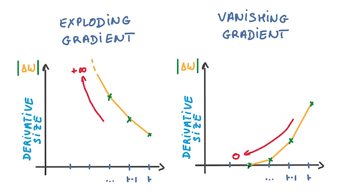

## Table of Contents

## What is the Exploding Gradient Problem in machine learning?

The Exploding Gradient Problem is a challenge that occurs during the training of deep neural networks, particularly those with many layers. It happens when the gradients, which are used to update the weights of the network during backpropagation, become extremely large. This causes the weights to be updated by such large amounts that the network's performance deteriorates rapidly, leading to unstable training and poor convergence. Imagine trying to adjust the settings on a machine, but each time you make an adjustment, it's so big that the machine goes out of control. That's what happens with exploding gradients.

To understand why this happens, consider the process of backpropagation. During backpropagation, the gradient of the loss function with respect to each weight in the network is calculated. If the gradients are multiplied together across many layers, they can grow exponentially, especially if the weights are large. This can be represented as $$ \frac{\partial L}{\partial w_i} = \frac{\partial L}{\partial z_L} \cdot \prod_{j=i+1}^{L} \frac{\partial z_j}{\partial z_{j-1}} \cdot \frac{\partial z_i}{\partial w_i} $$, where $$L$$ is the loss, $$z_j$$ is the output of the $$j$$-th layer, and $$w_i$$ is a weight in the $$i$$-th layer. If any of these terms are greater than 1, the product can become very large, leading to exploding gradients. To mitigate this problem, techniques like gradient clipping, where gradients are capped at a certain value, or using different activation functions and initialization methods can be employed.

## How does the Exploding Gradient Problem affect neural network training?

The Exploding Gradient Problem makes it hard for neural networks to learn properly. When the gradients get too big, they cause the weights in the network to change by huge amounts. This is like trying to fine-tune a radio, but instead of small adjustments, you're turning the dial wildly, making it impossible to find the right station. As a result, the network's predictions become very bad, and it can't learn from the data effectively. The training process becomes unstable, and the network might never reach a point where it can make good predictions.

To fix this problem, people use techniques like gradient clipping. This means setting a limit on how big the gradients can get. Imagine if you could only turn the radio dial a little bit at a time; it would be easier to find the right station. Another way to help is by choosing different activation functions or starting the weights at different values. These methods can keep the gradients from growing too big, helping the neural network to learn and improve over time.

## What are the common signs that a neural network is experiencing an Exploding Gradient Problem?

When a [neural network](/wiki/neural-network) has an Exploding Gradient Problem, you'll see its performance get worse very quickly. The network might start off learning okay, but then suddenly, its predictions become way off. It's like the network is going crazy and can't figure out how to get better. You might see the loss, which is how bad the network's predictions are, jump up to a huge number or even become infinity. This is a clear sign that the gradients are too big and are messing up the training.

Another sign is that the weights of the network change by huge amounts from one training step to the next. If you're watching the weights, you might see them swing wildly, which is not normal. This happens because the gradients are too big, causing the weights to be updated by too much. To fix this, you might need to use something like gradient clipping, where you set a limit on how big the gradients can get. This helps keep the training stable and lets the network learn properly.

## Can you explain how gradients are calculated in a neural network?

In a neural network, gradients are calculated during a process called backpropagation. This process starts at the end of the network, where the final output is compared to the desired output to calculate the loss. The goal is to find out how much each weight in the network contributed to the loss. To do this, we use the chain rule from calculus. We work backwards from the output layer to the input layer, calculating the gradient of the loss with respect to each weight. This gradient tells us how much we should change each weight to reduce the loss. If the gradient is large, it means a small change in the weight will have a big effect on the loss.

The calculation of gradients can be represented mathematically. For a weight $$w_i$$ in layer $$i$$, the gradient of the loss $$L$$ with respect to $$w_i$$ is given by $$ \frac{\partial L}{\partial w_i} = \frac{\partial L}{\partial z_L} \cdot \prod_{j=i+1}^{L} \frac{\partial z_j}{\partial z_{j-1}} \cdot \frac{\partial z_i}{\partial w_i} $$, where $$z_j$$ is the output of the $$j$$-th layer. This formula shows how the gradient is calculated by multiplying the gradients of the loss with respect to the outputs of each layer, all the way back to the weight in question. This process can lead to exploding gradients if the weights or the intermediate gradients are too large, causing the product to grow exponentially.

## What causes gradients to explode during training?

Gradients can explode during training when they become too large, causing the weights in a neural network to change by huge amounts. This happens because the gradients are calculated using the chain rule, which involves multiplying many terms together. If any of these terms are bigger than 1, the product can grow very quickly. For example, if the weights are large, the gradients can multiply across many layers, leading to an exponential increase. This is like trying to climb a hill, but each step you take is so big that you end up flying off the hill instead of reaching the top.

The formula for calculating gradients in a neural network is $$ \frac{\partial L}{\partial w_i} = \frac{\partial L}{\partial z_L} \cdot \prod_{j=i+1}^{L} \frac{\partial z_j}{\partial z_{j-1}} \cdot \frac{\partial z_i}{\partial w_i} $$, where $$L$$ is the loss, $$z_j$$ is the output of the $$j$$-th layer, and $$w_i$$ is a weight in the $$i$$-th layer. If any of these terms are greater than 1, the product can become very large, leading to exploding gradients. To prevent this, techniques like gradient clipping can be used, where the gradients are capped at a certain value. This helps keep the training stable and allows the network to learn effectively.

## How does the choice of activation function influence the Exploding Gradient Problem?

The choice of activation function can have a big impact on the Exploding Gradient Problem. Some activation functions, like the sigmoid or tanh, can cause the gradients to grow very quickly. This happens because their derivatives can be larger than 1, especially when the input is far from zero. For example, the derivative of the sigmoid function is $$ \sigma'(x) = \sigma(x) \cdot (1 - \sigma(x)) $$. If $$ x $$ is far from zero, $$ \sigma(x) $$ gets very close to 0 or 1, making the derivative very small, but if $$ x $$ is near zero, the derivative can be close to 0.25, which is still less than 1, but when multiplied across many layers, it can still lead to exploding gradients.

To avoid this problem, people often use activation functions like ReLU (Rectified Linear Unit), which is defined as $$ \text{ReLU}(x) = \max(0, x) $$. The derivative of ReLU is either 0 or 1, which means it won't make the gradients grow exponentially. This helps keep the training stable and prevents the gradients from exploding. By choosing the right activation function, you can make it easier for the neural network to learn without running into the Exploding Gradient Problem.

## What are some techniques to detect the Exploding Gradient Problem early in training?

To detect the Exploding Gradient Problem early in training, you can keep an eye on the loss value. If the loss suddenly jumps to a very high number or even becomes infinity, it's a clear sign that the gradients are too big and causing trouble. Another way to spot this problem is by watching the weights of the network. If they start changing by huge amounts from one training step to the next, it means the gradients are exploding and messing up the training.

You can also use tools and techniques to help detect this issue. For example, you can set up monitoring systems that track the gradients during training. If the gradients start to grow too large, these systems can alert you so you can take action before the problem gets worse. By keeping a close watch on the loss, weights, and gradients, you can catch the Exploding Gradient Problem early and fix it before it ruins your neural network's training.

## What is gradient clipping and how does it help mitigate the Exploding Gradient Problem?

Gradient clipping is a technique used to stop gradients from getting too big during training. When gradients are too large, they can cause the weights in a neural network to change by huge amounts, which can make the network's predictions very bad. Gradient clipping works by setting a limit on how big the gradients can get. If a gradient is bigger than this limit, it gets cut down to the limit. This helps keep the training stable and lets the network learn properly.

Imagine you're trying to adjust the [volume](/wiki/volume-trading-strategy) on a radio, but each time you turn the dial, it moves too much, making the sound too loud or too quiet. Gradient clipping is like setting a maximum amount you can turn the dial, so you can make small, controlled adjustments. By using gradient clipping, you can prevent the gradients from exploding and help the neural network learn more effectively.

## How can adjusting the learning rate help in preventing exploding gradients?

Adjusting the learning rate can help prevent exploding gradients by controlling how much the weights change during each training step. If the learning rate is too high, the weights can be updated by large amounts, which can cause the gradients to grow out of control. By setting the learning rate to a smaller value, you can make the updates to the weights more gradual. This helps keep the gradients from getting too big and keeps the training stable.

Think of the learning rate like the step size when you're trying to walk up a hill. If your steps are too big, you might overshoot and end up flying off the hill instead of reaching the top. But if you take smaller steps, you can move more carefully and steadily towards the top. By adjusting the learning rate to a smaller value, you can help the neural network learn more smoothly and avoid the problem of exploding gradients.

## What role does the initialization of weights play in managing exploding gradients?

The way you start the weights in a neural network can help stop the gradients from exploding. When you begin training, if the weights are too big, they can make the gradients grow very quickly. This happens because the gradients are calculated by multiplying many terms together. If any of these terms are bigger than 1, the product can become very large. By starting with smaller weights, you can keep the gradients from growing too much and help the network learn more smoothly.

One way to set the weights at the start is called Xavier initialization. This method sets the weights so that the gradients don't grow too fast or too slow. The formula for Xavier initialization is $$ W \sim \mathcal{U}(-\sqrt{\frac{6}{n_{in} + n_{out}}}, \sqrt{\frac{6}{n_{in} + n_{out}}}) $$, where $$ W $$ is the weight, $$ \mathcal{U} $$ is a uniform distribution, and $$ n_{in} $$ and $$ n_{out} $$ are the number of input and output units in the layer. By using this kind of initialization, you can help keep the gradients under control and make training more stable.

## Can you discuss the impact of network architecture on the Exploding Gradient Problem?

The way a neural network is built can make the Exploding Gradient Problem more likely to happen. If a network has many layers, the gradients have to go through a lot of calculations to reach the early layers. This means the gradients can grow very big because they are multiplied together many times. If the weights in the network are large, this can make the problem worse. The formula for calculating gradients in a neural network is $$ \frac{\partial L}{\partial w_i} = \frac{\partial L}{\partial z_L} \cdot \prod_{j=i+1}^{L} \frac{\partial z_j}{\partial z_{j-1}} \cdot \frac{\partial z_i}{\partial w_i} $$, where $$L$$ is the loss, $$z_j$$ is the output of the $$j$$-th layer, and $$w_i$$ is a weight in the $$i$$-th layer. If any of these terms are bigger than 1, the product can become very large, leading to exploding gradients.

To help with this problem, you can change the network's design. Using fewer layers or adding special layers like "skip connections" can stop the gradients from growing too much. Skip connections let the gradients go straight from one layer to another without going through all the layers in between. This can help keep the gradients smaller and make the training more stable. By thinking carefully about how to build the network, you can make it easier for the neural network to learn without running into the Exploding Gradient Problem.

## What advanced methods or algorithms have been developed to address the Exploding Gradient Problem in deep learning?

One advanced method to tackle the Exploding Gradient Problem is called gradient clipping. This technique works by setting a limit on how big the gradients can get. If a gradient is bigger than this limit, it gets cut down to the limit. This helps keep the training stable and lets the neural network learn properly. Imagine you're trying to adjust the volume on a radio, but each time you turn the dial, it moves too much, making the sound too loud or too quiet. Gradient clipping is like setting a maximum amount you can turn the dial, so you can make small, controlled adjustments. By using gradient clipping, you can prevent the gradients from exploding and help the neural network learn more effectively.

Another method is using different activation functions like ReLU (Rectified Linear Unit). ReLU is defined as $$ \text{ReLU}(x) = \max(0, x) $$. The derivative of ReLU is either 0 or 1, which means it won't make the gradients grow exponentially. This helps keep the training stable and prevents the gradients from exploding. Also, special network architectures like Residual Networks (ResNets) use skip connections to help with this problem. Skip connections let the gradients go straight from one layer to another without going through all the layers in between. This can help keep the gradients smaller and make the training more stable. By using these advanced methods, you can make it easier for the neural network to learn without running into the Exploding Gradient Problem.