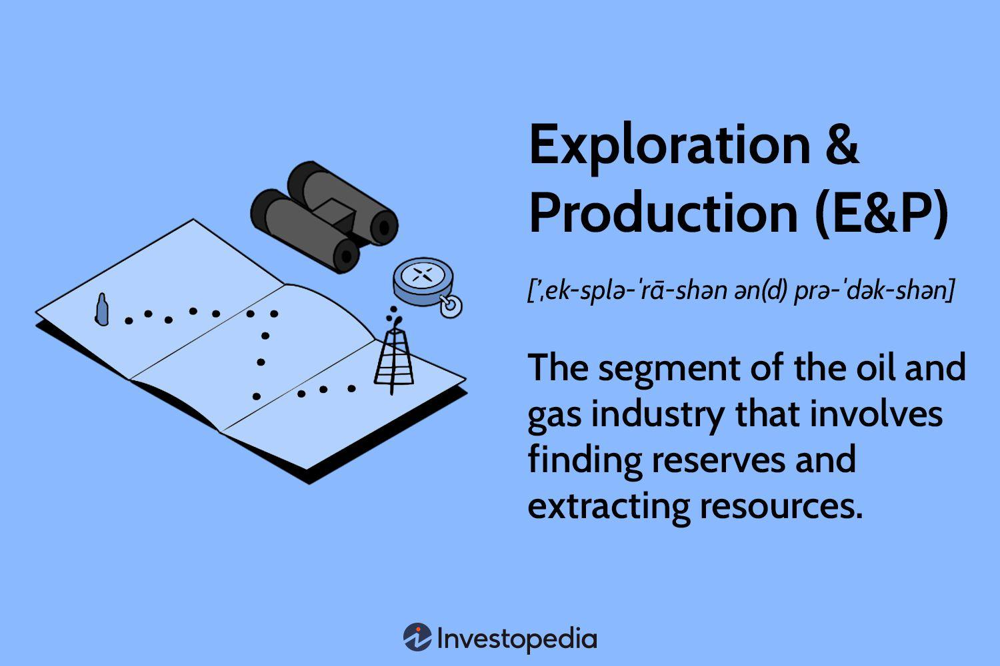

## Table of Contents

## What is the oil and gas industry?

The oil and gas industry is a big part of the world's energy. It finds, takes out, makes, and sells oil and gas. These are used for things like making cars move, heating homes, and making plastic. The industry is split into three parts: upstream, midstream, and downstream. Upstream is about finding and drilling for oil and gas. Midstream is about moving and storing them. Downstream is about making them into things we use every day.

The industry is very important because it gives us a lot of the energy we need. But it also has problems. It can hurt the environment by causing pollution and climate change. Because of this, people are looking for other kinds of energy, like wind and solar power. The oil and gas industry is trying to find new ways to be cleaner and more sustainable.

## What does exploration in the oil and gas industry involve?

Exploration in the oil and gas industry is about finding new places where oil and gas might be hiding underground. Scientists and geologists use special tools to study the earth. They look at rocks and the ground to see if there are signs of oil and gas. They might use things like seismic surveys, where they send sound waves into the ground and listen to the echoes to see what's down there.

Once they think they've found a good spot, they drill a small hole called an exploratory well to check if oil or gas is really there. This is a big deal because it costs a lot of money and can take a long time. If they find oil or gas, they start planning how to get it out. If not, they have to start looking somewhere else. Exploration is a key part of the industry because without finding new resources, the oil and gas would eventually run out.

## What is the process of oil and gas production?

Oil and gas production starts after exploration finds a good spot. First, they drill a well into the ground where the oil or gas is. This is called drilling. They use big machines called drilling rigs to make the hole deep enough to reach the oil or gas. Once the well is drilled, they need to make sure the oil or gas can flow up to the surface. They might use special methods like hydraulic fracturing, or "fracking," to break the rock and let the oil or gas out. This part of production is called the extraction or production phase.

After the oil or gas comes up to the surface, it's not ready to use yet. It needs to be cleaned and separated from water and other stuff that came up with it. This happens at a place called a processing facility. Once it's clean, the oil or gas is ready to be moved to where it's needed. They use pipelines, trucks, or ships to transport it. This is the midstream part of the industry. After it's transported, the oil might be turned into things like gasoline or plastic, and the gas might be used to heat homes or cook food. This final step is called refining and is part of the downstream part of the industry.

## How do exploration and production contribute to the oil and gas supply chain?

Exploration and production are the first steps in the oil and gas supply chain. Exploration is like a treasure hunt where scientists and geologists use special tools to find where oil and gas might be hiding underground. They look at rocks and use sound waves to see what's beneath the earth's surface. If they think they've found a good spot, they drill a small hole to check if oil or gas is really there. This step is super important because without finding new oil and gas, we wouldn't have any to use.

Once they find oil or gas, production starts. This means drilling a bigger hole, or well, to get the oil or gas out of the ground. Sometimes, they use methods like fracking to break the rock and let the oil or gas flow better. After it comes up, it's not ready to use yet. They need to clean it and take out any water or other stuff that came up with it. Then, it's ready to be moved to where people need it, like to gas stations or factories. Exploration and production are key parts of making sure we have enough oil and gas for everyone.

## What technologies are used in the exploration phase of oil and gas?

In the exploration phase of oil and gas, scientists and geologists use different tools to find where oil and gas might be hiding underground. One of the main tools they use is called seismic surveying. They send sound waves into the ground and listen to the echoes that bounce back. By studying these echoes, they can see what kinds of rocks are down there and if there might be oil or gas trapped in them. It's a bit like using sonar to find fish in the ocean, but instead, they're looking for oil and gas deep underground.

Another important technology is called geophysical data analysis. This means using computers to look at all the information they get from the ground, like the seismic data. The computers help them make maps and models of what's underground. This helps them decide the best places to drill. Sometimes, they also use satellites to take pictures of the earth's surface, which can give them more clues about where to look for oil and gas. All these technologies help make exploration more accurate and efficient, so they can find new oil and gas reserves faster and with less guesswork.

## What are the key stages of oil and gas production?

Oil and gas production starts after explorers find a good spot underground. First, they drill a well into the ground to reach the oil or gas. They use big machines called drilling rigs to make the hole deep enough. Sometimes, they use special methods like hydraulic fracturing, or "fracking," to break the rock and let the oil or gas flow out easier. This part of production is called extraction or the production phase. It's all about getting the oil or gas up to the surface.

Once the oil or gas comes up, it's not ready to use yet. It needs to be cleaned and separated from water and other stuff that came up with it. This happens at a place called a processing facility. After it's clean, the oil or gas is ready to be moved to where it's needed. They use pipelines, trucks, or ships to transport it. This is the midstream part of the industry. After it's transported, the oil might be turned into things like gasoline or plastic, and the gas might be used to heat homes or cook food. This final step is called refining and is part of the downstream part of the industry.

## How does exploration impact the environment?

Exploration in the oil and gas industry can hurt the environment. When they do seismic surveys, they send loud sound waves into the ground. These sounds can bother animals, especially in the ocean where whales and other sea creatures might get confused or hurt by the noise. Also, when they drill exploratory wells, there's a chance of oil spills or leaks. These can pollute the land and water, making it hard for plants and animals to live there.

To find oil and gas, explorers often have to clear big areas of land. This means cutting down trees and moving earth, which can harm forests and wildlife habitats. It can also lead to soil erosion, where the soil gets washed away and can't grow plants as well. Even though companies try to be careful, these impacts can still happen and affect the environment in big ways.

## What are the economic benefits of successful oil and gas exploration and production?

Successful oil and gas exploration and production bring a lot of money to the areas where they happen. When companies find oil or gas, they start drilling and selling it. This creates jobs for people who work at the drilling sites, in the processing plants, and in the transportation of oil and gas. These jobs help people earn money and support their families. The money from selling oil and gas also goes to the government as taxes. Governments can use this money to build schools, hospitals, and roads, making life better for everyone in the area.

The money from oil and gas can also help the whole country's economy grow. When a country has a lot of oil and gas, it can sell it to other countries and make money from exports. This can make the country's currency stronger and help businesses grow. Plus, the technology and skills used in oil and gas exploration and production can be used in other industries, helping to create more jobs and new businesses. Even though there are environmental worries, the economic benefits of oil and gas can be very big for both local communities and the whole country.

## What challenges do companies face during oil and gas exploration and production?

Companies face many challenges when they try to find and get oil and gas out of the ground. One big challenge is the high cost of exploration. It takes a lot of money to do seismic surveys and drill exploratory wells. Sometimes, they spend a lot of money and don't find any oil or gas. This can be a big risk for the company. Another challenge is the technology. They need special tools and machines to find oil and gas deep underground. If the technology doesn't work well, it can make exploration harder and more expensive.

Once they find oil or gas, the production phase brings its own set of challenges. Drilling wells is hard work and can be dangerous. There's always a chance of accidents, like oil spills or gas leaks, which can hurt people and the environment. Also, getting oil and gas out of the ground can be tricky. Sometimes, they need to use special methods like fracking, which can be expensive and controversial. Governments also have rules about how to drill and produce oil and gas to protect the environment. These rules can make it harder and more expensive for companies to do their work.

## How have recent technological advancements improved oil and gas exploration and production?

Recent technology has made finding and getting oil and gas out of the ground easier and better. One big improvement is in seismic imaging. Now, companies can use very detailed 3D and even 4D seismic surveys to see what's underground. This helps them find oil and gas more accurately and faster than before. They also use drones and satellites to get pictures of the earth's surface, which helps them pick the best spots to drill. These new tools save time and money and make the whole process more efficient.

Another important advancement is in drilling technology. Companies now use horizontal drilling and hydraulic fracturing, or "fracking," to get more oil and gas out of the ground. These methods let them reach oil and gas that was hard to get before. Also, new digital technologies like data analytics and [artificial intelligence](/wiki/ai-artificial-intelligence) help them make better decisions about where to drill and how to produce oil and gas. These improvements make the whole process safer and more productive, helping to meet the world's energy needs better.

## What role does data analytics play in modern oil and gas exploration and production?

Data analytics is a big help in finding and getting oil and gas out of the ground. It's like using a smart computer to look at all the information from the earth, like the seismic data and drilling results. This helps companies see patterns and make better guesses about where to drill next. By using data analytics, they can find oil and gas faster and with less risk. It's like having a map that shows them the best places to look, saving time and money.

In the production phase, data analytics also plays a key role. Companies use it to keep an eye on how much oil and gas is coming out of the wells and to make sure everything is working well. If something goes wrong, like a drop in production, data analytics can help them figure out why and fix it quickly. This makes the whole process of getting oil and gas out more efficient and helps prevent big problems like spills or leaks. In the end, data analytics makes the oil and gas industry smarter and safer.

## How do regulatory frameworks affect exploration and production activities in the oil and gas industry?

Regulatory frameworks are the rules that governments make to keep the oil and gas industry safe and good for the environment. These rules can change how companies do exploration and production. For example, before a company can start drilling, it might need to get a permit from the government. The rules can say where companies can drill, how they have to do it, and what they need to do to protect the environment. This can make exploration and production more expensive and take longer because companies have to follow all these rules.

Even though these rules can make things harder for companies, they are important. They help make sure that oil and gas exploration and production don't hurt people or the environment too much. For instance, rules might say that companies have to clean up any oil spills quickly and pay for any damage they cause. They might also have to use certain technologies to reduce pollution. In the end, these rules help balance the need for oil and gas with the need to keep the earth safe and healthy.

## References & Further Reading

Bergstra, J., Bardenet, R., Bengio, Y., & Kégl, B. (2011). "Algorithms for Hyper-Parameter Optimization." Advances in Neural Information Processing Systems. This paper discusses techniques for hyper-parameter optimization fundamental to enhancing [machine learning](/wiki/machine-learning) algorithms, which are pivotal in refining [algorithmic trading](/wiki/algorithmic-trading) systems.

Lopez de Prado, M. (2018). "Advances in Financial Machine Learning." Lopez de Prado's work presents sophisticated methods of applying machine learning in financial markets, offering insights into the development and implementation of trading strategies relevant to the oil and gas industry's dynamic environment.

Chan, E. P. (2009). "Quantitative Trading: How to Build Your Own Algorithmic Trading Business." This book provides a comprehensive guide for establishing [quantitative trading](/wiki/quantitative-trading) strategies, detailing the processes and considerations for developing a robust algorithmic trading operation.

Ghosh, S. (2017). "Algorithmic Trading & DMA: An Introduction to Direct Access Trading Strategies." Ghosh's book introduces readers to the intricacies of algorithmic trading and direct market access (DMA), focusing on the strategic and technical components necessary for optimizing trading execution and market interaction.

