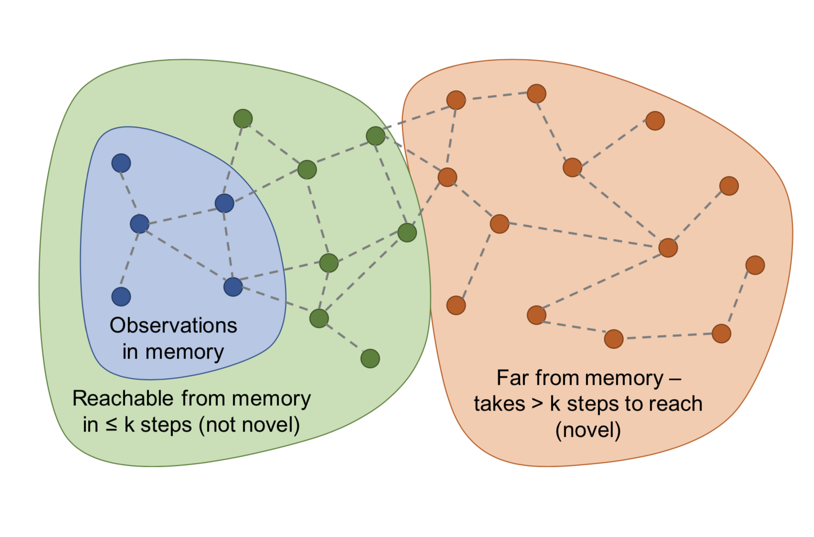

## Table of Contents

## What is exploration in the context of machine learning?

Exploration in machine learning is like trying new things to learn more about the world. Imagine you're playing a game where you need to find the best path to a treasure. If you only stick to the paths you already know, you might miss out on a shortcut or a better route. In machine learning, exploration means trying out different actions or strategies, even if they might not seem the best at first, to gather more information and potentially find better solutions.

This concept is especially important in reinforcement learning, where an agent learns by interacting with an environment. The agent needs to balance between exploiting what it already knows works well and exploring new possibilities that might lead to even better outcomes. This balance is often described by the exploration-exploitation dilemma. For example, if an agent always chooses the action that has given the best results so far (exploitation), it might never discover a superior action. On the other hand, if it explores too much, it might not make the most of what it has already learned. Finding the right balance helps the agent learn more effectively and achieve better performance over time.

## Why is exploration important in machine learning algorithms?

Exploration is important in machine learning because it helps algorithms learn about new possibilities and improve over time. Imagine you're trying to find the best way to do something, like cooking a new dish. If you only stick to the recipes you already know, you might miss out on a tastier combination of ingredients. In machine learning, if an algorithm only uses what it already knows, it might miss out on better solutions. By exploring, the algorithm tries new things, which can lead to discovering more effective strategies or actions.

This is especially crucial in [reinforcement learning](/wiki/reinforcement-learning), where an agent learns by interacting with its environment. The agent needs to balance between using what it knows works well (exploitation) and trying out new actions (exploration). If the agent always chooses the best-known action, it might never find an even better one. On the other hand, if it explores too much without using what it has learned, it might not make the most of its knowledge. Finding the right balance between exploration and exploitation helps the agent learn more effectively and achieve better results over time.

## What are some common exploration strategies used in reinforcement learning?

In reinforcement learning, one common exploration strategy is called epsilon-greedy. This method involves choosing the best-known action most of the time, but sometimes choosing a random action instead. The chance of choosing a random action is controlled by a value called epsilon. For example, if epsilon is set to 0.1, the agent will choose a random action 10% of the time and the best-known action 90% of the time. This helps the agent explore new possibilities while still using what it has learned.

Another strategy is called softmax exploration. Instead of choosing actions randomly, softmax uses a probability distribution based on how good each action seems to be. Actions that look better have a higher chance of being chosen, but even less promising actions still have a chance. This method can be more sophisticated than epsilon-greedy because it considers the relative value of all actions, not just the best one. The probability of choosing an action $$a$$ can be calculated using the formula $$P(a) = \frac{e^{Q(a)/\tau}}{\sum_{b} e^{Q(b)/\tau}}$$, where $$Q(a)$$ is the estimated value of action $$a$$ and $$\tau$$ is a temperature parameter that controls the level of exploration.

A third strategy is called Upper Confidence Bound (UCB). UCB balances exploration and exploitation by adding an exploration bonus to the estimated value of each action. The bonus is higher for actions that have been tried less often, encouraging the agent to explore them more. The UCB formula for choosing an action $$a$$ at time step $$t$$ is $$a_t = \arg\max_a \left[ Q(a) + c \sqrt{\frac{\ln t}{N(a)}} \right]$$, where $$Q(a)$$ is the estimated value of action $$a$$, $$N(a)$$ is the number of times action $$a$$ has been chosen, and $$c$$ is a constant that controls the level of exploration. This method ensures that the agent tries out less-explored actions while still considering what it has learned so far.

## How does the counterfactual exploration strategy work?

Counterfactual exploration is a strategy that helps an agent learn by imagining what would have happened if it had chosen a different action. Imagine you're playing a game and you choose to go left. With counterfactual exploration, you can think about what might have happened if you had gone right instead. This helps the agent learn from both the action it took and the actions it didn't take, making its learning process more efficient.

In reinforcement learning, counterfactual exploration works by using the data from the actions that were actually taken to estimate what would have happened with other actions. For example, if an agent chooses action A and gets a reward, it can use this information to guess what the reward might have been if it had chosen action B instead. This strategy helps the agent explore more possibilities without actually having to try every action in every situation, which can save time and resources. By considering these "what if" scenarios, the agent can improve its understanding of the environment and make better decisions in the future.

## What are the advantages of using counterfactuals in exploration?

Using counterfactuals in exploration helps an agent learn more efficiently. Instead of trying every possible action in every situation, the agent can imagine what would have happened if it had chosen a different action. This means the agent can learn from both the actions it took and the ones it didn't take, without needing to actually perform all those actions. This can save a lot of time and resources because the agent doesn't have to explore every option in the real world.

Counterfactual exploration also helps the agent make better decisions. By considering "what if" scenarios, the agent can get a fuller picture of the environment and understand the outcomes of different actions more clearly. This leads to smarter choices and can improve the overall performance of the agent over time. In the end, using counterfactuals makes the learning process more effective and helps the agent find better solutions faster.

## Can you explain the gSDE (generalized State-Dependent Exploration) method?

The gSDE (generalized State-Dependent Exploration) method is a way to help an agent explore in reinforcement learning by changing how it acts based on where it is. Imagine you're playing a game and you need to explore different parts of the game world. With gSDE, the agent doesn't just explore randomly; it explores in a way that depends on its current situation. This means the agent can be more careful in some places and more adventurous in others, which can help it learn better.

In gSDE, the agent uses a special kind of noise that changes depending on the state it's in. This noise helps the agent try out different actions in a smart way. The formula for the action with gSDE can be written as $$a = \mu(s) + \sigma(s) \cdot \epsilon$$, where $$a$$ is the action, $$\mu(s)$$ is the mean action based on the state $$s$$, $$\sigma(s)$$ is the state-dependent noise, and $$\epsilon$$ is a random variable. By adjusting the noise based on the state, gSDE helps the agent explore more effectively and learn about the environment in a way that's tailored to where it is.

## How does gSDE differ from other exploration strategies?

gSDE, or generalized State-Dependent Exploration, is different from other exploration strategies because it changes how the agent explores based on where it is in the environment. In many other methods, like epsilon-greedy or softmax exploration, the agent might choose actions randomly or based on how good they seem to be, but these choices don't change much depending on the current situation. With gSDE, the agent uses a special kind of noise that depends on the state it's in. This means the agent can be more careful in some places and more adventurous in others, which can help it learn better. The formula for the action with gSDE is $$a = \mu(s) + \sigma(s) \cdot \epsilon$$, where $$a$$ is the action, $$\mu(s)$$ is the mean action based on the state $$s$$, $$\sigma(s)$$ is the state-dependent noise, and $$\epsilon$$ is a random variable.

This state-dependent approach makes gSDE more flexible than other methods. For example, in epsilon-greedy, the agent might choose a random action with a fixed probability, no matter where it is. In softmax exploration, the agent chooses actions based on their estimated values, but the probabilities don't change based on the current state. With gSDE, the agent can adjust its exploration strategy to fit the situation, which can lead to more efficient learning. By considering the state when deciding how to explore, gSDE helps the agent find a better balance between trying new things and using what it already knows.

## What are the practical applications of gSDE in real-world scenarios?

gSDE, or generalized State-Dependent Exploration, can be used in real-world scenarios where an agent needs to learn how to do something by trying different actions. Imagine a robot learning to navigate a busy warehouse. With gSDE, the robot can explore more carefully near fragile items and be more adventurous in open spaces. This helps the robot learn the best paths and actions faster because it can adjust how it explores based on where it is. The formula for the action with gSDE is $$a = \mu(s) + \sigma(s) \cdot \epsilon$$, where $$a$$ is the action, $$\mu(s)$$ is the mean action based on the state $$s$$, $$\sigma(s)$$ is the state-dependent noise, and $$\epsilon$$ is a random variable. By using this method, the robot can improve its performance in real-world tasks where different areas require different levels of exploration.

Another practical application of gSDE is in autonomous vehicles. When a self-driving car is learning to drive in different environments, gSDE can help it explore more safely in busy city streets and more freely on empty highways. This allows the car to gather useful data about how to handle various situations without taking unnecessary risks. By adjusting its exploration strategy based on the current driving conditions, the car can learn more effectively and make better decisions on the road. This state-dependent approach makes gSDE a valuable tool for improving the learning process in real-world applications where the environment changes.

## How can one implement counterfactual exploration in a machine learning model?

Counterfactual exploration in a [machine learning](/wiki/machine-learning) model involves imagining what would happen if the model had chosen a different action. Imagine you're playing a game and you decide to go left. With counterfactual exploration, you can think about what might have happened if you went right instead. In a machine learning model, this means using the data from the actions that were actually taken to estimate what the outcome would have been if a different action had been chosen. This helps the model learn from both the actions it took and the ones it didn't take, making its learning process more efficient. By considering these "what if" scenarios, the model can get a better understanding of the environment and improve its decision-making over time.

To implement counterfactual exploration, you need to have a way to estimate the outcomes of different actions based on the data you've collected. One way to do this is by using a model to predict the rewards or outcomes for different actions. For example, if your model chooses action A and gets a reward, you can use this information to guess what the reward might have been if it had chosen action B instead. The formula for this could be something like $$Q(s, a) = Q(s, a_{\text{taken}}) + \Delta Q(s, a_{\text{not taken}})$$, where $$Q(s, a)$$ is the estimated value of taking action $$a$$ in state $$s$$, $$Q(s, a_{\text{taken}})$$ is the value of the action that was taken, and $$\Delta Q(s, a_{\text{not taken}})$$ is the estimated difference in value for the action that was not taken. By incorporating these counterfactual estimates into your learning algorithm, you can help the model explore more effectively and learn from a wider range of experiences.

## What metrics should be used to evaluate the effectiveness of an exploration strategy?

To evaluate how well an exploration strategy works, you can look at different metrics. One important metric is the cumulative reward, which is the total reward the agent gets over time. If the agent is doing a good job exploring, it should find better ways to get more rewards. Another metric is the regret, which measures how much the agent is missing out on by not always choosing the best action. If the regret is low, it means the agent is exploring well and not missing many opportunities. You can also use metrics like the number of unique states visited or the entropy of the policy to see how much the agent is exploring different parts of the environment.

Another useful metric is the learning curve, which shows how the agent's performance improves over time. A good exploration strategy should lead to a learning curve that goes up quickly, showing that the agent is learning and getting better fast. You can also look at the variance of the rewards to see how consistent the agent's performance is. If the variance is low, it means the agent is finding reliable ways to get rewards. By looking at these different metrics, you can get a good idea of how effective an exploration strategy is and whether it helps the agent learn and perform well.

## How do you balance exploration and exploitation in advanced machine learning models?

Balancing exploration and exploitation in advanced machine learning models is like finding the right mix between trying new things and sticking with what works. Imagine you're playing a game and you need to find the best way to win. If you always stick to the moves you know, you might miss out on a better strategy. But if you try too many new moves, you might not use what you've learned well enough. In machine learning, models need to explore to find new and better ways to do things, but they also need to exploit what they've learned to get good results. Finding the right balance helps the model learn more effectively and perform better over time.

One way to balance exploration and exploitation is by using methods like epsilon-greedy. In this method, the model chooses the best-known action most of the time, but sometimes it tries a random action instead. The chance of choosing a random action is controlled by a value called epsilon. For example, if epsilon is set to 0.1, the model will choose a random action 10% of the time and the best-known action 90% of the time. This helps the model explore new possibilities while still using what it has learned. Another method is called Upper Confidence Bound (UCB), which adds an exploration bonus to the estimated value of each action. The bonus is higher for actions that have been tried less often, encouraging the model to explore them more. The UCB formula for choosing an action $$a$$ at time step $$t$$ is $$a_t = \arg\max_a \left[ Q(a) + c \sqrt{\frac{\ln t}{N(a)}} \right]$$, where $$Q(a)$$ is the estimated value of action $$a$$, $$N(a)$$ is the number of times action $$a$$ has been chosen, and $$c$$ is a constant that controls the level of exploration. By using these strategies, models can find a good balance between exploring new actions and exploiting what they know.

## What are the current research trends and future directions in exploration strategies for machine learning?

Current research in exploration strategies for machine learning is focused on making algorithms smarter and more efficient. One big trend is using [deep learning](/wiki/deep-learning) to help with exploration. Deep learning can help models learn more about the environment by finding patterns and making better guesses about what might happen next. Another trend is using methods like curiosity-driven exploration, where the model tries new things because it wants to learn more about the world. This can help the model explore in a more natural way, like how a curious person might explore a new place. Researchers are also looking at how to use less data to learn more, which is important for real-world applications where data might be hard to get.

Future directions in exploration strategies are exciting and aim to solve big problems. One direction is improving how models can learn from other models or from human feedback. This could help models explore more effectively by using what others have learned. Another direction is making exploration strategies work better in complex environments, like in robotics or self-driving cars, where the world is always changing. Researchers are also working on making exploration more personalized, so models can learn in a way that fits each user's needs. By focusing on these areas, the future of exploration in machine learning looks promising, with the potential to create smarter and more adaptable models.