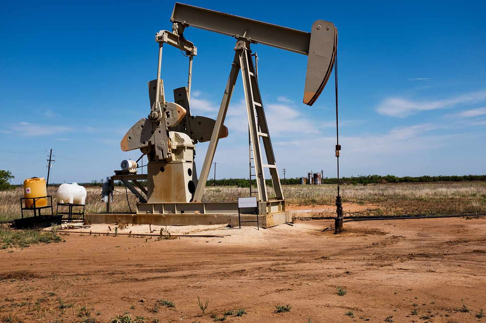

The oil and gas industry is a complex and crucial component of the global economy, segmented into three primary sectors: upstream, midstream, and downstream. Each phase of this industry plays a significant role in the final delivery of petroleum products to the market. This article primarily focuses on upstream operations, which encompass the exploration and extraction of hydrocarbons. In this context, exploratory wells are critical as they are drilled to discover new hydrocarbon reserves. These activities form the foundation of oil and gas exploration, as they help determine the presence and volume of recoverable resources.

An exploratory well, often referred to as a "wildcat well," serves as a primary method for discovering new oil and gas reserves. The process involves a strategic combination of geological surveys and sophisticated drilling techniques to detect and assess potential reservoirs. Successful drilling can pave the way for subsequent production wells, which are essential for sustained oil extraction activities.



As the oil and gas market becomes increasingly volatile, with frequent fluctuations in prices influenced by multiple global factors, there is a growing need for innovative strategies to optimize trading and manage risks effectively. Algorithmic trading emerges as a solution in this regard, leveraging advanced computer algorithms to analyze vast amounts of market data swiftly and accurately. By automating trading decisions, algorithmic trading helps mitigate risks and capitalize on trading opportunities more efficiently than traditional methods.

Incorporating algorithmic trading into the oil industry offers a competitive advantage by optimizing oil trading strategies, especially within upstream operations. It assists companies in managing price volatility, which can significantly affect profitability. The use of algorithmic systems allows for precise predictions of price trends and the execution of trades that minimize potential losses from market swings.

This article examines the intersection of well drilling and algorithmic trading in oil and gas exploration. It explores how these advanced technologies interplay to refine the processes of locating new hydrocarbon deposits and navigating the complexities of the trading market. The integration of these methodologies is not just improving the operational efficiencies of oil companies but is also enhancing their ability to tackle market challenges, thus promising both increased stability and profitability in the future.

## Table of Contents

## What is an Exploratory Well?

An exploratory well is a strategically drilled deep test hole that oil and gas companies utilize to ascertain the presence and potential recoverability of hydrocarbon reserves. The primary objective of these wells is to transform initial geological hypotheses and survey data into verified findings concerning subsurface formations. 

Exploratory wells are essential in both onshore and offshore settings, where they serve as the cornerstone for gathering valuable geological and reservoir data. This data is crucial for assessing the presence of hydrocarbons and the economic viability of developing full-scale production operations. The process of drilling exploratory wells typically commences with comprehensive seismic surveys. These surveys leverage sound wave technology to produce detailed images of the earth's subsurface. By analyzing these images, geologists can identify structures that may harbor oil and gas deposits.

Once potential reserves are pinpointed through seismic data, exploratory drilling is initiated to secure more granular geological information. This phase provides insights into the actual characteristics of the rock formations, fluid presence, and pressure conditions. The effectiveness of an exploratory well is determined by its ability to confirm the presence of hydrocarbons in quantities substantial enough to merit commercial extraction.

In cases where an exploratory well successfully identifies viable hydrocarbon deposits, it leads to the drilling of additional production wells. These wells are designed for sustained extraction of oil and gas, marking the transition from the exploration phase to the development and production phase of resource exploitation. This progression underscores the critical role exploratory wells play in the lifecycle of oil and gas projects, bridging the gap between theoretical exploration and tangible resource development.

## Understanding the Oil Exploration Process

Oil exploration is a critical phase in the oil and gas industry aimed at identifying potential hydrocarbon deposits. This process predominantly involves an integration of geological and geophysical surveys to uncover viable drilling locations. Geological surveys provide insights into the earth's composition and structure, which are essential for predicting the presence of hydrocarbons. Geophysical surveys, on the other hand, involve non-invasive techniques to assess subsurface characteristics.

Seismic surveys are the most common geophysical technique used in oil exploration. These surveys involve generating shock waves—typically through controlled explosions or specialized trucks—that travel through the earth's layers and are reflected back. By capturing the reflected waves with sensors, geophysicists can construct a detailed image of subsurface structures. This mapping is critical to identifying potential oil traps, which are geological formations capable of holding hydrocarbons. The data obtained is analyzed to determine the likelihood of viable oil reserves.

Once potential sites are identified, exploratory drilling is undertaken. This involves the drilling of test wells to confirm the existence of oil or gas. The primary objective of exploratory drilling is to gather detailed information about the geology and reservoir characteristics, such as porosity and permeability, which affect the reservoir's ability to store and transmit fluids. Drilling operations involve complex rigs and require precise engineering to ensure that target depths and zones are accurately reached.

The evaluation of commercial viability follows a successful exploratory drilling phase. This involves calculating the potential [volume](/wiki/volume-trading-strategy) of recoverable hydrocarbons and factoring in economic considerations such as extraction costs, market prices, and technological requirements. If an exploration site is deemed economically viable, the transition to development and production drilling takes place.

Development wells are drilled to efficiently extract the hydrocarbons from the reservoir, often involving additional techniques such as horizontal drilling or hydraulic fracturing to maximize extraction. Production wells are established to bring oil and gas to the surface for processing and distribution. The successful transition from exploration to production signifies a strategic advancement in the oil life cycle, promising substantial returns on investments.

## Algorithmic Trading in the Oil Industry

Algorithmic trading automates financial transactions by leveraging complex computer algorithms to analyze vast market datasets and execute trades with high precision and speed. In the oil industry, [algorithmic trading](/wiki/algorithmic-trading) has rapidly transformed the trading of oil futures, providing several operational efficiencies. 

Algorithmic systems can process substantial volumes of historical and real-time data, enabling traders to identify significant market trends and trading signals. These systems utilize sophisticated mathematical models and statistical analysis to predict price movements, ultimately enhancing decision-making speed and accuracy. By consistently processing and analyzing current and past market data, algorithms can identify patterns that are not easily detectable by human traders, leading to more informed trading strategies.

A key advantage of algorithmic trading in the oil industry is its capability to hedge against price [volatility](/wiki/volatility-trading-strategies), a common characteristic of oil markets influenced by geopolitical tensions, supply constraints, and demand fluctuations. Through algorithms, traders can deploy hedging strategies that mitigate risks by locking in prices at favorable terms through futures contracts. This form of trading also allows for the exploitation of [arbitrage](/wiki/arbitrage) opportunities—simultaneously buying and selling the same asset in different markets to profit from price discrepancies.

Python, a favored programming language in algorithmic trading, offers libraries like NumPy and pandas for data manipulation and analysis, while libraries like TA-Lib and [backtrader](/wiki/backtrader) are used for implementing technical analysis. A simple Python code snippet for calculating a moving average, an essential tool in algorithmic trading, is as follows:

```python
import pandas as pd

# Sample data
data = pd.Series([65.3, 70.5, 68.4, 69.7, 71.2])

# Calculate moving average
moving_average = data.rolling(window=3).mean()

print(moving_average)
```

This feature set facilitates traders in constructing responsive and adaptive trading systems capable of executing multiple strategies in parallel, further enhancing their ability to respond to rapid market changes and achieve profit maximization.

In summary, algorithmic trading significantly boosts operational efficiencies by automating processes, reducing human error, and optimizing financial outcomes in the dynamic and complex landscape of oil futures trading. Through continuous advancements in technology and computing, algorithmic trading presents a formidable tool in navigating the intricacies of oil market dynamics.

## How Algorithmic Trading Benefits Upstream Companies

Algorithmic trading provides substantial advantages for upstream companies involved in the exploration and extraction of hydrocarbons, primarily through enhancing market insights and optimizing risk management. By leveraging historical market data, algorithms can accurately predict price trends, which is vital for upstream companies in strategizing production and sales. This predictive capability assists companies in adjusting their operations and securing sales strategies that align with anticipated market fluctuations, thereby optimizing their production schedules and financial outcomes.

Efficient and timely trade execution is another critical benefit of algorithmic trading. Algorithms execute trades at high speed and precision, significantly reducing the likelihood of human error. This aspect is particularly important in the volatile oil market where rapid decision-making can lead to substantial financial gains or losses.

Moreover, algorithmic trading aids in securing favorable futures contracts, which is crucial for hedging against price volatility. The ability to analyze and act upon both historical and real-time data allows upstream companies to identify ideal times to engage in futures contracts, thereby ensuring stability in pricing and safeguarding against market unpredictability. This not only enhances operational efficiency but also optimizes financial performance by reducing the risk associated with price swings.

These technological advancements are reshaping the landscape of oil trading, providing upstream companies with tools to better manage market risks and improve profitability. As the oil market continues to be influenced by various economic and political factors, the strategic implementation of algorithmic trading can offer a significant competitive advantage for companies engaged in upstream activities.

## Conclusion

In the oil and gas sector, the combination of exploratory wells and algorithmic trading is significantly transforming both exploration and trading activities. Exploratory wells are crucial for identifying new hydrocarbon reserves, and their success depends on advanced technologies that enhance the accuracy of locating viable deposits. These technological innovations not only provide better geological insights but also enhance the efficiency of well placement and drilling operations, leading to more successful and economically viable discoveries.

Algorithmic trading augments this exploration process by mitigating market risks and optimizing trading outcomes. Its ability to analyze vast datasets and execute trades with speed and precision allows upstream companies to manage price volatility effectively. By leveraging historical and real-time data, algorithmic trading systems can identify profitable trading signals and hedge against potential risks, thus stabilizing revenues in an industry often subject to unpredictable market fluctuations.

The integration between upstream oil exploration and modern trading technologies is poised to strengthen industry stability. As these technologies continue to evolve, they promise greater operational efficiencies and provide companies with a competitive edge essential for sustaining profitability. Investments in advancing these innovations are expected to yield significant long-term benefits, including increased productivity and a more robust financial performance. This synergy heralds a new era in the oil and gas industry, characterized by improved resource management and enhanced market positioning.

## References & Further Reading

Bergstra, J., Bardenet, R., Bengio, Y., & Kégl, B. (2011). 'Algorithms for Hyper-Parameter Optimization.' This paper discusses advanced strategies for optimizing hyper-parameters in algorithmic models, a crucial aspect for improving the efficiency of trading algorithms used in the oil industry.

Lopez de Prado, M. 'Advances in Financial Machine Learning.' This book provides a comprehensive overview of how [machine learning](/wiki/machine-learning) can be applied to financial markets, offering insights into enhanced data processing techniques that could be beneficial for algorithmic trading in the oil and gas sector.

Aronson, D. 'Evidence-Based Technical Analysis.' This text emphasizes the importance of data-driven decision-making in trading, which can be instrumental in developing and refining trading strategies within the oil market.

Jansen, S. 'Machine Learning for Algorithmic Trading.' This book serves as a significant resource for understanding the application of machine learning techniques in algorithmic trading, detailing methods that can optimize trading performance and risk management.

Chan, E. P. 'Quantitative Trading: How to Build Your Own Algorithmic Trading Business.' This publication offers valuable guidance on establishing algorithmic trading systems, including relevant strategies and frameworks that can be adapted for trading oil futures and managing market volatility effectively.