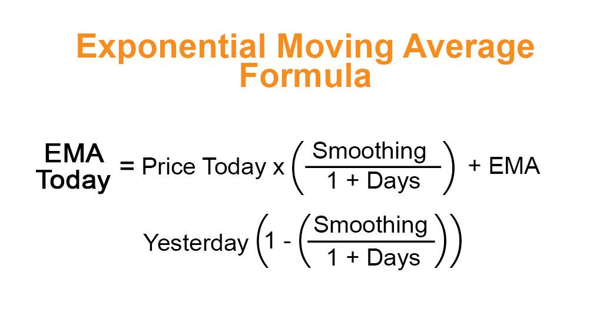

## Table of Contents

## What is an Exponential Moving Average (EMA)?

An Exponential Moving Average (EMA) is a type of moving average that gives more weight to recent prices. This makes it more responsive to new information compared to a Simple Moving Average (SMA), which treats all prices equally. The EMA is calculated using a formula that includes a smoothing factor, which determines how much weight is given to the most recent price.

Traders and investors use the EMA to identify trends and potential entry or exit points in the market. Because it reacts more quickly to price changes, the EMA can help in making timely decisions. For example, if the price of a stock crosses above its EMA, it might be seen as a buying signal, indicating that the stock's price is starting to rise. Conversely, if the price falls below the EMA, it could be a signal to sell, suggesting that the price might continue to drop.

## How does EMA differ from a Simple Moving Average (SMA)?

The main difference between an Exponential Moving Average (EMA) and a Simple Moving Average (SMA) is how they calculate and weigh the prices over time. An EMA gives more importance to the most recent prices, making it more sensitive to new information. This is done by using a formula that includes a smoothing factor, which adjusts how much the latest price impacts the average. On the other hand, an SMA treats all prices within its time period equally. It simply adds up all the prices and divides by the number of periods, giving each price the same weight regardless of when it occurred.

Because of these differences, EMAs react faster to price changes than SMAs. This can be helpful for traders who need to make quick decisions based on the latest market movements. For example, if a stock's price starts to rise, the EMA will show this change sooner than the SMA, potentially giving traders an earlier signal to buy. However, this sensitivity can also lead to more false signals, so it's important to use EMAs carefully. SMAs, being less responsive, might be better for longer-term trend analysis where sudden price changes are less critical.

## What are the basic steps to calculate an EMA?

To calculate an EMA, you start with a Simple Moving Average (SMA). First, pick the number of periods you want to use for your EMA, like 10 days or 20 days. Let's say you choose 10 days. You add up the closing prices for the last 10 days and divide by 10 to get the SMA. This SMA is the starting point for your EMA.

Next, you need to find the smoothing factor. It's calculated as 2 divided by the number of periods plus 1. For a 10-day EMA, the smoothing factor is 2/(10+1) which equals about 0.1818. To get the EMA for the next day, you multiply the smoothing factor by the current day's price and add it to the previous day's EMA multiplied by (1 minus the smoothing factor). So, if today's price is $50 and yesterday's EMA was $45, the new EMA would be (0.1818 * $50) + (1 - 0.1818) * $45. This gives you the EMA for the current day, and you repeat this process for each new day.

## What is the formula used to calculate an EMA?

To calculate an Exponential Moving Average (EMA), you start with a Simple Moving Average (SMA) for the first period. Let's say you want a 10-day EMA. You add up the closing prices for the last 10 days and divide by 10 to get the SMA. This SMA is the starting point for your EMA. Then, you need to find the smoothing factor, which is 2 divided by the number of periods plus 1. For a 10-day EMA, the smoothing factor is 2/(10+1) which equals about 0.1818.

After you have the SMA and the smoothing factor, you can calculate the EMA for the next day. You multiply the smoothing factor by the current day's price and add it to the previous day's EMA multiplied by (1 minus the smoothing factor). For example, if today's price is $50 and yesterday's EMA was $45, the new EMA would be (0.1818 * $50) + (1 - 0.1818) * $45. You repeat this process for each new day to keep the EMA updated.

## How do you choose the right time period for an EMA?

Choosing the right time period for an EMA depends on what you want to use it for. If you're a short-term trader looking to make quick decisions, you might choose a shorter time period like 10 or 20 days. This makes the EMA more sensitive to recent price changes, helping you spot trends faster. But, it can also lead to more false signals, so you need to be careful.

For longer-term investors, a longer time period like 50 or 200 days might be better. A longer period makes the EMA less sensitive to daily price changes, which can help you see the bigger picture and avoid getting thrown off by short-term ups and downs. The key is to match the time period to your trading or investing style and goals.

## What is the significance of the smoothing factor in EMA calculations?

The smoothing factor in an EMA calculation is really important because it decides how much the most recent price affects the average. The formula for the smoothing factor is 2 divided by the number of periods plus 1. So, if you're using a 10-day EMA, the smoothing factor would be about 0.1818. This number might seem small, but it has a big impact. A higher smoothing factor means the EMA will react more quickly to new prices, which can be good if you want to catch trends early.

On the other hand, a lower smoothing factor means the EMA will be slower to change, which can be better if you want to smooth out short-term price swings and focus on longer trends. The choice of the smoothing factor depends on what you're trying to do with the EMA. If you're a short-term trader, you might want a higher smoothing factor to get quick signals. But if you're a long-term investor, a lower smoothing factor might help you see the bigger picture without getting distracted by daily price movements.

## Can you explain the impact of different alpha values on EMA?

The alpha value in an EMA is another way to talk about the smoothing factor. It decides how much the newest price affects the EMA. A bigger alpha value means the EMA will change more quickly when prices move. For example, if you use a short time period like 10 days, you get a bigger alpha value. This makes the EMA very responsive to new prices, which can be good for traders who want to catch trends early. But it can also make the EMA jump around a lot, which might lead to false signals if you're not careful.

On the other hand, a smaller alpha value means the EMA won't change as much with each new price. This happens when you use a longer time period, like 50 or 200 days. A smaller alpha value makes the EMA smoother and less likely to be thrown off by short-term price swings. This can be better for investors who are looking at the bigger picture and don't want to react to every little price change. So, choosing the right alpha value depends on what you're trying to do with the EMA and how quickly you need it to respond to new information.

## How do you calculate the first EMA value when historical data is available?

When you want to calculate the first EMA value and you have historical data, you start with a Simple Moving Average (SMA). For example, if you want a 10-day EMA, you add up the closing prices for the last 10 days and divide by 10. This gives you the SMA, which you use as the first EMA value. This is because you need a starting point, and the SMA gives you a good average of the recent prices.

After you have the first EMA value, you can start calculating the EMA for the next days. You need to find the smoothing factor first, which is 2 divided by the number of periods plus 1. For a 10-day EMA, the smoothing factor is about 0.1818. Then, for the next day, you multiply the smoothing factor by the current day's price and add it to the previous day's EMA multiplied by (1 minus the smoothing factor). This way, you keep updating the EMA every day with the new prices.

## What are common applications of EMA in financial markets?

Traders and investors use the Exponential Moving Average (EMA) in financial markets to help them make decisions about buying and selling. One common way to use an EMA is to spot trends. If the price of a stock goes above its EMA, it might be a sign that the price is starting to go up, which could be a good time to buy. On the other hand, if the price falls below the EMA, it might mean the price is going down, and it could be a good time to sell. This helps traders catch trends early and make quick decisions.

Another way people use EMAs is to find out if a trend is strong or weak. If the EMA is moving in the same direction as the price, it can show that the trend is strong. But if the EMA is moving in the opposite direction, it might mean the trend is weak and could change soon. This can help traders decide if they should keep their investments or get out before the trend changes. By using EMAs, traders can get a better understanding of what's happening in the market and make smarter choices.

## How can EMA be used in conjunction with other technical indicators?

Traders often use the Exponential Moving Average (EMA) along with other technical indicators to make better decisions. One popular way is to use the EMA with the Moving Average Convergence Divergence (MACD) indicator. The MACD uses two EMAs to show the difference between them, which helps traders see if the trend is getting stronger or weaker. When the MACD line crosses above the signal line, it might be a good time to buy, and when it crosses below, it might be a good time to sell. By using the EMA and MACD together, traders can get a clearer picture of the market's direction and strength.

Another common combination is using the EMA with the Relative Strength Index (RSI). The RSI measures how fast prices are changing and can show if a stock is overbought or oversold. If the price is above the EMA and the RSI is over 70, it might mean the stock is overbought and could go down soon. But if the price is below the EMA and the RSI is under 30, it might mean the stock is oversold and could go up soon. By looking at both the EMA and RSI, traders can make more informed decisions about when to buy or sell.

## What are the limitations and potential pitfalls of using EMA in analysis?

Using an Exponential Moving Average (EMA) can help you see trends and make decisions, but it also has some problems. One big issue is that EMAs can give you false signals. This happens because they react quickly to price changes. If the price moves a lot in a short time, the EMA might make you think a new trend is starting when it's really just a temporary change. This can lead you to buy or sell at the wrong time, which can cost you money. Also, choosing the right time period for the EMA is tricky. If you pick a short time period, the EMA will be too sensitive and might give you too many false signals. But if you pick a long time period, the EMA might be too slow to help you catch trends early.

Another problem with EMAs is that they don't work well in all market conditions. In a market that's moving sideways, with prices going up and down but not really going anywhere, the EMA can be confusing. It might keep telling you to buy and sell, but the prices aren't really changing much. This can make you trade too much and lose money on fees and bad trades. Also, relying too much on EMAs can make you miss other important things happening in the market. It's good to use EMAs along with other tools and information to get a better understanding of what's going on.

## How can one implement EMA calculations in a programming language like Python?

To implement EMA calculations in Python, you need to start by calculating the Simple Moving Average (SMA) for the first period. Let's say you want a 10-day EMA. You would take the closing prices for the last 10 days, add them up, and divide by 10 to get the SMA. This SMA will be your first EMA value. Then, you calculate the smoothing factor, which is 2 divided by the number of periods plus 1. For a 10-day EMA, the smoothing factor would be 2/(10+1), which is about 0.1818. With this, you can start calculating the EMA for the next days.

After you have the first EMA value and the smoothing factor, you can update the EMA for each new day. For example, if today's price is $50 and yesterday's EMA was $45, you would calculate the new EMA as (0.1818 * $50) + (1 - 0.1818) * $45. This gives you the EMA for the current day. You repeat this process for each new day, using the previous day's EMA and the current day's price to keep the EMA updated. This way, you can track the EMA over time and use it in your trading or investing decisions.

## What is the Exponential Moving Average (EMA)?

The Exponential Moving Average (EMA) is a form of weighted moving average commonly utilized in technical analysis, designed to give greater importance to the most recent price data. This characteristic makes the EMA more responsive to new price movements compared to the Simple Moving Average (SMA), which treats all data points with equal weight. The increased sensitivity of the EMA allows traders to more promptly identify recent price trends, facilitating quicker decision-making processes in trading.

The EMA serves as a tool to capture the direction of financial trends over a predetermined period, smoothing out short-term fluctuations to highlight longer-term trends. This is accomplished by applying more weight to recent prices and less to older prices, which helps to reduce the lag observed in the SMA. The ability of the EMA to swiftly adapt to price changes is of significant value in fast-paced markets, as it provides a more timely reflection of price movements, potentially improving the accuracy of predictions about future price actions.

Calculating the EMA involves the use of a smoothing factor, which is derived from the number of periods covered by the moving average. The formula for the EMA at a particular time $t$ is:

$$
\text{EMA}(t) = \text{Price}(t) \times k + \text{EMA}(t-1) \times (1 - k),
$$

where:

- $\text{Price}(t)$ is the current price at time $t$,
- $\text{EMA}(t-1)$ is the EMA value of the previous period,
- $k$ is the smoothing factor, calculated as $\frac{2}{N+1}$, where $N$ is the number of periods over which the EMA is calculated.

This formula ensures that more recent prices are reflected more heavily in the calculation, making the EMA particularly useful for traders focusing on short-term price movements. The choice of the number of periods $N$ influences the responsiveness of the EMA; a smaller $N$ results in a more pronounced response to recent price changes, while a larger $N$ creates a smoother EMA line that reacts slower to price changes.

## How do you calculate the EMA?

To calculate the Exponential Moving Average (EMA), begin with computing a Simple Moving Average (SMA) for a specific number of periods. This SMA serves as the initial EMA value. The EMA assigns more weight to recent prices, making it responsive to recent price movements. This responsiveness is achieved through a weighting multiplier, known as the smoothing [factor](/wiki/factor-investing).

To compute the EMA, use the following steps:

1. **Calculate the SMA**: 
   For the first calculation, the EMA is not derived from prior EMA values but from the SMA. For instance, if calculating a 10-day EMA, average the closing prices of the first 10 days.

2. **Determine the Smoothing Factor (k)**:
   The smoothing factor k is calculated as:
$$
   k = \frac{2}{N + 1}

$$

   where $N$ represents the number of periods. This factor determines the percentage weight of the most recent data point.

3. **Calculate the EMA**:
   After obtaining the SMA for the initial period, the EMA for the current period $t$ (EMA(t)) is computed using:
$$
   \text{EMA}(t) = \text{Price}(t) \times k + \text{EMA}(y) \times (1 - k)

$$

   Here, $\text{Price}(t)$ signifies the current period's price, and $\text{EMA}(y)$ is the EMA value from the previous period. The formula effectively combines the effect of the current price with the prior EMA, ensuring the latest prices have more influence on the EMA than older prices.

By iterating this calculation for subsequent periods, traders can establish an EMA curve that provides a smoothed representation of price movements, allowing for enhanced trend identification and analysis. Each new EMA computation depends on the EMA value from the previous period, progressively incorporating more data points while prioritizing the most recent price information.

## What are the advantages and disadvantages of EMA?

The Exponential Moving Average (EMA) is a favored tool among traders due to its ability to swiftly react to price changes, making it particularly effective in trend-following systems. Its responsiveness allows it to capture significant price movements rapidly, which is beneficial in dynamic markets. For instance, traders often leverage EMAs for short-term trading strategies where quick decision-making is crucial. The inherent versatility of EMAs also allows them to be used across various financial markets, including [forex](/wiki/forex-system), stocks, and commodities, providing traders with a consistent method to analyze diverse trading environments.

However, the enhanced sensitivity of EMAs to price changes can also be a drawback. In volatile markets, this can lead to the generation of false signals. A false signal might cause traders to enter or [exit](/wiki/exit-strategy) positions prematurely, potentially leading to losses. This downside necessitates a deeper understanding of the mathematical calculations involved with EMAs and the potential for increased noise in the signal. The mathematical formula that describes the EMA is:

$$
EMA(t) = Price(t) \times k + EMA(y) \times (1 - k)
$$

Where $k$ is the smoothing factor, calculated as $k = \frac{2}{N+1}$, and $N$ is the number of periods.

For traders, balancing the EMA's responsiveness with the risk of noise is essential. This balance might involve adjusting the smoothing factor or combining EMAs with other technical indicators to filter out false signals. For instance, traders often use EMAs alongside other indicators like Relative Strength Index (RSI) or Moving Average Convergence Divergence (MACD) to validate signals and enhance the reliability of their trading strategies. This multifaceted approach helps mitigate the risk of relying too heavily on the EMA's indications alone.

## References & Further Reading

[1]: Wilder, J. W. (1978). ["New Concepts in Technical Trading Systems."](https://archive.org/details/newconceptsintec00wild) Trend Research.

[2]: Murphy, J. J. (1999). ["Technical Analysis of the Financial Markets."](https://www.amazon.com/Technical-Analysis-Financial-Markets-Comprehensive/dp/0735200661) New York Institute of Finance.

[3]: Pring, M. J. (2002). ["Technical Analysis Explained."](https://www.amazon.com/Technical-Analysis-Explained-Fifth-Successful/dp/0071825177) McGraw-Hill Education.

[4]: Elder, A. (2002). ["Come Into My Trading Room: A Complete Guide to Trading."](https://www.amazon.com/Come-Into-My-Trading-Room/dp/0471225347) John Wiley & Sons.

[5]: Chan, E. (2009). ["Quantitative Trading: How to Build Your Own Algorithmic Trading Business."](https://github.com/ftvision/quant_trading_echan_book) John Wiley & Sons.