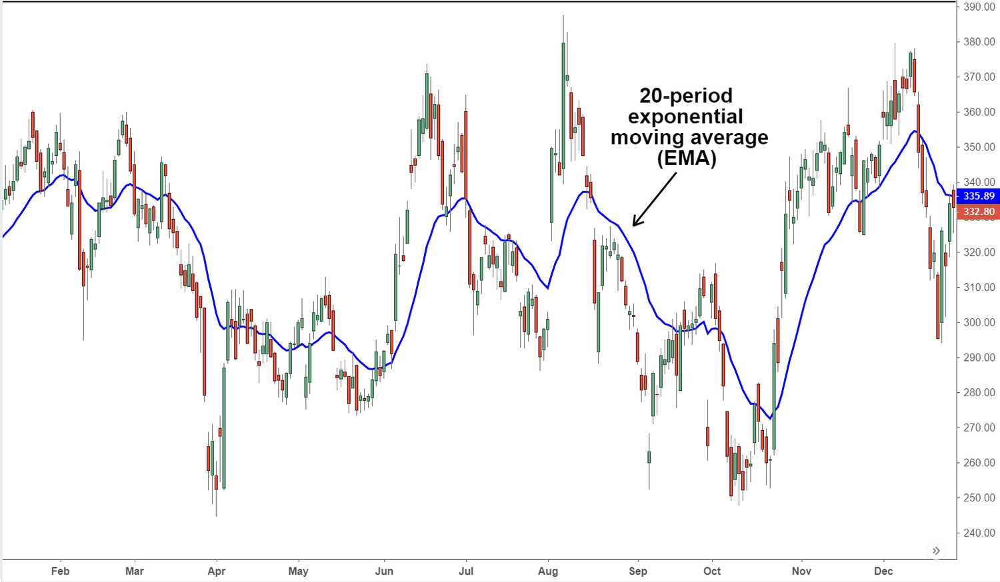

## Table of Contents

## What is an Exponential Moving Average (EMA) and why is it used in Forex trading?

An Exponential Moving Average (EMA) is a type of moving average that gives more weight to recent prices. This means it reacts faster to price changes compared to a Simple Moving Average (SMA), which treats all prices equally. The EMA is calculated using a formula that includes a smoothing factor, which determines how much weight is given to the most recent price. The higher the smoothing factor, the more sensitive the EMA is to recent price changes.

In Forex trading, the EMA is used because it helps traders identify trends more quickly. Since the Forex market can be very volatile, being able to spot trends early can be a big advantage. Traders often use the EMA to decide when to buy or sell a currency pair. For example, if the price of a currency is above its EMA, it might be a good time to buy because it suggests the price is trending upwards. Conversely, if the price is below the EMA, it might be a good time to sell because it suggests the price is trending downwards. This makes the EMA a useful tool for making trading decisions.

## How does the EMA differ from a Simple Moving Average (SMA) in Forex trading?

The main difference between an Exponential Moving Average (EMA) and a Simple Moving Average (SMA) in Forex trading is how they calculate and react to price changes. An EMA gives more weight to recent prices, making it more sensitive to new information. This means that an EMA will change more quickly when prices move. On the other hand, an SMA treats all prices within the chosen time period equally, so it reacts slower to price changes. Because of this, traders who want to catch trends early might prefer using an EMA.

In Forex trading, this difference can affect how traders use these indicators. For example, if a trader wants to follow a trend closely and make quick decisions, they might choose an EMA because it will show changes in the market faster. This can be helpful in the fast-moving Forex market. However, if a trader wants a smoother, less reactive view of the market, they might use an SMA. This can help them avoid false signals that might come from sudden price spikes. Both types of moving averages have their uses, depending on what the trader is looking for.

## What are the steps to calculate an EMA for Forex trading?

To calculate an EMA for Forex trading, you start by choosing a time period, like 10 days, 20 days, or any other number you want. Next, you need to find the SMA for that time period first. For example, if you choose a 10-day period, you add up the closing prices for the last 10 days and then divide by 10. This gives you the SMA for those 10 days. After you have the SMA, you can start calculating the EMA.

To calculate the EMA, you use a special formula that includes a smoothing [factor](/wiki/factor-investing). The smoothing factor is usually calculated as 2 divided by (1 + the number of periods). For a 10-day EMA, the smoothing factor would be 2 divided by (1 + 10), which is 0.1818. To find the EMA for the next day, you take the current day's closing price and multiply it by the smoothing factor. Then, you take the previous day's EMA and multiply it by (1 - the smoothing factor). You add these two numbers together to get the new EMA. You keep doing this each day to keep the EMA up to date.

## How do traders choose the right period for an EMA in Forex trading?

Traders choose the right period for an EMA in Forex trading based on their trading style and goals. If a trader wants to catch short-term trends, they might use a shorter period like a 10-day or 20-day EMA. This makes the EMA react quickly to price changes, which can be good for making fast trading decisions. On the other hand, if a trader is more interested in long-term trends, they might choose a longer period like a 50-day or 200-day EMA. A longer period makes the EMA less sensitive to sudden price changes, which can be helpful for seeing the bigger picture.

The choice also depends on the currency pair being traded. Some currency pairs can be more volatile than others, so traders might adjust the EMA period to match the pair's behavior. For example, a highly volatile pair might work better with a shorter EMA period to capture quick movements, while a less volatile pair might be better suited to a longer EMA period for a smoother trend line. By experimenting with different periods, traders can find the one that works best for their strategy and the specific market conditions they are trading in.

## Can you explain the significance of different EMA periods like 50-day, 100-day, and 200-day in Forex trading?

In Forex trading, different EMA periods like 50-day, 100-day, and 200-day have special meanings. A 50-day EMA is often used to spot short to medium-term trends. It reacts faster to price changes than longer EMAs, so it can help traders make quick decisions. If a currency's price stays above the 50-day EMA, it might be a sign that the price is going up, which could be a good time to buy. On the other hand, if the price stays below the 50-day EMA, it might mean the price is going down, which could be a good time to sell.

A 100-day EMA is used to look at medium-term trends. It's not as quick to react as the 50-day EMA, but it's still faster than the 200-day EMA. This makes it useful for traders who want a balance between quick reactions and a smoother view of the market. A 200-day EMA is often used to see long-term trends. It's slower to change, so it can help traders understand the big picture over many months. When the price crosses above or below the 200-day EMA, it can be a strong signal that a big trend is starting or ending.

## How can traders use EMAs to identify trends in the Forex market?

Traders use EMAs to spot trends in the Forex market by looking at how the price of a currency moves compared to the EMA line. If the price stays above the EMA, it might mean the price is going up, which is called an uptrend. When traders see this, they might think it's a good time to buy the currency because they expect the price to keep going up. On the other hand, if the price stays below the EMA, it could mean the price is going down, which is called a downtrend. This might be a signal for traders to sell the currency because they think the price will keep going down.

Different EMA periods can help traders see different types of trends. A short-term EMA like a 50-day EMA can show quick changes in the market, helping traders catch short-term trends. If they see the price moving above this EMA, it might be a sign of a new short-term uptrend starting. A longer-term EMA like a 200-day EMA can show bigger, long-term trends. If the price crosses above this EMA, it could mean a strong long-term uptrend is starting. By using different EMAs, traders can get a good idea of both short-term and long-term trends in the Forex market.

## What are the common EMA trading strategies used by Forex traders?

One common EMA trading strategy used by Forex traders is the "EMA Crossover" strategy. In this strategy, traders use two EMAs with different periods, like a 50-day and a 200-day EMA. When the shorter-term EMA (50-day) crosses above the longer-term EMA (200-day), it's seen as a buy signal because it might mean a new uptrend is starting. On the other hand, when the shorter-term EMA crosses below the longer-term EMA, it's seen as a sell signal because it might mean a new downtrend is starting. Traders using this strategy look for these crossovers to decide when to enter or [exit](/wiki/exit-strategy) trades.

Another popular strategy is the "EMA Trend Following" strategy. In this approach, traders use a single EMA, like a 50-day or 200-day EMA, to follow the trend of the market. If the price of a currency stays above the EMA, traders might see it as a sign to buy because it suggests the price is in an uptrend. If the price stays below the EMA, traders might see it as a sign to sell because it suggests the price is in a downtrend. This strategy helps traders stay in trades that are moving in the direction of the trend, which can be a good way to make profits in the Forex market.

A third strategy is the "EMA Support and Resistance" strategy. Here, traders use EMAs to identify levels where the price might bounce back or break through. For example, if the price of a currency is falling towards a 50-day EMA and then bounces back up, the EMA might act as a support level. If the price is rising towards a 200-day EMA and then falls back down, the EMA might act as a resistance level. Traders use these EMAs to make decisions about where to buy or sell, based on how the price reacts to these levels.

## How can EMAs be used in conjunction with other technical indicators in Forex trading?

Traders often use EMAs along with other technical indicators to make better trading decisions in the Forex market. One common combination is using EMAs with the Relative Strength Index (RSI). The RSI helps traders see if a currency is overbought or oversold. If the price of a currency is above the EMA and the RSI is not in the overbought zone, it might be a good time to buy. On the other hand, if the price is below the EMA and the RSI is not in the oversold zone, it might be a good time to sell. By using both indicators together, traders can get a clearer picture of when to enter or exit trades.

Another popular combination is using EMAs with the Moving Average Convergence Divergence (MACD). The MACD helps traders see the strength and direction of a trend. If the price is above the EMA and the MACD shows a bullish signal, it might be a strong sign to buy. If the price is below the EMA and the MACD shows a bearish signal, it might be a strong sign to sell. Using EMAs with the MACD can help traders confirm trends and make more confident trading decisions.

## What are the limitations and potential pitfalls of using EMAs in Forex trading?

Using EMAs in Forex trading can have some limitations and pitfalls. One big problem is that EMAs can give false signals. This happens when the price moves quickly in one direction but then changes direction soon after. If a trader buys or sells based on the EMA signal, they might end up losing money if the price goes the other way. Another issue is that EMAs can lag behind the market. This means the EMA might not change as fast as the price, so traders might miss out on some good trading opportunities. 

Another limitation is that EMAs work best in markets that have clear trends. If the market is moving sideways, without a clear up or down trend, EMAs can be less useful. Traders might see a lot of false signals because the price keeps crossing the EMA without going in one direction for long. It's also important for traders to remember that EMAs are just one tool. Relying only on EMAs without looking at other indicators or market conditions can lead to bad trading decisions. So, it's a good idea to use EMAs along with other tools to make the best choices in Forex trading.

## How does the EMA respond to market volatility and how should traders adjust their strategies accordingly?

The EMA reacts to market [volatility](/wiki/volatility-trading-strategies) by changing more quickly when prices move a lot. If the market is very volatile, the EMA will move up and down more often because it gives more weight to the most recent prices. This can be good because it helps traders catch trends early, but it can also lead to more false signals. When the market is moving a lot, the EMA might show that the price is going up or down when it's really just bouncing around. So, traders need to be careful and not jump into trades too quickly just because of what the EMA is showing.

To adjust their strategies during high market volatility, traders should use the EMA along with other tools to check if the signals are real. For example, they can use indicators like the RSI or MACD to see if the market is really trending in the direction the EMA is showing. If the other indicators agree with the EMA, it's more likely to be a good trade. Also, traders might want to use a longer EMA period during volatile times to smooth out the price movements and avoid false signals. By being careful and using more than just the EMA, traders can make better decisions even when the market is moving a lot.

## Can you discuss advanced EMA techniques like multiple EMA crossovers in Forex trading?

In Forex trading, traders often use multiple EMA crossovers to get better signals about when to buy or sell. Instead of just using one EMA, they use several EMAs with different time periods, like a 10-day, 20-day, and 50-day EMA. When these EMAs cross each other, it can give a stronger signal. For example, if the 10-day EMA crosses above both the 20-day and 50-day EMAs, it might be a really good time to buy because it shows a strong uptrend. On the other hand, if the 10-day EMA crosses below both the 20-day and 50-day EMAs, it might be a good time to sell because it shows a strong downtrend. By looking at multiple EMAs, traders can feel more confident about their trading decisions.

Using multiple EMA crossovers can help traders filter out false signals that might come from just one EMA. If the market is moving a lot, a single EMA might show a lot of ups and downs that aren't real trends. But if traders wait for several EMAs to line up and move in the same direction, they can be more sure that the trend is real. This can be especially useful in the Forex market, where prices can change quickly. By waiting for these multiple crossovers, traders can avoid getting into bad trades and focus on the ones that are more likely to make money.

## What are some real-world examples of successful EMA application in Forex trading?

One real-world example of successful EMA application in Forex trading is the story of a trader who used a 50-day and 200-day EMA crossover strategy to trade the EUR/USD pair. This trader noticed that when the 50-day EMA crossed above the 200-day EMA, it often signaled the start of an uptrend. By waiting for this crossover and then buying the EUR/USD, the trader was able to catch several profitable trades. The trader also used the RSI to make sure the market wasn't overbought, which helped to confirm the EMA signals and avoid false moves.

Another example is a Forex trader who used multiple EMAs to trade the GBP/JPY pair. This trader used a 10-day, 20-day, and 50-day EMA. When the 10-day EMA crossed above both the 20-day and 50-day EMAs, it was a strong signal to buy. The trader found that this strategy helped to filter out false signals and focus on strong trends. By combining this with the MACD to confirm the direction of the trend, the trader was able to make consistent profits over time.

## What are the challenges and how can risk management be approached?

The Exponential Moving Average (EMA) trading strategy, while advantageous, is not without its challenges. A primary concern is the generation of false signals, especially in volatile markets where price fluctuations can lead to erroneous trade prompts. This arises because EMA, by design, prioritizes recent prices, which can cause traders to react to short-term movements that do not signify longer-term trends. To mitigate this risk, traders often use EMA in conjunction with other technical indicators such as the Relative Strength Index (RSI) or Moving Average Convergence Divergence (MACD). This multi-indicator approach helps filter out market noise, enhancing signal accuracy and reliability.

Risk management is crucial in employing an EMA-based strategy effectively. Setting stop-loss orders is one technique that limits losses by automatically closing a position when a specified price is reached. This predefined limit protects traders from significant downside risks if the market moves unfavorably. Another essential aspect of risk management is position sizing, which involves determining the amount of capital to allocate per trade. Position sizing should be aligned with the trader's risk tolerance and the overall strategy objectives. An example of a simple position sizing calculation is:

$$
\text{Position Size} = \frac{\text{Risk Per Trade}}{\text{Trade Risk}}
$$

Where:
- Risk Per Trade is the total amount the trader is willing to lose on a single trade.
- Trade Risk is the difference in pips between the entry point and the stop-loss level.

By integrating these risk management strategies, traders can enhance their ability to manage the uncertainties inherent in [forex](/wiki/forex-system) trading, allowing them to respond more effectively to market dynamics and preserve their capital over the long term.

## References & Further Reading

1. Investopedia: [Using EMA in a Forex Trading Strategy](https://www.investopedia.com/forex-and-currencies-trading-4689676) - This comprehensive guide provides an overview of how Exponential Moving Averages (EMA) can be used effectively within forex trading strategies, highlighting the distinctions between EMAs and Simple Moving Averages (SMA), and offering insights into their application in detecting trends and signal generation.

2. Financial Trading Articles on EMA and Algo Trading Techniques - A wide range of articles are available on platforms such as TradingView, Medium, and Seeking Alpha. These articles often explore various algorithmic trading strategies incorporating EMA, discussing algorithmic implementations that optimize trading precision and responsiveness to market changes.

3. Forex Educational Platforms and Algo Trading Initiatives - Websites like BabyPips and My Trading Skills offer educational resources that cover the integration of EMA strategies within broader trading systems. These platforms frequently provide courses and webinars on forex trading basics, EMAs usage, and developing algorithmic strategies to enhance trading performance. Additionally, initiatives such as QuantConnect and AlgoTrader offer frameworks for developing, back-testing, and deploying algorithmic trading strategies, including those utilizing EMA.

