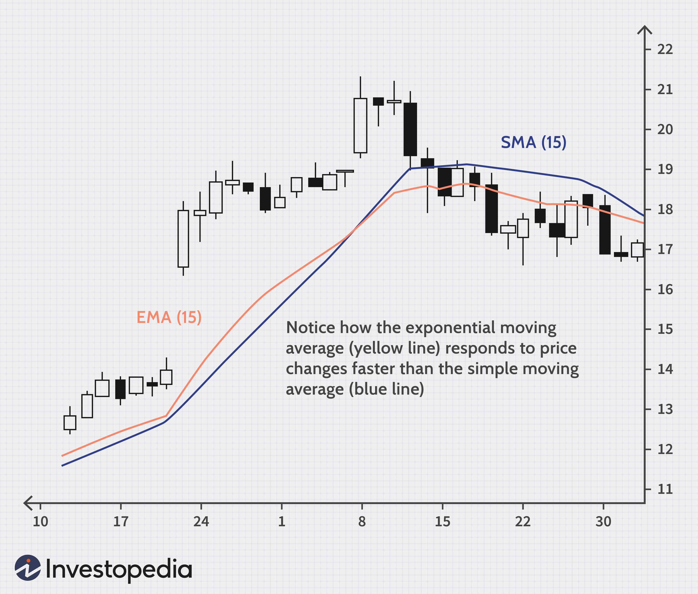

In today's dynamic forex market, traders are constantly seeking innovative strategies that can provide an edge. One popular approach involves the use of the Exponential Moving Average (EMA), particularly when combined with algorithmic trading techniques. The EMA is a type of moving average that emphasizes recent price data over older data, making it more sensitive to current market conditions. This characteristic allows traders to respond more swiftly to emerging trends, which is crucial in the fast-paced forex market.

Algorithmic trading, often referred to as algo trading, involves using computer programs to execute trades based on a predefined set of rules. When integrated with EMA strategies, it enables traders to capitalize on market opportunities with greater precision and speed by automating trading decisions. The synergy between EMA and algo trading can potentially reduce the impact of emotional biases, as trades are executed based on quantitative analysis rather than human intuition.



This article will explore the various facets of using EMA in forex, examining how it can inform buying and selling decisions and how algorithmic trading can enhance its effectiveness. Through leveraging both EMA and algo trading, traders can potentially optimize their strategies, navigating the complexities of the forex market with improved confidence and efficiency. However, understanding the components, benefits, and potential pitfalls of this approach is essential to achieving success in this constantly evolving financial landscape.

## Table of Contents

## What is EMA Forex Trading Strategy?

The Exponential Moving Average (EMA) is a widely used tool among forex traders for its ability to more promptly reflect price changes. Unlike the Simple Moving Average (SMA) that assigns equal weight to all price values within the given period, the EMA gives greater weight to the most recent prices. This characteristic makes the EMA particularly useful for capturing emerging trends in the forex market, where timely reactions to price movements are crucial.

Mathematically, the EMA can be calculated using the formula:
$$
\text{EMA}_t = \left( \frac{P_t - \text{EMA}_{t-1}}{N + 1} \right) + \text{EMA}_{t-1}
$$

In this formula, $P_t$ represents the current price, $\text{EMA}_{t-1}$ is the EMA calculated for the previous period, and $N$ is the number of periods used to calculate the EMA.

Forex traders typically deploy the EMA to monitor market trends and pinpoint potential buy or sell opportunities. This is often achieved by using two EMAs with different time frames—a short-term EMA and a long-term EMA. For instance, a common strategy may involve a 50-period EMA for the long-term trend and a 20-period EMA for the short-term trend. A bullish signal could be generated when the short-term EMA crosses above the long-term EMA, suggesting an upward market [momentum](/wiki/momentum). Conversely, a bearish signal might occur when the short-term EMA crosses below, indicating potential downward movement.

By employing EMAs of varying lengths, traders can effectively distinguish between noise and genuine market signals. This strategic deployment of EMAs aids in the identification of entry and [exit](/wiki/exit-strategy) points in trades, thus enhancing decision-making in the fast-paced [forex](/wiki/forex-system) market.

## Using EMA in Forex and Algo Trading

Exponential Moving Averages (EMAs) are widely utilized by forex traders to identify optimal market entry and exit points. This approach is based on the EMA's ability to assign greater importance to recent price data. By doing so, EMAs quickly adapt to price changes, ideally capturing emerging trends or reversals in the forex market. Typically, traders look for interactions between short-term and long-term EMAs to generate buy and sell signals. A common tactic is the "crossover strategy," where a short-term EMA crossing above a long-term EMA generates a buy signal, and a crossover below it indicates a sell signal.

Algorithmic trading, or algo trading, integrates these EMA-based strategies into automated systems. Algorithms are programmed to follow predetermined rules, thus enabling the automatic execution of trades based on specific EMA signals. This has several advantages. Most notably, it eliminates delays associated with manual trading, ensuring that trades occur at the desired price levels.

Moreover, algo trading reduces the emotional component of trading. By relying on data and preset rules, traders can avoid impulsive decisions driven by market [volatility](/wiki/volatility-trading-strategies). This systematic approach increases the consistency of trading actions, aiming for optimal moments to execute trades based on EMA signals.

When programming an EMA-based algorithm, traders can incorporate conditionals to enhance strategy performance. A simple Python pseudo-code snippet might look like this:

```python
def ema_crossover_strategy(data, short_window, long_window):
    data['Short_EMA'] = data['Close'].ewm(span=short_window, adjust=False).mean()
    data['Long_EMA'] = data['Close'].ewm(span=long_window, adjust=False).mean()

    buy_signals = []
    sell_signals = []

    for i in range(1, len(data)):
        if data['Short_EMA'][i] > data['Long_EMA'][i] and data['Short_EMA'][i-1] <= data['Long_EMA'][i-1]:
            buy_signals.append(data['Close'][i])
            sell_signals.append(float('nan'))
        elif data['Short_EMA'][i] < data['Long_EMA'][i] and data['Short_EMA'][i-1] >= data['Long_EMA'][i-1]:
            sell_signals.append(data['Close'][i])
            buy_signals.append(float('nan'))
        else:
            buy_signals.append(float('nan'))
            sell_signals.append(float('nan'))

    return buy_signals, sell_signals

# Example usage
# Assuming 'market_data' is a DataFrame with historical Close prices
buy_signals, sell_signals = ema_crossover_strategy(market_data, short_window=12, long_window=26)
```

This example assumes a basic strategy using two EMAs. Real-world applications may incorporate additional indicators or modify conditions to suit specific trading requirements. By leveraging algorithms, EMA strategies are executed with precision and speed, offering a significant advantage in the fast-paced forex environment.

## Benefits of Using EMA in Algo Trading

One significant advantage of using the Exponential Moving Average (EMA) in algorithmic (algo) trading is its responsiveness to price changes, a feature that is particularly beneficial in the rapidly moving forex market. The EMA assigns more weight to recent prices, making it more sensitive to fluctuations compared to a simple moving average (SMA). This characteristic allows traders to capture market trends more accurately and respond promptly to new information, which is crucial for maximizing profits or minimizing losses.

Algorithmic trading enhances the effectiveness of the EMA by automating the trading process, thus eliminating emotional bias. In a manually driven trading environment, emotional responses can lead to inconsistent decision-making. By using algorithms, traders ensure that strategies are executed uniformly based on pre-defined criteria. For example, in Python, implementing an EMA-based trading strategy can be achieved using the pandas library as shown below:

```python
import pandas as pd

def calculate_ema(prices, period):
    return prices.ewm(span=period, adjust=False).mean()

# Example usage with a DataFrame of closing prices
data = pd.DataFrame({
    'Close': [1.1234, 1.1250, 1.1275, ...]  # Replace with actual data
})

ema_period = 20
data['EMA'] = calculate_ema(data['Close'], ema_period)
```

Additionally, the combination of EMA with algo trading provides precision and efficiency in handling large volumes of data. Algorithms can scan multiple currency pairs and timeframes to identify optimal trading opportunities based on EMA crossovers or deviations. This capability allows the simultaneous monitoring of various markets, something that would be challenging to achieve manually. Moreover, automation facilitates the execution of trades at precise moments, ensuring trades are made at optimal points for entry and exit, based on predefined thresholds.

The use of EMA in algo trading also offers scalability. Once an algo strategy is developed and tested, it can be deployed across different forex pairs and trading environments without requiring extensive manual intervention. This saves time and allows traders to focus on strategy improvement and risk management.

In summary, the integration of EMA with [algorithmic trading](/wiki/algorithmic-trading) optimizes trading strategies by providing a responsive, precise, and scalable approach to market analysis and execution. This combination is particularly well-suited for the dynamic forex market, where timely responses to price changes are crucial.

## Challenges and Risk Management

The Exponential Moving Average (EMA) trading strategy, while advantageous, is not without its challenges. A primary concern is the generation of false signals, especially in volatile markets where price fluctuations can lead to erroneous trade prompts. This arises because EMA, by design, prioritizes recent prices, which can cause traders to react to short-term movements that do not signify longer-term trends. To mitigate this risk, traders often use EMA in conjunction with other technical indicators such as the Relative Strength Index (RSI) or Moving Average Convergence Divergence (MACD). This multi-indicator approach helps filter out market noise, enhancing signal accuracy and reliability.

Risk management is crucial in employing an EMA-based strategy effectively. Setting stop-loss orders is one technique that limits losses by automatically closing a position when a specified price is reached. This predefined limit protects traders from significant downside risks if the market moves unfavorably. Another essential aspect of risk management is position sizing, which involves determining the amount of capital to allocate per trade. Position sizing should be aligned with the trader's risk tolerance and the overall strategy objectives. An example of a simple position sizing calculation is:

$$
\text{Position Size} = \frac{\text{Risk Per Trade}}{\text{Trade Risk}}
$$

Where:
- Risk Per Trade is the total amount the trader is willing to lose on a single trade.
- Trade Risk is the difference in pips between the entry point and the stop-loss level.

By integrating these risk management strategies, traders can enhance their ability to manage the uncertainties inherent in forex trading, allowing them to respond more effectively to market dynamics and preserve their capital over the long term.

## Conclusion

The Exponential Moving Average (EMA) trading strategy, when integrated with algorithmic trading, provides a compelling framework for forex traders aiming to capitalize on short-term market movements. By its design, the EMA gives more weight to recent price data, making it highly responsive to changes in market trends. This responsiveness is particularly effective in forex trading, where quick decision-making can lead to substantial gains.

Algorithmic trading further enhances the effectiveness of the EMA by automating trade execution, ensuring that trades are made at optimal times without emotional interference. This automation allows traders to process vast amounts of data with precision and speed, a crucial advantage in the fast-paced forex market. The synergy between EMA and algo trading not only increases efficiency but also improves the accuracy of trade signals, potentially leading to improved trading outcomes.

However, successful implementation of this strategy requires a thorough understanding of both the EMA and the complexities of algorithmic trading. Traders must remain vigilant about the potential pitfalls such as false signals, particularly in volatile market conditions. It is essential to complement the EMA with additional indicators and robust risk management practices, such as setting appropriate stop-loss orders and judicious position sizing, to safeguard against potential losses.

Risk management should not be an afterthought but an integral part of the strategy. By doing so, traders can protect their capital and ensure that their trading strategies remain profitable over time. Properly balancing the benefits of rapid responsiveness and automation with solid risk management practices will empower traders to leverage the full potential of the EMA-algo trading combination in the dynamic forex market.

## References & Further Reading

1. Investopedia: [Using EMA in a Forex Trading Strategy](https://www.investopedia.com/forex-and-currencies-trading-4689676) - This comprehensive guide provides an overview of how Exponential Moving Averages (EMA) can be used effectively within forex trading strategies, highlighting the distinctions between EMAs and Simple Moving Averages (SMA), and offering insights into their application in detecting trends and signal generation.

2. Financial Trading Articles on EMA and Algo Trading Techniques - A wide range of articles are available on platforms such as TradingView, Medium, and Seeking Alpha. These articles often explore various algorithmic trading strategies incorporating EMA, discussing algorithmic implementations that optimize trading precision and responsiveness to market changes.

3. Forex Educational Platforms and Algo Trading Initiatives - Websites like BabyPips and My Trading Skills offer educational resources that cover the integration of EMA strategies within broader trading systems. These platforms frequently provide courses and webinars on forex trading basics, EMAs usage, and developing algorithmic strategies to enhance trading performance. Additionally, initiatives such as QuantConnect and AlgoTrader offer frameworks for developing, back-testing, and deploying algorithmic trading strategies, including those utilizing EMA.

