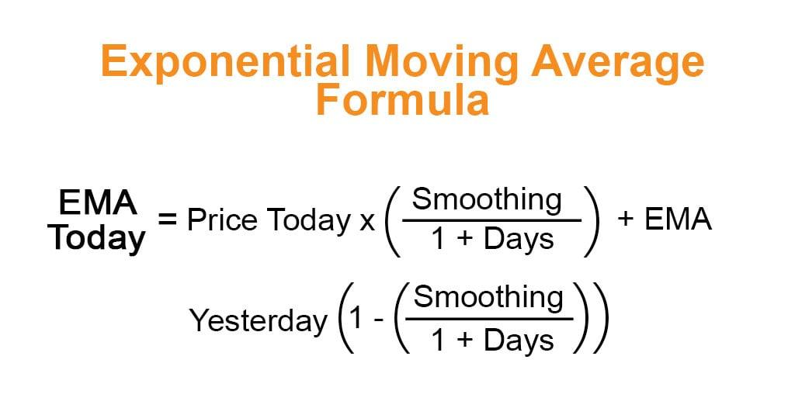

Algorithmic trading has transformed the financial markets by leveraging sophisticated tools and strategies to make informed decisions. At the core of many successful trading systems lies a suite of technical indicators, with the Exponential Moving Average (EMA) being one of the most favored by professionals and enthusiasts alike. The EMA is renowned for its ability to highlight trends in price data, offering traders a dynamic view of market behavior.

In this article, the focus is on elucidating the essential characteristics and advantages of the EMA. This technical indicator is pivotal in analyzing market trends and is integral to various trading strategies. The EMA is distinguished from other moving averages by its method of calculation, where more weight is assigned to recent price observations. This quality enables traders to respond more effectively to price changes, enhancing their ability to seize opportunities or avert risks in a timely manner.



Understanding the EMA, its calculation, and its applications can significantly impact a trader's ability to execute successful trades. The content ahead will delve into these fundamental aspects, demonstrating the EMA's role in refining trading decisions. Whether you are an experienced trader or in the early stages of learning, grasping the nuances of the EMA can vastly improve trading outcomes.

## Table of Contents

## Understanding the Exponential Moving Average (EMA)

The Exponential Moving Average (EMA) is a metric used in financial markets to smooth out price data, allowing traders to identify trends more readily. Unlike the Simple Moving Average (SMA), which assigns equal weight to all data points in the specified period, the EMA assigns exponentially decreasing weights as observations get older. Consequently, the EMA is more responsive to recent price movements and is therefore favored in environments where timely data interpretation is critical.

To understand the EMA calculation, one must grasp its formula and components. The EMA is computed using the current data point, previous EMA, and a smoothing factor, often referred to as the multiplier. This multiplier is determined by the length of the EMA period selected. The formula for calculating the multiplier is:

$$
\text{Multiplier} = \frac{2}{n + 1}
$$

where $n$ is the number of periods over which the EMA is calculated.

Given the multiplier, the EMA itself is then calculated using the following formula:

$$
\text{EMA}_{\text{today}} = (\text{Price}_{\text{today}} \times \text{Multiplier}) + (\text{EMA}_{\text{yesterday}} \times (1 - \text{Multiplier}))
$$

The essence of the EMA is in its sensitivity to recent price changes while maintaining a smoother line than what individual price points would suggest. This quality often makes it more advantageous than the SMA, especially in volatile markets where prompt response to price changes is necessary.

Calculating and interpreting EMA values requires attention to detail. Traders typically use software or programming languages, like Python, to automate these calculations, especially when integrating EMAs into [algorithmic trading](/wiki/algorithmic-trading) strategies. For example, in Python, the EMA can be calculated using the Pandas library:

```python
import pandas as pd

def calculate_ema(prices, period):
    return prices.ewm(span=period, adjust=False).mean()

# Example usage:
prices = pd.Series([23, 24, 25, 26, 25, 24])  # Example price data
ema_10 = calculate_ema(prices, 10)
print(ema_10)
```

Understanding the EMA and its calculation provides traders with the ability to make informed choices about which type of moving average to apply in a given market scenario. The preference for EMA in certain conditions arises from its ability to react swiftly to price changes, offering a more dynamic view of market trends compared to traditional moving averages.

## The Role of EMA in Technical Analysis

The Exponential Moving Average (EMA) plays a significant role in technical analysis due to its ability to smooth out price data effectively, aiding traders in identifying trends and pinpointing potential buying or selling opportunities. By placing more emphasis on recent price data, the EMA provides a clearer picture of market [momentum](/wiki/momentum) and trend direction. 

One of the primary uses of EMA is to identify the strength and direction of a trend. This is achieved by observing the slope of the EMA line: an upward slope indicates an uptrend, suggesting buying opportunities, while a downward slope signifies a downtrend, indicating selling opportunities. The sensitivity of EMA to recent price changes allows traders to respond more rapidly to market movements compared to the Simple Moving Average (SMA), which gives equal weight to all data points in its calculation.

Crossovers between different EMA time frames are vital in signal generation. For instance, when a short-term EMA (such as a 50-day EMA) crosses above a long-term EMA (like the 200-day EMA), it can signal a bullish trend and a potential entry point for traders. Conversely, a crossover where the short-term EMA falls below the long-term EMA may indicate a bearish trend and suggest a potential [exit](/wiki/exit-strategy) point or short-selling opportunity.

EMA is often utilized alongside other technical indicators to confirm signals and enhance trading decisions. For instance, combining EMA with momentum indicators, such as the Relative Strength Index (RSI), can help validate the strength of a trend. This multidimensional approach reduces the likelihood of false signals and increases the probability of successful trades.

Overall, the Exponential Moving Average serves as an essential tool for traders by providing a responsive measure of price trends and helping to identify strategic entry and exit points in the market. Its ability to quickly adapt to market changes makes it indispensable in technical analysis.

## Using EMA in Algorithmic Trading Strategies

Algorithmic traders frequently incorporate the Exponential Moving Average (EMA) within automated trading systems to optimize trading executions and strategies. The agility of the EMA in responding to market conditions makes it a valuable tool in dynamic trading environments. 

One common algorithmic strategy involves the use of EMA crossovers. A popular approach is the combination of a short-term EMA, such as the 50-day EMA, with a long-term EMA, like the 200-day EMA. The concept here is straightforward: when the short-term EMA crosses above the long-term EMA, it may signal a bullish trend or buying opportunity. Conversely, when the short-term EMA crosses below the long-term EMA, a bearish trend or selling opportunity could be indicated. This crossover method is beneficial for detecting potential changes in market trends early, offering traders an opportunity to act promptly.

Trading algorithms often utilize EMAs to adapt swiftly to volatile market conditions. By dynamically adjusting strategy parameters—such as the EMA period length in response to market signals—traders can fine-tune their systems to maintain optimal performance. The ability to make these adjustments programmatically allows for more efficient handling of market fluctuations compared to manual trading methods.

Backtesting forms a crucial part of integrating EMAs in algorithmic trading. This process involves applying trading strategies to historical data to evaluate their potential effectiveness and profitability in past market conditions. By analyzing how strategies involving EMAs performed historically, traders can refine their algorithms to enhance future performance. Python provides robust libraries such as `pandas` and `numpy` that facilitate efficient [backtesting](/wiki/backtesting). For example:

```python
import pandas as pd

# Sample code for calculating EMA
def calculate_ema(prices, window):
    return prices.ewm(span=window, adjust=False).mean()

# Sample code for backtesting an EMA crossover strategy
def backtest_ema_strategy(data, short_window, long_window):
    data['Short_EMA'] = calculate_ema(data['Close'], short_window)
    data['Long_EMA'] = calculate_ema(data['Close'], long_window)

    # Signal generation
    data['Signal'] = 0
    data.loc[data['Short_EMA'] > data['Long_EMA'], 'Signal'] = 1
    data.loc[data['Short_EMA'] <= data['Long_EMA'], 'Signal'] = -1

    # Calculate returns
    data['Strategy_Returns'] = data['Signal'].shift(1) * data['Close'].pct_change()
    return data['Strategy_Returns'].cumsum()

# Assume 'historical_data' is a DataFrame with a 'Close' column
cumulative_returns = backtest_ema_strategy(historical_data, 50, 200)
```

The adaptability of EMA is particularly appealing to high-frequency and systematic traders due to its fast responsiveness to market changes. This attribute allows for quicker execution of trades based on the latest price information, providing a competitive edge in rapidly changing market conditions. By incorporating EMAs effectively in trading algorithms, traders can harness their full potential, leading to improved decision-making and performance in various trading scenarios.

## Advantages and Limitations of EMA

The Exponential Moving Average (EMA) stands out as a preferred tool for traders due to its ability to provide a more responsive measure of recent price movements compared to the Simple Moving Average (SMA). This responsiveness is particularly advantageous in fast-moving markets, where recent data becomes crucial for making timely decisions. The EMA achieves this by assigning a higher weight to the most recent prices, making it more sensitive to new information and quick to reflect changes in market trends.

The formula for calculating the EMA for a given period can be expressed as follows:

$$

\text{EMA}_t = \left( \frac{2}{n+1} \right) \times (\text{Price}_t - \text{EMA}_{t-1}) + \text{EMA}_{t-1}
$$

Here, $n$ refers to the number of periods over which the EMA is calculated, $\text{Price}_t$ is the current price, and $\text{EMA}_{t-1}$ is the EMA of the previous period.

The swift responsiveness of the EMA, while beneficial, can also pose challenges. In highly volatile markets, this sensitivity can lead to overreacting to short-term price fluctuations, generating false signals that might prompt unnecessary trading actions. Consequently, traders need to balance the EMA's sensitivity with the stability of their trading decisions.

Understanding market conditions is necessary when applying EMA, as these conditions can significantly influence how the EMA behaves. For example, in a stable trend, the EMA can effectively capture the direction and strength of the trend, while in choppy markets, it might result in misleading signals due to its inherent responsiveness.

To mitigate false signals and enhance the effectiveness of the EMA, traders often turn to various tools and techniques. One common approach is the use of confirmation with other indicators. For instance, combining EMA with trend-confirming tools such as the Relative Strength Index (RSI) can help filter out noise. Furthermore, using longer time frames for the EMA can reduce sensitivity, providing a more smoothed view of price trends.

Trading algorithms can also play a crucial role in optimizing EMA usage. By incorporating rules to confirm EMA signals with other conditions or by adjusting EMA settings dynamically based on market [volatility](/wiki/volatility-trading-strategies), traders can maintain the reliability of EMA-based strategies.

In summary, while the EMA offers valuable insights into recent market movements and trends, its effectiveness hinges on the trader's ability to interpret its signals accurately and understand the current market dynamics. This balance between responsiveness and stability is critical for leveraging the EMA's full potential in trading strategies.

## Conclusion

The Exponential Moving Average (EMA) is essential for any trader engaged in algorithmic trading. Its unique capability to adapt quickly to new data points ensures that it remains relevant in various trading environments. By giving more weight to recent prices, the EMA allows traders to detect early signs of trend changes and make timely decisions [1]. This adaptability is a significant advantage, especially in volatile markets where conditions can shift rapidly.

For traders aiming to refine their strategies, an in-depth understanding of the EMA offers a competitive edge. The precision and speed of EMA calculations can help traders fine-tune their entry and exit points, enhancing the potential for profit. The formula for calculating EMA is given by:

$$
EMA_{t} = \text{Price}_{t} \times \left( \frac{2}{n+1} \right) + EMA_{t-1} \times \left(1 - \frac{2}{n+1} \right)
$$

where $EMA_t$ is the current EMA value, $\text{Price}_t$ is the current price, and $n$ is the number of periods over which the EMA is calculated.

Continual adaptation and learning are crucial for leveraging EMA effectively. Market conditions and trading environments evolve, and staying informed about these changes is essential. Traders must continuously evaluate their strategies, incorporating backtesting and optimization techniques to remain successful. For example, implementing Python scripts to automate EMA calculation and backtesting could include libraries like pandas and NumPy for efficient computation.

```python
import pandas as pd

def calculate_ema(data, period):
    return data.ewm(span=period, adjust=False).mean()

prices = pd.Series([ ... ])  # Replace with actual price data
ema_20 = calculate_ema(prices, 20)
```

When implemented correctly, the EMA significantly enhances trading performance within technical analysis frameworks. By smoothing out price fluctuations, it provides a clearer picture of underlying trends and improves the accuracy of trading signals. Therefore, mastering the EMA is not just a preference but a necessity for traders seeking to maximize their technical analysis acumen.

---
[1] Achelis, S. B. (2001). Technical Analysis from A to Z, 2nd edition. McGraw-Hill.

## References & Further Reading

[1]: Achelis, S. B. (2001). ["Technical Analysis from A to Z, 2nd edition."](https://archive.org/details/technicalanalysi00ache) McGraw-Hill.

[2]: ["Advances in Financial Machine Learning"](https://www.amazon.com/Advances-Financial-Machine-Learning-Marcos/dp/1119482089) by Marcos Lopez de Prado

[3]: ["Evidence-Based Technical Analysis: Applying the Scientific Method and Statistical Inference to Trading Signals"](https://www.amazon.com/Evidence-Based-Technical-Analysis-Scientific-Statistical/dp/0470008741) by David Aronson

[4]: ["Machine Learning for Algorithmic Trading"](https://github.com/stefan-jansen/machine-learning-for-trading) by Stefan Jansen

[5]: ["Quantitative Trading: How to Build Your Own Algorithmic Trading Business"](https://www.amazon.com/Quantitative-Trading-Build-Algorithmic-Business/dp/1119800064) by Ernest P. Chan