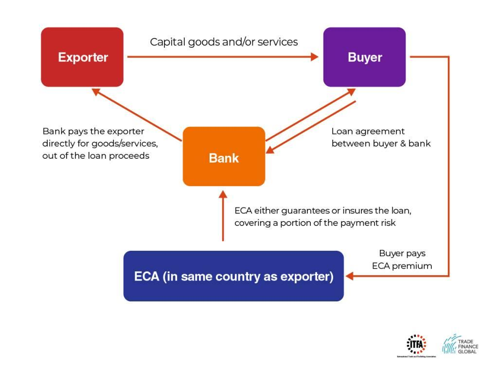

## Table of Contents

## What is an Export Credit Agency (ECA)?

An Export Credit Agency (ECA) is a government-backed organization that helps businesses export goods and services by providing financial support and insurance. This support is important because it reduces the risk for companies when they sell their products to customers in other countries. For example, if a company in the United States wants to sell machinery to a buyer in Brazil, the ECA can help by offering loans or guarantees that make the deal safer for the American company.

ECAs play a key role in promoting international trade. They help companies, especially smaller ones, compete in global markets by offering financial products that private banks might not provide. By doing this, ECAs not only help their own country's exporters but also contribute to economic growth and job creation at home. For instance, if a small business in Canada gets help from an ECA to export its products to Europe, it can grow its business and hire more people in Canada.

## What are the primary functions of an ECA?

An ECA has several important jobs. One big job is to give financial help to companies that want to sell things to other countries. This help can come in the form of loans, guarantees, or insurance. When a company sells something to another country, there's a risk that the buyer might not pay. The ECA steps in to make this risk smaller, which makes companies feel safer about selling abroad.

Another job of an ECA is to make it easier for companies to compete in the global market. This is especially helpful for small businesses that might not have the resources to handle big international deals on their own. By offering support, ECAs help these companies grow and sell more, which can lead to more jobs and a stronger economy at home. So, ECAs not only help businesses but also help the country's economy grow.

## How do ECAs support exporters?

ECAs help exporters by giving them financial support. When a company wants to sell its products to another country, it can be risky because the buyer might not pay. ECAs step in and offer loans, guarantees, or insurance to make this risk smaller. This means the company feels safer about selling abroad because the ECA will help if something goes wrong with the payment.

ECAs also make it easier for companies, especially smaller ones, to compete in the global market. A small business might not have the money or resources to handle big international deals on its own. But with the help of an ECA, these companies can grow their business and sell more products to other countries. This not only helps the company but also creates more jobs and helps the country's economy grow stronger.

## What types of financial products do ECAs offer?

ECAs offer different types of financial products to help companies sell their goods and services abroad. One type of product is loans. When a company wants to sell something to another country, it might need money to make the deal happen. The ECA can give the company a loan to help cover the costs. This makes it easier for the company to do business with customers in other countries.

Another product ECAs offer is guarantees. A guarantee is a promise that the ECA will pay the company if the buyer in another country doesn't pay. This makes the company feel safer about selling abroad because they know the ECA will help if something goes wrong. 

ECAs also provide insurance. This insurance protects the company from risks like the buyer not paying or political problems in the buyer's country. By offering insurance, ECAs make it less scary for companies to sell their products to other countries. This helps companies grow and do more business around the world.

## Can you explain the difference between official ECAs and private ECAs?

Official ECAs are run by the government. They help companies in their own country sell things to other countries. These ECAs use money from the government to give loans, guarantees, and insurance to companies. This makes it safer for companies to sell abroad because the government backs up the deals. Official ECAs focus on helping their country's economy grow by making it easier for companies to do business around the world.

Private ECAs, on the other hand, are run by private companies, not the government. They offer similar financial products like loans, guarantees, and insurance, but they don't have the backing of the government. This means they might charge more for their services because they take on more risk. Private ECAs help companies sell abroad too, but they focus more on making a profit for their own business rather than helping the national economy.

## How do ECAs mitigate risks for exporters?

ECAs help exporters by making the risks of selling to other countries smaller. When a company sells things to another country, there's a chance the buyer might not pay. This can be scary for the company. But ECAs offer insurance that protects the company if the buyer doesn't pay. This way, the company feels safer about selling abroad because the ECA will help if something goes wrong.

ECAs also give loans and guarantees to exporters. A loan helps the company pay for the costs of making the deal happen. A guarantee is a promise that the ECA will pay the company if the buyer in another country doesn't pay. These financial products make it easier for companies to do business with customers in other countries without worrying too much about the risks. By doing this, ECAs help companies grow and sell more, which is good for the country's economy.

## What role do ECAs play in international trade?

ECAs help make international trade easier and safer for companies. When a company wants to sell things to another country, it can be risky because the buyer might not pay. ECAs step in and offer insurance, loans, and guarantees to make these risks smaller. This means the company feels safer about selling abroad because the ECA will help if something goes wrong with the payment.

ECAs also help companies, especially smaller ones, compete in the global market. A small business might not have the money or resources to handle big international deals on its own. But with the help of an ECA, these companies can grow their business and sell more products to other countries. This not only helps the company but also creates more jobs and helps the country's economy grow stronger.

## How are ECAs regulated and what international agreements affect their operations?

ECAs are regulated by their own governments to make sure they follow rules and work well. Each country has its own rules for its ECA, but they all have to follow some international guidelines too. These rules help make sure ECAs are fair and don't cause problems in global trade. For example, the government might check that the ECA is giving loans and insurance in a way that helps the country's economy without being too risky.

There are also international agreements that affect how ECAs work. One important agreement is the OECD Arrangement on Officially Supported Export Credits. This agreement sets rules for ECAs from countries in the OECD, which is a group of mostly rich countries. The rules help make sure that ECAs from different countries don't compete unfairly. They set limits on things like how long loans can be and how much interest can be charged. This helps keep international trade fair and balanced.

## What is the impact of ECAs on developing countries?

ECAs can have a big impact on developing countries. When companies from richer countries want to sell things to a developing country, ECAs help make these deals happen. They offer loans, guarantees, and insurance that make it easier for the companies to do business. This can bring new products and technology to the developing country, which can help it grow. But, there can also be problems. Sometimes, the deals made with help from ECAs can be expensive for the developing country, and they might have to borrow a lot of money. If they can't pay it back, it can cause financial trouble.

On the positive side, ECAs can help developing countries build important things like roads, hospitals, and power plants. These projects can create jobs and improve life for people in the country. But, it's important for developing countries to be careful. They need to make sure the deals are fair and that they can pay back the money they borrow. If they don't, they might end up owing a lot of money, which can make it hard for them to grow and develop in the future.

## How do ECAs interact with other financial institutions like banks?

ECAs work closely with banks to help companies sell things to other countries. When a company wants to do a big deal with a buyer in another country, it might need a loan. The bank can give the company the loan, but it might be worried about the risk of the buyer not paying. That's where the ECA comes in. The ECA can offer a guarantee to the bank, promising to pay if the buyer doesn't. This makes the bank feel safer about giving the loan, and the company can go ahead with the deal.

Sometimes, ECAs and banks work together to offer special loans called buyer's credits. In this case, the bank gives a loan directly to the buyer in another country, but the ECA backs up the loan with a guarantee. This helps the buyer get the money they need to buy the products, and it helps the company sell more. By working together, ECAs and banks make it easier for companies to do business around the world.

## What are some case studies or examples of successful ECA interventions?

One good example of an ECA helping a company is when the Export-Import Bank of the United States (EXIM) helped Boeing sell airplanes to a buyer in India. Boeing wanted to sell some airplanes, but it was a big deal and there was a risk that the buyer might not pay. EXIM stepped in and offered a loan to the buyer in India, with a guarantee that if the buyer didn't pay, EXIM would cover the cost. This made the deal safer for Boeing, and they were able to sell the airplanes. This not only helped Boeing but also created jobs in the United States because more airplanes needed to be made.

Another example is when the UK Export Finance (UKEF) helped a small British company sell medical equipment to a hospital in Africa. The company was worried about selling to another country because it was risky. UKEF offered insurance to the company, promising to help if the hospital didn't pay. With this insurance, the company felt safe enough to make the deal. The hospital got the equipment it needed, and the British company was able to grow its business and hire more people. This shows how ECAs can help even small companies do business around the world.

## What are the current trends and future challenges facing ECAs?

ECAs are seeing a few big trends right now. One trend is that they are helping more with green projects. This means they are giving loans and insurance to companies that want to sell things like solar panels or wind turbines to other countries. Another trend is that ECAs are using more digital tools. They are making it easier for companies to apply for help online and using technology to make their work faster and better. ECAs are also working more with other countries' ECAs to help companies do business all over the world.

In the future, ECAs will face some challenges. One big challenge is making sure they help with projects that are good for the environment. As more people care about climate change, ECAs will need to be careful about the kinds of projects they support. Another challenge is dealing with political risks. Sometimes, problems in another country can make it hard for companies to get paid. ECAs will need to find new ways to help companies deal with these risks. Also, as the world changes, ECAs will need to keep up with new technology and find ways to help companies in new industries.

## References & Further Reading

[1]: Posner, R. (2010). ["The Impact of Export Credit Agencies on International Trade."](https://www.innovativehumancapital.com/article/your-title-doesn-t-make-you-a-leader-reframing-leadership-for-organizational-success) Journal of International Trade & Economic Development.

[2]: Wright, D., & Nur, E. (2018). ["Export Credit Agencies and Global Trade Finance."](https://onlinelibrary.wiley.com/doi/10.1111/j.1758-5899.2011.00132.x) Routledge.

[3]: Hull, J. (2012). ["Risk Management and Financial Institutions"](https://www.amazon.com/Management-Financial-Institutions-Wiley-Finance/dp/1119448115) by John C. Hull.

[4]: Narang, R. K. (2013). ["Inside the Black Box: A Simple Guide to Quantitative and High Frequency Trading,"](https://onlinelibrary.wiley.com/doi/book/10.1002/9781118662717) John Wiley & Sons.

[5]: Lyons, R. K. (2001). ["The Microstructure Approach to Exchange Rates."](https://direct.mit.edu/books/monograph/2004/The-Microstructure-Approach-to-Exchange-Rates) MIT Press.