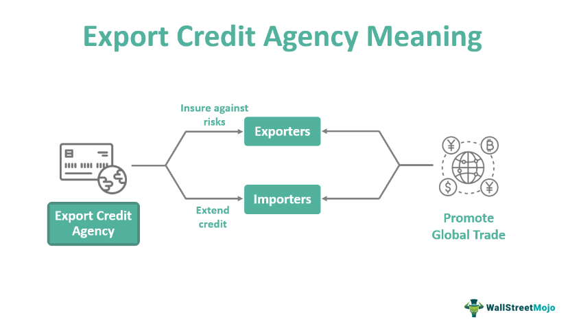

The world of trade finance is continually evolving, with technology playing a pivotal role in shaping its future. Export Credit Agencies (ECAs) are central to facilitating international trade by providing financial backing. These institutions help mitigate the risks associated with cross-border transactions by offering insurance, guarantees, and loans, thus enabling national exporters to compete more effectively in the global marketplace. As the landscape of international trade becomes increasingly complex, ECAs are essential to maintaining the flow of goods and services across borders.

In recent years, another transformative development has emerged within the domain of trade finance: algorithmic trading. This technology leverages computer algorithms to automate trading strategies, bringing significant advantages such as speed, efficiency, and the capacity to process large sets of data. The intersection of algorithmic trading with trade finance presents novel opportunities for enhancing efficiency, reducing errors, and managing risks more effectively.

This article explores the interplay between ECA-backed trade finance and algorithmic trading, focusing on the benefits and challenges presented by this fusion. By understanding these dynamics, businesses can better navigate the complex landscape of global trade finance. The integration of these technologies not only promises improvements in processing speed and accuracy but also in managing market volatility and currency fluctuations. As these fields converge, it creates a pathway toward more innovative and resilient financial operations, enabling businesses to maintain a competitive edge in the ever-evolving global market.

## Table of Contents

## Understanding Export Credit Agencies (ECAs)

Export Credit Agencies (ECAs) are pivotal entities in the international trade ecosystem, primarily serving to mitigate the inherent risks associated with cross-border transactions. These public institutions facilitate trade by offering a range of financial products that ensure businesses have access to the necessary capital and risk mitigation tools required for international trading operations.

ECAs offer a variety of financial instruments such as insurance and guarantees that cover the risks of non-payment by foreign buyers, as well as political risks, including expropriation and currency inconvertibility. For instance, an ECA might provide insurance to an exporter against the risk of a foreign buyer defaulting on payment. Furthermore, ECAs often supply direct financing in the form of loans to foreign buyers purchasing goods and services from national exporters, thereby enhancing the competitiveness of these exporters in global markets.

To comprehend the operational mechanisms of ECAs, one can examine their processes and services in detail. Typically, an ECA conducts a thorough risk assessment of the export transaction, evaluating both the creditworthiness of the foreign buyer and the political and economic stability of the buyer's country. Upon satisfactory assessment, the ECA then provides insurance or a guarantee, which may cover up to 95% of the transaction value, safeguarding the exporter against potential losses.

The benefits provided by ECAs are manifold for both exporters and importers. For exporters, ECAs reduce the financial risks associated with international sales, enable access to financing that might otherwise be unavailable, and enhance credibility with international clients. This assistance is crucial for businesses, particularly small and medium-sized enterprises (SMEs), which may lack the resources to independently manage export risks. For importers, the availability of ECA-backed financing can facilitate larger purchases and potentially improve payment terms. This dynamic not only supports individual businesses but also fosters broader economic growth by increasing trade flows.

In summary, Export Credit Agencies (ECAs) are essential to the operation of global trade, offering instruments to manage financial risks and supporting the expansion of national exporters into competitive international markets. Their services are instrumental in overcoming barriers to trade, thus empowering businesses to engage in international commerce with increased confidence and security.

## Overview of Trade Finance

Trade finance encompasses a range of financial products and instruments designed to assist companies in managing the complexities of international trade. It provides the financial lubrication necessary for the smooth flow of goods and services across borders.

One of the fundamental components of trade finance is the letter of credit (LC), a guarantee from a bank that a buyer's payment to a seller will be received on time and for the correct amount. Should the buyer be unable to make a payment, the bank covers the amount. This instrument reduces the risk for exporters by ensuring they receive payment once specific conditions are met, typically the delivery of goods.

Factoring is another component in which a company sells its accounts receivable to a third party at a discount. This practice provides companies with immediate cash flow, enhancing their working capital. Forfaiting similarly involves the purchase of receivables, but it is specifically focused on medium to long-term international trade transactions and usually involves the buying of receivables without recourse to the exporter.

Key stakeholders in trade finance include exporters, who require assurance of payment for their goods; importers, who seek financing to purchase goods; bankers, who provide the necessary financial products and guarantee transactions; and insurers, who offer credit insurance to mitigate risks associated with trade transactions.

Trade finance, by reducing risk and improving transaction efficiency, plays a crucial role in promoting international trade and economic growth. It enables companies to manage and allocate risks while ensuring [liquidity](/wiki/liquidity-risk-premium), which stimulates global trade flows. This, in turn, contributes to the growth of economies by facilitating the efficient distribution of resources and increasing market opportunities for businesses.

However, trade finance faces several challenges. Regulatory hurdles, resulting from varying international trade laws and compliance requirements, complicate the landscape for stakeholders. Additionally, effective risk management is crucial due to the intricate nature of international transactions and market [volatility](/wiki/volatility-trading-strategies). Companies must navigate these challenges to fully leverage the benefits of trade finance in the ever-evolving global market.

 to Algorithmic Trading

Algorithmic trading involves the utilization of computer algorithms to automate and execute trading strategies, often at speeds and efficiencies unattainable by human traders. By leveraging complex mathematical models and sophisticated technology, [algorithmic trading](/wiki/algorithmic-trading) systems can process vast amounts of market data and execute trades based on predefined criteria. This automated approach can occur in microseconds, offering significant advantages in markets where timing is critical.

One primary advantage of algorithmic trading is its speed. With the ability to monitor multiple markets and instruments simultaneously, these systems can respond to market movements with minimal latency. This speed ensures traders can capitalize on short-lived opportunities that arise due to market fluctuations. Furthermore, algorithmic trading improves efficiency by minimizing human intervention, which reduces emotional trading and human errors.

Algorithmic trading has seen a notable increase in adoption across various financial markets, such as equities and foreign exchange ([forex](/wiki/forex-system)). In the equities market, algorithms can execute large-[volume](/wiki/volume-trading-strategy) trades while minimizing market impact through tactics like slicing a large order into smaller ones, thus avoiding significant price movements. In forex, the ability to analyze multi-source data swiftly and execute cross-currency [arbitrage](/wiki/arbitrage) strategies exemplifies its strategic application.

In trade finance, algorithmic trading can play an influential role by optimizing operations and reducing transactional inefficiencies. For instance, algorithms can be utilized to manage foreign exchange risks by automatically hedging currency exposure in global transactions. This potential to streamline operations can lead to lower costs and improved decision-making accuracy in trade finance transactions.

Despite its advantages, algorithmic trading does present challenges. Cybersecurity is a critical concern, as the increased digitalization and automation of trading increase the vulnerability to cyberattacks. Protective measures must be robust to safeguard sensitive financial data and transaction integrity. Additionally, algorithmic trading can lead to unintended consequences, such as flash crashes, where rapid trading algorithms exacerbate market volatility. Ensuring algorithms operate within safe parameters requires continuous monitoring and a blend of human oversight alongside automated systems. 

Understanding these facets of algorithmic trading and incorporating them into trade finance can discernibly enhance the efficiency and security of financial operations, fostering a more fortified framework for international trade.

## The Intersection of ECA Trade Finance and Algo Trading

Algorithmic trading has emerged as a powerful tool that can significantly enhance the operations of Export Credit Agency (ECA)-backed trade finance. By employing sophisticated algorithms, financial institutions can streamline processes, mitigate risks, and improve the efficiency of trade finance services.

One of the primary applications of algorithmic trading in ECA-backed trade finance is in the management of foreign exchange risks. ECAs often deal with multiple currencies, and fluctuations in exchange rates can pose significant financial risks. Algorithms can be programmed to monitor forex markets continuously and automatically execute trades to hedge against unfavorable currency movements. For instance, if an ECA-backed transaction involves payment in a foreign currency, an algorithm can dynamically adjust the hedging strategy to optimize costs and minimize exposure to currency volatility.

Algorithmic trading also enhances decision-making and risk assessment in ECA-backed deals. Advanced models can analyze historical data and market trends to predict potential risks. These models enable ECAs to make informed decisions quickly, such as setting appropriate risk premiums or determining credit limits for exporters. For example, [machine learning](/wiki/machine-learning) algorithms can evaluate the probability of default by factoring in various economic indicators, past transaction histories, and global trade patterns.

The potential for increased accuracy and efficiency in executing trade finance agreements is another advantage of incorporating algorithmic trading into ECA operations. Automated systems can process vast amounts of transaction data rapidly, ensuring that trade finance agreements are executed with precision. This capability reduces the likelihood of errors and accelerates transaction completion times. Automation allows for the consistent application of underwriting standards and reduces processing bottlenecks.

Real-world implementations of algorithmic trading in ECA finance illustrate the tangible benefits of this integration. Some financial institutions have successfully deployed algorithms to manage credit exposure and optimize funding costs for ECA-backed transactions. For example, JPMorgan Chase has used algorithmic strategies to enhance its trade finance operations by improving credit assessment accuracy and optimizing its currency hedging processes.

In conclusion, by leveraging algorithmic trading, ECAs can enhance their trade finance operations through superior risk management, improved decision-making, and efficient execution of transactions. As financial technologies evolve, the synergy between ECAs and algorithmic trading is expected to expand, offering new solutions for the complexities of international trade finance.

## Benefits of Integrating Algo Trading with ECA Finance

Integrating algorithmic trading with Export Credit Agency (ECA) finance offers a range of benefits, significantly advancing the efficiency and accuracy of trade finance operations. One primary advantage is the improvement in processing speed and transaction efficiency. Algorithmic trading systems can execute complex financial transactions at a scale and speed that surpasses human capabilities, ensuring that trade finance activities are completed swiftly and accurately. By automating routine tasks, these systems minimize the time required for processing transactions, allowing businesses to expedite their trade finance activities.

The use of algorithmic trading also contributes to a decrease in human error and a reduction in operational risks. Algorithms operate based on predefined rules and parameters, which reduces the likelihood of mistakes that can arise from manual data entry or decision-making processes. This precision enhances the reliability of trade finance operations, offering firms greater confidence in the accuracy of their financial transactions.

Another significant benefit is the enhanced ability to manage market volatility and currency exchange fluctuations. Algorithmic trading systems are capable of analyzing vast amounts of market data in real time, allowing them to respond to fluctuations in currency values and market conditions rapidly. This capability is particularly valuable in the context of ECA-backed transactions, where foreign exchange risks can be substantial. By employing algorithmic models, businesses can better hedge against such risks, ensuring more stable and predictable financial outcomes.

Automating the monitoring and management of trade finance portfolios is another advantage of integrating algorithmic trading with ECA finance. Algorithms can continuously track a wide range of financial metrics and indicators, enabling businesses to maintain an up-to-date view of their trade finance positions. This real-time insight facilitates timely decision-making and portfolio adjustments, ensuring optimal performance of financial assets.

Finally, the integration of algorithmic trading with ECA finance can help break down trade barriers through innovative financial technologies. By leveraging advanced algorithms, businesses can overcome traditional obstacles in international trade, such as inefficient payment processes and complex regulatory compliance. This innovation not only streamlines operations but also facilitates greater access to international markets, promoting broader participation in global trade networks.

## Challenges and Considerations

Addressing the technological and regulatory challenges in merging algorithmic trading with Export Credit Agency (ECA) trade finance requires concerted efforts and careful planning.

One primary concern is the cybersecurity threats associated with increased digital transactions. As algorithmic trading relies heavily on internet-based platforms and technology, it opens up the risk of cyber-attacks, which can disrupt operations, compromise sensitive data, and cause significant financial losses. To mitigate these risks, deploying robust encryption protocols, regular security audits, and real-time threat monitoring systems is essential. A secure architecture must be designed to protect both the data and the underlying trading algorithms from unauthorized access.

Navigating the regulatory landscape is another critical challenge. Different jurisdictions impose varying rules regarding algorithmic trading and ECA finance. Ensuring compliance with international laws demands a comprehensive understanding of each regulatory environment. Market participants must adhere to the Basel III requirements and adhere to anti-money laundering (AML) and know-your-customer (KYC) regulations. This compliance ensures the integrity and transparency of transactions, fostering trust among stakeholders.

There is also a pressing need for skilled professionals capable of managing complex trading algorithms. The integration of algorithmic trading with ECA finance involves sophisticated data analysis and strategic decision-making, necessitating expertise in finance, programming, and data science. These professionals must be adept at designing, implementing, and fine-tuning algorithms to adapt to evolving market conditions. Educational programs and training initiatives must focus on developing a workforce equipped with these interdisciplinary skills.

Furthermore, the balance between automation and human oversight remains a significant consideration. While algorithmic trading enhances efficiency, it lacks the nuanced understanding of context and judgment that human input provides. Establishing a framework where algorithms handle routine tasks while humans oversee critical decision-making processes is crucial. This can be achieved by incorporating human-in-the-loop (HITL) systems, which allow humans to intervene and calibrate trading algorithms based on contextual judgment.

In summary, while the fusion of algorithmic trading with ECA-backed trade finance presents notable advantages, it also comes with significant challenges that must be strategically managed. Addressing these challenges involves strengthening cybersecurity measures, adhering to complex regulatory requirements, fostering the necessary talent pool, and ensuring an optimal balance between automated and human-driven processes.

## Conclusion

The integration of algorithmic trading into ECA-backed trade finance marks a significant transformation in the field, blending the robustness of traditional financial support mechanisms with the precision and speed of modern technology. This integration offers substantial benefits, such as enhanced efficiencies in transaction processing and a marked reduction in operational risks. By automating complex financial evaluations and transactions, algorithmic trading reduces the possibility of human error, thereby fostering a more reliable and efficient trade finance environment.

As financial technologies continue to evolve rapidly, it remains essential for stakeholders—ranging from exporters and importers to financial institutions and regulators—to remain informed and flexible. This adaptability is crucial to navigating the emerging landscape, where new tools and methodologies may redefine industry standards regularly.

Businesses poised to adopt these technological advancements can significantly enhance their competitive position in global markets. The ability to swiftly respond to market changes and manage financial risks more effectively offers a strategic advantage that can lead to increased market share and profitability.

In conclusion, the future of trade finance is contingent on the effective fusion of established financial practices with state-of-the-art technologies. This convergence promises not only to streamline processes but also to open up new opportunities for innovation and growth in international trade, thus setting a new paradigm for trade finance globally.

## References & Further Reading

[1]: Posner, R. (2010). ["The Impact of Export Credit Agencies on International Trade."](https://www.innovativehumancapital.com/article/your-title-doesn-t-make-you-a-leader-reframing-leadership-for-organizational-success) Journal of International Trade & Economic Development.

[2]: Wright, D., & Nur, E. (2018). ["Export Credit Agencies and Global Trade Finance."](https://onlinelibrary.wiley.com/doi/10.1111/j.1758-5899.2011.00132.x) Routledge.

[3]: Hull, J. (2012). ["Risk Management and Financial Institutions"](https://www.amazon.com/Management-Financial-Institutions-Wiley-Finance/dp/1119448115) by John C. Hull.

[4]: Narang, R. K. (2013). ["Inside the Black Box: A Simple Guide to Quantitative and High Frequency Trading,"](https://onlinelibrary.wiley.com/doi/book/10.1002/9781118662717) John Wiley & Sons.

[5]: Lyons, R. K. (2001). ["The Microstructure Approach to Exchange Rates."](https://direct.mit.edu/books/monograph/2004/The-Microstructure-Approach-to-Exchange-Rates) MIT Press.