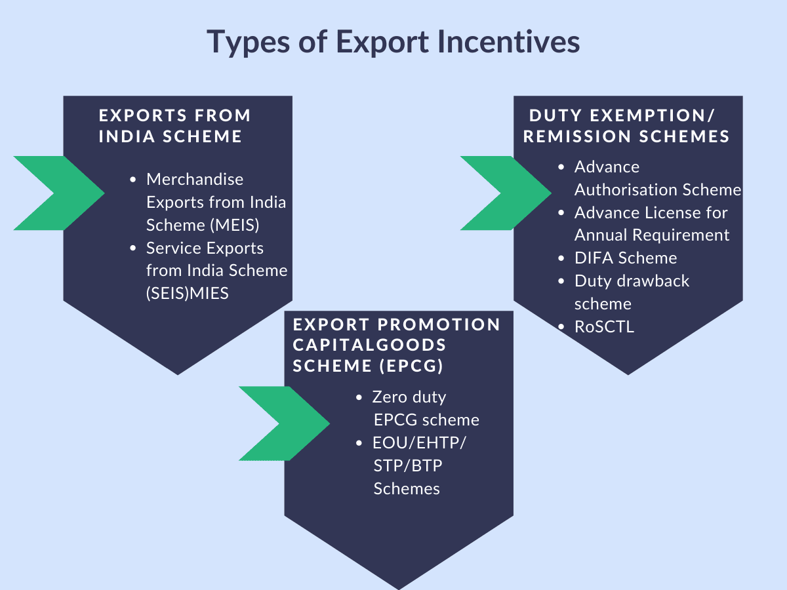

## Table of Contents

## What are export incentives?

Export incentives are benefits that governments give to companies to encourage them to sell their products or services to other countries. These incentives can help businesses grow by making it easier and cheaper to export. They might include tax breaks, subsidies, or special loans. By offering these benefits, governments hope to boost their country's economy by increasing the amount of goods and services sold abroad.

These incentives are important because they can help smaller businesses compete in the global market. Without them, it might be too expensive or risky for these companies to start exporting. For example, a small business might get a tax break that allows them to invest more in marketing their products overseas. This can lead to more jobs and a stronger economy at home. Overall, export incentives are a way for governments to support their businesses and help them succeed on the world stage.

## Why are export incentives important for businesses?

Export incentives are important for businesses because they help them sell their products or services to other countries more easily. These incentives can lower the costs of exporting, like giving tax breaks or subsidies. This means businesses can spend less money to reach new customers in different countries. For small businesses, this can make a big difference because they might not have a lot of money to spend on exporting.

By using export incentives, businesses can grow and become more competitive in the global market. When businesses export more, they can make more money and create more jobs at home. This is good for the economy because it helps businesses get bigger and stronger. Overall, export incentives are a way for governments to help their businesses succeed and grow by making it easier for them to sell things to other countries.

## What are the different types of export incentives?

Export incentives can come in many forms. One type is tax breaks, which means businesses pay less in taxes when they export their products. This can save them a lot of money, making it easier to sell things in other countries. Another type is subsidies, which are like gifts of money from the government to help businesses with the costs of exporting. Governments might also offer special loans with low interest rates, so businesses can borrow money more easily to expand their exports.

There are also incentives like duty drawback, where businesses get back the taxes they paid on materials used to make products for export. This makes it cheaper to produce things that will be sold overseas. Governments might also help with marketing and promotion, giving businesses money to advertise their products in other countries. All these different types of incentives help businesses sell more abroad and grow bigger.

## How do export incentives benefit the economy?

Export incentives help the economy by making it easier for businesses to sell their products to other countries. When businesses get tax breaks or subsidies, they can spend less money on exporting. This means they can sell more products abroad, which can lead to more jobs at home. When more people have jobs, they can spend more money, helping the whole economy grow.

These incentives also make businesses more competitive in the global market. When businesses can compete better, they can grow bigger and stronger. A stronger business sector means a stronger economy. Plus, when businesses export more, the country earns more money from other countries. This can help the country's currency become stronger and make the economy more stable. Overall, export incentives are a way to boost the economy by helping businesses succeed on the world stage.

## Can you explain duty drawback as an export incentive?

Duty drawback is a type of export incentive where businesses get back the taxes they paid on materials used to make products for export. Imagine a company buys materials to make a product, and they have to pay taxes on those materials. If they then sell that product to another country, the government will give them back the money they paid in taxes. This makes it cheaper for the company to produce things for export.

By getting this money back, businesses can lower their costs and make more money when they sell their products overseas. This incentive helps them compete better in the global market because they don't have to pay as much to make their products. Overall, duty drawback helps businesses grow by making exporting more affordable and encouraging them to sell more to other countries.

## What is the role of tax exemptions in export incentives?

Tax exemptions are a big part of export incentives. They help businesses by letting them pay less in taxes when they sell their products to other countries. This means the businesses can keep more of the money they make from exporting. It's like getting a discount on their taxes, which makes it easier and cheaper for them to sell things abroad.

When businesses get these tax exemptions, they can use the extra money to grow their business. They might spend it on making more products, advertising in other countries, or even hiring more people. This helps the business get bigger and can lead to more jobs at home. In the end, tax exemptions help the whole economy by making it easier for businesses to export and grow.

## How do export credit guarantees work?

Export credit guarantees are a type of export incentive that help businesses sell their products to other countries. They work like a safety net for businesses. When a business sells something to another country, there is always a risk that the buyer might not pay. An export credit guarantee means the government promises to pay the business if the buyer doesn't. This makes businesses feel safer about selling to other countries because they know they won't lose money if something goes wrong.

By offering these guarantees, the government helps businesses take on more risks and sell more abroad. This can help businesses grow because they can reach more customers in different countries. When businesses export more, they can make more money and create more jobs at home. This is good for the whole economy because it helps businesses become bigger and stronger.

## What are the eligibility criteria for businesses to avail export incentives?

To get export incentives, businesses usually need to meet certain rules set by the government. These rules can be different depending on the country and the type of incentive. Generally, a business needs to be involved in exporting goods or services. They might also need to show that they have been exporting for a certain amount of time or that they meet specific financial standards. For example, they might need to have a certain amount of money coming in from exports each year.

Some incentives might also have special requirements. For example, a business might need to use a certain percentage of local materials in their products, or they might need to export to certain countries. Governments often want to make sure that the incentives help the right businesses, so they set these rules to make sure the incentives are used in the best way. By meeting these criteria, businesses can get help to grow and sell more to other countries.

## How do export processing zones function as an incentive?

Export processing zones are special areas where businesses can make things and then sell them to other countries more easily. In these zones, businesses get special rules that make it cheaper and easier to export. They might not have to pay as much in taxes, and they might get help with things like electricity and water. This makes it a good place for businesses to set up factories and start selling things abroad.

These zones help the economy because they bring in more jobs and money. When businesses set up in these zones, they often hire more people from the local area. This means more people have jobs, and they can spend more money in the community. Also, when businesses in the zones sell more things to other countries, the country makes more money from exports. This can help the whole economy grow and become stronger.

## What are the international regulations governing export incentives?

There are rules set by the World Trade Organization (WTO) that countries need to follow when they give export incentives. These rules are meant to make sure that all countries play fair and don't use incentives to hurt other countries' businesses. The main rule is that countries should not give too many incentives that make it hard for other countries to compete. This is called the Agreement on Subsidies and Countervailing Measures. If a country gives too many incentives, other countries can complain to the WTO and ask for them to be stopped.

The WTO also has special rules for developing countries. These countries can give more export incentives to help their businesses grow. But even these countries need to be careful not to give too much help, or other countries might still complain. The goal is to help all countries trade fairly and grow their economies without hurting each other. By following these rules, countries can use export incentives to help their businesses, but they need to make sure they are not breaking the rules set by the WTO.

## How can a business apply for export incentives?

A business can apply for export incentives by first finding out what incentives their government offers. They can do this by checking the government's website or talking to a trade office. Once they know what incentives are available, they need to see if they meet the rules to get them. This might mean filling out forms and showing that they are really exporting things. Sometimes, they might need to give proof of how much they are exporting or what they are making.

After making sure they meet the rules, the business can apply for the incentives. This usually means filling out an application form and sending it to the right government office. They might need to include documents like their export records or financial statements. It's important to follow all the steps carefully and send everything on time. If the application is approved, the business will start getting the benefits, like tax breaks or subsidies, which can help them grow and sell more things to other countries.

## What are the potential drawbacks or challenges associated with export incentives?

Export incentives can help businesses grow, but they also come with some problems. One big challenge is that they can be hard to get. Businesses need to follow a lot of rules and fill out many forms to apply for them. This can take a lot of time and money. Sometimes, small businesses might not have the resources to do all this, so they miss out on the help they need.

Another problem is that export incentives can cause unfair competition. If one country gives too many incentives, it can make it hard for businesses in other countries to compete. This can lead to fights between countries at places like the World Trade Organization. Also, if businesses rely too much on incentives, they might not be able to make money without them. This can be risky if the government decides to stop the incentives in the future.

## What are the benefits of understanding trade?

Trade benefits are critical economic advantages that businesses and economies gain by participating in international commerce. These benefits are multifaceted, encompassing several key areas such as increased market access, diversification, and the ability to exploit comparative advantages.

Increased market access is a primary benefit, as it allows businesses to reach a broader customer base beyond their domestic borders. By engaging with international markets, companies can expand their sales potential and increase revenue streams. This expansion often leads to economies of scale, where the cost per unit decreases as production increases, thereby boosting profitability.

Diversification is another significant advantage. By tapping into multiple markets, businesses can mitigate risks associated with economic downturns or demand fluctuations in a single market. This strategic diversification ensures more stable and predictable cash flows, providing resilience against market [volatility](/wiki/volatility-trading-strategies).

The concept of comparative advantage further underlines the benefits of international trade. Comparative advantage, first introduced by economist David Ricardo, suggests that countries and businesses should specialize in producing goods and services where they have a lower opportunity cost compared to others. By leveraging their unique strengths, such as technology proficiency or abundant natural resources, they can produce certain goods more efficiently than their trading partners.

Mathematically, comparative advantage can be expressed using opportunity costs. If a country is more efficient in producing good A than good B relative to another country, even if the other country is more efficient in producing both goods, there is still potential for beneficial trade. The formula representing opportunity cost in terms of labor hours could be:

$$
\text{Opportunity Cost of Good A} = \frac{\text{Labor Hours for Good A}}{\text{Labor Hours for Good B}}
$$

By focusing on goods with lower opportunity costs, businesses and economies can maximize efficiency and trade these goods for others that would be more costly to produce domestically.

Engaging in international commerce leads to improved profitability and competitive positioning for businesses. Access to a diverse range of markets allows companies to capitalize on different consumer preferences and increase their bargaining power. Furthermore, the ability to source inputs more cost-effectively from multiple countries can reduce production costs and enhance product quality.

In summary, the benefits of international trade are clear-cut: they provide businesses with opportunities to expand their reach, stabilize revenues through diversification, and harness comparative advantages for superior market positioning. These economic advantages drive global competitiveness and contribute significantly to economic growth.

## References & Further Reading

[1]: Bergstra, J., Bardenet, R., Bengio, Y., & Kégl, B. (2011). ["Algorithms for Hyper-Parameter Optimization."](https://papers.nips.cc/paper/4443-algorithms-for-hyper-parameter-optimization) Advances in Neural Information Processing Systems 24.

[2]: ["Advances in Financial Machine Learning"](https://www.amazon.com/Advances-Financial-Machine-Learning-Marcos/dp/1119482089) by Marcos Lopez de Prado

[3]: ["Evidence-Based Technical Analysis: Applying the Scientific Method and Statistical Inference to Trading Signals"](https://www.amazon.com/Evidence-Based-Technical-Analysis-Scientific-Statistical/dp/0470008741) by David Aronson

[4]: ["Machine Learning for Algorithmic Trading"](https://github.com/stefan-jansen/machine-learning-for-trading) by Stefan Jansen

[5]: ["Quantitative Trading: How to Build Your Own Algorithmic Trading Business"](https://www.amazon.com/Quantitative-Trading-Build-Algorithmic-Business/dp/1119800064) by Ernest P. Chan