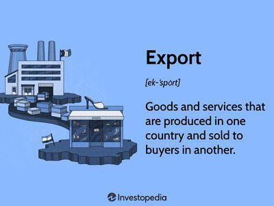

In today's global economy, trade benefits, export incentives, and incentive programs are essential elements that significantly enhance international trade. Trade benefits encompass a range of economic advantages that arise from engaging in global commerce, such as access to larger markets, increased competitiveness, and the exploitation of comparative advantages. These benefits enable businesses to reach new customers and diversify their operations, thereby improving profitability and stability.

Export incentives, typically provided by governments, aim to encourage companies to expand their sales into international markets. These incentives can include measures like subsidies, tax exemptions, and financial assistance, which help businesses overcome hurdles associated with exporting, such as high costs and complex regulations. By providing these incentives, governments support local industries in establishing a foothold in global markets.



In addition to these traditional mechanisms, algorithmic trading, commonly referred to as algo trading, is revolutionizing how businesses interact with financial markets. Algo trading involves the use of sophisticated algorithms to automate and optimize the execution of trades based on set criteria. This technological advancement offers unprecedented speed and efficiency, reducing response times and minimizing human error in trading operations. By integrating these algorithms, businesses can leverage rapid market changes and make informed decisions that align with government-provided export incentives.

This article examines the critical role of trade benefits, export incentives, and algorithmic trading in contemporary commerce. It highlights how these components work together to facilitate economic growth by promoting international trade and attracting investment. As businesses embrace these programs and technologies, they are better positioned to thrive in the dynamic global market, fostering innovation and contributing to overall economic development.

## Table of Contents

## Understanding Trade Benefits

Trade benefits are critical economic advantages that businesses and economies gain by participating in international commerce. These benefits are multifaceted, encompassing several key areas such as increased market access, diversification, and the ability to exploit comparative advantages.

Increased market access is a primary benefit, as it allows businesses to reach a broader customer base beyond their domestic borders. By engaging with international markets, companies can expand their sales potential and increase revenue streams. This expansion often leads to economies of scale, where the cost per unit decreases as production increases, thereby boosting profitability.

Diversification is another significant advantage. By tapping into multiple markets, businesses can mitigate risks associated with economic downturns or demand fluctuations in a single market. This strategic diversification ensures more stable and predictable cash flows, providing resilience against market [volatility](/wiki/volatility-trading-strategies).

The concept of comparative advantage further underlines the benefits of international trade. Comparative advantage, first introduced by economist David Ricardo, suggests that countries and businesses should specialize in producing goods and services where they have a lower opportunity cost compared to others. By leveraging their unique strengths, such as technology proficiency or abundant natural resources, they can produce certain goods more efficiently than their trading partners.

Mathematically, comparative advantage can be expressed using opportunity costs. If a country is more efficient in producing good A than good B relative to another country, even if the other country is more efficient in producing both goods, there is still potential for beneficial trade. The formula representing opportunity cost in terms of labor hours could be:

$$
\text{Opportunity Cost of Good A} = \frac{\text{Labor Hours for Good A}}{\text{Labor Hours for Good B}}
$$

By focusing on goods with lower opportunity costs, businesses and economies can maximize efficiency and trade these goods for others that would be more costly to produce domestically.

Engaging in international commerce leads to improved profitability and competitive positioning for businesses. Access to a diverse range of markets allows companies to capitalize on different consumer preferences and increase their bargaining power. Furthermore, the ability to source inputs more cost-effectively from multiple countries can reduce production costs and enhance product quality.

In summary, the benefits of international trade are clear-cut: they provide businesses with opportunities to expand their reach, stabilize revenues through diversification, and harness comparative advantages for superior market positioning. These economic advantages drive global competitiveness and contribute significantly to economic growth.

## Exploring Export Incentives

Export incentives are essential tools employed by governments worldwide to stimulate economic growth by encouraging businesses to extend their reach to international markets. These incentives are structured to mitigate the initial costs and challenges that companies face when exporting goods and services, thereby making international trade more accessible and appealing.

Typically, export incentives take several forms, each targeting specific aspects of the export process:

1. **Tax Breaks**: These are reductions or exemptions from certain taxes for companies involved in exporting. By lowering the tax burden, governments make it more financially viable for businesses to compete in foreign markets. Such tax incentives can lead to increased profitability for exporters, encouraging them to maintain or expand their export operations.

2. **Subsidies**: Direct financial support to exporters can significantly impact their ability to compete globally. These subsidies might cover part of the production cost, logistics, or even marketing expenses abroad. This financial assistance makes it easier for businesses to offer competitive pricing in international markets, fostering a more robust presence overseas.

3. **Financial Aid**: Governments may offer export credits and insurance schemes designed to improve the cash flow and reduce the risks associated with exporting. These programs provide companies with necessary financial backing that can make entering new markets less daunting.

Export incentives play a pivotal role in helping local businesses overcome various barriers associated with entering international markets. These barriers might include higher production costs, stricter regulatory standards, and logistical challenges that make foreign markets less accessible. By effectively reducing these obstacles, export incentives are a catalyst for growth, enabling companies to achieve greater economies of scale and enhance their global competitiveness.

Through strategic implementation of export incentives, governments strive to create an environment where domestic businesses can thrive internationally. This not only helps the businesses themselves but also contributes to the broader economic development of the country by increasing exports, generating employment opportunities, and attracting foreign investments.

## Types of Export Incentives

Export incentives are essential mechanisms employed by governments to encourage domestic businesses to venture into international markets. These incentives are crucial for mitigating the various challenges and costs associated with exporting goods and services. Here, we examine the primary types of export incentives, which include export subsidies, tax exemptions, and government-assisted market access.

### Export Subsidies
Export subsidies refer to direct financial support that governments provide to domestic firms to promote their goods and services in foreign markets. These subsidies help reduce the cost burden on exporters, allowing them to offer competitive pricing in international markets. By lowering production costs or enhancing marketing efforts, export subsidies can make domestic products more appealing on the global stage. For example, a government might subsidize transportation costs or reimburse a portion of an exporter’s expenses incurred while entering a new market.

### Tax Exemptions
Tax exemptions are another form of export incentive, designed to lower the cost of exporting by reducing or eliminating certain taxes that exporters might otherwise have to pay. These can include exemptions from sales tax on exported goods or reductions in import duties on raw materials used in the manufacturing of export products. Tax incentives enhance the competitiveness of domestic products by decreasing the overall financial burden on exporters, thus enabling them to allocate more resources towards market expansion and innovation.

### Government-Assisted Market Access
In facilitating international trade, governments often assist domestic businesses in gaining access to new markets. This assistance can take the form of organizing or sponsoring participation in international trade fairs and missions, where businesses can showcase their products to a wider audience. Such platforms not only provide exposure but also facilitate networking opportunities and potential partnerships. Governments may also offer informational and logistical support to aid businesses in understanding and complying with foreign market regulations.

By employing these types of export incentives, governments aim to foster a more conducive environment for exporters, allowing them to overcome barriers to entry and improve their global market presence. These incentives are tailored to specific industry needs and are pivotal in enhancing the international competitiveness of domestic firms.

## The Role of the World Trade Organization

The World Trade Organization (WTO) plays a central role in facilitating international commerce by establishing and enforcing rules that govern global trade. One of its primary responsibilities is to monitor and regulate the use of export incentives to ensure they promote fair competition among its member countries. The WTO's framework is designed to prevent practices that could potentially distort trade or create imbalances in the global market.

Export incentives, often employed by governments to bolster their domestic industries' competitiveness on the international stage, can take various forms such as subsidies, tax breaks, and financial aids. However, the WTO generally prohibits subsidies that can lead to unfair competitive advantages or distortions in international trade. This prohibition is articulated under the Agreement on Subsidies and Countervailing Measures (SCM Agreement), which outlines the types of subsidies and the conditions under which they can be legitimately used.

The WTO distinguishes between prohibited subsidies and those that are permissible under certain conditions. Prohibited subsidies include those contingent upon export performance or the use of domestic over imported goods. However, the WTO recognizes that lesser-developed countries face distinct economic challenges that may necessitate additional support to integrate into global trade networks. As such, under specific circumstances, these countries are afforded greater leeway to employ certain subsidies to stimulate their economic development. This differential treatment is crucial for addressing economic disparities and promoting inclusive growth.

While developed nations are subject to stringent scrutiny regarding their use of subsidies, the WTO's framework provides transitional periods or exceptions for lesser-developed countries. This approach is intended to help these nations build their competitive capacities and enhance their participation in international trade without immediately subjecting them to the same constraints faced by more economically advanced countries.

In summary, the WTO's oversight ensures that export incentives are used ethically and effectively, balancing the need for economic assistance in developing regions with the larger goal of maintaining a fair and equitable international trading system. The organization continues to adapt its guidelines and frameworks to address the evolving landscape of global trade and the varying needs of its diverse membership.

## Incentive Programs Impact on Economic Growth

Incentive programs are crucial mechanisms employed by governments to stimulate economic growth. They achieve this by promoting exports, attracting foreign investments, and generating employment. By offering financial benefits such as tax reductions, subsidies, or grants, these programs reduce operational costs for businesses, enabling them to expand market presence internationally.

Enhancing exports is a primary objective of incentive programs. By making it more financially viable for companies to engage in international trade, governments can increase their country's share in the global market. This boost in exports not only amplifies the country's economic output but also diversifies revenue streams, which can fortify economies against domestic market volatility.

Foreign investments are another growth accelerant influenced by these programs. By presenting a welcoming economic environment, characterized by reduced taxes or financial aid, countries can attract multinational corporations seeking to establish operations. These corporations bring capital, enhance local industry standards, and often provide technology transfers, contributing significantly to the host country's economic infrastructure and workforce skill level.

Furthermore, incentive programs are instrumental in job creation. As businesses expand due to eased financial pressures, they require additional human resources, thereby providing new employment opportunities. This boom in job availability has a multiplier effect on the economy: increased employment leads to higher disposable incomes, which, in turn, stimulate further economic activities through heightened consumer spending.

To illustrate, consider the case of a country implementing a subsidy for technology exports. As a result, local tech firms might increase production and offer more competitive pricing internationally. The increased demand for their products could lead them to hire more workers, thus reducing unemployment and boosting local consumption of goods and services.

Overall, incentive programs serve to create a conducive environment for economic expansion beyond local markets, facilitating broader participation in international commerce and fostering a resilient and robust economic landscape.

 to Algorithmic Trading

Algorithmic trading, commonly referred to as algo trading, is a method of executing trades using automated and pre-programmed trading instructions. These instructions account for variables such as timing, price, and [volume](/wiki/volume-trading-strategy). The primary advantage of [algorithmic trading](/wiki/algorithmic-trading) is its ability to systematically process large volumes of trading data and execute orders at a speed and frequency impossible for human traders.

Algorithmic trading offers several significant benefits. First, it enhances precision by eliminating the kind of human errors that can occur during manual trading. For instance, algorithms can be designed to continually scan multiple markets and execute trades if certain conditions are met, ensuring that orders are precise and consistent. Moreover, the speed of algo trading is unparalleled; trades can be executed in milliseconds, allowing traders to capitalize on fleeting market opportunities and execute high-frequency trading strategies effectively.

Another crucial feature of algorithmic trading is its capability for back-testing strategies across historical market data. Traders can rigorously test the viability and performance of their algorithms against past data to refine and optimize their strategies. This process involves feeding historical data into the trading algorithms and evaluating their performance as if the algorithms had been operating in real-time. For example, traders can implement a strategy using Python as follows:

```python
import backtrader as bt

class MyStrategy(bt.Strategy):
    def __init__(self):
        self.sma = bt.indicators.SimpleMovingAverage(self.data.close, period=15)

    def next(self):
        if not self.position:  # not in the market
            if self.data.close[0] > self.sma[0]:
                self.buy()
        elif self.data.close[0] < self.sma[0]:
            self.sell()

data = bt.feeds.YahooFinanceData(dataname='AAPL',
                                 fromdate=datetime.datetime(2020, 1, 1),
                                 todate=datetime.datetime(2021, 1, 1))

cerebro = bt.Cerebro()
cerebro.adddata(data)
cerebro.addstrategy(MyStrategy)
cerebro.run()
```

This sample code uses the Backtrader library to test a simple moving average strategy. It checks if the current close price is above the moving average to make a buy decision, and if it is below, it triggers a sell. Such testing ensures that strategic decisions are based on sound data and analyses rather than gut feelings. 

Overall, algorithmic trading integrates technology with financial strategies, offering efficiency that supports greater integration and [liquidity](/wiki/liquidity-risk-premium) in global financial markets.

## Benefits of Algorithmic Trading in Commerce

Algorithmic trading, commonly referred to as algo trading, leverages advanced computer algorithms to automatically and efficiently execute trading orders. This technological advancement plays a pivotal role in enhancing market efficiency, minimizing decision-making errors, and supporting seamless global market integration.

One of the primary benefits of algorithmic trading is the speed and accuracy with which trades are executed. By using predefined criteria and sophisticated mathematical models, algorithms can process vast amounts of market data in real time. This capability allows traders to capitalize on fleeting market opportunities that would otherwise be missed through manual trading methods. The rapid execution helps in reducing transaction costs and slippage, thereby improving overall market efficiency. It enhances liquidity by ensuring that buy and sell orders are matched more swiftly and accurately, contributing to tighter spreads and fairer pricing in the marketplace.

Moreover, algorithmic trading significantly minimizes human error and emotional influences that can cloud judgment during trading processes. Traditional trading involves significant human intervention, which can be prone to errors and delays, especially in volatile market conditions. Emotions such as fear and greed can drive irrational decision-making, leading to suboptimal trades. By automating trading decisions based on unemotional and quantitative data analysis, algorithmic trading reduces these psychological biases and errors, allowing for more consistent and objective trading outcomes.

In addition to improving individual trade executions, algorithmic trading supports the broader integration of global markets. The capacity of algorithms to handle high-frequency trading across multiple platforms and time zones facilitates the processing of large volumes of transactions seamlessly. This ability underscores the importance of robust infrastructure that enables the connectivity of markets worldwide. It ensures that information dissemination and trade execution occur expediently across different geographical regions, promoting a more interconnected and resilient global financial ecosystem.

The programming aspect of algorithmic trading further aids in its effectiveness. For instance, using Python, traders can employ libraries such as NumPy and pandas for data analysis, while trader-execution platforms can leverage APIs to implement and backtest trading strategies. An illustrative example in Python might look like:

```python
import numpy as np
import pandas as pd

def moving_average_strategy(prices, short_window=40, long_window=100):
    signals = pd.DataFrame(index=prices.index)
    signals['signal'] = 0.0

    signals['short_mavg'] = prices.rolling(window=short_window, min_periods=1, center=False).mean()
    signals['long_mavg'] = prices.rolling(window=long_window, min_periods=1, center=False).mean()

    signals['signal'][short_window:] = np.where(signals['short_mavg'][short_window:] > signals['long_mavg'][short_window:], 1.0, 0.0)  
    signals['positions'] = signals['signal'].diff()

    return signals
```

In this code snippet, a basic moving average crossover strategy is employed, where signals are generated based on whether a short-term moving average surpasses a longer-term moving average, indicating potential buying opportunities.

In summary, algorithmic trading enhances market efficiency, reduces human error, and facilitates global market integration by processing vast transaction volumes. Its reliance on data-driven strategies offers a more disciplined approach to trading, aligning with the demands of modern commerce.

## How Algo Trading Integrates with Trade Incentives

Algorithmic trading, often known as algo trading, plays a pivotal role in maximizing the financial advantages derived from export incentives. As global markets become increasingly interconnected, the capacity to react swiftly to economic changes is crucial. Algo trading offers this capability by leveraging sophisticated computer algorithms to execute trades based on predefined criteria, thus integrating efficiently with trade incentive structures.

For businesses benefiting from export incentives, algo trading facilitates the optimization of these financial benefits. Companies can utilize algorithms to swiftly adjust their trade strategies in response to fluctuations in economic conditions or changes in incentive programs. This rapid adaptability is achieved through algorithmic mechanisms that continuously monitor market indicators, enabling timely decision-making in trading processes.

A practical example can be illustrated with a Python-based approach. Consider a scenario where a company wants to optimize its trading strategy in alignment with government incentives. By employing [machine learning](/wiki/machine-learning) models and real-time data analytics, the company can develop an algorithm predicting the most favorable trading conditions. 

```python
import numpy as np
from sklearn.ensemble import RandomForestRegressor

# Historical data of market indicators and export incentives
market_data = np.array([...])
incentives_data = np.array([...])

# Combine market and incentives data
features = np.hstack((market_data, incentives_data))

# Target variable: measure of financial benefits (e.g., profit margins)
financial_benefits = np.array([...])

# Train the model
model = RandomForestRegressor()
model.fit(features, financial_benefits)

# Predictive analysis for optimal trading strategy
predicted_benefits = model.predict(features)
```

In this code snippet, a Random Forest Regressor is utilized to model the relationship between market conditions, export incentives, and financial outcomes. The algorithm can be continually refined with new data to ensure the trading strategy remains optimal as market and incentive conditions evolve.

Furthermore, algo trading minimizes human errors and reduces the potential for emotion-driven decisions, enhancing the effectiveness of export incentive schemes. Automated systems ensure that trading actions align with strategic financial goals influenced by available incentives.

In conclusion, by integrating algorithmic trading with export incentives, businesses can efficiently capitalize on government programs intended to stimulate economic growth. This fusion not only enhances financial outcomes but also ensures strategic alignment with dynamic economic conditions.

## Case Studies of Successful Trade Incentives and Algo Trading

Countries such as Singapore, South Korea, and Germany have successfully implemented trade incentives, fostering robust economic growth and positioning themselves as global trade leaders. These nations offer valuable insights into the effectiveness of strategic trade policies and the integration of advanced technologies like algorithmic trading to maximize trade benefits.

### Singapore

Singapore has long been recognized for its strategic location and pro-business environment. The government provides various export incentives, including tax exemptions and grants, to foster international trade. The country's Global Trader Programme (GTP) provides concessionary tax rates on qualifying trading income, thereby encouraging global trading companies to base their operations in Singapore. This initiative has attracted numerous multinational corporations, enhancing Singapore's role as a global trading hub [1].

Moreover, Singapore has embraced algorithmic trading as part of its financial ecosystem. The Monetary Authority of Singapore (MAS) regulates and supports a highly developed financial infrastructure that aligns with the precision and speed offered by algorithmic trading. Businesses leveraging algo trading in Singapore can efficiently capitalize on trade incentives, optimizing profit margins and minimizing risks in volatile markets.

### South Korea

South Korea's economic development strategy has historically emphasized export growth as a core component. The government provides a range of export incentives, from direct financial subsidies to support for participation in international trade fairs. The Korean New Deal, for example, includes significant investments in digital infrastructure, enhancing the technological capabilities of export industries [2].

South Korean companies have also tapped into algorithmic trading to improve their international competitiveness. By utilizing sophisticated trading algorithms, businesses can effectively navigate global markets, adapt to dynamic changes, and exploit the benefits of government incentives. This technological edge has strengthened South Korea's export performance, especially in high-tech sectors like electronics and automotive.

### Germany

Germany's success in international trade is supported by its well-structured export promotion programs. The country's foreign trade policy includes initiatives such as export credit guarantees and financial support for market entry activities, reducing the risk associated with entering new markets [3]. These incentives have been instrumental in maintaining Germany's status as a leading exporter, particularly in machinery, automotive, and chemical products.

In addition to traditional trade policies, German businesses are increasingly incorporating algorithmic trading to optimize their operations. By automating trading decisions, companies can improve their supply chain efficiency and respond swiftly to changing market conditions. This integration of technology complements Germany's robust export incentives, allowing businesses to maximize their global reach and economic impact.

### Examples of Businesses Utilizing Algorithmic Trading

Several businesses across these countries have demonstrated the successful integration of algorithmic trading to leverage trade benefits. For instance, financial institutions and multinational corporations often deploy algo trading strategies to manage complex international transactions. By analyzing large datasets and market trends, these businesses can make informed trading decisions that align with government incentives, thereby enhancing their competitiveness and profitability.

In conclusion, the experiences of Singapore, South Korea, and Germany underscore the significant impact of well-crafted trade incentives and the strategic adoption of algorithmic trading. These approaches not only boost national economies but also enhance the global trading landscape, providing a blueprint for other nations seeking to enhance their trade competitiveness.

References:

1. Economic Development Board. (2023). Global Trader Programme. EDB Singapore.
2. South Korea Ministry of Economy and Finance. (2023). Korean New Deal.
3. Federal Ministry for Economic Affairs and Energy. (2023). Foreign Trade Policy. Germany.

## Challenges and Considerations

Implementing effective trade incentives and addressing the concerns arising from algorithmic trading involve significant economic and political challenges. Evaluating these factors requires a comprehensive understanding of both the benefits and the potential pitfalls inherent in these strategies.

### Economic and Political Challenges

1. **Economic Constraints**:
   Trade incentives often require substantial financial resources, which can place a strain on government budgets, especially in developing and emerging economies. Allocating funds for export incentives can lead to trade-offs with other developmental priorities such as infrastructure, education, and healthcare. Additionally, maintaining these incentives may lead to budget deficits if not matched with increased export revenues or offset by other sectors.

2. **Regulatory Complexity**:
   Different countries have varying regulatory environments, which can complicate the implementation of trade incentives. The need for harmonization with international trade laws, compliance with World Trade Organization (WTO) rules, and the avoidance of disputes makes the process inherently complex. Striking a balance between promoting exports and adhering to global trade commitments is crucial.

3. **Political Will and Stability**:
   Political instability can derail trade incentive programs. Sudden policy changes stemming from shifts in government can alter or eliminate existing incentives, thereby affecting business confidence and planning. Political will is necessary to sustain long-term trade strategies that often require years to materialize benefits.

4. **Beneficiaries and Inequity**:
   Trade incentives may disproportionately benefit larger, already established businesses while small and medium enterprises (SMEs) struggle to access these advantages due to bureaucratic hurdles and lack of resources. This can exacerbate economic inequality within a country, leading to political and social unrest.

### Concerns Over Algorithmic Trading

1. **Market Manipulation**:
   Algorithmic trading has the potential to manipulate market prices through high-frequency trading strategies such as quote stuffing or spoofing. These practices can create artificial price volatility and impact market fairness. Regulatory bodies face challenges in detecting and curbing such manipulative behaviors due to the sophisticated nature of algorithms.

2. **Systemic Risk**:
   The increased reliance on algorithmic trading increases systemic risk, where technical glitches or erroneous algorithms can lead to market disruptions. Events like the "Flash Crash" of 2010 exemplify how automated trading can cause rapid and significant market disturbances. Ensuring robust risk management systems are in place within trading platforms is essential.

3. **Transparency and Oversight**:
   The complexity of algorithmic trading strategies can obscure market operations and reduce transparency. This opacity makes it difficult for regulators to understand and oversee the exact nature of trades, posing challenges to ensuring fair trading practices.

4. **Impact on Traditional Trading**:
   As algorithmic trading grows, traditional traders may find it difficult to compete, thus potentially reducing market diversity. The speed and efficiency of algorithms can outpace human decision-making, raising concerns about the future role of human traders.

In conclusion, while trade incentives and algorithmic trading hold significant promise for economic growth and market efficiency, they also pose complex challenges. Addressing these requires coordinated efforts from governments, financial regulators, and market participants to ensure equitable economic benefits and a stable trading environment.

## Conclusion

Trade benefits, export incentives, and algorithmic trading are vital components of modern global commerce, each playing an indispensable role in fostering economic expansion. Collectively, they help businesses overcome traditional market barriers, enabling a more dynamic and competitive landscape. Trade benefits extend the reach of businesses, allowing them to access a broader range of markets. This increased accessibility not only boosts sales opportunities but also promotes diversification and mitigates the risks associated with market dependency.

Export incentives, often in the form of tax breaks or subsidies, further encourage businesses to engage in international transactions. These incentives can substantially reduce costs and foster a conducive environment for global trade, enhancing the financial landscape for exporting companies. As governmental support helps domestic businesses grow beyond national borders, it also aids in attracting foreign investment, thereby generating employment and driving economic vitality.

Algorithmic trading optimizes this ecosystem by introducing high-speed, reliable transaction capabilities that are less prone to human error. Its ability to process vast amounts of data instantaneously allows businesses to capitalize on trade incentives swiftly and efficiently. Moreover, algorithmic trading supports market integration by facilitating seamless execution across a multitude of financial instruments and markets.

Looking ahead, the continued success of trade benefits, export incentives, and algorithmic trading relies on the careful design and implementation of trade policies. These policies must strike a balance between domestic support mechanisms and adherence to global trade regulations. Harmonizing these elements will be crucial in optimizing trade activities and fostering sustainable economic growth. A forward-looking approach requires policy frameworks that are adaptable and inclusive, ensuring that the advantages of global commerce are maximized for both businesses and economies at large.

## References & Further Reading

[1]: Bergstra, J., Bardenet, R., Bengio, Y., & Kégl, B. (2011). ["Algorithms for Hyper-Parameter Optimization."](https://papers.nips.cc/paper/4443-algorithms-for-hyper-parameter-optimization) Advances in Neural Information Processing Systems 24.

[2]: ["Advances in Financial Machine Learning"](https://www.amazon.com/Advances-Financial-Machine-Learning-Marcos/dp/1119482089) by Marcos Lopez de Prado

[3]: ["Evidence-Based Technical Analysis: Applying the Scientific Method and Statistical Inference to Trading Signals"](https://www.amazon.com/Evidence-Based-Technical-Analysis-Scientific-Statistical/dp/0470008741) by David Aronson

[4]: ["Machine Learning for Algorithmic Trading"](https://github.com/stefan-jansen/machine-learning-for-trading) by Stefan Jansen

[5]: ["Quantitative Trading: How to Build Your Own Algorithmic Trading Business"](https://www.amazon.com/Quantitative-Trading-Build-Algorithmic-Business/dp/1119800064) by Ernest P. Chan