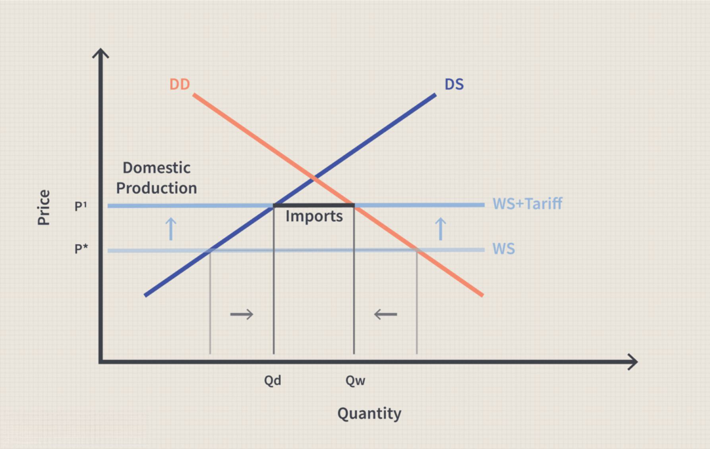

## Table of Contents

## What is exporting in programming?

Exporting in programming means making parts of your code available for use in other parts of your program or in different programs. When you write code, you often organize it into different files or modules. Exporting lets you share functions, classes, or variables from one file so they can be used in another file. This helps keep your code organized and makes it easier to reuse code across different projects.

For example, if you have a function that calculates the area of a circle in one file, you can export that function so it can be used in another file where you need to calculate areas. This way, you don't have to rewrite the same code in multiple places. Many programming languages have their own ways to export code, like using the `export` keyword in JavaScript or the `public` keyword in Java. By exporting, you can build more complex programs by combining smaller, reusable pieces of code.

## What does 'inline' mean in the context of exporting?

When we talk about 'inline' in the context of exporting, it means that the exported item is directly included in the same file where it's being used, rather than being imported from another file. For example, if you have a function in your code, and you want to use it in the same file, you might export it 'inline' so that it's immediately available without needing to import it from somewhere else.

This approach can be useful in certain situations, like when you're working on a small project or when you want to keep related code together in one place. However, using 'inline' exporting too much can make your code harder to manage, especially in larger projects, because it can lead to long, cluttered files. It's usually better to split your code into different files and import what you need, but 'inline' exporting can be handy for quick, simple tasks.

## Why would you want to export inline functions or variables?

You might want to export inline functions or variables when you're working on a small project or a quick script. If everything is in one file, it's easier to see all your code at once. This can make it simpler to understand and change your code because you don't have to jump between different files. For example, if you're writing a short program to do some math, you might put all your functions in the same file and export them inline so they're ready to use right away.

However, using inline exports too much can make your code messy, especially in bigger projects. When you keep everything in one file, it can get long and hard to read. It's usually better to split your code into different files and import what you need. But for small tasks or when you want to keep things simple, exporting inline can be a good choice.

## How do you export an inline function in JavaScript?

In JavaScript, to export an inline function, you use the `export` keyword right before you define the function. For example, if you want to export a function called `add`, you would write `export function add(a, b) { return a + b; }`. This way, the function is both defined and made available for use in other parts of your code without needing to import it from another file.

Using inline exports like this can be helpful when you're working on a small project or a quick script. It keeps everything in one place, making it easier to read and change your code. But if your project gets bigger, it's usually better to split your code into different files and use regular exports and imports to keep things organized.

## What are the differences between exporting inline and default exports?

When you export something inline in JavaScript, you use the `export` keyword right before you define the function, class, or variable. This makes it easy to see and use in the same file. For example, you might write `export function greet() { return "Hello"; }`. Inline exports are good for small projects where you want to keep everything in one file. But if your project gets bigger, it can make your file messy and hard to read.

Default exports are different. With a default export, you can export one thing from a file without naming it. You use the `export default` keyword. For example, you might write `export default function greet() { return "Hello"; }`. When you import a default export, you don't need to use curly braces, like `import greet from './greet.js';`. Default exports are good when you want to export the main thing from a file, like the main function or class. But you can only have one default export per file, while you can have many inline exports.

Both inline and default exports help you share your code between files. Inline exports are simple and work well for small projects, while default exports are useful for bigger projects where you want to clearly say what the main thing in a file is. Choosing between them depends on how big your project is and how you want to organize your code.

## Can you explain the performance implications of inline exports?

Using inline exports in your code won't make your program run faster or slower. Inline exports just make it easier for you to write and read your code when it's all in one file. The computer doesn't care if you use inline exports or not; it just sees the code and runs it the same way.

But if you use inline exports too much, your code can get messy and hard to read. This can make it take longer for you to understand and change your code, which is not good for big projects. So while inline exports don't affect how fast your code runs, they can affect how easy it is for you to work with your code.

## How do inline exports affect code readability and maintainability?

Inline exports can make your code easier to read when you're working on small projects. If you put everything in one file, you can see all your code at once. This can be helpful because you don't have to jump between different files to understand what's going on. For quick scripts or small tasks, inline exports can keep things simple and easy to follow.

But if you use inline exports too much, especially in bigger projects, your code can get messy. When everything is in one file, it can become long and hard to read. This makes it harder to find and change things when you need to. Splitting your code into different files and using regular exports and imports can help keep your project organized and easier to maintain as it grows.

## What are common use cases for inline exports in a project?

Inline exports are great for small projects or quick scripts. If you're working on something simple, like a short program to do some math, you might want to put all your functions in one file. This way, you can see everything at once and it's easy to read and change your code. For example, if you're making a script to calculate the area of different shapes, you could put all your functions in the same file and use inline exports to keep everything simple.

But in bigger projects, using inline exports too much can make things messy. If you have a lot of code in one file, it can get hard to read and find what you need. This can make it difficult to work on your project as it grows. So, while inline exports are handy for small tasks, it's better to split your code into different files and use regular exports and imports when you're working on something bigger.

## How do different module systems (CommonJS, ES6) handle inline exports?

In CommonJS, which is used in Node.js, you can't use inline exports the way you can in ES6. Instead, you define your functions, classes, or variables in a file, and then use `module.exports` at the end of the file to make them available to other files. For example, you might write `function greet() { return "Hello"; }` and then `module.exports = { greet };` to export the `greet` function. This way, you can't put the `export` keyword right before your function like you can in ES6, but you can still share your code between files.

In ES6, which is used in modern JavaScript, you can use inline exports. This means you can put the `export` keyword right before you define a function, class, or variable. For example, you can write `export function greet() { return "Hello"; }`. This makes it easy to see what you're exporting in the same file where you're writing your code. ES6 also lets you use `export default` for one main thing in a file, which is different from inline exports but still part of the ES6 module system.

## What are some best practices for using inline exports effectively?

When you use inline exports, it's best to keep them for small projects or quick scripts. If you're working on something simple, like a short program to do some math, putting all your functions in one file with inline exports can make your code easy to read. You can see everything at once without having to jump between files, which helps when you're working on small tasks.

But if your project gets bigger, it's better to split your code into different files and use regular exports and imports. Using too many inline exports in a large project can make your files long and hard to read. This can make it tough to find and change things when you need to. So, while inline exports are handy for small projects, use them carefully and think about switching to regular exports as your project grows.

## How can inline exports impact the tree shaking process in bundlers?

Inline exports can make tree shaking harder for bundlers. Tree shaking is when a bundler removes code that you don't use, so your final file is smaller. If you use inline exports and put everything in one file, it's harder for the bundler to see what code you're using and what you're not. This can mean the bundler might keep more code than it needs to, making your final file bigger.

But if you use regular exports and split your code into different files, it's easier for the bundler to do tree shaking. When your code is in separate files, the bundler can see which files are being imported and used. This helps the bundler remove any code that isn't needed, making your final file smaller and more efficient. So, while inline exports are good for small projects, they can make tree shaking less effective in bigger ones.

## What advanced techniques can be used with inline exports for optimizing large-scale applications?

In large-scale applications, using inline exports can be tricky because they can make your code harder to manage and less efficient for tree shaking. But if you really want to use inline exports, you can try to keep them in smaller, focused files that handle specific tasks. This way, you can still see the benefits of inline exports for readability while keeping your project organized. For example, you might have a file for utility functions where inline exports make sense because the functions are closely related and used together.

Another technique is to use inline exports for quick prototypes or temporary code that you'll refactor later. This can help you get started faster and see how different parts of your code work together. Once you're happy with the prototype, you can split the code into separate files with regular exports. This approach lets you use inline exports for the benefits they offer in the early stages, but then you can switch to a more maintainable structure as your application grows. By carefully managing inline exports and knowing when to switch to regular exports, you can keep your large-scale application efficient and easy to work with.

## References & Further Reading

[1]: Bergstra, J., Bardenet, R., Bengio, Y., & Kégl, B. (2011). ["Algorithms for Hyper-Parameter Optimization."](https://papers.nips.cc/paper/4443-algorithms-for-hyper-parameter-optimization) Advances in Neural Information Processing Systems 24.

[2]: ["Advances in Financial Machine Learning"](https://www.amazon.com/Advances-Financial-Machine-Learning-Marcos/dp/1119482089) by Marcos Lopez de Prado

[3]: ["Evidence-Based Technical Analysis: Applying the Scientific Method and Statistical Inference to Trading Signals"](https://www.amazon.com/Evidence-Based-Technical-Analysis-Scientific-Statistical/dp/0470008741) by David Aronson

[4]: ["Machine Learning for Algorithmic Trading"](https://github.com/stefan-jansen/machine-learning-for-trading) by Stefan Jansen

[5]: ["Quantitative Trading: How to Build Your Own Algorithmic Trading Business"](https://books.google.com/books/about/Quantitative_Trading.html?id=j70yEAAAQBAJ) by Ernest P. Chan