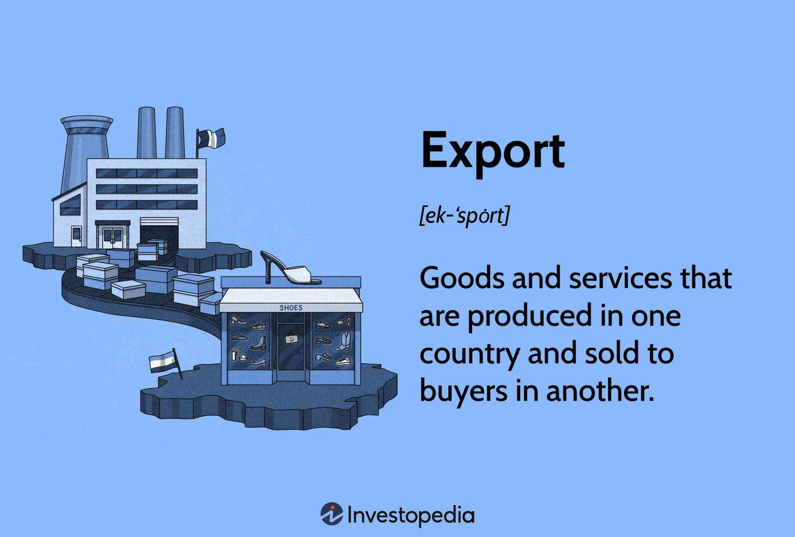

## Table of Contents

## What are exports?

Exports are goods and services that a country sells to other countries. When a country exports something, it means they are sending products or services outside their borders to be used or consumed in another country. This can include things like cars, electronics, food, and even services like tourism or consulting.

Exporting is important for a country's economy because it can help businesses grow and create jobs. When a country exports more than it imports, it has a trade surplus, which can make the country's economy stronger. Exports also help countries earn foreign currency, which they can use to buy things they need from other countries.

## Why are exports important for a country's economy?

Exports are important for a country's economy because they help businesses grow and create jobs. When a country sells its products or services to other countries, it earns money from those sales. This money can be used to pay workers, invest in new technology, and expand the business. More jobs mean more people have money to spend, which helps the whole economy grow.

Exports also help a country earn foreign currency. This is the money from other countries that a country gets when it sells its exports. With this foreign currency, a country can buy things it needs from other countries, like oil, machinery, or food that it can't produce at home. When a country exports more than it imports, it has a trade surplus, which can make its economy stronger and more stable.

## What are the main types of exports?

There are two main types of exports: goods and services. Goods are physical things that you can touch, like cars, clothes, and food. When a country sends these things to another country, they are exporting goods. Services are things that people do for others, like tourism, banking, or education. When people from one country go to another country to use these services, the country providing them is exporting services.

Both types of exports are important. Goods exports can help a country's factories and farms grow and make more money. This can create jobs and help the economy. Service exports can also create jobs, especially in areas like tourism and finance. They can bring in money from other countries and help the economy in different ways. Both goods and services exports help countries earn foreign money, which they can use to buy things they need from other countries.

## How do exports contribute to economic growth?

Exports help a country's economy grow by making businesses bigger and creating more jobs. When a country sells its products or services to other countries, it earns money. This money can be used to pay workers more, buy new machines, and make the business grow. When businesses grow, they need more workers, so they create new jobs. More jobs mean more people have money to spend, which helps the whole economy get bigger.

Exports also help a country earn money from other countries, called foreign currency. This money is important because it lets the country buy things it can't make at home, like oil or special machines. When a country exports more than it imports, it has a trade surplus. A trade surplus can make the country's economy stronger and more stable. This stability helps the economy grow over time because people and businesses feel more confident about spending and investing.

## What are the benefits of exporting for businesses?

Exporting helps businesses grow and make more money. When a business sells its products or services to other countries, it can reach more customers. This means the business can sell more things and earn more money. With this extra money, the business can pay its workers more, buy new equipment, or even open new stores or factories. This growth can help the business become bigger and more successful.

Exporting also helps businesses spread their risk. If a business only sells in one country, it might have problems if that country's economy gets bad. But if the business exports to many countries, it can still make money even if one country's economy is not doing well. This makes the business more stable and safer. Plus, when a business exports, it can learn new ways to do things from other countries, which can help it improve and do better.

## What challenges do businesses face when exporting?

Businesses face many challenges when they start exporting. One big challenge is understanding different rules and laws in other countries. Each country has its own rules about what can come into the country and how much it will cost. This can make it hard for a business to know if it can sell its products there and how much it will cost. Another challenge is figuring out how to get the products to the other country. Shipping can be expensive and take a long time, and sometimes things can get lost or damaged along the way.

Another challenge is understanding what people in other countries want to buy. What sells well in one country might not sell well in another. Businesses need to do a lot of research to find out what people in other countries like and how much they are willing to pay. This can take a lot of time and money. Also, businesses need to think about how to talk to their customers in other countries. They might need to learn a new language or find a good way to communicate, which can be hard.

Finally, businesses can face competition from other companies when they start exporting. In a new country, there might already be many companies selling similar things. It can be hard for a new business to stand out and get people to buy from them instead of their competitors. Plus, the business might need to change its prices to be competitive, which can mean making less money on each sale. All these challenges can make exporting a tough but rewarding thing for businesses to do.

## How can a company start exporting its products?

To start exporting its products, a company first needs to do some research. It should find out which countries might want to buy its products. This means learning about the rules and laws of those countries, like what they allow to be imported and how much it will cost. The company also needs to figure out how to get its products to those countries. This includes choosing a good way to ship the products and finding out how much it will cost and how long it will take. The company should also learn about what people in those countries like to buy and how much they are willing to pay. This can help the company decide if exporting to those countries is a good idea.

Once the company has done its research, it can start making a plan. It needs to find a good way to talk to its customers in other countries, which might mean learning a new language or using a translator. The company should also think about how it will sell its products in the new countries. It might need to work with other companies there, like distributors or [agents](/wiki/agents), who can help sell the products. The company should also think about how to stand out from other companies that are already selling similar things in those countries. This might mean changing the price or the way the product is packaged. By taking these steps, a company can start exporting its products and reach new customers in other countries.

## What role do trade agreements play in exports?

Trade agreements are deals between countries that help make it easier to buy and sell things across borders. They can lower or get rid of taxes that countries put on imports, which makes it cheaper for businesses to export their products. Trade agreements also help set clear rules about what can be traded and how it should be done. This makes it easier for businesses to know what they need to do to sell their products in other countries.

These agreements are important because they can help businesses grow and create more jobs. When it's easier and cheaper to export, businesses can sell more things to other countries. This means they can make more money and use it to grow their business. Trade agreements also help countries work together better, which can make the world economy stronger. By making it easier to trade, these agreements help businesses reach more customers and make the global market bigger.

## Can you provide examples of countries with high export volumes?

China is a country that exports a lot. It sends many things like electronics, clothes, and toys to other countries. China is good at making things cheaply, so many businesses around the world buy things from there. This helps China's economy grow because it earns a lot of money from these exports.

The United States also exports a lot. It sends out things like airplanes, cars, and farm products like corn and soybeans. The U.S. has many big companies that make high-quality products, which other countries want to buy. Exporting these products helps the U.S. economy by creating jobs and bringing in money from other countries.

Germany is another country with high export volumes. It is known for making good cars, machinery, and chemicals. Many countries buy these things from Germany because they are well-made and reliable. Exporting helps Germany's economy because it earns a lot of money and creates jobs for people.

## How do global economic factors influence export levels?

Global economic factors can change how much a country exports. When the world economy is doing well, people in other countries have more money to spend. They buy more things from other countries, so exports go up. But if the world economy is not doing well, people have less money to spend. They buy fewer things from other countries, so exports go down. Also, the price of money between countries, called exchange rates, can affect exports. If a country's money is worth more compared to other countries, its exports can become more expensive and harder to sell.

Another big [factor](/wiki/factor-investing) is trade rules between countries. If countries make it easier to trade by lowering taxes on imports, exports can go up because it's cheaper to buy things from other countries. But if countries put up more rules or taxes, it can make it harder and more expensive to export, so exports might go down. Things like wars, natural disasters, or health problems can also change how much a country exports. These events can disrupt the way things are made and shipped, making it harder for businesses to export their products.

## What are some advanced strategies for maximizing export potential?

To maximize export potential, a company can focus on understanding and adapting to the markets it wants to enter. This means doing a lot of research to find out what people in those countries like to buy and how much they are willing to pay. The company might need to change its products a bit to fit what people in the new country want. It's also important to find good partners in the new country, like distributors or agents, who can help sell the products. By working closely with these partners, the company can learn more about the local market and find the best ways to reach customers.

Another strategy is to use technology to help with exporting. This can include using online platforms to sell products to other countries, which can reach more customers without having to open a new store in each country. The company can also use data to understand what is working and what is not. By looking at this data, the company can make better decisions about where to focus its efforts and how to improve its products. Finally, the company should keep an eye on global economic trends and trade agreements. By understanding these factors, the company can plan ahead and take advantage of new opportunities as they come up.

## How do export regulations and compliance affect international trade?

Export regulations and compliance are rules that countries set up to control what can be sent out of their country. These rules help make sure that businesses follow the laws and keep the country safe. When a business wants to export, it has to follow these rules, which can include getting special permits or paying taxes on what it sends out. If a business does not follow the rules, it can get in trouble and have to pay fines or even stop exporting. This can make it harder and more expensive for businesses to sell their products in other countries, which can slow down international trade.

These regulations also affect how much a country exports. If the rules are very strict, it can be hard for businesses to export, so they might not try as much. But if the rules are easier, more businesses might want to export, and the country's exports could go up. Compliance also helps keep trade fair and safe. By making sure everyone follows the same rules, countries can trust each other more and trade more easily. This can help the global economy grow because more countries can work together and trade with each other.

## References & Further Reading

[1]: Krugman, P. R., & Obstfeld, M. (2009). ["International Economics: Theory & Policy."](https://archive.org/details/internationaleco0008krug) Pearson Education.

[2]: Carmen, R. (2015). ["The Globalization Paradox: Democracy and the Future of the World Economy."](https://drodrik.scholar.harvard.edu/publications/globalization-paradox-democracy-and-future-world-economy) W.W. Norton & Company.

[3]: Lopez de Prado, M. (2018). ["Advances in Financial Machine Learning."](https://www.amazon.com/Advances-Financial-Machine-Learning-Marcos/dp/1119482089) Wiley.

[4]: Chan, E. P. (2008). ["Quantitative Trading: How to Build Your Own Algorithmic Trading Business."](https://github.com/ftvision/quant_trading_echan_book) Wiley.

[5]: Jansen, S. (2020). ["Machine Learning for Algorithmic Trading."](https://github.com/stefan-jansen/machine-learning-for-trading) Packt Publishing.

[6]: Aronson, D. R. (2006). ["Evidence-Based Technical Analysis: Applying the Scientific Method and Statistical Inference to Trading Signals."](https://www.amazon.com/Evidence-Based-Technical-Analysis-Scientific-Statistical/dp/0470008741) Wiley.

[7]: Bergstra, J., Bardenet, R., Bengio, Y., & Kégl, B. (2011). ["Algorithms for Hyper-Parameter Optimization."](https://dl.acm.org/doi/10.5555/2986459.2986743) Advances in Neural Information Processing Systems 24.