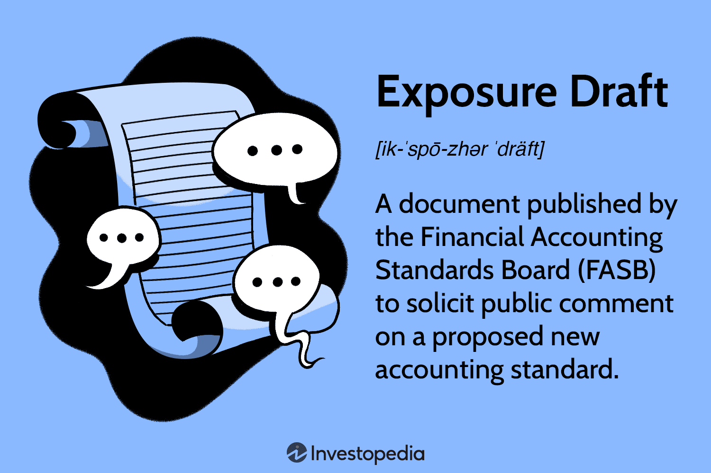

## Table of Contents

## What is an Exposure Draft?

An Exposure Draft is a document that is released by a standard-setting body, like the Financial Accounting Standards Board (FASB) or the International Accounting Standards Board (IASB), to get feedback from the public before they finalize a new rule or standard. It's like a rough draft of a new rule that they want people to read and comment on. This helps make sure the final rule is fair and works well for everyone who will have to follow it.

When an Exposure Draft is released, it usually has a deadline for when people need to send in their comments. This could be accountants, businesses, or anyone else who will be affected by the new rule. After the deadline, the standard-setting body looks at all the feedback and decides if they need to make changes to the draft before making it a final rule. This process helps make sure that the new standards are well thought out and meet the needs of the people who will use them.

## Why are Exposure Drafts important in the standard-setting process?

Exposure Drafts are really important in the standard-setting process because they help make sure new rules are good for everyone. When a group like the FASB or IASB wants to make a new rule, they first write an Exposure Draft and show it to the public. This way, people like accountants, businesses, and others who will have to follow the rule can read it and say what they think. If there are problems with the draft, people can point them out before the rule becomes final. This helps the rule-makers fix any issues and make the rule better for everyone.

Also, Exposure Drafts make the rule-making process more open and fair. By asking for comments from the public, the standard-setting bodies show that they care about what people think. This can make people trust the new rules more because they know their opinions were considered. It also helps avoid surprises when the final rule comes out, since everyone had a chance to see the draft and give feedback. Overall, Exposure Drafts make sure that new standards are well thought out and meet the needs of the people who will use them.

## Who typically issues Exposure Drafts?

Exposure Drafts are usually issued by groups that make rules for things like accounting or financial reporting. The main groups that do this are the Financial Accounting Standards Board (FASB) in the United States and the International Accounting Standards Board (IASB) around the world. These groups are in charge of setting the rules that businesses and accountants need to follow when they report their financial information.

When FASB or IASB want to make a new rule, they write an Exposure Draft first. This is like a first try at the new rule, and they show it to the public to get feedback. People like accountants, businesses, and anyone else who will be affected by the rule can read the draft and tell the rule-makers what they think. This helps the rule-makers make sure the final rule is fair and works well for everyone.

## How long is the comment period for an Exposure Draft?

The comment period for an Exposure Draft usually lasts for a few months. It can be different each time, but it often goes from 60 to 120 days. This gives people enough time to read the draft and think about it before they send their comments.

Having a long enough comment period is important. It makes sure that everyone who wants to give feedback has time to do it. This helps the rule-makers get good ideas and fix any problems before the rule becomes final.

## What is the purpose of public comments on an Exposure Draft?

Public comments on an Exposure Draft are really important. They help the people who make the rules understand what others think about the new rule. When people read the draft and give their feedback, they can point out any problems or things that might not work well. This helps the rule-makers fix these issues before the rule becomes final. It's like getting help from a lot of people to make sure the rule is the best it can be.

Also, public comments make the rule-making process fair and open. When everyone can see the draft and say what they think, it shows that the rule-makers care about what people want. This can make people trust the new rules more because they know their ideas were listened to. It also helps avoid surprises when the final rule comes out, since everyone had a chance to give their thoughts on the draft.

## Can you give an example of a significant Exposure Draft?

One big example of an Exposure Draft was when the International Accounting Standards Board (IASB) made a draft about how companies should report their leases. This was called IFRS 16 Leases. The draft said that companies had to show all their leases on their balance sheets, even ones they used to not have to show. This was a big change and could affect how companies looked financially. People from all over the world read the draft and sent in their thoughts on it.

After the comment period, the IASB looked at all the feedback and made some changes to the draft. They thought about what people said and tried to make the rule better. In the end, they made the final rule, IFRS 16, which came out in 2016. This rule changed how companies around the world report their leases and made financial statements more clear and fair for everyone.

## How does feedback from an Exposure Draft influence the final standard?

Feedback from an Exposure Draft helps the people who make the rules, like the FASB or IASB, understand what others think about the new rule. When people read the draft and send in their comments, they can point out any problems or things that might not work well. This feedback is really important because it helps the rule-makers fix these issues before the rule becomes final. They might change parts of the rule, make it clearer, or even decide not to go ahead with it if there are too many problems.

Using feedback from the public makes the rule-making process fair and open. When everyone can see the draft and give their thoughts, it shows that the rule-makers care about what people want. This can make people trust the new rules more because they know their ideas were listened to. It also helps avoid surprises when the final rule comes out, since everyone had a chance to comment on the draft. In the end, the feedback helps make sure the new standard is the best it can be for everyone who will have to follow it.

## What are the steps involved in responding to an Exposure Draft?

When you want to respond to an Exposure Draft, the first step is to read the draft carefully. You need to understand what the new rule is about and how it might affect you or your business. After reading it, think about what you like or don't like about the draft. You might want to talk to other people, like coworkers or experts, to get their thoughts too. Once you have a good understanding and some ideas, you can start writing your comments.

To write your comments, you should be clear and specific. Explain what parts of the draft you agree with and what parts you think need to be changed. Give good reasons for your thoughts and suggest how the rule could be better. Make sure to follow any rules the group that made the draft has for sending in comments, like how long your comment can be or what format it should be in. Once you have your comments ready, send them in before the deadline. After that, the group will look at all the feedback and decide what changes to make before they finalize the rule.

## What challenges might organizations face when responding to an Exposure Draft?

When organizations respond to an Exposure Draft, they might face some challenges. One big challenge is understanding the draft. It can be hard to read and understand because it often uses complicated language and talks about technical things. Organizations need to spend time reading it carefully and might need to ask experts for help. Another challenge is finding the time and resources to respond. Writing a good comment takes a lot of work. Organizations need to think about the draft, talk to other people, and write down their thoughts. This can be tough if they are busy with other things.

Another challenge is making sure their comments are heard. There might be a lot of people sending in feedback, so it can be hard for an organization's voice to stand out. They need to make sure their comments are clear and strong so the rule-makers pay attention to them. Also, sometimes organizations might not agree on what to say. Different parts of the organization might have different ideas about the draft, and they need to work together to come up with one comment. This can take a lot of time and effort.

## How do Exposure Drafts vary across different industries or sectors?

Exposure Drafts can be different depending on the industry or sector they are for. For example, in the accounting world, Exposure Drafts from the Financial Accounting Standards Board (FASB) or the International Accounting Standards Board (IASB) focus on rules for financial reporting. These drafts might talk about how companies should show their money and what information they need to share. In the insurance industry, Exposure Drafts might come from groups like the National Association of Insurance Commissioners (NAIC) and could be about rules for how insurance companies work and what they need to tell their customers.

Even though Exposure Drafts can be different, the way they work is pretty much the same across industries. They are always a way for the people making the rules to get feedback from the public before the rules become final. No matter if it's for accounting, insurance, or any other sector, the goal is to make sure the new rules are fair and work well for everyone who has to follow them. The comment period, where people can send in their thoughts, is important in every industry because it helps make the rules better.

## What advanced strategies can be used to effectively analyze an Exposure Draft?

To effectively analyze an Exposure Draft, it's helpful to start by breaking it down into smaller parts. Read through the draft carefully and try to understand each section. It can be useful to make notes or a summary of the main points. After you understand the draft, think about how it might affect your organization or industry. Talk to experts or colleagues to get different views. You might also want to use tools like spreadsheets or flowcharts to see how the new rule could change your financial reports or operations. This can help you spot any problems or benefits the draft might bring.

Another good strategy is to compare the Exposure Draft with current rules and see what's different. Look at examples or case studies to see how the new rule might work in real life. It's also smart to think about what other people might say about the draft. You can read comments from other organizations or industry groups to see what they think. This can give you new ideas and help you make stronger points in your own feedback. By using these strategies, you can make sure your analysis of the Exposure Draft is thorough and well thought out, which will help you give better feedback to the rule-makers.

## How can stakeholders track the progress and outcomes of an Exposure Draft?

Stakeholders can track the progress of an Exposure Draft by regularly checking the website of the group that issued it, like the FASB or IASB. These groups usually have a section where they post updates about the draft, including any changes they make and when the comment period ends. Stakeholders can also sign up for newsletters or alerts from these groups to get emails about the draft's progress. Sometimes, the groups hold meetings or webinars where they talk about the draft and answer questions, so keeping an eye on their event calendar can be helpful too.

After the comment period ends, stakeholders can find out about the outcomes by looking at the final rule or standard that gets published. The group that issued the draft will usually put out a summary of the feedback they got and explain how they used it to make changes. This summary can show what parts of the draft were changed and why. Stakeholders can also read the final rule to see how it's different from the draft and how it might affect them. Keeping track of these updates helps stakeholders stay informed and ready for any new rules they need to follow.

## References & Further Reading

[1]: Bergstra, J., Bardenet, R., Bengio, Y., & Kégl, B. (2011). ["Algorithms for Hyper-Parameter Optimization."](https://dl.acm.org/doi/10.5555/2986459.2986743) Advances in Neural Information Processing Systems 24.

[2]: Lopez de Prado, M. (2018). ["Advances in Financial Machine Learning."](https://www.amazon.com/Advances-Financial-Machine-Learning-Marcos/dp/1119482089) John Wiley & Sons.

[3]: Aronson, D. R. (2006). ["Evidence-Based Technical Analysis: Applying the Scientific Method and Statistical Inference to Trading Signals."](https://www.amazon.com/Evidence-Based-Technical-Analysis-Scientific-Statistical/dp/0470008741) John Wiley & Sons.

[4]: Jansen, S. (2020). ["Machine Learning for Algorithmic Trading."](https://github.com/stefan-jansen/machine-learning-for-trading) Packt Publishing.

[5]: Chan, E. (2008). ["Quantitative Trading: How to Build Your Own Algorithmic Trading Business."](https://github.com/ftvision/quant_trading_echan_book) John Wiley & Sons.