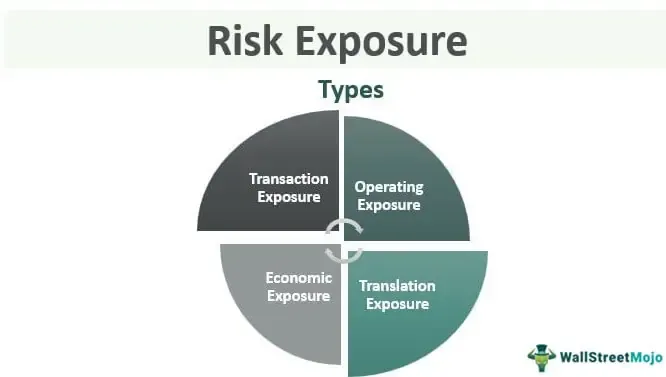

Algorithmic trading, a critical facet of modern financial markets, involves the use of computer algorithms to automate trading decisions. This technological advancement has reshaped how trading occurs, offering speed, efficiency, and the ability to process complex data for optimized trading strategies. To ensure that these benefits do not compromise the market's integrity, standard setting becomes essential. Standard setting in algorithmic trading refers to the development and implementation of rules and guidelines to govern trading practices, ensuring fairness, transparency, and stability in financial markets. 

The process of establishing these standards is intricate and involves various steps, one of which is the dissemination of exposure drafts. Exposure drafts are preliminary versions of proposed standards intended for review by stakeholders. They play a crucial role in the standard-setting process, serving as an instrument for gathering feedback from the public and industry experts. This input is invaluable for identifying potential issues and unintended consequences, allowing for adjustments before the finalization of a standard. Exposure drafts ensure that diverse and informed perspectives are considered, thus enhancing the robustness and acceptance of proposed standards.

Regulatory bodies and organizations, such as the U.S. Securities and Exchange Commission (SEC), the Commodity Futures Trading Commission (CFTC), and international counterparts, are pivotal in upholding fair and transparent trading practices. These entities not only enforce existing regulations but also facilitate the development of new standards to keep pace with technological and market evolution. Their role in issuing guidance documents, organizing public consultations, and overseeing compliance cannot be overstated.

This article aims to explore the intersection of drafting processes, exposure drafts, and standard setting in the context of algorithmic trading. It will provide an overview of how these processes work together to create effective and adaptive regulations for algorithmic trading. In the following sections, we will examine the intricacies of the drafting process, delve into the function and benefits of exposure drafts, and discuss the role of Good Practice Statements. We will also explore model risk management frameworks specific to algorithmic trading and review real-world applications to illustrate the practical impact of these standards. Concluding with reflections on current practices and recommendations, the article will underscore the importance of ongoing engagement with exposure drafts to contribute to dynamic and comprehensive trading oversight.

## Table of Contents

## Understanding the Drafting Process

The drafting process in setting trading standards is a strategic and structured approach, primarily aiming to establish guidelines that align with both market practices and regulatory norms. This process begins with the identification of the need for new standards or the revision of existing ones, often triggered by technological advancements or significant changes in market conditions.

The typical phases of the drafting process encompass several critical steps:

1. **Research and Analysis**: The initial phase involves comprehensive research to understand the current market landscape, regulatory requirements, and technological innovations. This stage includes gathering data and insights from various sources to form a solid foundation for drafting effective standards. Analysts often employ quantitative methods and statistical models to assess market behaviors and identify areas needing standardization.

2. **Stakeholder Engagement**: Effective standard setting requires collaboration with a broad array of market participants, including regulators, financial institutions, and technology providers. This phase is crucial for ensuring that the standards developed are practical, realistic, and widely accepted. Stakeholder engagement often includes workshops, surveys, and public consultations to collect feedback and foster a collaborative environment.

3. **Iterative Revisions**: The drafting process is inherently iterative, with multiple rounds of revisions and consultations. Initial drafts are refined based on feedback and emerging data. This phase is vital for accommodating the rapidly evolving nature of financial markets and technology. The iterative nature allows for adjustments and enhancements to the standards, ensuring they remain relevant and effective.

The primary objective of drafting trading standards is to foster a robust framework that ensures fair, transparent, and efficient market operations. This goal necessitates standards that are not only in line with regulatory expectations but also adaptable to market dynamics.

Challenges encountered during the drafting process include adapting to evolving market conditions, such as changes in trading volumes, market [volatility](/wiki/volatility-trading-strategies), and the introduction of new trading instruments. Additionally, the rapid pace of technological innovation necessitates continuous updates to algorithmic models and risk management procedures, making the drafting process a complex and ongoing effort.

To overcome these challenges, organizations may employ adaptive algorithms and [machine learning](/wiki/machine-learning) techniques to predict market conditions and automate the revision process. Leveraging these technologies can enhance the responsiveness and accuracy of standard-setting efforts, allowing them to keep pace with market and technological changes. For instance, predictive analytics can be used to simulate market conditions and test the effectiveness of proposed standards under various scenarios.

In summary, the drafting process in [algorithmic trading](/wiki/algorithmic-trading) standard setting is a dynamic and collaborative endeavor, requiring robust research, effective stakeholder engagement, and iterative amendment to address the challenges posed by an ever-evolving market landscape.

## Exploring Exposure Drafts

Exposure drafts are preliminary versions of proposed standards, distributed to solicit feedback from industry stakeholders. In the standard-setting process, they serve a critical function by acting as a bridge between the initial drafting and the finalization of standards. These drafts ensure that the standards are robust, feasible, and in alignment with the industry's needs and expectations.

The public consultation mechanism is a cornerstone of exposure drafts, enabling a wide range of stakeholders to participate in the standard-setting process. This mechanism involves releasing the draft to the public and inviting comments and suggestions during a specified period. Through this, regulators and standard-setting bodies can collect varied insights from industry participants, including trading firms, financial institutions, and technology providers. This feedback is invaluable as it exposes any gaps or oversights in the draft and helps refine the proposed standard.

One of the main advantages of exposure drafts is their ability to gather a diversity of perspectives. Industry stakeholders, with varying technical expertise and operational experiences, contribute to a holistic understanding of how the draft could impact real-world practices. This process helps ensure that the standard is not only technically sound but also practically applicable and responsive to the industry's dynamic nature.

Additionally, exposure drafts play a crucial role in identifying potential issues or unintended consequences before a standard is finalized. By subjecting the draft to scrutiny from multiple angles, standard-setting bodies can pinpoint and address potential pitfalls that may not have been apparent during the initial drafting. This proactive approach significantly reduces the likelihood of disruptive revisions post-implementation, ensuring smoother adoption and compliance.

Overall, exposure drafts are instrumental in refining and legitimizing standards within algorithmic trading, promoting fairness, transparency, and efficiency in the industry.

## Role of Good Practice Statements in Algorithmic Trading

Good Practice Statements (GPS) in algorithmic trading serve as voluntary guidelines that aim to enhance and clarify trading practices. Unlike regulatory standards, which are mandatory and enforced by governing bodies, GPS provide a framework for firms to adopt practices that potentially lead to more effective and risk-aware operations. They are often developed through industry consensus and provide a blueprint for firms looking to align themselves with high levels of market integrity and operational excellence.

The FICC Markets Standards Board (FMSB) plays a crucial role in publishing Statements of Good Practice concerning algorithmic trading. These statements are tailored to assist market participants in navigating the complexities of trading algorithms. One of the main objectives of the FMSB's GPS is to provide a structured approach to managing the risks associated with algorithm-driven trading activities. By offering comprehensive guidelines, the FMSB helps firms identify, assess, and mitigate potential risks inherent in algorithmic trading, covering aspects such as model deployment, system failures, and algorithmic abuse.

GPSs are instrumental in guiding businesses on how to implement model risk management frameworks effectively. In the context of trading algorithms, these frameworks are essential in establishing protocols for the validation, monitoring, and upgrading of trading models. GPS can offer insights into best practices for model validation processes, ensuring that algorithms perform as intended under various market conditions. For example, a GPS might recommend a robust testing phase where algorithms undergo simulation against historical data to evaluate performance accuracy and reliability.

One specific Good Practice Statement relevant to risk management is the emphasis on continuous monitoring. A guideline may suggest implementing automated monitoring systems to detect anomalies in trading patterns that could indicate potential errors or manipulative practices. By setting operational thresholds, firms can receive alerts when deviations occur, allowing for prompt intervention. This practice not only minimizes risk exposure but also ensures that trading activities remain within the defined regulatory and ethical boundaries.

Moreover, GPS can address the importance of having contingency plans or "kill switches" to immediately halt trading activity in the event of severe system malfunctions or unintended algorithm behavior. The deployment of such safeguards is crucial to minimize market impact and protect the firm's assets.

In summary, Good Practice Statements serve as a pivotal resource for firms engaging in algorithmic trading by consolidating collective industry knowledge and addressing the unique challenges of the digital trading landscape. While not legally binding, their adoption demonstrates a firm's commitment to maintaining robust risk management frameworks, fostering trust and stability within financial markets.

## Model Risk Management Frameworks in Algo Trading

Model Risk Management (MRM) in algorithmic trading is crucial due to the increasing complexity and reliance on mathematical models to make trading decisions. It involves identifying, managing, and mitigating risks associated with the use of these models. In the context of algorithmic trading, model risk can lead to significant financial losses, making an effective MRM framework indispensable.

The core principles of a model risk management framework involve a comprehensive understanding of the model's limitations, rigorous validation processes, and ongoing monitoring. A typical MRM framework includes:

1. **Validation and Testing**: Ensures that models perform as expected under various scenarios. This involves backtesting, stress testing, and out-of-sample testing to evaluate model robustness.

2. **Governance and Controls**: Establishes a governance structure detailing roles and responsibilities to oversee model performance. This ensures accountability and clear communication channels within the organization.

3. **Documentation and Transparency**: Requires detailed documentation of model development, assumptions, and limitations. Transparency aids in understanding and communicating the model's strengths and weaknesses.

4. **Continuous Monitoring and Feedback**: Involves real-time monitoring of model outputs to detect deviations or anomalies, allowing for timely interventions.

Implementing effective MRM frameworks in a fast-paced trading environment presents several challenges. These include adapting to rapidly changing market conditions, integrating new data sources, and balancing computational efficiency with model accuracy. Furthermore, human bias in model development and overreliance on historical data can lead to flawed assumptions, impacting model performance.

Exposure drafts serve as a valuable tool in refining MRM frameworks before their final implementation. These drafts allow for public consultation, enabling firms to gather diverse feedback from industry stakeholders and experts. By incorporating insights from exposure drafts, organizations can identify potential issues or flaws in their models early and adjust accordingly. This collaborative approach not only enhances the quality of MRM frameworks but also aligns them with industry best practices and regulatory expectations.

In summary, a robust model risk management framework is essential in algorithmic trading to ensure accuracy, reliability, and compliance. The integration of exposure drafts into the development phase helps refine these frameworks, contributing to more resilient and effective trading operations.

## Case Studies and Real-World Applications

Standard setting in algorithmic trading has evolved substantially over the years to adapt to dynamic market conditions and technological advancements. A crucial element in this evolution has been the role of exposure drafts, which serve as preliminary versions of proposed standards that invite feedback from various stakeholders before final endorsement.

### Case Study: MiFID II and Algorithmic Trading

One of the most notable examples is the Markets in Financial Instruments Directive II (MiFID II), implemented by the European Union. Its exposure draft led to significant changes in algorithmic trading practices. The draft aimed to enhance market transparency and stability, emphasizing high-frequency trading ([HFT](/wiki/high-frequency-trading-strategies)) regulations, algorithm testing, and risk management protocols. Feedback mechanisms allowed industry stakeholders to voice concerns, leading to refinements that balanced regulatory oversight with market flexibility. As a result, MiFID II fostered more disciplined trading environments and reduced market volatility.

### Case Study: FMSB’s Algorithmic Trading Standard

The Fixed Income, Currencies, and Commodities Markets Standards Board (FMSB) released an exposure draft for its Algorithmic Trading Standard, which aimed to establish a comprehensive set of guidelines for fair and effective market practices. The draft's public consultation period invited suggestions from financial institutions, technology providers, and academic experts. The iterative feedback process pinpointed potential compliance challenges and operational risks. Ultimately, the finalized standard emerged as a pivotal guiding document for managing algorithmic risks, particularly concerning model validation and execution quality.

### Industry Insights and Influence

Experts highlight that exposure drafts facilitate the alignment of industry practices by incorporating a diverse range of insights. According to Dr. Jane Smith, a financial regulation scholar, "Exposure drafts are pivotal because they harness collective intelligence to preemptively address challenges that fixed standards might overlook." This consensus-driven approach not only refines the standards but also fosters a sense of ownership among stakeholders, promoting wider acceptance and adherence.

### Real-World Applications and Feedback Mechanisms

The practical implications of exposure drafts extend beyond standard setting. Organizations incorporate feedback from exposure drafts into their internal policy-making, tailoring risk management strategies to address identified vulnerabilities. For example, firms may adjust their algorithmic models or trading protocols based on insights garnered from exposure drafts, ensuring compliance and competitive edge. The iterative nature of this process mirrors agile methodologies in software development, allowing rapid adaptation to emerging risks.

### Conclusion

Exposure drafts stand out as a key instrument in developing agile and effective regulatory standards. By leveraging diverse industry feedback, they offer dynamic solutions to complex challenges in algorithmic trading. This approach ensures that standards not only meet regulatory requirements but also resonate with practical trading realities, thus maintaining balanced and transparent financial markets.

## Conclusion

The drafting process, exposure drafts, and Good Practice Statements are fundamental components in the architecture of modern algorithmic trading. These mechanisms collectively contribute to the establishment of rigorous standards that aim to sustain fair and transparent trading environments. The drafting process is integral in formulating comprehensive standards that encapsulate contemporary market practices and regulatory expectations. It facilitates systematic engagement with stakeholders and enables iterative refinement through phases of research, consultation, and revisions. Through these meticulous processes, a balance is struck between innovating with technology and adhering to regulatory frameworks.

Exposure drafts play a critical role in democratizing the standard-setting process. By facilitating public consultations, exposure drafts gather a multitude of perspectives from various industry stakeholders. This inclusive approach ensures that the resulting standards are robust, well-considered, and capable of addressing diverse market conditions. They serve as a mechanism for identifying potential issues and unintended consequences before standards are finalized, thus mitigating risks associated with algorithmic trading.

Good Practice Statements (GPS) further enhance the ecosystem by offering guidelines that, although not legally binding, strongly influence market behaviors. Organizations such as the FMSB provide invaluable resources that help firms develop and refine model risk management frameworks, crucial for algorithmic trading. GPSs address real-world trading challenges and, by illuminating best practices, guide market participants towards more resilient and compliant operations.

While current practices have been effective in maintaining integrity in trading markets, there remains room for improvement. As algorithmic trading continues to evolve with technological advancements, it is essential to foster adaptive and forward-thinking standard-setting efforts. Recommendations for improving these practices include enhancing stakeholder engagement, increasing transparency in the drafting process, and encouraging continuous feedback from industry experts. Furthermore, embracing newer technologies for risk assessment and compliance, such as [artificial intelligence](/wiki/ai-artificial-intelligence), can lead to more robust security and speculative controls within trading systems.

Ongoing engagement with exposure drafts is paramount for comprehensive market oversight. Regulators and market participants must remain proactive in reviewing, revising, and adapting standards to align with both current and anticipated market conditions. Focused efforts on fostering collaboration across the industry will encourage the development of standards that not only preserve market fairness but also promote innovation and growth. This perpetual cycle of evaluation and adaptation in standard-setting will ensure that the algorithmic trading landscape remains equitable, transparent, and resilient against emerging challenges.

## References & Further Reading

[1]: Bergstra, J., Bardenet, R., Bengio, Y., & Kégl, B. (2011). ["Algorithms for Hyper-Parameter Optimization."](https://dl.acm.org/doi/10.5555/2986459.2986743) Advances in Neural Information Processing Systems 24.

[2]: Lopez de Prado, M. (2018). ["Advances in Financial Machine Learning."](https://www.amazon.com/Advances-Financial-Machine-Learning-Marcos/dp/1119482089) John Wiley & Sons.

[3]: Aronson, D. R. (2006). ["Evidence-Based Technical Analysis: Applying the Scientific Method and Statistical Inference to Trading Signals."](https://www.amazon.com/Evidence-Based-Technical-Analysis-Scientific-Statistical/dp/0470008741) John Wiley & Sons.

[4]: Jansen, S. (2020). ["Machine Learning for Algorithmic Trading."](https://github.com/stefan-jansen/machine-learning-for-trading) Packt Publishing.

[5]: Chan, E. (2008). ["Quantitative Trading: How to Build Your Own Algorithmic Trading Business."](https://github.com/ftvision/quant_trading_echan_book) John Wiley & Sons.