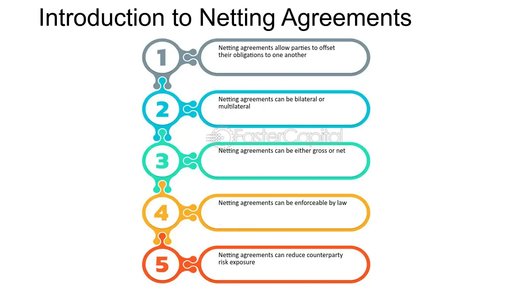

## Table of Contents

## What is exposure netting?

Exposure netting is a way for banks and financial institutions to manage the risk of their foreign currency transactions. It involves looking at all the money they are owed and all the money they owe in different currencies, and then figuring out the overall risk they face. Instead of looking at each transaction separately, they combine them to see the net position. This helps them understand which currencies they are most exposed to and helps them make better decisions about managing that risk.

By using exposure netting, banks can reduce the amount of money they need to set aside for potential losses. This is because they can offset gains in one currency against losses in another. For example, if a bank is owed $100 in euros but owes $80 in euros, they only need to worry about the net amount of $20. This process makes it easier for banks to handle their foreign currency risks and can save them money.

## Why is exposure netting important in financial management?

Exposure netting is important in financial management because it helps banks and financial institutions understand and manage their risks better. When banks do business in different countries, they often deal with different currencies. This can be risky because the value of one currency can go up or down compared to another. By using exposure netting, banks can look at all their transactions together and see the overall risk they face. This helps them make smarter decisions about which currencies they need to be careful with.

Another reason exposure netting is important is that it can save banks money. When banks look at each transaction on its own, they might need to set aside a lot of money to cover potential losses. But with exposure netting, they can see how gains in one currency can offset losses in another. For example, if a bank is owed money in one currency but owes money in the same currency, they only need to worry about the difference. This means they don't need to keep as much money aside for emergencies, which can help them use their money more efficiently.

## What are the basic principles of exposure netting?

Exposure netting is all about looking at the big picture when it comes to money in different currencies. Instead of worrying about each transaction separately, banks add up all the money they are owed and all the money they owe. This way, they can see if they have more money coming in than going out in each currency. It's like balancing a checkbook but on a much bigger scale and with different types of money.

The main idea is to figure out the net position, which is the difference between what a bank is owed and what it owes. If a bank is owed more than it owes in a certain currency, that's a positive net position. If it owes more than it's owed, that's a negative net position. By understanding these net positions, banks can see which currencies they need to be careful with and make plans to reduce their risk. This helps them manage their money better and avoid big losses.

## How does exposure netting differ from traditional netting?

Exposure netting and traditional netting both help banks manage their money, but they do it in different ways. Traditional netting is all about looking at each deal or contract one by one. If a bank has a deal where they owe money and another deal where they are owed money, traditional netting lets them cancel out those amounts. For example, if a bank owes $100 and is owed $100, traditional netting would say those amounts cancel each other out, so the bank doesn't have to pay or receive anything.

Exposure netting, on the other hand, takes a bigger view. Instead of looking at each deal separately, it looks at all the money a bank is owed and all the money it owes across different currencies. It then figures out the overall risk the bank faces in each currency. So, if a bank is owed $150 in euros but owes $100 in euros, exposure netting would show a net position of $50 in euros. This helps the bank see which currencies it needs to be careful with and manage its overall risk better.

## What are the common types of exposures that can be netted?

Exposure netting can help banks manage different types of risks or exposures. One common type is currency exposure. This happens when a bank has money coming in and going out in different currencies. By looking at all these transactions together, the bank can see if it has more money coming in than going out in each currency. This helps them know which currencies they need to watch closely.

Another type of exposure is interest rate exposure. This happens when a bank has loans or investments that are affected by changes in interest rates. If a bank has loans where it pays interest and investments where it receives interest, it can net these amounts to see the overall risk. This helps the bank manage its money better and make sure it doesn't lose too much if interest rates change.

A third type of exposure is credit exposure. This is the risk that someone who owes the bank money might not pay it back. By netting all the money the bank is owed against the money it owes to others, the bank can see its overall credit risk. This helps the bank decide if it needs to be more careful about lending money or if it can take on more risk.

## Can you explain the process of implementing exposure netting in a business?

To implement exposure netting in a business, the first step is to gather all the information about the money the business is owed and the money it owes. This includes looking at all the transactions in different currencies, interest rates, and credit risks. The business needs to have a good system to keep track of all these numbers. Once all the data is collected, the next step is to add up all the money coming in and all the money going out for each type of exposure. This means adding up all the money in euros, dollars, or any other currency, and doing the same for interest rates and credit risks.

After figuring out the total amounts, the business can then calculate the net position for each type of exposure. For example, if the business is owed $200 in euros but owes $150 in euros, the net position in euros would be $50. The same process is done for interest rates and credit risks. Once the net positions are known, the business can make better decisions about managing its risks. It can see which currencies or types of risks it needs to be careful with and take steps to reduce those risks. This might mean buying insurance, changing the terms of loans, or being more careful about who it lends money to. By doing exposure netting, the business can manage its money better and avoid big losses.

## What are the legal and regulatory considerations for exposure netting?

When a business wants to use exposure netting, it needs to think about the laws and rules that apply. Different countries have different rules about how businesses can manage their money, especially when it comes to different currencies. For example, some countries might have strict rules about how businesses can move money in and out of the country. It's important for a business to know these rules and make sure it follows them when it does exposure netting. If a business doesn't follow the rules, it could get in trouble with the government or face fines.

Another thing to think about is the contracts the business has with other companies or banks. These contracts might have rules about how the business can net its exposures. For example, a contract might say that the business can only net certain types of transactions or that it needs to get permission before it can net its exposures. The business needs to read these contracts carefully and make sure it follows the rules in them. If it doesn't, it could end up in a legal fight with the other company or bank. By understanding and following the legal and regulatory rules, a business can use exposure netting to manage its money better and stay out of trouble.

## How does exposure netting impact risk management strategies?

Exposure netting helps businesses see the big picture of their money risks. When a business looks at all the money it is owed and all the money it owes, it can see which currencies or types of risks it needs to be careful with. This helps the business make better plans to manage its risks. For example, if a business sees that it has a lot of money coming in and going out in euros, it might decide to buy insurance to protect itself from changes in the value of the euro. By understanding its net positions, the business can focus on the most important risks and make smarter decisions.

Using exposure netting also helps businesses save money. When a business looks at each transaction on its own, it might need to set aside a lot of money to cover possible losses. But with exposure netting, the business can see how gains in one currency can cancel out losses in another. This means the business doesn't need to keep as much money aside for emergencies. It can use that money for other things, like growing the business or paying down debts. By managing its risks better, the business can be more stable and successful.

## What technological tools are used to facilitate exposure netting?

To make exposure netting easier, businesses use special computer programs and software. These tools help gather all the information about the money the business is owed and the money it owes. They can quickly add up all the numbers and show the business its net position in different currencies, interest rates, and credit risks. This saves a lot of time and helps the business make better decisions. Some popular software for exposure netting includes treasury management systems like SAP Treasury and Risk Management, and financial risk management platforms like Murex and Finastra.

These technological tools also help businesses follow the rules and laws about managing their money. They can keep track of all the contracts and make sure the business is doing exposure netting the right way. They can also send alerts if something goes wrong or if the business needs to do something to stay safe. By using these tools, businesses can manage their risks better and avoid big problems. This makes it easier for them to grow and succeed.

## What are the challenges and limitations of exposure netting?

Exposure netting can be hard because it needs a lot of information. A business has to keep track of all the money it is owed and all the money it owes in different currencies, interest rates, and credit risks. This can be a big job, especially for big businesses with lots of transactions. If the business misses some numbers or makes a mistake, it could end up with the wrong net position. This could make the business think it is safer than it really is, which could lead to big problems if things go wrong.

Another challenge is that the rules about exposure netting can be different in different countries. A business has to make sure it follows all the right laws and rules when it does exposure netting. If it doesn't, it could get in trouble with the government or face fines. Also, the contracts the business has with other companies or banks might have special rules about netting. The business has to read these contracts carefully and follow the rules in them. If it doesn't, it could end up in a legal fight.

## How can exposure netting be optimized for multinational corporations?

Exposure netting can be optimized for multinational corporations by using special computer programs that help gather all the money information from different countries. These programs can quickly add up all the numbers and show the company its net position in different currencies, interest rates, and credit risks. This is really helpful because multinational corporations have lots of transactions in different places. By using these tools, the company can see the big picture of its risks and make better plans to manage them. It can also save time and money because it doesn't have to look at each transaction one by one.

Another way to optimize exposure netting is to have a good team of people who understand the rules and laws in different countries. These people can make sure the company follows all the right rules when it does exposure netting. They can also help read the contracts the company has with other businesses or banks and make sure the company follows the special rules in those contracts. By having a good team, the company can avoid getting in trouble with the government or facing fines. This helps the company manage its risks better and stay safe.

## What are the advanced techniques in exposure netting used by financial experts?

Financial experts use advanced techniques in exposure netting to manage risks better. One technique is using complex computer models to predict how the value of different currencies might change. These models look at lots of information, like past changes in currency values, news about the economy, and even things like weather patterns. By using these models, experts can guess how much money the company might lose or gain in different currencies. This helps them make better plans to protect the company from big losses.

Another advanced technique is called dynamic exposure netting. This means the experts keep checking the company's net positions all the time, not just once in a while. They use special software that updates the numbers every day or even every hour. This way, they can see if something is changing quickly and take action right away. For example, if the value of a currency starts to drop fast, they can quickly buy insurance or make other deals to protect the company's money. By doing this, they can manage the company's risks even better and avoid big problems.

## What is Exposure Netting?

Exposure netting is a strategic approach in financial management used to alleviate the risks associated with fluctuations in currency and other market variables. It focuses on managing overall risk exposure by offsetting individual exposures, rather than addressing each risk [factor](/wiki/factor-investing) separately. This aggregate approach results in greater cost efficiency and simpler management processes.

In international business operations, currency exchange risk is a significant concern. Exposure netting becomes particularly essential for companies engaged in various global markets, where exchange rate volatility can impact profits and costs significantly. By using exposure netting, firms aim to neutralize these potential risks by offsetting their exposures across different currencies and markets.

For instance, consider a multinational corporation that has liabilities of €100,000 due in one geographic region while holding a receivable of the same amount in another. This company might balance its Euro-denominated liabilities with its Euro-denominated receivables, effectively reducing the currency risk associated with exchange rate fluctuations. The net exposure, in this case, would be minimized or wholly mitigated if the amounts match, thus stabilizing the financial outcome and enhancing predictability in financial planning.

Mathematically, exposure netting can be represented as minimizing the net exposure, $E_{\text{net}}$, which can be computed through the formula:

$$
E_{\text{net}} = E_{\text{total\_liabilities}} - E_{\text{total\_receivables}}
$$

If $E_{\text{net}} = 0$, the company has successfully netted its exposure, nullifying the risk from currency variances. This ensures that the risk management exercises are cost-effective by reducing the need for additional hedging transactions, which often entail extra costs and complexity.

In summary, exposure netting is a vital tool for organizations participating in the global marketplace. It provides a systematic and efficient method to manage and mitigate financial risks, ensuring stability and predictability in an unpredictable economic landscape.

## How does algorithmic trading play a role in risk management?

Algorithmic trading employs sophisticated computer algorithms to execute trades automatically based on predefined criteria. This approach streamlines the trading process, particularly in managing financial risk through hedging strategies. The core advantage of [algorithmic trading](/wiki/algorithmic-trading) lies in its ability to handle large volumes of data swiftly and accurately, making timely trading decisions that would be challenging for human traders to match. 

These algorithms can quickly analyze market conditions, taking into account various factors such as historical data, price movements, and economic indicators, to optimize trading outcomes. This is particularly significant in the context of exposure netting, where the speed and accuracy of executing trades are paramount to effectively offset financial risks. For instance, algorithms can instantly adjust a company's position in response to currency fluctuations, providing a more dynamic approach to risk management.

The algorithms used in trading are often based on mathematical models that incorporate various risk management techniques. For example, consider the application of the Black-Scholes model for pricing options, which helps in determining the optimum timing and price for executing trades:

$$
C(S, t) = S \Phi(d_1) - Ke^{-rt} \Phi(d_2)
$$

where:
- $C$ is the call option price
- $S$ is the current stock price
- $t$ is the time to expiration
- $K$ is the strike price
- $r$ is the risk-free interest rate
- $\Phi$ is the cumulative distribution function of the standard normal distribution
- $d_1$ and $d_2$ are intermediary parameters calculated based on market variables

By integrating such models, algorithms can forecast price trends and execute trades at the most favorable conditions, thereby mitigating potential losses due to adverse market movements.

Moreover, algorithmic trading enhances risk management by enabling complex strategies like statistical [arbitrage](/wiki/arbitrage) and [market making](/wiki/market-making). Python, for instance, offers powerful libraries such as NumPy and Pandas that assist in the quantitative analysis required for these strategies. Below is a simple Python example showcasing data processing for trading algorithms:

```python
import numpy as np
import pandas as pd

# Example: Calculate moving average for a stock
def moving_average(prices, window_size):
    return prices.rolling(window=window_size).mean()

# Simulated stock prices
prices = pd.Series([100, 102, 105, 107, 110, 120])

# Calculate 3-day moving average
ma = moving_average(prices, window_size=3)
print(ma)
```

This code snippet illustrates how easy it is to compute technical indicators, such as a moving average, that form the basis of many trading algorithms.

As technology evolves, the capabilities of algorithmic trading will expand further, potentially incorporating emerging technologies like [artificial intelligence](/wiki/ai-artificial-intelligence) and [machine learning](/wiki/machine-learning) to enhance decision-making processes. This highlights the growing role of algorithmic trading in risk management, enabling businesses to execute exposure netting strategies efficiently and effectively.

## References & Further Reading

[1]: Hull, J. C. (2017). ["Options, Futures, and Other Derivatives"](https://www.semanticscholar.org/paper/Options%2C-Futures%2C-and-Other-Derivatives-Hull/89bdee500c8623864fc9eb7a471546aa713acc44). Pearson.

[2]: Chance, D. M., & Brooks, R. (2015). ["Introduction to Derivatives and Risk Management"](https://books.google.com/books/about/Introduction_to_Derivatives_and_Risk_Man.html?id=b8PgBQAAQBAJ). South-Western College Pub.

[3]: Kissell, R. (2013). ["The Science of Algorithmic Trading and Portfolio Management"](https://www.sciencedirect.com/book/9780124016897/the-science-of-algorithmic-trading-and-portfolio-management). Academic Press.

[4]: Vanderbei, R. J. (2013). ["Linear Programming: Foundations and Extensions"](https://link.springer.com/book/10.1007/978-3-030-39415-8). Springer.

[5]: Black, F., & Scholes, M. (1973). ["The Pricing of Options and Corporate Liabilities"](https://www.cs.princeton.edu/courses/archive/fall09/cos323/papers/black_scholes73.pdf). The Journal of Political Economy, 81(3), 637-654.