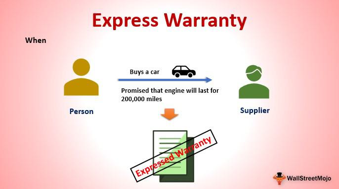

Warranties are contractual commitments that ensure the performance, quality, or condition of a product or service. They play a crucial role in consumer transactions by providing assurance to buyers about the reliability and functionality of a product they are purchasing. By safeguarding consumer interests, warranties help mitigate the risk of financial loss due to defective or substandard products.

Warranties can be broadly classified into two categories: express warranties and implied warranties. Express warranties are explicit guarantees provided by the seller or manufacturer regarding specific characteristics or conditions of a product. These assurances can be given verbally or written and are intended to form part of the sales contract. For instance, a car manufacturer may offer an express warranty that covers engine repairs for a specified period or mileage.

In contrast, implied warranties are unspoken, unwritten guarantees automatically conferred by law. They ensure that a product meets basic standards of quality and reliability. Notably, two primary types of implied warranties exist under U.S. law: the implied warranty of merchantability, which assures that a product will work as expected, and the implied warranty of fitness for a particular purpose, which applies when a buyer relies on the seller's expertise to select a product suitable for a specific use.

While warranties are traditionally associated with consumer goods, they also have significant implications in various industries, including algorithmic trading. In this context, warranties might cover aspects such as the accuracy of trading algorithms, the security of the trading platform, and compliance with regulatory standards. By providing performance guarantees and ensuring the reliability of software systems, warranties help foster confidence in technological solutions and enhance their adoption across industries.

Overall, warranties are indispensable in both consumer and industrial sectors, serving as a vital mechanism for building trust and maintaining product standards.

## Table of Contents

## Understanding Express Warranty

An express warranty is a seller's explicit guarantee to a buyer that a product or service will meet certain specified standards or criteria. Under the Uniform Commercial Code (UCC), which governs commercial transactions in the United States, express warranties are legally binding promises or affirmations made by a seller regarding the quality, condition, or performance of the goods being sold. These warranties are typically formed through statements made during negotiations, descriptions provided in advertisements, or assurances given at the time of sale. For example, if a car dealer states that a vehicle will run for 30,000 miles without mechanical issues, that statement constitutes an express warranty.

The formation of an express warranty under the UCC requires certain elements: (1) a clear affirmation of fact or promise by the seller, (2) a description of the goods that becomes part of the basis of the bargain, or (3) a sample/model that is used to establish an agreement. Notably, express warranties do not cover statements of opinion or commendation unless they become factual assertions.

Express warranties play a crucial role in consumer decision-making. They provide potential buyers with confidence in the quality and performance of a product, effectively reducing perceived risks associated with the purchase. When a consumer evaluates products, express warranties can be a deciding [factor](/wiki/factor-investing), potentially influencing the selection of one product over competitors. This assurance is particularly significant in markets with high competition and similar product offerings, as it helps distinguish products by reliability and accountability, fostering trust between the buyer and seller.

The presence of express warranties also requires companies to maintain product quality and fulfill marketing claims, enhancing accountability. In situations where a product fails to meet the standards outlined in an express warranty, consumers have legal recourse to seek remedies such as repairs, replacements, or even refunds, thereby encouraging manufacturers and sellers to adhere to stated commitments. 

Ultimately, express warranties provide a foundation for informed purchasing decisions and enhance consumer protection in commercial transactions. Through legally binding guarantees, they help establish transparent market practices and drive the production of reliable and high-quality goods.

## Examples of Express Warranty

Express warranties play a crucial role in various industries, providing assurance that products will meet certain standards and specifications. These warranties are particularly relevant in e-commerce, automotive sales, and other sectors, where clear representations about a product are made to consumers. 

In e-commerce, express warranties often manifest as specific promises regarding the attributes, quality, or performance of a product. For example, an online retailer may offer an express warranty that a smartphone will have a battery life of up to 10 hours under normal usage conditions. This promise, usually detailed in product descriptions or marketing materials, assures consumers of the product's expected performance. Over time, such warranties have become essential for maintaining consumer trust and confidence, particularly given the rapid increase in online shopping and the associated risks of not physically inspecting a product before purchase.

The automotive industry also widely uses express warranties. Car manufacturers often provide specific guarantees related to vehicle performance and parts durability. A typical example of this is a five-year or 60,000-mile powertrain warranty, which promises that crucial components like the engine and transmission will function properly during this period. These warranties are pivotal for consumers when making purchase decisions, as they promise repair or replacement if the vehicle fails to meet the warranty terms. This assurance encourages customers to invest substantial amounts in new vehicles, knowing there is a defined recourse if the car doesn’t perform as promised.

Beyond e-commerce and automobiles, express warranties serve important functions in sectors like electronics and home appliances. For instance, a manufacturer of washing machines might offer a two-year warranty covering defects in materials and workmanship. This explicit guarantee assures consumers that they are purchasing a reliable product, backed by the company’s commitment to quality. Compliance with express warranties ensures marketing claims are not merely promotional but supported by tangible service promises. This is particularly significant because it directly impacts consumer protection and helps companies differentiate their products in competitive markets.

Overall, express warranties are indispensable in ensuring product quality and bridging the gap between marketing claims and actual product performance. They offer a clear framework within which consumers can expect goods to function, backed by legal obligations on the part of sellers and manufacturers.

## Express Warranty in Algorithmic Trading

Express warranties in [algorithmic trading](/wiki/algorithmic-trading) play a crucial role in maintaining the integrity, reliability, and performance of trading platforms. These warranties refer to the explicit promises made by software developers and vendors about the capabilities and performance of their algorithmic trading systems. They serve as a safeguard for traders and investors who rely heavily on these systems to execute trades autonomously and efficiently.

One key aspect of express warranties in this context is performance guarantees. Algorithmic trading systems are expected to execute trades at high speeds and with minimal latency. Performance guarantees are assurances provided by the system developers that the trading software will meet specific execution speeds or transaction throughput thresholds. This is crucial for traders who operate in high-frequency trading environments, where the slightest delay can result in significant financial losses.

Data accuracy is another important component of express warranties in algorithmic trading. Accurate and timely data feeds are essential for making informed trading decisions. Vendors typically provide express warranties ensuring that their systems will process and reflect market data accurately and without delay. Discrepancies or errors in data can lead to incorrect trading signals and potentially costly decisions, making these warranties vital for maintaining trust in trading platforms.

Software functionality is also covered under express warranties. This includes assurances that the trading algorithms will function as intended, without bugs or malfunctions, and that they will be compatible with the trading platform or infrastructure in use. Such warranties might also cover regular updates and maintenance to adapt to changing market conditions and regulatory requirements.

An example of express warranties related to trading platforms might involve a vendor providing a warranty that their algorithmic trading software will execute trades within a 5-millisecond latency window under normal market conditions. Similarly, a warranty on data accuracy might promise less than a 0.01% error rate in the processing of live market data feeds. These warranties are legally binding agreements ensuring that the software performs within specified limits, providing users with a level of assurance and predictability.

In conclusion, express warranties in algorithmic trading are essential for ensuring trust and reliability in trading systems. They cover vital aspects such as performance guarantees, data accuracy, and software functionality. These warranties provide traders with confidence in the tools they use, helping them to mitigate risks in the fast-paced environment of financial markets.

## Express vs. Implied Warranty

Express warranties and implied warranties serve as key elements in consumer protection, each offering distinct types of legal coverage for consumers. Understanding the differences between these warranties is crucial for navigating various market transactions effectively.

An express warranty is a specific promise made by a seller or manufacturer regarding the quality, performance, or condition of a product. This type of warranty is often articulated through verbal assurances, written agreements, or marketing materials and is covered by the Uniform Commercial Code (UCC). For example, a car advertisement stating, "This vehicle offers 35 miles per gallon," constitutes an express warranty about fuel efficiency.

In contrast, an implied warranty automatically applies to transactions, providing a baseline assurance that a product meets certain minimum standards of quality and functionality. Implied warranties do not require explicit statements and are recognized by law under UCC as well. The two main types are the implied warranty of merchantability, which assumes a product will perform as expected for its ordinary purpose, and the implied warranty of fitness for a particular purpose, which applies when a seller knows a buyer is relying on their expertise to choose a product for a specific use. For instance, if a consumer purchases a winter jacket from a store specializing in cold-weather gear, there is an implied warranty that the jacket will keep the wearer warm under standard winter conditions.

Legal protections for express warranties arise directly from the seller's or manufacturer's specific promises. If the product fails to meet the standards outlined in an express warranty, the consumer may seek legal recourse based on breach of contract. For implied warranties, legal protections are rooted in state statutes and the UCC, providing remedies such as repair, replacement, or refund when products do not meet ordinary expectations. These warranties can be disclaimed or limited by sellers, but such disclaimers must be conspicuous and explicit.

In summary, while express warranties are defined by specificity and assurances from sellers or manufacturers, implied warranties are generalized statutory protections ensuring fundamental product integrity. Both play essential roles in upholding consumer rights and instilling confidence in purchases.

## Conclusion

Understanding warranties is essential for consumers and businesses alike because they function as a critical component in establishing trust and ensuring compliance. In consumer transactions, warranties, especially express warranties, assure buyers of the quality and performance of products or services they purchase. This assurance is vital not only for consumer confidence but also for protecting consumer rights, as it sets clear expectations and provides a legal basis for recourse should products fail to meet those promises.

Moreover, in high-stakes environments such as algorithmic trading, warranties take on an even greater significance. Express warranties in this context may include performance guarantees, data accuracy, and software functionality, all of which are crucial in ensuring that trading algorithms operate as expected. These warranties serve as a foundation for trust between developers, traders, and financial institutions, as they ensure that the complex systems at play can be relied upon to make precise and timely decisions.

The role of express warranties in both consumer goods and technology-driven industries underscores their importance in promoting transparency and accountability. They are not only mechanisms for consumer protection but also strategic tools for businesses to differentiate themselves in competitive markets. By providing clear and enforceable guarantees, express warranties help in building long-term relationships with clients and stakeholders, fostering loyalty and mitigating disputes. In conclusion, a thorough understanding of warranties, particularly express warranties, is indispensable for both everyday transactions and sophisticated, technology-driven endeavors.

## References & Further Reading

[1]: U.C.C. Article 2 - Sales. Uniform Commercial Code. [Link](https://www.law.cornell.edu/ucc/2)

[2]: ["Understanding Warranties"](https://aaronhall.com/understanding-warranties-in-contracts-legal-insights-you-cant-ignore/) by the Federal Trade Commission

[3]: "Warranty Law: Foundational Principles and Contemporary Issues" by Jeffrey A. Helewitz

[4]: ["Algorithmic Trading and DMA"](https://www.amazon.com/Algorithmic-Trading-DMA-introduction-strategies/dp/0956399207) by Barry Johnson

[5]: Shreve, S. E. (2004). ["Stochastic Calculus for Finance II: Continuous-Time Models."](https://link.springer.com/book/9780387401010) 

[6]: "Algorithmic Trading: Winning Strategies and Their Rationale" by Ernie Chan