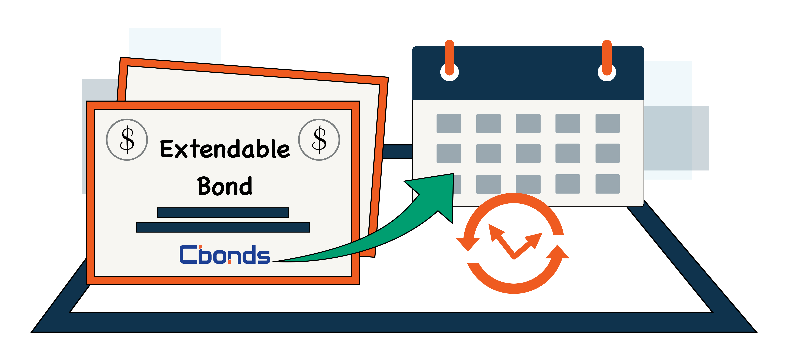

## Table of Contents

## What is an extendable bond?

An extendable bond is a type of bond that gives the holder the option to extend the bond's maturity date. This means that if the bond is about to reach its original maturity date, the holder can choose to keep the bond for a longer period instead of getting their money back right away. This can be useful if the holder thinks they can get a better return by keeping the bond longer, or if they don't need the money right away.

The bond's terms will specify how long the bond can be extended and under what conditions. For example, the bond might be extendable for another five years, but the interest rate might change during the extension period. This type of bond can be attractive to investors who want flexibility in managing their investments, as it allows them to adapt to changing market conditions or their own financial needs.

## How does an extendable bond differ from a regular bond?

An extendable bond is different from a regular bond because it gives the person who owns it a choice. With a regular bond, you get your money back when the bond reaches its maturity date. But with an extendable bond, you can choose to keep the bond longer if you want to. This means you don't have to take your money back right away; you can decide to wait and maybe get more interest.

The terms of an extendable bond will tell you how long you can keep it and what might change if you do. For example, the interest rate might be different during the extra time. This can be good for people who want to be able to change their plans based on what's happening in the market or in their own life. A regular bond doesn't give you this choice; once you buy it, you have to wait until the set maturity date to get your money back.

## What are the benefits of investing in extendable bonds?

One big benefit of investing in extendable bonds is the flexibility they offer. If you own an extendable bond, you can choose to keep it longer if you think it's a good idea. This means you don't have to take your money back right when the bond is supposed to end. You can wait and maybe earn more interest if the rates go up or if you just don't need the money right away. This can be really helpful if things change in the market or in your own life.

Another benefit is that extendable bonds can help you manage risk better. If interest rates are going up, you might want to keep your bond longer to get a better return. If rates are going down, you can take your money back and invest it somewhere else. This choice can make your investment safer because you can adjust to what's happening around you. It's like having a backup plan that lets you decide what's best for your money at any time.

## Who typically issues extendable bonds?

Extendable bonds are usually issued by big companies and governments. These groups need to borrow money to do things like build roads, start new projects, or keep their business running. They issue bonds as a way to get that money from people who want to invest. By offering extendable bonds, they can attract more investors because these bonds give people more choices about when to get their money back.

Banks and financial institutions also issue extendable bonds sometimes. They do this to raise money for their own operations or to lend to others. Extendable bonds can be a good option for these organizations because they can appeal to investors who like having the flexibility to decide when to cash in their bonds. This can make the bonds more popular and help the banks and financial institutions get the money they need.

## What are the risks associated with extendable bonds?

One risk with extendable bonds is that the interest rate might change when you choose to extend the bond. If the new interest rate is lower than before, you might not earn as much money as you hoped. This can be disappointing if you were expecting a higher return on your investment. Also, if you decide to extend the bond, you might miss out on other good investment opportunities that come up during the extension period.

Another risk is that the company or government that issued the bond might have trouble paying you back. This is called credit risk. If the issuer runs into financial trouble, they might not be able to pay the interest or return your money at all. This can be a bigger worry with extendable bonds because you might be holding onto them for a longer time, giving more chance for things to go wrong with the issuer.

## How is the extension feature of an extendable bond priced?

The extension feature of an extendable bond is priced based on how likely people think it is that they will use it and what they think will happen with interest rates. If people think they are going to extend the bond a lot, the price of the bond might be higher because it's seen as more valuable. If they think interest rates will go up, they might be more likely to extend the bond to get a better return, which can also make the bond's price go up.

On the other hand, if people think they won't use the extension feature much, the bond might not be priced as high. If they think interest rates will go down, they might not want to extend the bond and would rather take their money back to invest it somewhere else. So, the price of the extension feature depends a lot on what people expect will happen in the future with interest rates and their own plans for the money.

## What factors influence the decision to extend an extendable bond?

The main thing that influences the decision to extend an extendable bond is what's happening with interest rates. If interest rates are going up, it might be a good idea to extend the bond. This is because you can keep [earning](/wiki/earning-announcement) interest at the current rate, which might be better than what you could get if you took your money back and invested it somewhere else. On the other hand, if interest rates are going down, you might not want to extend the bond. You could take your money back and put it into a new investment that gives you a better return.

Another [factor](/wiki/factor-investing) is how much you need the money. If you need the money soon, you probably won't extend the bond. But if you don't need the money right away, extending the bond might be a good choice. It's also important to think about the financial health of the company or government that issued the bond. If they are doing well, you might feel more comfortable extending the bond. But if they are having money problems, you might decide to take your money back to be safe.

## Can you provide an example of how an extendable bond might be structured?

Imagine a company called BigCorp wants to borrow money, so they issue an extendable bond. This bond has a face value of $1,000 and an original maturity of 5 years. The bond pays an annual interest rate of 3%. When the 5 years are up, the person who owns the bond can choose to get their $1,000 back plus the interest they've earned, or they can decide to extend the bond for another 3 years. If they choose to extend, the interest rate for those extra 3 years will be 4%.

Let's say you buy this bond from BigCorp. After 5 years, you see that interest rates have gone up and you think they might keep going up. You decide to extend the bond for the extra 3 years because you want to keep earning interest at the new rate of 4%. This way, you can keep your money in the bond longer and maybe earn more money than if you took it out and put it somewhere else. But if interest rates had gone down, you might have decided to take your money back and look for a better investment.

## How do extendable bonds affect portfolio diversification?

Extendable bonds can help with portfolio diversification because they give you more choices. When you have different types of investments, it's like spreading your money around so that if one thing doesn't do well, you still have other things that might do better. Extendable bonds are special because you can decide to keep them longer if you want to. This means you can change your plan based on what's happening with interest rates or your own needs. So, having extendable bonds in your portfolio can make it more flexible and help you manage your money better.

But, it's important to remember that extendable bonds also come with their own risks. If you decide to extend the bond, you might get a different interest rate, and it might not be as good as you hoped. Also, if the company or government that issued the bond runs into money problems, you might not get your money back. So, while extendable bonds can help diversify your portfolio and give you more options, you need to think carefully about the risks too. Balancing these risks and benefits can make your overall investment strategy stronger.

## What are the tax implications of holding an extendable bond?

When you hold an extendable bond, the interest you earn each year is usually taxed as regular income. This means you have to pay taxes on the interest every year, just like you would with money you earn from a job. If you decide to extend the bond, the interest rate might change, but you'll still have to pay taxes on the new interest you earn each year during the extension period. It's important to keep track of how much interest you're earning so you can report it correctly on your taxes.

If you sell the extendable bond before it matures, you might have to pay capital gains tax. This depends on whether you sell it for more or less than what you paid for it. If you sell it for more, you'll pay tax on the profit you made. If you sell it for less, you might be able to claim a loss on your taxes, which can help lower the amount of tax you owe. The rules can be different depending on where you live, so it's a good idea to talk to a tax professional to make sure you're doing everything right.

## How do market conditions impact the value of extendable bonds?

Market conditions can really change the value of extendable bonds. If interest rates go up, the value of the bond might go down because people can get better returns from other investments. But, if you think rates will keep going up, you might want to extend the bond to keep earning the current interest rate, which could make the bond more valuable to you. On the other hand, if interest rates go down, the value of the bond might go up because it's paying a higher rate than what's available in the market. This could make you decide not to extend the bond and take your money back to invest it somewhere else.

Another thing that affects the value of extendable bonds is how the company or government that issued the bond is doing financially. If they're doing well, people might feel more confident about extending the bond, which can make its value go up. But if they're having money problems, people might not want to extend the bond and might even sell it, which can make its value go down. So, the overall health of the economy and the specific situation of the bond issuer can both play a big role in deciding whether to extend the bond and how much it's worth.

## What advanced strategies can investors use with extendable bonds to optimize returns?

One advanced strategy investors can use with extendable bonds is to carefully watch interest rates and try to guess where they are going. If they think rates will go up, they might extend the bond to keep earning the current interest rate, which could be better than what they would get if they took their money out and put it somewhere else. But if they think rates will go down, they might not extend the bond and instead take their money back to invest it in something new that gives them a better return. This strategy needs a lot of looking at market trends and making smart guesses about the future.

Another strategy is to use extendable bonds as part of a bigger plan to manage risk. Investors can mix extendable bonds with other types of investments to spread out their money. This way, if one investment doesn't do well, the others might still be okay. Extendable bonds can help because they give the investor the choice to change their plan based on what's happening. If the bond issuer is doing well, extending the bond might be a safe choice. But if the issuer is having money problems, the investor can decide not to extend and take their money back to put it in a safer place. Balancing these choices can help the investor make the most out of their money while keeping risks under control.

## What is the Role of Bond Finance?

Bond finance serves as a critical mechanism for raising capital by governments and corporations. It allows these entities to obtain necessary funding for various projects and operations without giving up ownership stakes, as would be required through equity financing. Bonds represent a fixed-income investment, where the issuer is obliged to pay back the face value on the maturity date, alongside periodic interest payments to bondholders.

The bond market comprises various segments, including government bonds, corporate bonds, and municipal bonds, each serving distinct purposes. Government bonds are typically issued to fund public projects and manage national debts. These are considered low-risk investments, particularly in stable economies where default risk is minimal. On the other hand, corporate bonds are issued by companies to raise capital for business expansion, refining operations, or restructuring debt. These bonds usually offer higher yields than government bonds, reflecting their increased risk profile.

The functioning of bond markets significantly influences global finance and interest rates. Bond markets are characterized by their depth and [liquidity](/wiki/liquidity-risk-premium), allowing for substantial volumes of trades and investment flows. The dynamics within these markets affect the cost of borrowing and capital allocation. For instance, when a government issues a large amount of bonds, it could result in a glut, driving up interest rates as investors demand more return for their investment. Conversely, a high demand for bonds can drive prices up and yields down, impacting global borrowing costs.

The relationship between bond yields, prices, and market interest rates is intrinsic and governed by straightforward principles. Bond prices and yields are inversely related. When interest rates in the broader market increase, the existing bonds' fixed coupon payments become less attractive, causing their market prices to fall and their yields to rise to remain competitive. Conversely, when market interest rates decrease, existing bonds with higher fixed rates are more appealing, thus increasing their market prices and reducing yields.

This connection is often quantified through modified duration, a measure of bond price sensitivity to [interest rate](/wiki/interest-rate-trading-strategies) changes. The formula for calculating modified duration $D$ is:

$$
D = \frac{M}{1 + y}
$$

where $M$ is the Macaulay duration, and $y$ is the bond's yield to maturity (YTM) or market interest rate. This metric aids investors in assessing the potential impact of interest rate fluctuations on their bond investment portfolios.

The strategic management of bond finance can influence monetary policy, where central banks may purchase or sell government bonds to adjust the money supply and influence economic activity. A prevalent example is quantitative easing, a policy employed to increase the money supply and lower interest rates to spur economic growth.

In summary, bond finance is integral to the economic framework, providing governments and corporations essential capital while influencing broader monetary conditions. Understanding the intricate relationships within bond markets is crucial for stakeholders to navigate the complex landscape of global finance.

## References & Further Reading

[1]: "Extendable Bonds and the Impact on the Bond Market" - Journal of Fixed Income, available through financial industry journals.

[2]: Chacko, G., & Das, S. R. (2002). "Pricing and Hedging Interest Rate Derivatives." Financial Analysts Journal, available through [JSTOR](https://www.jstor.org/stable/3699343).

[3]: Aldridge, I. (2010). ["High-Frequency Trading: A Practical Guide to Algorithmic Strategies and Trading Systems"](https://onlinelibrary.wiley.com/doi/pdf/10.1002/9781119203803.fmatter) - Wiley Finance.

[4]: Fabian, M., & Henn, A. (2018). "Algorithmic Trading in Bond Markets" - Research papers from financial institutions.

[5]: ["Algorithmic and High-Frequency Trading"](https://www.cambridge.org/us/universitypress/subjects/mathematics/mathematical-finance/algorithmic-and-high-frequency-trading) by Álvaro Cartea, Sébastien Jaimungal, and José Penalva.