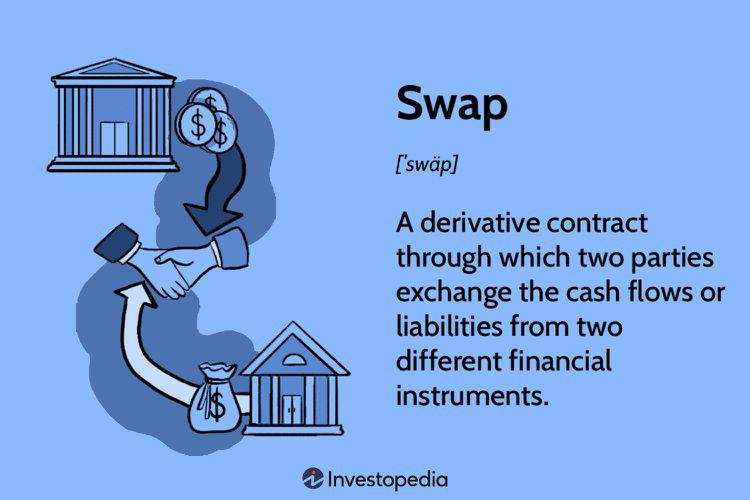

In the financial world, derivatives serve as powerful tools for managing risk and enhancing returns. These complex instruments derive their value from underlying assets, including stocks, bonds, and commodities, providing traders with versatile means to strategize in various market conditions. Among the array of derivatives, extendable swaps have emerged as a specialized form, recognized for their flexibility in adapting to shifting market dynamics.

Extendable swaps are a type of financial swap with the unique feature of an embedded option that allows one party to prolong the maturity of the swap. This distinctive characteristic renders extendable swaps particularly advantageous in scenarios characterized by market volatility or uncertainty, providing the involved parties the option to lock in terms that might align more favorably with future market states.



This article explores the dynamics and structure of financial derivatives, concentrating on extendable swaps. It examines their mechanisms, the advantages they offer, and their integration into modern trading strategies, particularly within algorithmic trading. Algorithmic trading, with its reliance on computer systems to execute trades at speeds and volumes beyond the capability of human traders, represents an area where extendable swaps can be utilized effectively to manage risks associated with market fluctuations.

By understanding the intricate functionality and strategic implications of extendable swaps, traders can better navigate the complexities of financial markets, optimizing their portfolios to leverage both risk management and potential returns.

## Table of Contents

## Understanding Financial Derivatives

Financial derivatives are financial instruments whose value is dependent on or derived from an underlying asset or group of assets. These can include stocks, bonds, commodities, currencies, interest rates, and market indexes. The primary utility of derivatives lies in their versatility for various financial strategies such as managing risk, enhancing returns, and accessing new markets. 

Derivatives are critical for hedging risks, which involves taking a position in a derivative to offset potential losses in the underlying asset. For instance, an investor holding a stock portfolio can use options to protect against downside risk. Similarly, derivatives enable speculation, allowing traders to bet on the future direction of market prices with potentially high leverage, thus amplifying both potential gains and losses.

Moreover, derivatives provide a mechanism for investors to engage with asset classes or investments without having to directly own them. This becomes particularly significant in markets that are otherwise difficult to access due to geographic, regulatory, or logistical barriers.

The most common types of derivatives are options, futures, forwards, and swaps:

1. **Options**: These are contracts that offer the buyer the right, but not the obligation, to buy or sell an underlying asset at a predetermined price before a specific expiration date. Options can be tailored into complex structures like call options and put options, which provide strategic avenues in various market conditions.

2. **Futures**: Futures contracts denote an agreement to buy or sell an asset at a predetermined future date and price. They are standardized and exchange-traded, providing liquidity and transparency. These are commonly utilized in commodities markets for hedging price movements.

3. **Forwards**: Similar to futures, forward contracts involve the agreement to buy or sell an asset at a future date for a fixed price. However, unlike futures, forwards are typically customized, over-the-counter instruments that do not trade on exchanges.

4. **Swaps**: Swaps are private agreements between two parties to exchange financial instruments. The most common version is interest rate swaps, where parties exchange cash flows based on fixed and floating interest rates to manage exposure to fluctuations in interest rates.

Each of these derivatives offers unique features and caters to different needs within financial markets. Through a combination of these instruments, investors and corporations can create diversified strategies to effectively manage the complex and interrelated risks encountered in today's global financial environment.

## What Are Extendable Swaps?

Extendable swaps are a specialized type of financial swap featuring an embedded option that grants one party the ability to extend the swap's maturity beyond its original expiration date. This embedded option differentiates extendable swaps from standard swaps, offering increased adaptability in fluctuating market environments. In an extendable swap, the party with the extension option, often the fixed-rate payer, has the discretion to decide whether to extend the swap. This decision is typically based on prevailing market conditions and anticipated future trends.

The additional flexibility provided by the option to extend is particularly advantageous in volatile markets, where the future trajectory of interest rates or asset prices is uncertain. For instance, in periods of rising interest rates, a fixed-rate payer might opt to extend the swap to continue benefiting from a lower, fixed rate rather than entering into a new swap at higher current rates. Conversely, if interest rates are expected to decline, the payer may choose not to exercise the extension option, allowing the swap to expire and potentially entering into a new agreement at advantageous rates.

The structure of extendable swaps involves key components similar to standard swaps: a fixed-rate payer and a floating-rate payer. The fixed-rate payer agrees to pay a predetermined fixed [interest rate](/wiki/interest-rate-trading-strategies), while the floating-rate payer pays an interest rate that is periodically reset based on a reference rate, such as LIBOR (London Interbank Offered Rate). The primary distinction lies in the inclusion of the extension feature, which is negotiated at the swap's inception.

The decision to extend a swap encompasses strategic considerations, including an assessment of the potential benefits of locking in current rates versus the risks of market reversals. The potential to extend the swap enhances the instrument's utility, making it an appealing choice for entities looking to manage interest rate risks effectively amid uncertainties.

## Mechanism and Advantages of Extendable Swaps

The mechanism of extendable swaps revolves around the unique feature that distinguishes them from standard swaps: the embedded extension option. This option is agreed upon by the involved parties at the inception of the swap contract, effectively granting the fixed-rate or floating-rate payer the ability to extend the swap's maturity. The process allows the parties to adapt to changing market conditions, providing a level of flexibility that is particularly useful in volatile financial environments.

Extendable swaps are advantageous when linked to commodities known for their price fluctuations, such as oil or agricultural products. This capacity to extend the swap provides the fixed price payer with strategic control over pricing commitments, allowing them to maintain favorable terms in scenarios where the market price of the underlying asset continues to rise. By locking in a lower price before a significant increase, the payer can achieve substantial cost savings. For example, if the market expects an increase in oil prices, an entity paying a fixed rate might choose to extend the swap to continue benefiting from a previously agreed lower price ceiling.

Moreover, the economic rationale for using extendable swaps includes the potential hedging benefits and cost management incentives. If the current economic indicators suggest impending upward trends in interest rates or commodity prices, an extendable swap can act as a safeguard against these changes. This feature of prolonging the swap’s life ensures that the parties involved sustain economic continuity without renegotiating entirely new contracts.

In mathematical terms, the valuation of the extension option can be approached through models that consider the probability of exercising the extension. These valuations could integrate dynamic programming algorithms within a Python framework, for instance. Here's a simple example to conceptualize how one might simulate scenarios to value the extension option:

```python
import numpy as np

# Parameters
initial_price = 100  # Initial fixed price of the commodity
volatility = 0.2  # Estimated market volatility
time_horizon = 1  # 1 year
num_simulations = 10000  # Number of simulations

# Simulation of potential future prices
price_paths = initial_price * np.exp(volatility * np.sqrt(time_horizon) * np.random.randn(num_simulations))

# Calculate the option to extend based on future prices compared to the fixed price
option_values = np.maximum(price_paths - initial_price, 0)

# Average value of the option to extend
average_option_value = np.mean(option_values)
print(f"Average Option Value: {average_option_value:.2f}")
```

This example provides a framework for simulating future potential price paths and evaluating the economic incentives of extending the swap under different market scenarios. It showcases the interaction of variables such as [volatility](/wiki/volatility-trading-strategies) and the resultant impact on pricing and strategy. By comprehending these dynamics, stakeholders can leverage extendable swaps to optimize financial outcomes, aligning contract terms with strategic market forecasts.

## Extendable Swaps in Algorithmic Trading

Algorithmic trading, also known as algo trading, implements computer algorithms to conduct trades at a speed and frequency far exceeding human capability. This technological advancement in trading is not just about speed; it also involves intricate strategies and large volumes of data to optimize trading outcomes. Extendable swaps offer unique opportunities when integrated into [algorithmic trading](/wiki/algorithmic-trading) systems, serving as instruments to manage financial risks specifically related to interest rate fluctuations and market volatility.

An extendable swap is a derivative contract that includes an embedded option allowing the extension of the swap's maturity. In algorithmic trading, customizing these swap features is essential to mitigate risks associated with rapid market changes. Algorithms can be programmed to assess various market conditions and predict interest rate trends with considerable accuracy. Once these conditions are met, the algorithm can automatically decide whether to exercise the extension option embedded within the swap, keeping the trading portfolio aligned with strategic goals.

By leveraging the extendable feature of these swaps, traders can dynamically adjust their exposure to market risks. This adjustment is crucial when dealing with volatile interest rates, as it allows for more controlled financial outcomes. Implementing an algorithm that can automate the decision-making process based on real-time data analysis can provide traders with a competitive edge. For instance, a Python script could be structured to use [machine learning](/wiki/machine-learning) models that process historical interest rate data alongside current market indicators to determine optimal times for extending swap contracts. 

```python
import pandas as pd
from sklearn.ensemble import RandomForestRegressor
from sklearn.model_selection import train_test_split

# Load historical interest rate data
data = pd.read_csv('interest_rate_data.csv')

# Define features and target variable
features = data.drop(columns=['interest_rate'])
target = data['interest_rate']

# Split data into training and testing sets
X_train, X_test, y_train, y_test = train_test_split(features, target, test_size=0.2, random_state=42)

# Train a decision-making model
model = RandomForestRegressor(n_estimators=100, random_state=42)
model.fit(X_train, y_train)

# Predict future interest rates
future_interest_rate = model.predict(X_test)

# Decision function to extend the swap based on predicted rate
def should_extend_swap(predicted_rate, current_rate, threshold=0.5):
    return predicted_rate > current_rate + threshold

# Example: checking if we should extend the swap
for rate in future_interest_rate:
    extend = should_extend_swap(rate, current_rate=5.0)
    if extend:
        print("Extend the swap.")
    else:
        print("Do not extend the swap.")
```

This example script demonstrates how a machine learning model could drive the decision to extend a swap based on predictive analytics. By integrating such adaptive mechanisms, algos can effectively manage and optimize risks proactively, ensuring that the trading strategies remain robust against unforeseen market shifts. The automation not only improves efficiency but reduces the cognitive load on traders, allowing them to focus on strategic decisions rather than routine processes.

## Risks and Considerations

While extendable swaps offer notable flexibility, they also inherently [carry](/wiki/carry-trading) various risks akin to those associated with other financial derivatives. These risks can broadly be categorized into market, credit, and [liquidity](/wiki/liquidity-risk-premium) risks. 

Market risk, often considered the most prominent, arises from adverse price movements in the underlying assets. Since the extendable option relies on market conditions at the time of extension, volatility can significantly impact the financial outcomes of these swaps. For example, if the market interest rates increase after entering the original swap agreement, extending the swap might result in higher borrowing costs than initially anticipated.

Credit risk, another fundamental concern, involves the potential for one party to default on their obligations. In the context of extendable swaps, the risk is exacerbated by the longer duration due to potential extensions. The likelihood of credit events or changes in credit quality increases over time, making counterparty assessment and risk mitigation strategies essential.

Liquidity risk pertains to the potential difficulty in unwinding or terminating the swap before its expiration. This risk becomes more pronounced in volatile markets, where finding a willing counterparty at a reasonable price might be challenging. With extendable swaps, liquidity issues can compound, particularly if the extension complicates matching tenor or terms with another party in the market.

The decision to extend a swap is influenced by market predictions and conditions at the decision point. Hence, the ability to make informed decisions relies heavily on accurate market analyses and reliable predictive models. Inadequate or incorrect predictions can lead to extensions under unfavorable terms, negating potential benefits.

Acknowledging and understanding these risks is paramount for traders and financial professionals incorporating extendable swaps into their trading strategies. Risk management practices, such as stress testing, scenario analysis, and maintaining robust credit evaluation processes, are essential to navigate the complexities associated with these financial instruments effectively. Additionally, leveraging technology and algorithmic tools can aid in managing risks and optimizing the timing and terms of swap extensions.

## Conclusion

Extendable swaps are a sophisticated financial derivative that provide significant strategic benefits, especially in volatile markets. Their primary advantage lies in their inherent flexibility, which allows traders to adapt to changing market conditions by extending the swap's maturity when beneficial. This can be particularly valuable in scenarios where market predictions indicate potential shifts in interest rates or commodity prices. 

For traders employing algorithmic models, extendable swaps can be an attractive option. They can be integrated into algorithmic trading strategies to enhance risk management and optimize trading decisions. With the capability to automate the decision-making process around extending swaps based on predictive algorithms, traders can more effectively manage the complexities of fluctuating markets and interest rates. 

Nonetheless, the effective use of extendable swaps requires a comprehensive understanding of their mechanics, potential opportunities, and the associated risks. While these swaps provide flexibility, they also expose traders to the typical risks associated with derivatives, including market, credit, and liquidity risks. The decision to extend a swap must be informed by accurate market predictions; thus, inadequate analysis or flawed algorithmic models can lead to unfavorable outcomes. 

Ultimately, the key to successful utilization of extendable swaps is balancing their flexibility with a solid grasp of market dynamics and risk management strategies. This ensures that traders can harness the benefits of these derivatives while mitigating potential downsides.

## References

Chen, J. (2021). "Extendable Swap: What It is, How It Works." Investopedia. Retrieved from https://www.investopedia.com/terms/e/extendable-swap.asp

Fincyclopedia.net. Retrieved December 24, 2024, from https://fincyclopedia.net

## References & Further Reading

[1]: Chen, J. (2021). ["Extendable Swap: What It is, How It Works."](https://www.investopedia.com/terms/e/extendable-swap.asp) Investopedia.

[2]: Hull, J. C. (2018). [Options, Futures, and Other Derivatives](https://www.semanticscholar.org/paper/Options%2C-Futures%2C-and-Other-Derivatives-Hull/89bdee500c8623864fc9eb7a471546aa713acc44). Pearson.

[3]: Jessen, C., & Krolzig, H-M. (2015). ["An Asset Pricing Approach to Liquidity Effects in Corporate Bond Markets."](https://www.jstor.org/stable/26166314) The Oxford Bulletin of Economics and Statistics, 77(5), 590-615.

[4]: Derman, E., & Miller, M. (2016). [My Life as a Quant: Reflections on Physics and Finance](https://www.amazon.com/My-Life-Quant-Reflections-Physics/dp/0470192739). Wiley.

[5]: Shreve, S. E. (2004). [Stochastic Calculus for Finance I: The Binomial Asset Pricing Model](https://link.springer.com/book/10.1007/978-0-387-22527-2). Springer.