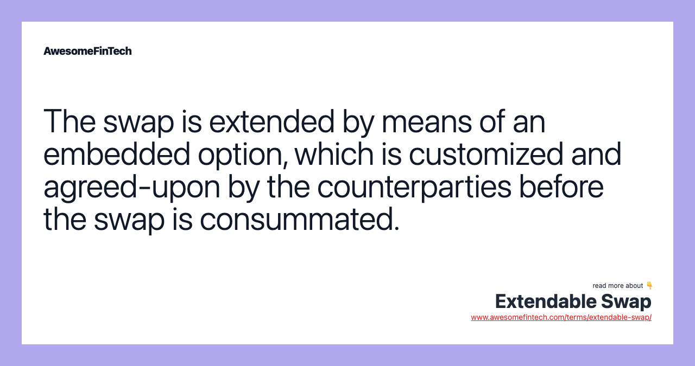

## Table of Contents

## What is an extendable swap?

An extendable swap is a type of financial agreement that lets you change the terms of the swap at certain times. A swap is when two parties agree to exchange cash flows or other financial instruments. In an extendable swap, one or both parties can choose to extend the swap's duration. This gives more flexibility because you can keep the swap going if it's still useful or end it if it's not.

For example, imagine you have a swap that lasts for five years, but after three years, you think it would be good to keep it going for another two years. With an extendable swap, you can choose to extend it. This can be helpful in managing financial risks because you can adapt to changes in the market or your financial situation. However, the option to extend usually comes with a cost, which is agreed upon when the swap is first set up.

## How does an extendable swap differ from a standard swap?

An extendable swap is different from a standard swap because it lets you change how long the swap lasts. In a standard swap, once you agree on the terms, like how long it will last and what you will exchange, you can't change them. But with an extendable swap, you can choose to make it last longer at certain times. This can be really helpful if things change and you want to keep the swap going.

The option to extend the swap usually costs something, which is decided when you first make the swap. This is different from a standard swap, where you don't have this extra choice. Having the ability to extend the swap gives you more flexibility to deal with changes in the market or your own financial needs. So, an extendable swap is like a standard swap but with an added feature that lets you adjust the duration if you need to.

## What are the basic components of an extendable swap?

An extendable swap has a few key parts that make it work. First, there's the basic swap agreement, which is like any other swap where two parties agree to exchange cash flows or other financial instruments. This part sets out the original terms, like how long the swap will last, what you're swapping, and the amounts involved. Then, there's the option to extend the swap. This means at certain times, one or both parties can choose to make the swap last longer. This option is agreed upon at the start and usually costs something, which is part of the deal.

The other important part is the rules for extending the swap. These rules say when you can extend it, how long you can extend it for, and any costs involved. For example, you might be able to extend the swap after three years for another two years, but you'll have to pay a fee to do that. These rules are set at the beginning so everyone knows what to expect. This flexibility can be really helpful because it lets you adjust the swap if your situation or the market changes.

## Who typically uses extendable swaps and why?

Extendable swaps are often used by businesses and financial institutions that want more flexibility in managing their financial risks. These organizations might use swaps to protect against changes in interest rates, currency values, or commodity prices. An extendable swap gives them the option to keep the swap going if it's still useful, which can be important if the market conditions or their financial needs change over time. For example, a company might use an extendable swap to manage the risk of rising interest rates on its debt, but if rates stay low, they can choose to extend the swap and keep benefiting from it.

The main reason people use extendable swaps is to have more control over their financial strategies. If a company thinks the swap is still helping them manage risks or save money, they can extend it. This can be really helpful in uncertain markets where things can change quickly. On the other hand, if the swap isn't useful anymore, they can let it end without extending it. This flexibility means they can adapt to new situations without being stuck with a swap that doesn't meet their needs anymore.

## What are the potential benefits of using an extendable swap?

One big benefit of using an extendable swap is that it gives you more flexibility. With a regular swap, you're stuck with the terms you agreed on at the start, no matter what happens. But with an extendable swap, you can choose to keep it going if it's still helping you. This can be really useful if the market changes or if your financial situation shifts. For example, if you're using a swap to protect against rising interest rates and rates stay low, you can extend the swap and keep benefiting from it.

Another benefit is that extendable swaps can help you manage risks better. Since you can extend the swap, you have more control over how you handle financial risks like changes in interest rates, currency values, or commodity prices. If the swap is still doing a good job at managing these risks, you can keep it going. This means you don't have to find a new way to protect yourself if the current swap is working well. Plus, knowing you have the option to extend can give you peace of mind in uncertain times.

## What risks are associated with extendable swaps?

One risk with extendable swaps is the cost of the extension option. When you set up an extendable swap, you usually have to pay a fee for the right to extend it later. This can make the swap more expensive overall, and if you decide not to extend it, you might feel like you wasted money on the option. Another risk is that the decision to extend can be tricky. If you choose to extend the swap and the market moves against you, you could end up in a worse financial position than if you had let it end.

There's also the risk of over-reliance on the extendable feature. If you're counting too much on being able to extend the swap, you might not be prepared for what happens if you decide not to extend it or can't extend it for some reason. This could leave you exposed to risks you thought the swap would protect you from. It's important to carefully think about when and why you might want to extend the swap, and have a backup plan in case things don't go as expected.

## How is the extension feature of an extendable swap exercised?

The extension feature of an extendable swap is used at certain times that are agreed upon when the swap is first set up. These times are called extension dates. If you want to extend the swap, you have to tell the other party before the extension date. This is usually done in writing, like sending an email or a letter, to make sure everyone knows what's happening. There might also be a fee to pay for extending the swap, which you'll have to take care of when you decide to extend.

Once you've told the other party you want to extend and paid any fees, the swap will keep going for the extra time you agreed on. This could be a few months or a few years, depending on what was decided at the start. It's important to keep track of the extension dates and think carefully about whether extending the swap will help you. If you miss the extension date or decide not to extend, the swap will end as originally planned.

## What are the common terms and conditions associated with extending an extendable swap?

When you set up an extendable swap, you agree on some key terms and conditions for extending it. One important term is the extension dates, which are specific times when you can choose to extend the swap. You need to tell the other party before these dates if you want to extend, usually in writing, like an email or a letter. There might also be a fee for extending the swap, which you have to pay when you decide to extend. It's important to know these dates and fees so you can plan ahead.

Another common condition is how long you can extend the swap for. This could be a set amount of time, like another year or two years, or it might depend on certain conditions, like market rates. You'll also need to think about any rules or limits on extending the swap, like how many times you can extend it or if there are any special conditions that need to be met. Knowing all these terms and conditions helps you make a smart decision about whether to extend the swap or let it end as planned.

## How do market conditions affect the decision to extend an extendable swap?

Market conditions can have a big impact on whether you decide to extend an extendable swap. If the market is moving in a way that makes the swap still useful for you, like if interest rates are staying low when you're using the swap to protect against rising rates, you might choose to extend it. This way, you can keep benefiting from the swap without having to find a new one. On the other hand, if the market changes and the swap isn't helping you anymore, you might decide not to extend it. For example, if interest rates go up a lot, extending a swap that was meant to protect against low rates might not make sense.

It's also important to think about how the market might change in the future. If you think the market will keep going in a way that makes the swap useful, you might want to extend it. But if you're not sure, or if you think the market will change a lot, you might decide not to extend. This can be a tricky decision because you have to guess what might happen, but knowing the current market conditions and having a good idea of where they might go can help you make a smart choice about extending your swap.

## What valuation methods are used for extendable swaps?

Valuing an extendable swap can be a bit tricky because you have to think about the basic swap part and the option to extend it. For the basic swap part, you can use the same methods you use for regular swaps, like looking at the present value of the cash flows that will be exchanged. This means figuring out how much the money you'll get or pay in the future is worth right now, considering things like interest rates and how long the swap will last.

The tricky part is valuing the option to extend the swap. This is like valuing any financial option, where you use models like the Black-Scholes model or binomial models. These models help you figure out how much the right to extend the swap is worth, based on things like how likely it is that you'll want to extend it, what the costs of extending are, and how the market might change. So, to value an extendable swap, you add the value of the basic swap to the value of the extension option, which gives you the total value of the extendable swap.

## How do extendable swaps fit into broader financial strategies?

Extendable swaps are useful tools in broader financial strategies because they give companies and financial institutions more flexibility in managing their risks. When a company uses a swap to protect against changes in interest rates, currency values, or commodity prices, an extendable swap lets them keep the swap going if it's still helping them. This can be really important if the market or their financial situation changes over time. For example, if a company is using a swap to manage the risk of rising interest rates on its debt, but rates stay low, they can extend the swap and keep benefiting from it.

In a bigger financial plan, extendable swaps help companies adapt to new situations without being stuck with a swap that doesn't meet their needs anymore. If the swap is still doing a good job at managing risks or saving money, they can choose to extend it. This flexibility means they can keep using the same tool to protect themselves without having to find a new one. But it's important for companies to carefully think about when and why they might want to extend the swap, and have a backup plan in case things don't go as expected. This way, extendable swaps can be a key part of a company's overall strategy to manage financial risks and stay stable in uncertain times.

## What are some real-world examples of extendable swaps and their outcomes?

A real-world example of an extendable swap could be a company that takes out a loan with a floating [interest rate](/wiki/interest-rate-trading-strategies). To protect against rising interest rates, the company enters into an extendable swap with a bank, where they swap their floating rate payments for fixed rate payments. After a few years, interest rates stay low, so the company decides to extend the swap for another two years. This helps the company save money because they keep paying the lower fixed rate instead of the higher floating rate that might have gone up if they hadn't extended the swap.

Another example is a multinational company that uses an extendable swap to manage currency risk. The company has revenues in euros but expenses in dollars, so they enter into a swap to exchange euros for dollars at a fixed rate. If the euro stays strong against the dollar, the company can extend the swap and keep getting a good exchange rate. But if the euro weakens, they might choose not to extend the swap and find another way to manage their currency risk. This flexibility helps the company adapt to changes in the currency market and protect their profits.

## References & Further Reading

[1]: Chen, J. (2021). ["Extendable Swap: What It is, How It Works."](https://www.investopedia.com/terms/e/extendable-swap.asp) Investopedia.

[2]: Hull, J. C. (2018). [Options, Futures, and Other Derivatives](https://www.semanticscholar.org/paper/Options%2C-Futures%2C-and-Other-Derivatives-Hull/89bdee500c8623864fc9eb7a471546aa713acc44). Pearson.

[3]: Jessen, C., & Krolzig, H-M. (2015). ["An Asset Pricing Approach to Liquidity Effects in Corporate Bond Markets."](https://www.jstor.org/stable/26166314) The Oxford Bulletin of Economics and Statistics, 77(5), 590-615.

[4]: Derman, E., & Miller, M. (2016). [My Life as a Quant: Reflections on Physics and Finance](https://www.amazon.com/My-Life-Quant-Reflections-Physics/dp/0470192739). Wiley.

[5]: Shreve, S. E. (2004). [Stochastic Calculus for Finance I: The Binomial Asset Pricing Model](https://link.springer.com/book/10.1007/978-0-387-22527-2). Springer.