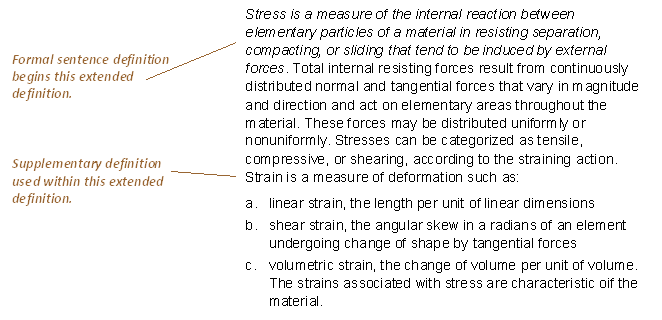

## Table of Contents

## What is an extended explanation?

An extended explanation is a detailed and thorough description of a topic or concept. It goes beyond a simple or brief explanation by providing more information, examples, and sometimes different perspectives. This type of explanation is useful when someone needs to understand something deeply or when a topic is complex and requires more than just a basic overview.

For example, if someone asks about how a car engine works, a simple explanation might just say that it uses fuel to create energy that moves the car. But an extended explanation would go into details about the different parts of the engine, like the cylinders, pistons, and spark plugs, and how they work together. It might also explain the combustion process, the role of the fuel system, and even compare different types of engines, like diesel and gasoline engines. This way, the person gets a complete picture and a deeper understanding of the topic.

## Why are extended explanations important?

Extended explanations are important because they help people understand things better. When you explain something in detail, you give more information and examples. This makes it easier for someone to learn and remember the topic. If you only give a short explanation, people might not get all the information they need. They might have questions or be confused. But with an extended explanation, you cover everything and answer possible questions before they even come up.

Also, extended explanations are good for complex topics. Some things are hard to understand if you just hear a little bit about them. For example, if you want to learn about how the internet works, a short explanation won't be enough. You need to know about servers, data packets, and protocols. An extended explanation can break down these parts and show how they fit together. This way, even tough subjects become clearer and easier to grasp.

## How do extended explanations differ from brief explanations?

Extended explanations and brief explanations are different in how much detail they give. A brief explanation is short and to the point. It gives just the basic facts or ideas about a topic. For example, if someone asks about photosynthesis, a brief explanation might say it's how plants make food using sunlight. This is quick and simple, but it doesn't go into depth.

On the other hand, an extended explanation goes much further. It gives a lot more information and often includes examples, steps, or different parts of the topic. Using the same example of photosynthesis, an extended explanation would talk about chlorophyll, the role of sunlight, how water and carbon dioxide are used, and how oxygen is produced. This type of explanation helps people understand the topic better because it covers everything in detail.

## In which contexts are extended explanations most useful?

Extended explanations are most useful in educational settings, like schools or training programs. When teachers or trainers need to explain complex subjects, like science or math, they use extended explanations. This helps students understand the topic better because they get all the details and examples. For example, if a teacher is explaining how the human body works, they might talk about different organs, systems, and how they all work together. This way, students learn more than just the basics and can really understand the subject.

Extended explanations are also important in technical fields, like engineering or computer programming. When someone is learning how to build something or write code, they need to know all the steps and details. A brief explanation might not be enough for them to do the job right. For example, if a programmer is learning a new coding language, they need to know about syntax, functions, and how to debug their code. An extended explanation helps them learn all of this and do their work well.

## What are the key components of an effective extended explanation?

An effective extended explanation needs to have clear and organized information. This means starting with the basics and then moving on to more complex parts. For example, if you're explaining how a computer works, you might start with what a computer is, and then talk about the different parts like the CPU, memory, and storage. Each part should be explained well so people can understand how it fits into the whole picture. Using simple words and short sentences can help make the explanation easier to follow.

Another important part of an extended explanation is giving examples and real-life situations. This makes the topic more interesting and helps people see how it applies to their lives. For instance, if you're explaining how a car engine works, you could talk about how it helps a car move faster on the highway. Including pictures, diagrams, or videos can also make the explanation more clear. These visual aids can show things that are hard to explain with words alone.

Finally, an effective extended explanation should also answer questions that people might have. This means thinking about what someone might not understand and explaining it before they even ask. It's also good to repeat important points in different ways to make sure they stick. By covering all these parts, an extended explanation can help people really understand a topic and remember it better.

## How can one structure an extended explanation for clarity?

To structure an extended explanation for clarity, start with an introduction that gives a quick overview of the topic. This sets the stage and helps the listener or reader know what to expect. After the introduction, break down the topic into smaller parts or steps. Explain each part clearly and in order, moving from simple to more complex ideas. This helps people follow along without getting overwhelmed. Make sure to use headings or clear transitions between sections to show when you're moving from one part to another.

Including examples and real-life situations is also important for clarity. When you explain how something works or why it's important, use examples that people can relate to. This makes the topic more interesting and easier to understand. You can also use pictures, diagrams, or videos to show what you're talking about. These visual aids can help explain things that are hard to describe with words alone. Finally, end with a summary that goes over the main points again. This helps people remember what they learned and ties everything together.

## What techniques can be used to maintain audience engagement in an extended explanation?

To keep an audience engaged during an extended explanation, it's important to use stories and real-life examples. People like hearing about things that relate to their own lives. If you're explaining how a car engine works, you could tell a story about a time when understanding the engine helped someone fix their car on the road. This makes the topic more interesting and helps people see why it's important. You can also ask questions to keep the audience thinking. For example, you might ask, "Have you ever wondered how your car can go from 0 to 60 miles per hour?" This gets people involved and thinking about the topic.

Another technique is to use different ways of explaining the same idea. You can explain something in words, show it in a picture, and maybe even act it out. This keeps the explanation from getting boring and helps people understand it better. Using humor can also help keep the audience interested. A funny story or a light-hearted comment can make people smile and stay focused. Finally, make sure to check in with your audience from time to time. Ask if they have any questions or if there's anything they don't understand. This shows that you care about their learning and helps keep them engaged.

## How does the audience's prior knowledge affect the approach to an extended explanation?

The audience's prior knowledge is really important when you're giving an extended explanation. If people already know a lot about the topic, you can start with more advanced ideas and not spend as much time on the basics. For example, if you're talking to a group of engineers about how a car engine works, you can skip the simple parts and go straight to the more complex details. But if your audience doesn't know much about the topic, you need to start with the basics and explain things more slowly. This way, everyone can understand and follow along.

Understanding the audience's prior knowledge also helps you choose the right examples and words. If you're explaining something to people who are new to the topic, you need to use simple words and everyday examples. But if your audience already knows a lot, you can use more technical words and examples that are more specific to the topic. By knowing what your audience already understands, you can make your explanation more interesting and helpful for everyone.

## What are common challenges faced when delivering extended explanations, and how can they be overcome?

One common challenge when delivering extended explanations is keeping the audience interested. It's hard to keep people focused when you're talking for a long time about a complex topic. To overcome this, you can use stories, real-life examples, and even a bit of humor to make the explanation more engaging. Asking questions and checking in with the audience can also help keep them involved and make sure they understand what you're saying.

Another challenge is making sure the explanation is clear and easy to follow. When you're explaining something in detail, it's easy to get lost in the details or use words that are too hard for some people to understand. To solve this, start with the basics and build up to more complex ideas slowly. Use simple language and break the topic into smaller parts. Visual aids like pictures or diagrams can also help make things clearer and easier to understand. By keeping the explanation organized and using examples, you can help your audience follow along and learn more effectively.

## How can visual aids enhance an extended explanation?

Visual aids can make an extended explanation much easier to understand. When you use pictures, diagrams, or videos, you can show things that are hard to explain with words alone. For example, if you're explaining how a car engine works, a diagram can show all the parts and how they fit together. This helps people see what you're talking about and understand it better. Visual aids also make the explanation more interesting and can keep the audience engaged. When people can see what you're explaining, they are more likely to stay focused and remember the information.

Using visual aids can also help you explain complex ideas in a simpler way. Sometimes, words can be confusing, especially when you're talking about something technical. But a picture or a video can show the same thing in a way that's easier to understand. For instance, if you're teaching about the water cycle, a diagram can show how water moves from the ocean to the sky and back again. This visual helps people see the whole process at once, which can be hard to understand from just listening to words. By using visual aids, you can make sure your extended explanation is clear and effective for everyone.

## What role does feedback play in refining extended explanations?

Feedback is really important when you're trying to make an extended explanation better. When people tell you what they understand and what they don't, you can change your explanation to make it clearer. If someone says they're confused about a part, you can explain it again in a different way or give more examples. This helps everyone understand better. Also, if people say they like certain parts of your explanation, you know to keep doing those things because they work well.

Getting feedback also helps you know if you're using the right words and if your examples make sense to the audience. If someone tells you that a word is too hard or an example doesn't fit, you can change it to make it easier to understand. This way, your explanation becomes more helpful for everyone. By listening to feedback and making changes, you can keep improving your extended explanation until it's the best it can be.

## How can one assess the effectiveness of an extended explanation?

To assess the effectiveness of an extended explanation, you can look at how well people understand the topic after you explain it. One way to do this is by asking questions. If people can answer questions about the topic correctly, it means they understood what you said. You can also watch how people react while you're explaining. If they seem interested and ask good questions, it's a sign that your explanation is working well. Another way is to see if people can use what they learned. For example, if you explained how to fix a bike and someone goes and fixes their bike correctly, it shows your explanation was effective.

Feedback from the audience is also important for assessing the effectiveness of an extended explanation. When people tell you what they liked or didn't understand, you can see what parts of your explanation need to be better. If someone says they were confused about a certain part, it means you might need to explain it differently next time. On the other hand, if people say they found the explanation clear and helpful, it's a good sign that your explanation is working well. By listening to feedback and seeing how well people understand and use the information, you can tell if your extended explanation is effective.

## References & Further Reading

[1]: Bergstra, J., Bardenet, R., Bengio, Y., & Kégl, B. (2011). ["Algorithms for Hyper-Parameter Optimization."](https://papers.nips.cc/paper/4443-algorithms-for-hyper-parameter-optimization) Advances in Neural Information Processing Systems 24.

[2]: ["Advances in Financial Machine Learning"](https://www.amazon.com/Advances-Financial-Machine-Learning-Marcos/dp/1119482089) by Marcos Lopez de Prado

[3]: ["Evidence-Based Technical Analysis: Applying the Scientific Method and Statistical Inference to Trading Signals"](https://www.amazon.com/Evidence-Based-Technical-Analysis-Scientific-Statistical/dp/0470008741) by David Aronson

[4]: ["Machine Learning for Algorithmic Trading"](https://github.com/stefan-jansen/machine-learning-for-trading) by Stefan Jansen

[5]: ["Quantitative Trading: How to Build Your Own Algorithmic Trading Business"](https://www.amazon.com/Quantitative-Trading-Build-Algorithmic-Business/dp/1119800064) by Ernest P. Chan