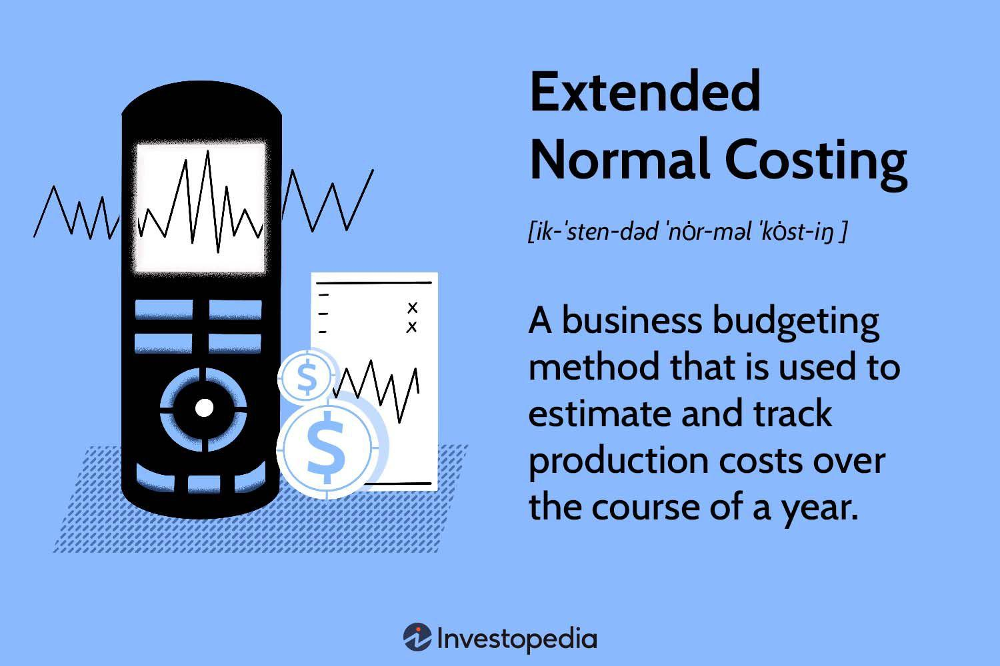

## Table of Contents

## What is Extended Normal Costing?

Extended Normal Costing is a method used by businesses to figure out how much it costs to make their products. It's a bit different from traditional costing because it uses actual costs for some things, like materials, and standard or estimated costs for other things, like labor and overhead. This mix helps companies keep track of costs without having to wait for all the real numbers to come in, which can take a lot of time.

This method is really helpful for businesses that want to know their costs quickly. By using standard costs for labor and overhead, companies can plan and budget more easily. It also makes it simpler to compare how much they thought things would cost with how much they actually cost. This way, they can see if they need to make changes to save money or improve their processes.

## How does Extended Normal Costing differ from traditional costing methods?

Extended Normal Costing and traditional costing methods both aim to figure out how much it costs to make products, but they do it in different ways. Traditional costing, also known as actual costing, uses the real costs of everything - materials, labor, and overhead. This means a company waits until all the actual costs are known before calculating the total cost of a product. This can be good for accuracy but can take a long time because you have to wait for all the numbers to come in.

On the other hand, Extended Normal Costing mixes things up. It uses the actual costs for materials, which are usually easy to track, but it uses standard or estimated costs for labor and overhead. This means companies can get a quick idea of their costs without waiting for all the real numbers. It's faster and helps with planning and budgeting because you can use the same standard costs for a while, making it easier to compare costs over time and see if you're doing better or worse than expected.

So, the big difference is in how quickly you can get cost information and how you use it. Traditional costing gives you a very accurate but slow picture of costs, while Extended Normal Costing gives you a quicker, less detailed but still useful picture. This can be really helpful for businesses that need to make decisions fast and want to keep a close eye on their costs without getting bogged down in details.

## What are the key components of Extended Normal Costing?

Extended Normal Costing has three main parts: actual costs for materials, standard costs for labor, and standard costs for overhead. The actual costs for materials are the real amounts you pay for things like wood, metal, or fabric that go into making your product. These costs are easy to track because you can see exactly how much you spend on each piece of material.

The standard costs for labor and overhead are different. They are estimates or set amounts that you decide on ahead of time. For labor, this could be an hourly rate you expect to pay workers. For overhead, it might be an estimated cost for things like rent, utilities, or machine maintenance that you spread out over all your products. Using these standard costs helps you get a quick idea of your total costs without waiting for all the real numbers to come in.

This mix of actual and standard costs in Extended Normal Costing helps businesses plan better and make decisions faster. By using standard costs for labor and overhead, companies can compare what they thought things would cost with what they actually cost. This way, they can see if they need to make changes to save money or improve how they make things.

## Can you explain the process of implementing Extended Normal Costing in a business?

To start using Extended Normal Costing in a business, you first need to figure out the actual costs of your materials. This means keeping track of how much you spend on things like wood, metal, or fabric that go into making your products. You'll need to set up a system to record these costs accurately as they happen. Once you have a good handle on your material costs, you can move on to setting standard costs for labor and overhead. For labor, you might decide on an hourly rate that you expect to pay your workers. For overhead, you'll estimate costs like rent, utilities, or machine maintenance and spread them out over all your products.

After setting these standard costs, you'll use them along with your actual material costs to figure out the total cost of making each product. This means whenever you make something, you'll add up the real cost of the materials used, plus the standard labor cost, and the standard overhead cost. This gives you a quick idea of your costs without waiting for all the real numbers to come in. It's important to keep an eye on how your actual costs compare to your standard costs. If you see big differences, you might need to update your standard costs to make sure they're still a good estimate of what you're actually spending.

Using Extended Normal Costing helps businesses plan better and make decisions faster. By comparing what you thought things would cost with what they actually cost, you can see if you need to make changes to save money or improve how you make things. It's a good way to keep a close eye on your costs without getting bogged down in details, and it can help you run your business more smoothly.

## What are the advantages of using Extended Normal Costing over other costing methods?

Extended Normal Costing has some big advantages over other costing methods. One of the main ones is that it's faster. With this method, you use the real costs for materials, which are easy to track, but you use set or estimated costs for labor and overhead. This means you don't have to wait for all the real numbers to come in before you can figure out how much it costs to make your products. This can be really helpful for businesses that need to make quick decisions and want to keep a close eye on their costs without getting bogged down in details.

Another advantage is that it helps with planning and budgeting. Because you use the same standard costs for labor and overhead for a while, it's easier to compare what you thought things would cost with what they actually cost. This way, you can see if you're doing better or worse than expected and make changes if you need to. It also makes it simpler to plan for the future because you have a good idea of what your costs will be, which can help you run your business more smoothly.

## What types of businesses or industries would benefit most from Extended Normal Costing?

Businesses that make a lot of the same product over and over again would really benefit from using Extended Normal Costing. This method is great for factories or manufacturing companies that need to know their costs quickly. Since they use the same materials and processes for many products, they can easily keep track of the actual costs for materials. Using standard costs for labor and overhead helps them plan and budget without waiting for all the real numbers to come in, which can take a long time.

Companies in industries where costs can change a lot might also find Extended Normal Costing useful. For example, businesses in construction or custom manufacturing often have to deal with changing prices for materials and labor. By using actual costs for materials and standard costs for labor and overhead, these companies can get a quick idea of their costs and make decisions faster. This helps them stay on top of their budgets and adjust to changes in costs more easily.

## How does Extended Normal Costing handle overhead costs?

Extended Normal Costing uses standard costs to handle overhead costs. Overhead costs are things like rent, utilities, or machine maintenance that you need to make your products but don't go directly into them. Instead of waiting to know the exact amount of these costs, you estimate them ahead of time. You decide on a standard cost for overhead that you think will be close to what you actually spend. This way, you can quickly figure out how much it costs to make your products without waiting for all the real numbers to come in.

Using standard costs for overhead helps businesses plan and budget better. Since you use the same standard costs for a while, it's easy to compare what you thought your overhead would cost with what it actually costs. If you see big differences, you might need to update your standard costs to make sure they're still a good estimate. This method helps you keep a close eye on your overhead costs and make changes if you need to, without getting bogged down in details.

## What are the common challenges faced when adopting Extended Normal Costing?

One common challenge businesses face when adopting Extended Normal Costing is setting the right standard costs for labor and overhead. It can be hard to guess these costs correctly because they can change a lot. If the standard costs are too low, you might think you're making more money than you really are. If they're too high, you might think you're losing money when you're actually doing okay. Getting these numbers right is important for making good decisions about your business.

Another challenge is keeping the standard costs up to date. Over time, the actual costs of labor and overhead can change because of things like inflation, new technology, or changes in how you make your products. If you don't update your standard costs to match these changes, they won't be a good estimate anymore. This means you have to keep a close eye on your costs and be ready to change your standard costs when needed, which can take time and effort.

## How can Extended Normal Costing improve decision-making in a company?

Extended Normal Costing can help a company make better decisions by giving them quick and clear information about their costs. When you use this method, you know the real cost of materials right away, and you use set costs for labor and overhead. This means you don't have to wait for all the real numbers to come in before you can figure out how much it costs to make your products. With this quick information, you can make decisions faster. For example, if you see that the cost of making something is higher than you thought, you can quickly decide to change how you make it or find cheaper materials.

Another way Extended Normal Costing helps with decision-making is by making it easy to compare what you thought things would cost with what they actually cost. By using the same standard costs for labor and overhead for a while, you can see if you're doing better or worse than expected. This helps you figure out if you need to make changes to save money or improve how you make things. For example, if your actual labor costs are always higher than your standard costs, you might decide to train your workers better or find ways to make them work more efficiently. This kind of information helps you make smart choices that can make your business run better and save money.

## What role does technology play in the application of Extended Normal Costing?

Technology is really important for using Extended Normal Costing in a business. It helps keep track of the actual costs of materials, which is a big part of this method. With computers and special software, you can quickly see how much you're spending on things like wood or fabric. This makes it easier to add up the real costs and use them with the standard costs for labor and overhead. Technology also helps you set and update those standard costs. You can use software to look at past costs and make good guesses about what future costs might be.

Another way technology helps is by making it easy to compare what you thought things would cost with what they actually cost. With the right tools, you can see these differences quickly and figure out if you need to make changes. This can help you make better decisions faster. For example, if you see that your actual labor costs are higher than your standard costs, you can use technology to find out why and fix it. Overall, technology makes Extended Normal Costing easier to use and more helpful for running your business smoothly.

## How does Extended Normal Costing integrate with other financial management systems?

Extended Normal Costing works well with other financial management systems because it helps give a quick and clear picture of costs. When you use Extended Normal Costing, you track the real costs of materials and use set costs for labor and overhead. This information can be easily put into other systems like accounting software or budgeting tools. These systems use the cost data to make financial reports, help with budgeting, and figure out how much profit you're making. By using Extended Normal Costing, you make sure the cost information going into these systems is up-to-date and useful for making decisions.

Also, Extended Normal Costing helps with other financial management tasks like planning and forecasting. Because you use the same standard costs for labor and overhead for a while, it's easy to see how your costs change over time. This makes it simpler to plan for the future and predict what your costs might be. When you add this information to other financial systems, it helps you make better plans and budgets. It also makes it easier to see if you need to make changes to save money or improve how you make things. Overall, Extended Normal Costing fits well with other financial management systems and helps you run your business better.

## What are the latest trends and developments in Extended Normal Costing?

One of the latest trends in Extended Normal Costing is the increased use of technology and automation. Many businesses now use special software to help them track the real costs of materials and set standard costs for labor and overhead. This makes it easier and faster to figure out how much it costs to make their products. With technology, companies can also update their standard costs more often to make sure they stay accurate. This helps them make better decisions and keep their costs under control.

Another development is the growing focus on using Extended Normal Costing for better planning and forecasting. Companies are finding that this method helps them see how their costs change over time, which makes it easier to plan for the future. By using the same standard costs for a while, businesses can compare what they thought things would cost with what they actually cost. This helps them find ways to save money and improve how they make things. Overall, these trends show that Extended Normal Costing is becoming more important for businesses that want to run smoothly and make smart decisions.

## What is Understanding Normal Costing?

Normal costing is an accounting method used for product costing that aims to assign manufacturing costs to products more consistently and predictably. It is predominantly utilized in manufacturing settings where the production workload varies, enabling businesses to estimate costs more accurately over time.

Normal costing fits within the broader framework of cost accounting, where costs associated with the production process, such as direct materials, direct labor, and manufacturing overhead, are traced and allocated to products. This cost allocation is essential for determining the cost of goods sold and maintaining profitability.

### Allocation of Direct Costs

In normal costing, direct costs, which include direct materials and direct labor, are allocated to products based on actual quantities used. Direct materials refer to raw materials that are traceable to the finished product, while direct labor encompasses wages paid to workers directly involved in production. For example, if a company manufactures chairs, the wood might be a direct material, and the wages of factory workers assembling the chairs would be considered direct labor costs.

The cost of direct materials is calculated by multiplying the actual quantity of materials used by the price per unit. Similarly, direct labor costs are computed based on the actual hours worked and the rate per hour. The formula for calculating direct costs is:

$$
\text{Direct Costs} = (\text{Quantity of Materials} \times \text{Price per Unit}) + (\text{Labor Hours} \times \text{Hourly Wage})
$$

### Role of Overhead Rates

Overhead costs consist of indirect costs, such as utilities, depreciation, and maintenance, that cannot be directly traced to specific products. In normal costing, these overhead costs are applied to products using a predetermined overhead rate. This rate is established at the beginning of an accounting period, based on estimated annual overhead costs and an expected activity level, such as machine hours or labor hours.

The overhead rate is calculated using the formula:

$$
\text{Predetermined Overhead Rate} = \frac{\text{Estimated Total Overhead Costs}}{\text{Estimated Total Activity Base}}
$$

By applying this rate to the actual activity base incurred during production, businesses allocate overhead costs to products consistently. This method smoothens fluctuations in overhead costs, which might occur due to seasonal changes or other variables.

### Advantages of Normal Costing

Normal costing offers several advantages in traditional manufacturing environments:

1. **Consistency:** By using predetermined rates, normal costing allows for cost allocation consistency throughout the period, aiding in budgeting and financial analysis.

2. **Simplification:** It simplifies the accounting process by using estimates for overhead costs, reducing the need to adjust for actual overhead costs continuously.

3. **Suitable for Long-term Planning:** This method is beneficial for long-term financial planning and decision-making by providing stable cost information.

4. **Flexibility:** It can adapt to varying production levels by adjusting the activity base used for allocating overhead.

### Real-life Examples

A practical example of normal costing can be observed in automotive manufacturing, where manufacturers estimate direct material costs like metal and fabric, alongside labor costs associated with assembly. By applying predetermined overhead rates based on direct labor hours or machine hours, manufacturers can forecast product costs more accurately.

Another example is seen in electronics manufacturing, where companies use normal costing to allocate costs of components like semiconductors and capacitors, alongside direct labor for assembly, which assists in maintaining cost consistency despite technological changes and demand fluctuations.

Overall, normal costing is a vital tool in cost accounting, providing a framework that helps businesses balance accuracy and efficiency in cost management, thereby facilitating more informed financial decision-making.

## References & Further Reading

[1]: Bergstra, J., Bardenet, R., Bengio, Y., & Kégl, B. (2011). ["Algorithms for Hyper-Parameter Optimization."](https://proceedings.neurips.cc/paper/2011/file/86e8f7ab32cfd12577bc2619bc635690-Paper.pdf) Advances in Neural Information Processing Systems 24.

[2]: ["Advances in Financial Machine Learning"](https://www.amazon.com/Advances-Financial-Machine-Learning-Marcos/dp/1119482089) by Marcos Lopez de Prado

[3]: ["Evidence-Based Technical Analysis: Applying the Scientific Method and Statistical Inference to Trading Signals"](https://www.amazon.com/Evidence-Based-Technical-Analysis-Scientific-Statistical/dp/0470008741) by David Aronson

[4]: ["Machine Learning for Algorithmic Trading"](https://github.com/stefan-jansen/machine-learning-for-trading) by Stefan Jansen

[5]: ["Quantitative Trading: How to Build Your Own Algorithmic Trading Business"](https://github.com/LucindaYa/quant-resources/blob/master/Quantitative%20Trading%20How%20to%20Build%20Your%20Own%20Algorithmic%20Trading%20Business.pdf) by Ernest P. Chan