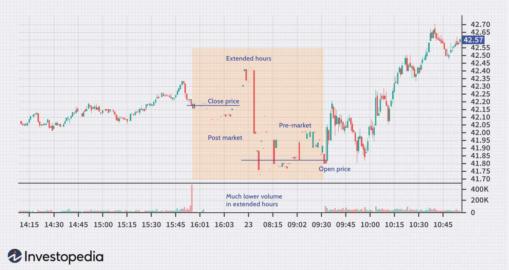

In trading, comprehending the subtleties and intricacies of various trading practices is indispensable for achieving success and managing risks effectively. Trading, by nature, involves a multitude of elements that can influence market behavior and trading strategies. In this article, we delve into fundamental aspects that include trading risks, trading hours, extended trading, and algorithmic (algo) trading, each of which plays a pivotal role in shaping modern trading techniques.

Trading risks constitute a core component of any trading strategy, reflective of market volatility and liquidity constraints. An adept understanding of these risks is necessary not only to mitigate potential losses but also to optimize returns. Trading hours, denoting the specific window in which markets operate, impact market accessibility and liquidity. Typically, major U.S. stock exchanges operate from 9:30 a.m. to 4:00 p.m. EST, and these hours affect trading behavior and strategy formulation.



Extended trading, which occurs beyond regular trading hours, provides opportunities for traders to respond to off-hour events and news. It encompasses pre-market and after-hours sessions and is typically less liquid, often characterized by increased volatility and wider bid-ask spreads. These sessions allow market participants to capitalize on developments occurring outside standard market times, although they also present additional challenges including heightened market risks.

Algorithmic trading, or algo trading, employs sophisticated algorithms to execute trades based on specific criteria. This method is instrumental in managing the rapidity and complexity of trading, especially during extended hours. Algo trading harnesses computational power to analyze real-time market data, enabling traders to act swiftly on fleeting opportunities while managing risks more effectively through predefined strategies.

This article aims to provide a comprehensive understanding of these interconnected elements to assist traders in navigating the intricate web of modern financial markets. By examining how extended trading hours can alter market dynamics, identifying associated risks, and evaluating the efficacy of algo trading, traders can enhance their ability to make informed decisions, adapt strategies, and ultimately, succeed in the fast-evolving market landscape.

## Table of Contents

## Understanding Trading Hours

Trading hours are the designated times during which financial markets, such as stock exchanges, are open for trading activities. For traders, understanding these hours is crucial as they directly influence market liquidity and volatility. 

In the United States, the standard trading hours for major stock exchanges, like the New York Stock Exchange (NYSE) and the Nasdaq, run from 9:30 a.m. to 4:00 p.m. Eastern Standard Time (EST). During this period, the market is fully operational, allowing for the execution of buy and sell orders at generally high volumes and narrower bid-ask spreads, which denotes more liquid market conditions.

Liquidity refers to the ease with which assets can be bought or sold in the market without causing a significant change in the asset's price. Higher [liquidity](/wiki/liquidity-risk-premium) is typically seen during regular trading hours as more participants, including institutional investors, are active in the market. This increased participation leads to reduced price [volatility](/wiki/volatility-trading-strategies) and tighter spreads, providing more efficient price discovery.

Volatility is the statistical measure of the [dispersion](/wiki/dispersion-trading) of returns for a given security or market index, commonly quantified by the standard deviation or variance. Regular trading hours often witness lower volatility relative to extended hours due to the broader participation and more significant number of transactions that occur during this time.

Traders formulate strategies based on the anticipation of these liquidity and volatility patterns. By trading within regular hours, they aim to capitalize on macroeconomic news releases or company-specific announcements, which are typically scheduled around these hours for maximum exposure and market impact.

Global trading strategies also need to consider variations in trading hours across different regions and asset classes. For instance, the London Stock Exchange operates from 8:00 a.m. to 4:30 p.m. Greenwich Mean Time (GMT), while Asian markets like the Tokyo Stock Exchange have their own specific timings. The overlapping hours between major markets, such as the NYSE and the London Stock Exchange, often result in peak trading activity and liquidity due to cross-border trading activities.

Understanding these nuances allows traders to effectively plan their trading activities, aligning their strategies with periods of optimal market conditions. Familiarity with various global trading hours also enables better risk management for portfolios comprising different international assets.

## Exploring Extended Trading

Extended trading takes place beyond the conventional market hours and is primarily supported through electronic communication networks (ECNs). These networks facilitate trades without requiring participation in a traditional exchange, allowing for seamless execution at nearly any time. Extended trading is divided into pre-market and after-hours sessions. Pre-market trading generally occurs from 4:00 a.m. to 9:30 a.m. EST, whereas after-hours trading extends from 4:00 p.m. to 8:00 p.m. EST. This additional time offers investors the chance to act on news and events that break outside of standard trading hours, providing valuable opportunities but also presenting unique challenges.

By participating in extended trading, traders can quickly respond to earnings reports, economic indicators, or geopolitical developments announced after markets close. This ability to react promptly can be advantageous, particularly when significant market movements are anticipated. However, these sessions often exhibit characteristics such as low liquidity, increased volatility, and wider bid-ask spreads compared to normal trading hours. The bid-ask spread, representing the difference between what buyers are willing to pay (bid) and what sellers are asking (ask), can widen significantly, leading to higher trading costs and the potential for executed trades at unfavorable prices.

One of the primary challenges involves reduced market liquidity. With fewer participants, it becomes harder to execute large transactions without influencing the price, contributing to heightened market volatility. The limited pool of buy and sell orders results in fewer options for price discovery and can make the market more sensitive to small volumes of trade, leading to sharp price swings.

Despite the risks, extended trading sessions offer notable benefits. They can provide strategic advantages by allowing traders to capture price movements and adjust their portfolios before the regular market opens. This can be particularly beneficial for professional traders or institutional investors looking to preempt market trends based on overnight news or data trends. Moreover, having the capacity to trade around the clock is increasingly important in a global marketplace where developments in one region can impact markets across the world.

Professionals engaging in extended trading often employ sophisticated strategies and tools, such as [algorithmic trading](/wiki/algorithmic-trading) systems, to manage the associated risks properly and efficiently. These tools not only speed up transaction times but also help in analyzing substantial market data, understanding trends, and automating decisions to capitalize on emergent opportunities while mitigating exposure to adverse conditions.

In summary, while extended trading hours provide pathways to react to critical market cues beyond regular hours, traders must be well-prepared to handle the associated risks and challenges. The balance of opportunity and risk requires traders to use advanced strategies and tools to participate effectively and safely in these sessions.

## Recognizing Trading Risks

Several risks are inherent in trading, and understanding them is essential for any trader. Central among these are limited liquidity, increased volatility, wider spreads, and the impact of external news during extended hours.

1. **Limited Liquidity**:
   - Liquidity refers to the ability of the market to absorb large orders without a significant impact on price. During extended trading hours, liquidity is often reduced, meaning that there are fewer market participants and thus fewer buy and sell orders. This can lead to difficulties in executing large trades at desired prices.
   - Limited liquidity increases the probability of price slippage, where the actual execution price deviates from the expected entry or exit point. This risk is especially pronounced during extended trading hours when market participants are less active.

2. **Increased Volatility**:
   - Volatility is a measure of the price variations a market experiences over a specific period. During extended hours, smaller volumes of trades can result in more significant price swings, leading to increased volatility. 
   - The lack of market depth in these hours can cause exaggerated price movements, making it challenging for traders to predict market trends accurately.

3. **Wider Spreads**:
   - The spread is the difference between the bid price (price at which a market maker will buy) and the ask price (price at which a market maker will sell). A wider spread indicates higher trading costs and lower efficiency in executing trades.
   - During extended trading sessions, spreads tend to widen due to limited liquidity and increased volatility. Traders face the risk of paying more when buying and receiving less when selling.

4. **Impact of External News**:
   - News events outside of regular trading hours can significantly influence market behavior, as traders react to newly available information. For example, earnings reports and macroeconomic data releases often occur when the market is closed and can lead to sharp price movements once the market reopens.
   - Traders engaged in extended hours trading must monitor news events closely, as they can introduce additional risks and opportunities.

5. **Domination by Professional Traders and Institutions**:
   - Extended trading sessions are often dominated by professional traders and institutional investors who have more sophisticated tools and resources. This creates a competitive environment where individual traders may find themselves at a disadvantage.
   - These participants can employ advanced trading algorithms and information systems to gain an edge, necessitating that retail traders remain vigilant and informed.

Recognizing these risks can help traders develop strategies to mitigate them and make informed trading decisions. For example, employing algorithmic trading tools can enhance decision-making and execution speed, while a thorough understanding of news events can help anticipate and capitalize on market-moving announcements. Traders must remain proactive in adjusting their strategies to account for these risks, potentially adopting a more conservative approach during periods of reduced liquidity and heightened volatility.

## The Role of Algo Trading

Algorithmic trading (algo trading) leverages computer algorithms to execute trades using predefined criteria. These algorithms can quickly analyze a multitude of market data points and detect patterns that might be imperceptible to human traders. By doing so, algo trading enhances the speed and efficiency of trading operations. This capability is particularly advantageous during extended trading sessions. These sessions occur outside regular market hours and are characterized by challenges such as increased volatility and lower liquidity.

The primary advantage of algo trading is its ability to process vast amounts of data rapidly and execute trades within milliseconds. This speed enables traders to seize fleeting market opportunities that would otherwise be missed. For instance, algorithms can initiate trades based on real-time statistical [arbitrage](/wiki/arbitrage) or trend-following strategies, adapting to fast-moving market conditions.

Here is a simplified example of a typical algorithmic trading strategy in Python:

```python
import numpy as np

def simple_moving_average(prices, window):
    return np.convolve(prices, np.ones(window), 'valid') / window

prices = [120, 121, 122, 125, 124, 123, 126, 128, 127, 129]
sma_short = simple_moving_average(prices, window=2)
sma_long = simple_moving_average(prices, window=5)

for i in range(len(sma_long)):
    if sma_short[i] > sma_long[i]:
        print("Buy Signal")
    elif sma_short[i] < sma_long[i]:
        print("Sell Signal")
```

This basic algorithm aims to identify 'Buy' or 'Sell' signals based on the short-term simple moving average (SMA) crossing above or below the long-term SMA.

Despite its potential, algorithmic trading is not without risks. Technical failures are a significant concern. Hardware malfunctions, software bugs, or connectivity issues can lead to unintended trades or missed opportunities. Moreover, market anomalies such as 'flash crashes' can be exacerbated by algorithms making large volumes of trades in short periods. These events emphasize the importance of robust risk management strategies in algo trading.

Risk management in algorithmic trading involves regular monitoring of algorithms' performance and tuning parameters to align with the prevailing market conditions. Backtesting, a process of testing trading strategies against historical data, is vital to ensure the strategies are likely to be profitable. Moreover, implementing stop-loss mechanisms or circuit breakers can prevent significant losses during unexpected market fluctuations.

Overall, while algorithmic trading offers enhanced speed and efficiency, traders must approach it with a comprehensive risk management plan. This will enable them to navigate the complexities of different trading hours effectively and improve their overall trading strategies and outcomes.

## Conclusion

In today's fast-paced trading environment, understanding the interplay of trading hours, extended trading sessions, and trading risks is essential. Extended trading sessions provide traders with the advantage of reacting to global news outside regular market hours, potentially capturing valuable opportunities. However, they also pose significant risks due to reduced liquidity and increased volatility. Traders must be vigilant in managing these risks to ensure successful outcomes.

Algorithmic trading presents a robust solution to these challenges, offering the ability to execute trades swiftly and efficiently. By harnessing the power of algorithms, traders can process vast quantities of market data in real-time, allowing them to capitalize on transient market opportunities while minimizing risk exposure. However, it is crucial to recognize that while algorithmic trading enhances execution speed and decision-making, it also demands meticulous risk management to avoid technical failures and market distortions.

Continuous education and the ability to adapt to evolving market conditions are indispensable for traders aiming to maintain a competitive edge. By leveraging an in-depth knowledge of trading hours and a clear understanding of the associated risks, traders can strategically enhance their trading strategies. Technology, when used effectively, can greatly improve trading outcomes, allowing for greater precision and efficiency. Embracing these elements will empower traders to navigate the complexities of modern markets successfully.

## References & Further Reading

[1]: Feier, H., & Döring, D. (2015). ["Algorithmic Trading in Practice"](https://academic.oup.com/edited-volume/41262/chapter/350850196). SpringerLink.

[2]: DeGennaro, R. P., & Robotti, C. (2007). ["Financial Market Volatility and the Theory of Projects."](https://papers.ssrn.com/sol3/papers.cfm?abstract_id=3738764) International Finance Discussion Papers.

[3]: Aldridge, I. (2008). ["High-Frequency Trading: A Practical Guide to Algorithmic Strategies and Trading Systems"](https://www.ahmetbeyefendi.com/wp-content/uploads/2020/07/High-Frequency-Trading-Irene-Aldridge.pdf) by Irene Aldridge.

[4]: Harris, L. (2003). ["Trading and Exchanges: Market Microstructure for Practitioners"](https://academic.oup.com/book/52292) by Larry Harris.

[5]: Kissell, R. (2013). ["The Science of Algorithmic Trading and Portfolio Management"](https://www.sciencedirect.com/book/9780124016897/the-science-of-algorithmic-trading-and-portfolio-management) by Robert Kissell.