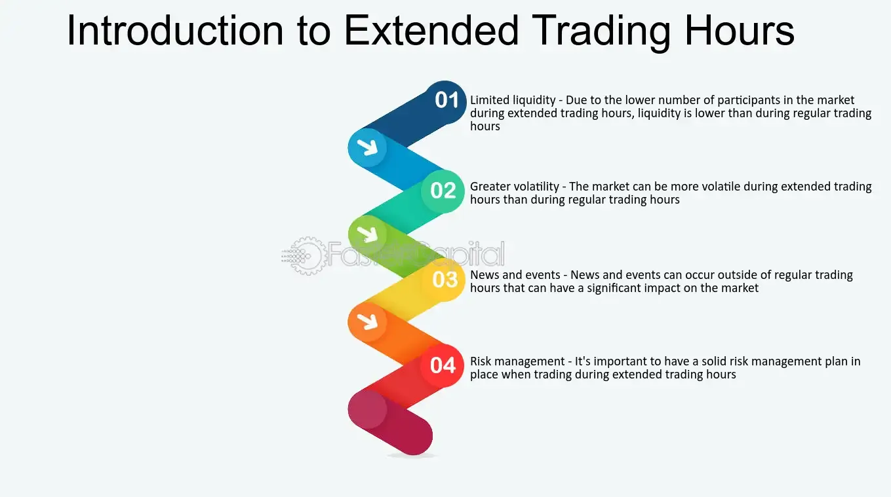

## Table of Contents

## What is extended trading and how does it differ from regular trading hours?

Extended trading refers to the buying and selling of stocks outside of the regular trading hours of the major stock exchanges, like the New York Stock Exchange (NYSE) and the Nasdaq. Regular trading hours are typically from 9:30 AM to 4:00 PM Eastern Time, Monday through Friday. Extended trading, on the other hand, happens before the market opens, known as pre-market trading, and after the market closes, known as after-hours trading. This allows investors to react to news and events that happen outside of regular trading hours.

The main difference between extended trading and regular trading hours is the level of activity and liquidity. During regular trading hours, there are more buyers and sellers, which makes it easier to buy and sell stocks at the prices you want. In extended trading, there are fewer participants, so it can be harder to find someone to trade with, and the prices can be more volatile. This means that while extended trading gives you more flexibility to trade whenever news breaks, it also comes with more risk due to the lower liquidity and potential for larger price swings.

## What are the typical hours for pre-market and after-hours trading?

Pre-market trading usually happens from about 4:00 AM to 9:30 AM Eastern Time. This is the time before the regular market opens. People trade during these hours to react to news or events that happened overnight or early in the morning.

After-hours trading takes place from 4:00 PM to 8:00 PM Eastern Time. This is after the regular market closes. Investors use this time to trade based on news or announcements that come out after the market has closed for the day.

## Which platforms or brokers offer extended trading services?

Many online brokers offer extended trading services. Some popular ones include Robinhood, E*TRADE, and TD Ameritrade. These platforms allow you to buy and sell stocks before the market opens and after it closes. They often have different rules and fees for extended trading, so it's good to check before you start trading.

Not all brokers offer the same hours for extended trading. For example, Robinhood might let you trade from 7 AM to 8 PM, while E*TRADE might have different times. It's important to know the specific hours your broker offers. Also, some brokers might charge extra for extended trading or have different rules about what you can trade during these times.

## What types of orders can be placed during extended trading sessions?

During extended trading sessions, you can place different types of orders. The most common ones are market orders and limit orders. A market order means you want to buy or sell a stock at the best available price right away. A limit order lets you set a specific price at which you want to buy or sell. If the stock reaches that price during the extended hours, the order will be filled.

Some brokers also let you use other types of orders during extended trading, like stop orders and stop-limit orders. A stop order turns into a market order once the stock hits a certain price. A stop-limit order turns into a limit order at a certain price. These orders can help you manage risk, but they can be trickier to use during extended hours because there are fewer people trading, and prices can jump around more.

It's important to know what types of orders your broker allows during extended trading. Not all brokers offer the same options, and the rules can be different from regular trading hours. Always check with your broker to make sure you understand what you can and can't do during these times.

## What are the potential benefits of trading during extended hours?

Trading during extended hours can give you a chance to react to news and events that happen when the regular market is closed. If a big news story breaks after the market closes, you can buy or sell stocks right away instead of waiting until the next day. This can help you make quick moves and possibly make more money or avoid losses.

Another benefit is that you can have more flexibility in your trading schedule. If you work during the day, you might not be able to trade during regular hours. Extended trading lets you buy and sell stocks early in the morning or in the evening, which can fit better with your daily routine. This way, you don't have to miss out on trading opportunities just because you're busy during the day.

## What are the common risks associated with extended trading?

One of the biggest risks with extended trading is lower [liquidity](/wiki/liquidity-risk-premium). During regular trading hours, lots of people are buying and selling, so it's easier to find someone to trade with. But in extended hours, fewer people are trading, which means it can be harder to buy or sell at the price you want. This can lead to bigger price swings and more risk.

Another risk is higher [volatility](/wiki/volatility-trading-strategies). Because there are fewer people trading, prices can change a lot more quickly. News or events can cause big jumps in stock prices, and you might end up buying or selling at a price that's very different from what you expected. This can lead to bigger losses if the market moves against you.

It's also important to know that not all brokers offer the same services during extended hours. Some might have different rules or fees, and they might not let you trade all types of stocks or use all types of orders. This can make it harder to manage your trades and could lead to unexpected costs or missed opportunities. Always check with your broker to understand what you can and can't do during these times.

## How does liquidity affect trading during extended hours?

Liquidity means how easy it is to buy or sell something without changing its price too much. During regular trading hours, lots of people are trading, so it's easy to find someone to buy from or sell to. But in extended hours, fewer people are trading, so it's harder to find someone to trade with. This means that if you want to buy or sell a stock, you might have to wait longer or accept a worse price than you would during regular hours.

Because there are fewer people trading, the prices can also jump around more. If you want to sell a stock, you might not get as much money as you hoped because there aren't many buyers. And if you want to buy, you might have to pay more than you expected. This can make trading riskier during extended hours because the price you get might be very different from what you wanted.

## What impact can news releases have on extended trading?

News releases can have a big impact on extended trading because they often come out after the regular market closes or before it opens. If a company announces good news, like better-than-expected earnings, the stock price might go up a lot during extended hours. People who want to buy the stock can do so right away instead of waiting until the next day. On the other hand, if the news is bad, like a company missing its earnings targets, the stock price might drop a lot. Traders can sell their stocks quickly to avoid bigger losses.

Because fewer people are trading during extended hours, the price can change more than it would during regular hours. A news release can cause the stock price to jump up or down quickly. This can be good if you want to react fast to the news, but it can also be risky. The price might keep changing a lot until more people start trading during regular hours, so you might buy or sell at a price that's very different from what you expected.

## How can one develop a strategy specifically for extended trading?

Developing a strategy for extended trading involves understanding the unique characteristics of these sessions. Because there are fewer people trading during extended hours, you need to be ready for bigger price swings. A good strategy might be to focus on news and events that happen outside of regular trading hours. If a company releases earnings after the market closes, you can use that information to decide whether to buy or sell the stock right away. It's also important to set clear goals for what you want to achieve during these times, like making quick profits or avoiding losses.

Another part of your strategy should be choosing the right types of orders. During extended trading, using limit orders can help you control the price at which you buy or sell. This can be safer than using market orders, which might fill at a very different price than you expected. Also, make sure to check what your broker allows during extended hours. Some brokers might have different rules or fees, so understanding these can help you plan better. By combining these elements, you can create a strategy that helps you navigate the risks and opportunities of extended trading.

## What are the regulatory considerations for extended trading?

When you trade during extended hours, there are some rules you need to know about. The main stock exchanges, like the NYSE and Nasdaq, have their own rules for extended trading. These rules can be different from the ones during regular trading hours. For example, not all stocks can be traded during extended hours, and some brokers might have their own rules about what you can and can't do. It's important to check with your broker to understand what's allowed and what's not.

Also, the Securities and Exchange Commission (SEC) has rules that apply to all trading, including extended hours. They want to make sure trading is fair and that everyone has the same information. During extended hours, there might be less information available, which can make things riskier. The SEC wants brokers to tell you about these risks before you start trading during these times. Knowing these rules can help you trade more safely and avoid any surprises.

## How does volatility in extended trading compare to regular trading hours?

Volatility means how much prices go up and down. During extended trading, there is usually more volatility than during regular trading hours. This is because fewer people are trading, so prices can change a lot more quickly. If something big happens, like a news release after the market closes, the price of a stock might jump up or down a lot during extended hours. This can be good if you want to make quick money, but it can also be risky because the price might keep changing until more people start trading during regular hours.

During regular trading hours, there are more people buying and selling, so prices usually don't change as much. If a lot of people want to buy a stock, the price might go up, but it won't jump as much as it might during extended hours. This makes regular trading hours a bit safer because there are more people to trade with, and the prices are usually more stable. But if you want to react to news right away, extended trading can be useful, even if it's more volatile.

## What advanced techniques can experienced traders use to optimize their performance during extended trading sessions?

Experienced traders can use several advanced techniques to optimize their performance during extended trading sessions. One key technique is to closely monitor news and earnings releases that happen outside of regular trading hours. By quickly analyzing this information, traders can make informed decisions to buy or sell stocks before the market opens or after it closes. This can help them take advantage of price movements that occur due to new information. Another technique is to use advanced order types, like stop-limit orders, to manage risk better. These orders can help traders set specific prices at which they want to buy or sell, which is important during extended hours when prices can be more volatile.

Another approach is to focus on stocks with high liquidity even during extended hours. Some stocks are more actively traded during these times, which can make it easier to buy and sell at the prices you want. Traders can also use technical analysis tools to spot trends and patterns in stock prices during extended sessions. By understanding these patterns, traders can make better predictions about where the price might go next. Overall, combining these techniques can help experienced traders navigate the challenges and opportunities of extended trading more effectively.

## References & Further Reading

[1]: Feier, H., & Döring, D. (2015). ["Algorithmic Trading in Practice"](https://academic.oup.com/edited-volume/41262/chapter/350850196). SpringerLink.

[2]: DeGennaro, R. P., & Robotti, C. (2007). ["Financial Market Volatility and the Theory of Projects."](https://papers.ssrn.com/sol3/papers.cfm?abstract_id=3738764) International Finance Discussion Papers.

[3]: Aldridge, I. (2008). ["High-Frequency Trading: A Practical Guide to Algorithmic Strategies and Trading Systems"](https://www.ahmetbeyefendi.com/wp-content/uploads/2020/07/High-Frequency-Trading-Irene-Aldridge.pdf) by Irene Aldridge.

[4]: Harris, L. (2003). ["Trading and Exchanges: Market Microstructure for Practitioners"](https://academic.oup.com/book/52292) by Larry Harris.

[5]: Kissell, R. (2013). ["The Science of Algorithmic Trading and Portfolio Management"](https://www.sciencedirect.com/book/9780124016897/the-science-of-algorithmic-trading-and-portfolio-management) by Robert Kissell.