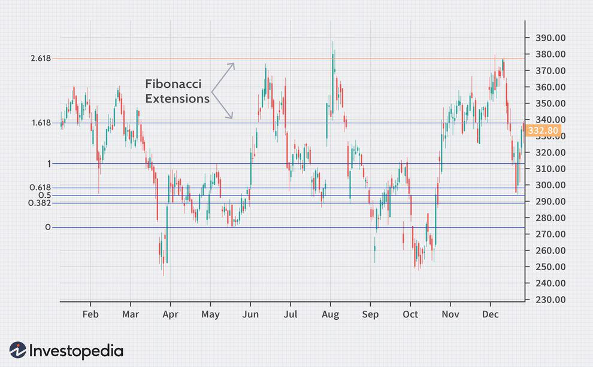

In the complex world of finance, understanding the nuances of risk is crucial for investors. Bond markets, as a fundamental component of global finance, present unique challenges and opportunities. Among the various risks that investors must navigate, extension risk is a significant concern. This particular risk surfaces when borrowers decide to extend their loan durations in response to changing market conditions, impacting the expected cash flows and returns of investors, especially those engaged in structured credit products like mortgage-backed securities.

In this article, we aim to provide a comprehensive overview of the financial risks inherent in bond markets, with a particular emphasis on extension risk. We will examine how these risks manifest and their implications for both primary and secondary market investors. Additionally, the article will explore the role of algorithmic trading, a technological advancement that holds the potential to either mitigate or amplify these risks. Algorithmic trading utilizes sophisticated algorithms to automate trading decisions, offering enhanced efficiency and liquidity in the markets. However, its complexity also introduces new dimensions of risk that investors must consider.



Our goal is to equip both novice and experienced investors with a clearer understanding of these dynamics, offering insights into how technological tools can be leveraged for strategic risk management in bond markets. By staying informed and utilizing advanced trading techniques, investors can better navigate the evolving landscape of financial risks.

## Table of Contents

## Understanding Financial Risk in Bond Markets

Bond markets are integral to the global financial system, serving as a pivotal source of funding for governments, corporations, and other entities. They provide a relatively stable avenue for investment, often attracting a diverse range of investors seeking steady income through interest payments. However, despite their perceived stability, bond markets embody a variety of financial risks that investors must be acutely aware of.

Interest rate risk stands as a principal concern in bond markets. It arises from the inverse relationship between bond prices and interest rates. When interest rates rise, existing bonds with lower yields become less attractive, causing their prices to decline. Conversely, when interest rates fall, existing bonds gain value. This fluctuation can affect the bond's total return, especially impacting long-term bonds more significantly due to their longer duration.

Credit risk is another critical risk, reflecting the possibility that an issuer may default on their obligations. This risk is more pronounced in corporate bonds, where the issuer's creditworthiness is paramount. Ratings provided by agencies like Moody’s and S&P offer investors a gauge of credit risk, but changes in ratings or the issuer's financial health can lead to swift price adjustments in the primary and secondary bond markets.

Extension risk surfaces when borrowers extend the duration of their loans under changing market conditions, impacting structured credit products such as mortgage-backed securities (MBS). This risk emerges prominently when interest rates rise, dissuading borrowers from refinancing their existing loans. The extension of loan durations beyond initial expectations can alter the anticipated cash flow patterns for investors, making their investments more exposed to [interest rate](/wiki/interest-rate-trading-strategies) risk over an extended period.

The link between these financial risks and the behavior of bond markets underscores the complex dynamics that investors navigate. In the primary market, where new bonds are issued, these risks influence the terms and pricing of the bonds. Issuers must price their bonds to reflect the prevailing interest rate environment and credit conditions. In the secondary market, where existing bonds are traded, these risks can lead to price [volatility](/wiki/volatility-trading-strategies) as market participants reassess the value of bonds in response to changes in interest rates or issuer creditworthiness.

Understanding these financial risks is essential for investors aiming to optimize their bond portfolio strategies. Each risk requires distinct management techniques, often involving diversification, duration management, and the use of financial derivatives. Ultimately, the ability to anticipate and respond to these risks significantly contributes to the stability and profitability of investments within the bond markets.

## What is Extension Risk?

Extension risk occurs when borrowers extend their loan durations beyond the initial expectations, which can often be the result of unfavorable market conditions. This extension poses a particular risk to investors in the secondary markets of structured credit products, such as mortgage-backed securities (MBS). These securities depend heavily on the predictability of cash flows from borrowers, and any extension can lead to a mismatch in the expected timing of cash flows.

The manifestation of extension risk is closely tied to changes in interest rates. When interest rates rise, borrowers are less inclined to refinance their existing loans because the costs of taking out new loans at higher rates outweigh the benefits. This reluctance to refinance leads to loan durations being extended. As a result, the expected cash flows to the investors are delayed, impacting the valuation of the securities. This can be a significant concern for institutional investors who rely on predictable income streams to meet their liabilities.

For instance, consider a simplified scenario of a mortgage pool underlying an MBS. Initially, it is assumed that a significant portion of the borrowers will refinance after a few years, returning the principal sooner than the original maturity date. If interest rates rise, fewer borrowers will refinance, and the principal repayments will be extended over a longer period. This extension results in lower-than-expected returns in the present period and increased interest rate sensitivity.

Such risks highlight the importance of understanding borrower behavior and market conditions when investing in complex structured credit products. Investors often use models to predict prepayment and extension behaviors under various interest rate scenarios, helping them assess the extension risk level associated with each investment. However, changes in borrower behavior driven by broader economic conditions can make predicting extension risk particularly challenging. This risk management complexity underscores the need for robust analytical tools and market awareness by investors.

## Algorithmic Trading: Friend or Foe?

Algorithmic trading, also known as algo trading, uses complex algorithms to automate and optimize trading. These systems are designed to execute orders based on predefined criteria, such as timing, price, or [volume](/wiki/volume-trading-strategy), without direct human intervention. The precision and speed of [algorithmic trading](/wiki/algorithmic-trading) systems make them invaluable tools in modern finance, particularly in enhancing efficiency and bolstering market [liquidity](/wiki/liquidity-risk-premium).

Despite these benefits, algorithmic trading can also introduce new risks and amplify existing ones in financial markets, including bond markets. In particular, the rapid execution of trades can lead to market volatility during periods of stress, affecting both prices and liquidity. For instance, flash crashes are notable examples where algorithmic trading has contributed to rapid declines in market prices.

In bond markets, where liquidity is traditionally lower compared to equity markets, the influx of algo trading can either alleviate or exacerbate liquidity issues. On one hand, the automation of trades allows for a continuous and smoother flow of transactions, even during off-peak hours, by bridging order gaps. This can make it easier to match buyers with sellers, reducing the bid-ask spreads and thus improving overall market efficiency.

However, the very nature of algorithmic systems—relying on historical data and mathematical models—makes them susceptible to systemic risks, including extension risk. Extension risk becomes pronounced when adverse conditions, such as rising interest rates, prevent borrowers from refinancing. Algorithms programmed to manage such risks may miscalculate due to reliance on outdated or non-adaptive models, potentially exacerbating the situation by making rapid, volume-heavy trades based on incorrect assumptions.

The role of algo trading in managing such risks invites a complex analysis. On one hand, algorithms can be equipped with risk management functions, such as stop-loss orders and dynamic rebalancing, to minimize potential losses. Methods like scenario analysis and stress testing are also commonly employed within these systems to anticipate and counteract adverse market movements.

Furthermore, [machine learning](/wiki/machine-learning) and predictive analytics are beginning to play an instrumental role in enhancing the responsiveness of these systems. By continuously learning from market data, these algorithms can adapt more quickly to changing market conditions, thereby potentially diminishing extension risk. Python, a popular language in data analytics and finance, offers extensive libraries like Scikit-learn and TensorFlow that facilitate the development of adaptive models.

In summary, while algorithmic trading holds significant promise for augmenting market efficiency and managing financial risks, it also possesses the potential to magnify these risks if not properly designed and monitored. Balancing these dual aspects requires ongoing vigilance, adaptive strategies, and a thorough understanding of both market dynamics and technological capabilities.

## Managing Risks with Algo Trading

Algorithmic trading, known for its capacity to process and analyze large datasets, provides sophisticated tools for managing financial risks, including extension risk in bond markets. By leveraging advanced algorithms, traders can automate trading decisions and implement dynamic hedging strategies, which are crucial in mitigating risks during periods of market volatility.

### Dynamic Hedging Strategies

Dynamic hedging requires continuous adjustment of financial positions to maintain a desired level of risk exposure as market conditions change. This approach is particularly beneficial for managing extension risk, which occurs when loan durations unexpectedly extend, primarily due to rising interest rates. By utilizing predictive analytics and machine learning models, algo trading systems can identify patterns and forecast market movements, allowing traders to adjust their positions proactively.

#### Predictive Analytics

Predictive analytics involves using historical data to forecast future market behavior. Algorithms can be trained to recognize shifts in interest rates and other economic indicators that might increase extension risk. For instance, machine learning models such as neural networks or decision trees can be employed to analyze complex datasets. Python libraries like Scikit-learn or TensorFlow provide robust tools for implementing these models. Here's a simple example using Python:

```python
from sklearn.model_selection import train_test_split
from sklearn.tree import DecisionTreeRegressor
import numpy as np

# Sample dataset: [interest rate changes, refinancing applications, market sentiment]
data = np.array([[0.5, 200, 0.7], [0.3, 180, 0.6], [0.1, 160, 0.4], [0.4, 190, 0.65]])
target = np.array([0.6, 0.5, 0.4, 0.55])  # Extension risk indicator

# Split data into training and testing sets
X_train, X_test, y_train, y_test = train_test_split(data, target, test_size=0.2)

# Initialize and train the model
model = DecisionTreeRegressor()
model.fit(X_train, y_train)

# Predict extension risk
predictions = model.predict(X_test)
print("Predicted Extension Risks:", predictions)
```

This model predicts extension risk based on interest rate changes, refinancing applications, and market sentiment, informing trading strategies.

### Real-World Applications

Algorithmic strategies have shown success in mitigating risks across various financial markets. For example, large asset management firms use algorithmic trading to implement risk parity strategies, balancing risk across different asset classes. In the context of extension risk, algo systems can dynamically adjust the duration and convexity of bond portfolios. This is achieved by using derivatives like interest rate swaps and options, which help hedge against unexpected changes in interest rates, thereby aligning the portfolio's risk profile with market conditions.

### Conclusion

Algorithmic trading offers an advanced arsenal of risk management tools that are essential for modern financial markets. By implementing dynamic hedging strategies and utilizing predictive analytics, traders can effectively manage extension risk and other financial risks, safeguarding investments against market volatility.

## The Future of Bond Markets and Algo Trading

With technological advancements, the integration of [artificial intelligence](/wiki/ai-artificial-intelligence) (AI) in financial markets is increasingly becoming a reality, marking a transformative era for algorithmic trading (algo trading) in bond markets. The evolution of AI-powered algorithms is enhancing the capacity to process vast amounts of data, enabling more precise predictive analysis and automated decision-making. This progression holds the potential to revolutionize how bond markets function and adapt to changing economic landscapes.

One potential development in algo trading for bond markets is the increased use of machine learning techniques to analyze historical data, identify patterns, and predict future market movements. These innovations could lead to more accurate pricing models and improved risk assessment frameworks, crucial for handling the nuances of extension risk and other uncertainties inherent in bond trading. For instance, machine learning algorithms can be deployed to evaluate factors like interest rate changes, prepayment behaviors, and macroeconomic indicators, refining strategies to hedge against risks.

Moreover, as AI continues to evolve, its role is not limited to prediction and analysis. It also extends to executing trades at optimal times, thereby maximizing returns while minimizing risks. The automation of repetitive and complex trading strategies allows for quicker reaction times to market events, a critical [factor](/wiki/factor-investing) in highly liquid and volatile markets. Python, with libraries such as NumPy, pandas, and scikit-learn, serves as an essential tool for developing these AI-driven strategies, providing flexibility and computational efficiency.

The regulatory landscape surrounding algo trading in bond markets is also poised for evolution. As AI integration increases, regulators may introduce more robust frameworks to ensure market stability and protect investor interests. These regulations might include transparency in algorithmic strategies, reporting requirements for AI-driven trades, and measures to prevent market manipulation. It is essential for market participants to remain compliant and aware of these regulatory changes, ensuring that their strategies align with legal and ethical standards.

Investors, too, must adapt their strategies to harness the benefits of AI and algo trading in the bond markets. This might involve adopting a more data-driven approach and continuously updating their models to include AI insights, thus enhancing decision-making processes. Collaboration between human expertise and machine intelligence could become a norm, blending quantitative analysis with qualitative insights to navigate complex bond market environments.

In conclusion, the integration of AI and algo trading in bond markets signifies a shift towards more sophisticated and efficient trading ecosystems. While promising, it demands careful consideration of regulatory frameworks and investor adaptability to fully leverage the technological advancements at hand.

## Conclusion

Navigating financial risks in bond markets requires investors to understand the nuances of various risk factors and employ strategic approaches to manage them effectively. Extension risk, a significant concern in these markets, arises when borrowers extend loan durations beyond initial expectations, often due to unfavorable changes in interest rates. This can adversely impact investors, particularly in the secondary market for structured credit products like mortgage-backed securities.

However, this risk, while challenging, is not insurmountable. Innovative trading techniques, particularly those utilizing algorithms, offer promising solutions. Algorithmic trading leverages sophisticated algorithms to automate and optimize trading decisions, potentially enhancing the capacity to manage risks, including extension risk. By analyzing extensive datasets and predicting market movements, algorithmic trading can implement dynamic hedging strategies, providing a robust tool for risk mitigation in volatile markets.

Investors must stay informed about technological advancements to navigate these complexities effectively. Regularly updating knowledge and strategies to incorporate emerging algorithmic technologies is crucial. As artificial intelligence increasingly integrates into financial markets, it's likely that new tools and techniques will evolve, further aiding in risk management. Investors who remain proactive in adapting to these advances will be better positioned to not only manage extension risk but also capitalize on emerging opportunities in the bond markets.

## References & Further Reading

[1]: Bergstra, J., Bardenet, R., Bengio, Y., & Kégl, B. (2011). ["Algorithms for Hyper-Parameter Optimization."](https://dl.acm.org/doi/10.5555/2986459.2986743) Advances in Neural Information Processing Systems 24.

[2]: ["Advances in Financial Machine Learning"](https://www.amazon.com/Advances-Financial-Machine-Learning-Marcos/dp/1119482089) by Marcos Lopez de Prado

[3]: ["Evidence-Based Technical Analysis: Applying the Scientific Method and Statistical Inference to Trading Signals"](https://books.google.com/books/about/Evidence_Based_Technical_Analysis.html?id=MeoJAQAAMAAJ) by David Aronson

[4]: ["Machine Learning for Asset Managers"](https://github.com/emoen/Machine-Learning-for-Asset-Managers) by Marcos Lopez de Prado

[5]: ["Quantitative Trading: How to Build Your Own Algorithmic Trading Business"](https://www.amazon.com/Quantitative-Trading-Build-Algorithmic-Business/dp/1119800064) by Ernest P. Chan

[6]: Fabozzi, F. J. (Editor). (2016). ["Handbook of Mortgage-Backed Securities"](https://api.pageplace.de/preview/DT0400.9780191088773_A30390474/preview-9780191088773_A30390474.pdf). Oxford University Press. 

[7]: ["Bond Markets, Analysis, and Strategies"](https://www.amazon.com/Bond-Markets-Analysis-Strategies-7th/dp/0136078974) by Frank J. Fabozzi