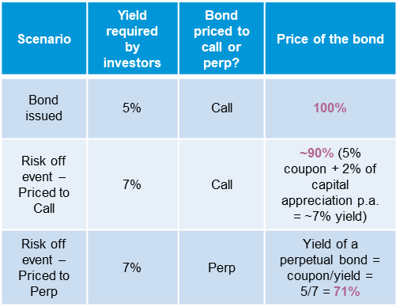

## Table of Contents

## What is extension risk in financial instruments?

Extension risk is a type of risk that affects financial instruments like bonds or mortgages. It happens when interest rates go up, causing borrowers to keep their loans longer than expected. This means that the money from these loans, which was supposed to come back to the investors sooner, gets delayed. As a result, investors might have to wait longer to get their money back, and this can be a problem if they were planning to use that money for something else.

This risk is particularly important for investors who rely on the regular payments from these financial instruments. When loans are extended, the cash flow that investors were counting on can be disrupted. This can affect their financial planning and might force them to find other sources of money or adjust their investment strategies. Understanding extension risk helps investors make better decisions about which financial instruments to invest in, based on how long they are willing to wait for their money to come back.

## How does extension risk affect bond investors?

Extension risk can make things tricky for bond investors. When interest rates go up, people who borrowed money might decide to keep their loans longer than planned. This means bond investors don't get their money back as quickly as they thought they would. They were expecting to get their money back and maybe use it to invest in something else or for other plans, but now they have to wait longer.

This waiting can be a big problem for investors. They might have counted on that money coming in at a certain time to help pay for things or to invest in new opportunities. When the money is delayed because of extension risk, it can mess up their financial plans. They might need to find other ways to get money or change their investment strategies to deal with the delay.

## Can you explain the relationship between interest rates and extension risk?

Extension risk is all about what happens when interest rates go up. When this happens, people who have loans might decide to keep them longer than they originally planned. They do this because the new interest rates are higher, and they want to stick with their old, lower rates. This means that the people who invested in those loans, like bond investors, don't get their money back as soon as they expected. They have to wait longer, and this can be a problem if they were planning to use that money for something else.

This waiting can really affect bond investors. They might have made plans based on getting their money back at a certain time. When interest rates go up and loans get extended, those plans can get messed up. Investors might need to find other ways to get money or change their investment strategies to deal with the delay. Understanding how interest rates and extension risk are connected helps investors make better choices about where to put their money.

## What are some common financial instruments that are subject to extension risk?

Extension risk can affect different types of financial instruments, especially those that involve loans. One common type is mortgage-backed securities (MBS). These are investments that are made up of home loans. When interest rates go up, homeowners might decide to keep their old mortgages instead of getting new ones with higher rates. This means the money from those mortgages, which investors were expecting to get back sooner, gets delayed. This can be a problem for investors who were planning on using that money for other things.

Another type of financial instrument that can be affected by extension risk is callable bonds. These are bonds that the issuer can decide to pay back early. When interest rates rise, issuers are less likely to call back these bonds because they would have to issue new bonds at higher rates. As a result, investors might have to wait longer to get their money back than they thought, which can mess up their financial plans. Understanding extension risk helps investors make better choices about which financial instruments to invest in.

## How can extension risk impact the yield of a bond?

Extension risk can change the yield of a bond in a big way. When interest rates go up, people who borrowed money might decide to keep their loans longer. This means that the money from the bond, which was supposed to come back to the investor sooner, gets delayed. Because the money is coming back later than expected, the bond's yield can go down. The yield is like the return you get on your investment, and if you have to wait longer to get your money back, the return isn't as good as you thought it would be.

This can be a problem for investors who were counting on a certain yield from their bond. If the yield goes down because of extension risk, it can mess up their financial plans. They might have been planning to use the money from the bond to invest in something else or to pay for something important. When the yield drops, they might need to find other ways to make up for the lower return or change their investment strategies to deal with the new situation.

## What strategies can investors use to mitigate extension risk?

Investors can use different strategies to deal with extension risk. One way is to look at the kind of bonds they are thinking about buying. Some bonds, like those backed by mortgages, can be more affected by extension risk. By choosing bonds that are less likely to be affected, like those with shorter times until they pay back, investors can lower the chance of extension risk messing up their plans. Another way is to keep an eye on interest rates. If interest rates are expected to go up, investors might want to avoid bonds that could be extended, or they might choose bonds that will pay back sooner.

Another strategy is to spread out their investments. Instead of putting all their money into one type of bond, investors can put their money into different kinds of investments. This way, if one investment is affected by extension risk, the others might not be, and the overall impact on their money won't be as bad. It's also a good idea to talk to a financial advisor. They can help investors understand which bonds are more likely to be affected by extension risk and come up with a plan to handle it. By using these strategies, investors can better protect their money from the effects of extension risk.

## How do callable bonds relate to extension risk?

Callable bonds are a type of bond that can be paid back early by the issuer. When interest rates go up, issuers are less likely to call back these bonds because they would have to issue new bonds at higher rates. This means that investors might have to wait longer to get their money back than they expected, which is where extension risk comes in. If the bonds are not called back, they stay in the hands of the investors for a longer time, and this can mess up their financial plans.

To deal with extension risk in callable bonds, investors need to be careful about which bonds they choose. They should look at how likely it is that the bond will be called back and how that might affect their money. If interest rates are expected to go up, it might be a good idea to avoid callable bonds that could be extended or to choose bonds that will pay back sooner. By understanding how callable bonds and extension risk are connected, investors can make better choices about where to put their money.

## What role does the duration of a bond play in extension risk?

The duration of a bond is a big deal when it comes to extension risk. Duration is a way to measure how long it will take for an investor to get their money back from a bond. When a bond has a longer duration, it means the investor has to wait longer to get their money back. If interest rates go up, people who borrowed money might decide to keep their loans longer, which makes the bond's duration even longer. This is what we call extension risk, and it can be a problem for investors who were planning on getting their money back sooner.

If a bond has a shorter duration, it's less likely to be affected by extension risk. Shorter duration means the money comes back to the investor more quickly, so even if interest rates go up, the impact on the bond's duration might not be as big. Investors can use the duration of a bond to help them decide which bonds to buy. By choosing bonds with shorter durations, they can lower the chance of extension risk messing up their plans.

## Can you discuss the impact of prepayment risk on extension risk?

Prepayment risk and extension risk are two sides of the same coin, both related to how interest rates affect loans and bonds. Prepayment risk happens when interest rates go down, and borrowers decide to pay off their loans early. This can be a problem for investors because they get their money back sooner than they expected, and they might have to find new places to invest that money at lower interest rates. On the other hand, extension risk happens when interest rates go up, and borrowers decide to keep their loans longer to stick with their lower rates. This means investors have to wait longer to get their money back, which can mess up their financial plans.

The relationship between prepayment risk and extension risk is important for investors to understand. When interest rates are changing, it can be hard to predict whether loans will be paid off early or extended. If interest rates are expected to go down, investors might worry more about prepayment risk. But if interest rates are expected to go up, they might be more concerned about extension risk. By keeping an eye on [interest rate](/wiki/interest-rate-trading-strategies) trends and choosing investments that match their plans, investors can better handle the ups and downs caused by prepayment and extension risks.

## How do different economic conditions influence extension risk?

Different economic conditions can really change how much extension risk affects investors. When the economy is doing well and interest rates are low, people might borrow more money. But if the economy starts to slow down and interest rates go up, borrowers might decide to keep their old loans longer to avoid higher rates. This is when extension risk becomes a bigger problem for investors. They might have to wait longer to get their money back from bonds or other investments, which can mess up their financial plans.

On the other hand, when the economy is in a downturn and interest rates are low, extension risk might not be as big of a deal. People might not be as worried about keeping their old loans because new loans are also at low rates. But if the economy starts to recover and interest rates start to go up, borrowers might want to stick with their old loans, and that's when extension risk can come back into play. By understanding how the economy and interest rates are changing, investors can make better choices about where to put their money to handle extension risk.

## What are the advanced modeling techniques used to assess extension risk?

To assess extension risk, financial experts use advanced modeling techniques like Monte Carlo simulations. These simulations help them predict how long it might take for borrowers to pay back their loans when interest rates change. By running many different scenarios, experts can see how likely it is that loans will be extended and how that might affect investors. This helps them understand the risks and make better decisions about which bonds or other investments to buy.

Another technique is using option-adjusted spread (OAS) models. These models look at how the option to extend or pay off a loan early can change the value of a bond. By figuring out the spread between the bond's yield and a risk-free rate, experts can see how much extension risk might affect the bond's return. This helps investors compare different bonds and choose the ones that fit their plans best. By using these advanced models, investors can get a clearer picture of how extension risk might affect their money.

## How does extension risk interact with other types of financial risks in a portfolio?

Extension risk doesn't work alone. It often mixes with other risks in a portfolio, like interest rate risk and credit risk. Interest rate risk happens when interest rates go up or down, which can change the value of bonds and other investments. If rates go up, extension risk can make this worse because investors might have to wait longer to get their money back, and the value of their bonds can drop even more. Credit risk is about the chance that a borrower won't pay back their loan. If extension risk makes loans last longer, it can also make credit risk bigger because there's more time for something to go wrong with the borrower's ability to pay.

To handle these mixed risks, investors need to think about how they all fit together. They might spread out their investments to lower the impact of any one risk. For example, if they have some bonds that could be affected by extension risk, they might also invest in other things that aren't as affected by interest rates or credit problems. By understanding how extension risk interacts with other risks, investors can make smarter choices about where to put their money and how to protect it from different kinds of problems.

## References & Further Reading

[1]: Bergstra, J., Bardenet, R., Bengio, Y., & Kégl, B. (2011). ["Algorithms for Hyper-Parameter Optimization."](https://dl.acm.org/doi/10.5555/2986459.2986743) Advances in Neural Information Processing Systems 24.

[2]: ["Advances in Financial Machine Learning"](https://www.amazon.com/Advances-Financial-Machine-Learning-Marcos/dp/1119482089) by Marcos Lopez de Prado

[3]: ["Evidence-Based Technical Analysis: Applying the Scientific Method and Statistical Inference to Trading Signals"](https://books.google.com/books/about/Evidence_Based_Technical_Analysis.html?id=MeoJAQAAMAAJ) by David Aronson

[4]: ["Machine Learning for Asset Managers"](https://github.com/emoen/Machine-Learning-for-Asset-Managers) by Marcos Lopez de Prado

[5]: ["Quantitative Trading: How to Build Your Own Algorithmic Trading Business"](https://www.amazon.com/Quantitative-Trading-Build-Algorithmic-Business/dp/1119800064) by Ernest P. Chan

[6]: Fabozzi, F. J. (Editor). (2016). ["Handbook of Mortgage-Backed Securities"](https://api.pageplace.de/preview/DT0400.9780191088773_A30390474/preview-9780191088773_A30390474.pdf). Oxford University Press. 

[7]: ["Bond Markets, Analysis, and Strategies"](https://www.amazon.com/Bond-Markets-Analysis-Strategies-7th/dp/0136078974) by Frank J. Fabozzi