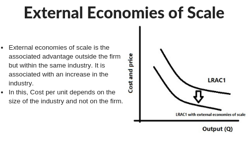

Understanding economies of scale is crucial in explaining how businesses and industries function efficiently. Economies of scale refer to cost advantages that enterprises realize due to the scale of their operations, with cost per unit of output generally decreasing as scale increases. This principle not only applies to individual firms but extends to entire industries, influenced significantly by external factors that create industry-wide cost advantages.

In this article, we explore the concepts of external economies of scale with a focus on their economic impact on various industries, particularly algorithmic trading. External economies of scale occur when an entire industry benefits from factors outside the control of individual companies, such as advancements in technology, improved infrastructure, or supportive government policies. These factors facilitate reduced operational costs and increased competitive advantage across the industry.

Algorithmic trading serves as a contemporary example of how industries utilize both economies of scale and external synergies to optimize their operations in financial markets. This modern financial technology leverages advancements in computing power and data analytics, which are shared among market participants, thus reducing costs and increasing the efficiency of market engagements.

The article further addresses how external economies play a dynamic role in numerous sectors, creating synergies between technological advancements and economic scale benefits. These synergies foster innovation, enable industry growth, and provide businesses with the opportunity to thrive in competitive markets. Understanding the contribution of external economies to industry dynamics is essential for businesses seeking to maintain strategic advantages while navigating the complexities of modern economies.

## Table of Contents

## What Are Economies of Scale?

Economies of scale arise when the cost per unit of output decreases as the scale of production increases. This phenomenon is a fundamental principle within the field of industrial economics and plays a vital role in shaping both business strategies and industry structures. By expanding production volumes, firms can enhance the efficiency of resource utilization, which often leads to substantial reductions in average production costs. This increased efficiency is primarily attributable to factors such as specialized labor, advanced manufacturing techniques, and optimized logistical operations.

The reduction in costs with rising production levels can be mathematically expressed as follows:

$$
\text{AC} = \frac{TC}{Q}
$$

where $\text{AC}$ is the average cost per unit, $TC$ is the total cost of production, and $Q$ represents the quantity of output. As $Q$ increases, the $\text{AC}$ tends to decrease, assuming $TC$ does not increase proportionately.

The advantages derived from economies of scale are not limited merely to individual enterprises. They can permeate entire industries, particularly in contexts marked by external economies of scale. Here, various businesses collectively benefit from reduced costs due to external influences like infrastructure enhancements, technological advancements, or regulatory incentives.

These shared external advantages supplement those obtained internally and potentially lead to industry-wide improvements in competitiveness and profitability. As businesses scale up, they may leverage these external factors to further streamline operations, reduce costs, and enhance profit margins, thereby contributing to larger economic growth and development.

## Understanding External Economies of Scale

External economies of scale arise when cost reductions benefit an entire industry due to external influences rather than individual firm actions. Unlike internal economies of scale, where a company reduces costs by increasing its own production, external economies affect all businesses within the industry.

Several external factors contribute to such cost advantages:

1. **Improved Infrastructure**: As infrastructure develops, it often reduces transportation and supply chain costs for companies in a specific area. For instance, a well-established transportation network can lower the costs of shipping raw materials and finished goods, benefiting all businesses within that network.

2. **Technological Progress**: Industry-wide technological innovations can lead to more efficient production processes and reduced operational costs. The spillover effects of technology improvements mean that once an industry adopts a technology, all firms can benefit from the efficiencies it provides. This can include advancements in production methods, data analysis, or automation.

3. **Favorable Government Policies**: Policies such as tax incentives, subsidies, or reduced regulatory burdens can lower costs. When a government supports an industry through favorable policies, the entire industry benefits, leading to a decrease in production costs and an increase in competitive advantage.

A core aspect of external economies of scale is that they benefit all firms in the sector rather than providing an advantage to a single company. This collective benefit distinguishes external economies of scale from internal economies, which are specific to individual firms and their operational efficiencies. The shared nature of these advantages helps to drive industry-wide cost reductions and contribute to sector growth.

## Economic Examples of External Economies of Scale

Examples of external economies of scale can be observed in various industry clusters around the world. Among the most prominent examples is the technology sector concentrated in Silicon Valley. This region has become a hub of innovation largely due to the dense concentration of tech firms, startups, and venture capitalists. These entities benefit from shared resources such as a skilled labor force, specialized suppliers, and synergies from collaborative innovation efforts. The presence of renowned universities and research institutions further contributes to the knowledge exchange and talent pool, fostering an environment conducive to technological advancement and economic growth.

Similarly, the automotive industry in Detroit exemplifies external economies of scale, where a dense network of manufacturers and suppliers creates a synergistic environment. The city’s infrastructure supports manufacturing logistics, and a historical concentration of skilled labor has propelled the industry’s development. This interconnected ecosystem allows automotive companies to reduce costs through shared supply chains and innovation in vehicle technology, ultimately enhancing competitiveness across the region.

Financial hubs such as New York City demonstrate another form of external economies of scale, particularly within the financial services sector. The dense clustering of banks, trading firms, and financial consultants provides access to a deep pool of talent and knowledge. Additionally, firms benefit from proximity to regulatory bodies and a robust IT infrastructure, which is crucial for timely and efficient financial transactions. The shared financial and human resources reduce operational costs and enhance the industry's growth and efficiency.

These examples illustrate the significant benefits that location-specific clusters provide to industries, fostering an environment where shared resources and expertise drive efficiency and development. Whether through technology, manufacturing, or financial services, external economies of scale contribute to a formidable competitive advantage for firms within these clusters.

## Algorithmic Trading and Economies of Scale

Algorithmic trading platforms utilize both internal and external economies of scale to enhance trading strategies and minimize operating costs. These automated systems, which execute trades based on predefined criteria, benefit from substantial technological advancements that have reshaped financial markets. 

Internally, economies of scale are realized as trading volumes increase, resulting in lower costs per trade due to fixed costs being spread across a larger number of transactions. This internal scaling allows algorithmic traders to process vast quantities of trades with minimal human intervention, ensuring operational efficiency. 

Externally, industry-wide technological advancements and infrastructure improvements play a pivotal role. External economies of scale manifest through the shared use of sophisticated financial technologies and infrastructures, such as high-speed internet connections, cloud computing, and cutting-edge data analytics. These shared resources reduce individual costs for accessing crucial market information and computational power, enabling [algorithmic trading](/wiki/algorithmic-trading) platforms to operate more effectively.

One decisive [factor](/wiki/factor-investing) in this external scaling is the accessibility of rapid market data feeds. High-frequency trading, a subset of algorithmic trading, relies heavily on timely data to make split-second decisions. Financial institutions and trading firms often share data sources and connectivity solutions, which reduce latency and allow for immediate response to market changes at a lower cost than if each entity developed its proprietary system.

Furthermore, cloud computing offers a powerful example of external economies benefiting algorithmic traders. By renting computational power and storage from cloud providers, trading platforms can execute complex algorithms and handle large datasets without investing heavily in physical computing infrastructure. This scalability ensures cost-effectiveness while maintaining high processing speeds and reliability. 

In summary, algorithmic trading platforms thrive by leveraging both internal efficiencies and external industry advancements. Their strategic use of external economies, such as shared technological resources and reduced data acquisition costs, significantly contributes to their operational success in the fast-paced financial markets.

## Pros and Cons of External Economies of Scale

External economies of scale offer numerous advantages that significantly impact industries and local economies. One of the primary benefits is the reduction of production costs. As industries develop, shared infrastructure, such as transportation networks and communication systems, becomes more efficient and reduces the cost of operations for all businesses involved. This cost-sharing allows firms to allocate resources more effectively and focus on enhancing their core competencies.

Additionally, external economies of scale contribute to industry growth. When industries cluster in specific regions, they create a network of suppliers, customers, and skilled labor, all of which bolster the industry's expansion. For instance, the concentration of tech companies in regions like Silicon Valley has led to a rapid exchange of ideas and innovations, fostering an environment conducive to growth and development. Moreover, these industry clusters often attract new businesses, further accelerating economic progress and enabling rapid development within these regions.

However, external economies of scale also present certain challenges. One significant drawback is the potential for a lack of competitive differentiation. As companies share similar benefits, such as access to the same pool of skilled labor or technology, it becomes more difficult for individual firms to distinguish themselves from competitors. This homogenization can lead to reduced innovation and efficiency as firms rely heavily on shared resources rather than developing unique strengths.

Another issue is geographic limitation. Regions that benefit from substantial external economies might experience saturation, where growth potential becomes limited due to space constraints or overreliance on local resources. This concentration might also lead to increased costs associated with living and operating in these regions, posing challenges for businesses seeking to maximize their operational efficiency.

Understanding these dynamics is crucial for businesses that aim to capitalize on external economies of scale. Companies need to focus on finding the right balance between benefiting from shared advantages and fostering independent innovation to maintain strategic competitiveness. By navigating these challenges thoughtfully, businesses can thrive amidst the benefits of external economies while minimizing associated risks.

## Conclusion

External economies of scale significantly impact industries by reducing costs and enhancing productivity. When industries cluster geographically, such as technology firms in Silicon Valley or financial institutions in New York City, they share resources and infrastructure, ultimately fostering a more efficient and innovative environment. This shared advantage not only promotes the growth of individual firms but also spurs regional economic development and industry-wide advancements.

The inherent benefits of external economies encourage companies to push the boundaries of innovation, increasing their competitiveness. However, these advantages come with challenges, such as the risk of geographic concentration and decreased differentiation among firms. Companies must strategically manage these risks to maximize their opportunities within these shared environments.

Algorithmic trading exemplifies the leverage of external economies to optimize performance in financial markets. The availability of high-speed internet, advanced data analytics, and robust computational infrastructure constitute a conducive ecosystem for algorithmic trading platforms. By capitalizing on these external efficiencies, algorithmic trading improves execution speed and cost-effectiveness, thereby enhancing market engagement metrics. Firms that harness these dynamics effectively can maintain a competitive edge by balancing cost reductions with innovative strategy development.

## References & Further Reading

[1]: Bergstra, J., Bardenet, R., Bengio, Y., & Kégl, B. (2011). ["Algorithms for Hyper-Parameter Optimization."](https://papers.nips.cc/paper/4443-algorithms-for-hyper-parameter-optimization) Advances in Neural Information Processing Systems 24.

[2]: ["Advances in Financial Machine Learning"](https://www.amazon.com/Advances-Financial-Machine-Learning-Marcos/dp/1119482089) by Marcos Lopez de Prado

[3]: ["Evidence-Based Technical Analysis: Applying the Scientific Method and Statistical Inference to Trading Signals"](https://www.amazon.com/Evidence-Based-Technical-Analysis-Scientific-Statistical/dp/0470008741) by David Aronson

[4]: ["Machine Learning for Algorithmic Trading"](https://github.com/stefan-jansen/machine-learning-for-trading) by Stefan Jansen

[5]: ["Quantitative Trading: How to Build Your Own Algorithmic Trading Business"](https://www.amazon.com/Quantitative-Trading-Build-Algorithmic-Business/dp/1119800064) by Ernest P. Chan