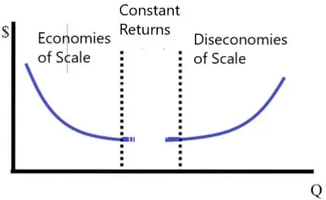

In economics and trading, various concepts shape the way markets operate and businesses function. Critical among these are external economies and external diseconomies, which play pivotal roles in influencing market dynamics and business strategies. External economies refer to the benefits that firms experience due to factors outside their control, such as an expanding industry or improvements in infrastructure. These advantages can lead to increased efficiency and reduced costs. In contrast, external diseconomies involve negative impacts from external factors, such as regulatory constraints or environmental limits, which may increase operational costs or hinder a firm's performance.

These foundational concepts, deeply rooted in traditional economic theory, are highly relevant to modern trading strategies, particularly in algorithmic trading. Algorithmic trading, or algo trading, relies heavily on the speed, accuracy, and efficiency of executing financial transactions. It benefits significantly from external economies, such as technological advancements and infrastructure developments, which enhance its operational effectiveness. Conversely, it must also navigate the challenges posed by external diseconomies, including regulatory changes or resource constraints, which can disrupt or limit trading activities.



This article will explore these economic principles, emphasizing their significance in the context of algo trading. By understanding how external factors influence trading strategies and market efficiency, traders can better anticipate and adapt to shifts in the trading landscape. As technology and market conditions continue to evolve, recognizing and responding to these economic influences will be essential for success in algorithmic trading.

## Table of Contents

## Understanding External Economies and Diseconomies

External economies and diseconomies represent key concepts in economic theory, commonly identified as externalities. These phenomena occur when a business or industry experiences indirect effects—either advantageous or disadvantageous—that are not directly reflected in market transactions.

**External Economies:**  
External economies, also known as positive externalities, occur when a firm reaps benefits from developments beyond its immediate operations. For example, an individual firm might benefit from the growth of the industry in which it operates. Such growth can lead to enhanced infrastructure like improved transportation networks or the expansion of utilities, effectively reducing operational costs or enhancing efficiency for all firms within that industry. Moreover, a concentration of industry activities in a specific area may attract a skilled labor force, thereby benefiting organizations by providing access to necessary talent without additional training costs.

The presence of external economies can bolster competitive advantage and lead to economies of scale, where increased production levels result in lower average costs. Consider this simplified representation for economies of scale:  
$$
\text{Average Cost} = \frac{\text{Total Cost}}{\text{Quantity Produced}} \]  
As the industry grows, the denominator increases, leading to a decrease in average cost, assuming constant or decreasing returns.

**External Diseconomies:**  
In contrast, external diseconomies, akin to negative externalities, emerge when external factors elevate costs or present operational hindrances across an industry. For instance, increased regulations might necessitate more extensive compliance procedures or technological upgrades, both of which could raise operational costs. Additionally, resource constraints such as limited availability of raw materials or insufficient infrastructure capacity might hinder an industry's capacity to expand or function efficiently.

An illustrative example of external diseconomies can be expressed through an increase in production costs due to regulatory changes:  
$$
\text{New Total Cost} = \text{Old Total Cost} + \text{Compliance Cost} \]  
This increase can impact the pricing strategy, with firms needing to adjust prices to maintain margins, potentially reducing competitiveness compared to those not facing the same constraints.

Understanding these concepts is crucial for analyzing how external factors shape industry dynamics. Recognizing the presence of external economies or diseconomies can guide strategic decision-making, encouraging firms to leverage beneficial external conditions while preparing for or countering adverse effects.

## Implications of External Economies in Algo Trading

Algorithmic trading, a sophisticated trading method that uses complex algorithms to execute orders, benefits significantly from external economies. These are factors that positively influence a firm's or industry's operation and efficiency from outside its direct control. In the context of algo trading, several key external economies contribute to its success.

Technological advancements serve as a critical form of external economy in the trading world. Innovations in computer processing power, data analytics, and [machine learning](/wiki/machine-learning) algorithms greatly enhance the speed and accuracy of trade executions. High-frequency trading, a subset of [algorithmic trading](/wiki/algorithmic-trading), particularly benefits from these advancements, as it involves executing thousands of trades per second, which requires robust computational capabilities and network infrastructure. For instance, the deployment of low-latency networks allows for faster data transmission and order execution, minimizing slippage and maximizing profitability.

Another external economy conducive to algo trading is the accessibility to a skilled workforce. Trading firms often depend on data scientists, quantitative analysts, and software engineers to develop sophisticated trading strategies and systems. The availability of educational programs focusing on financial engineering, data science, and computer programming has expanded the pool of skilled professionals, enabling firms to construct more complex and efficient algorithms.

Furthermore, as the broader financial and technical ecosystem evolves, it lays a foundation for enhanced algorithmic trading practices. For example, the integration of big data and cloud computing provides traders with real-time access to vast amounts of market data, enabling more informed decision-making. This ecosystem growth fosters an environment where algo trading can flourish, driven by improved infrastructure and sustained technological development.

In summary, the alignment of algorithmic trading with various external economies highlights its dependency on factors like technological progress, skilled human resources, and a supportive financial infrastructure. These elements together facilitate improved trading efficiency and create opportunities for continued innovation in trading strategies.

## Challenges of External Diseconomies in Trading

Algorithmic traders often confront significant hurdles when external diseconomies influence market operations. One of the predominant challenges is the evolving landscape of regulatory frameworks. Regulatory changes can impose strict constraints on trading strategies, compelling traders to adopt adaptive measures to ensure adherence and compliance. For instance, increased scrutiny and regulatory demands might require modifications in algorithmic strategies to avoid market manipulation or insider trading allegations. This often requires the continuous monitoring of legal developments and adapting algorithmic codes accordingly.

Moreover, resource scarcity presents another set of hurdles. Limited access to high-speed data channels or computing power can significantly hinder trading efficiency. In algorithmic trading, where split-second decisions are critical, the lack of optimal resources can lead to delayed trade executions, resulting in financial losses. Traders must invest in state-of-the-art infrastructure, such as low-latency networks and high-performance computing, to maintain a competitive edge.

Understanding and mitigating the risks associated with external diseconomies is crucial for algo traders aiming to sustain profitability. One approach for managing these risks is through strategic diversification of trading algorithms and infrastructure investments. Algo traders can implement risk management frameworks that incorporate predictive analytics to foresee potential disruptions caused by external diseconomies. Such frameworks can use machine learning models to analyze historical data and predict future regulatory or resource-based disruptions.

Python code for a simple predictive model might look like this:

```python
import numpy as np
from sklearn.model_selection import train_test_split
from sklearn.ensemble import RandomForestRegressor
from sklearn.metrics import mean_squared_error

# Example data, in practice use real-world historical trading and regulatory data
data = np.random.rand(1000, 10)
target = np.random.rand(1000)

# Splitting the data
X_train, X_test, y_train, y_test = train_test_split(data, target, test_size=0.2)

# Model training
model = RandomForestRegressor(n_estimators=100, random_state=42)
model.fit(X_train, y_train)

# Predictions
predictions = model.predict(X_test)

# Evaluation
mse = mean_squared_error(y_test, predictions)
print(f'Mean Squared Error: {mse}')
```

This basic model can be enhanced with more complex features and tuned parameters to better predict how external factors such as regulation or resource constraints could affect trading strategies. By proactively managing these external challenges, algo traders can better position themselves to maintain operational efficiency and profitability despite the presence of external diseconomies. Maintaining such adaptive capabilities is essential in the ever-evolving financial markets.

## Case Studies and Examples

Examining real-world examples highlights the impact of external economies and diseconomies on trading. A noteworthy instance of external economies is the technological transformation in the financial industry. The adoption of fiber-optic communication and algorithmic trading platforms has significantly enhanced trading efficiency. In the 2000s, the installation of high-speed fiber networks connecting major financial centers like New York, London, and Tokyo drastically reduced latency times. This infrastructure improvement enabled quicker information dissemination and trade executions, proving beneficial for firms engaged in high-frequency trading ([HFT](/wiki/high-frequency-trading-strategies)). The result was a pronounced increase in trading volumes and [liquidity](/wiki/liquidity-risk-premium) within these markets, demonstrating how external economies can positively impact trading operations.

For example, the implementation of the Securities Information Processor (SIP) data feeds allowed traders to access consolidated quotes from multiple exchanges, facilitating better [arbitrage](/wiki/arbitrage) opportunities. This connectivity fostered a thriving environment for HFT strategies, where success heavily depends on speed and access to real-time market data.

Conversely, regulatory changes illustrate the challenges associated with external diseconomies. The European Union's Markets in Financial Instruments Directive II (MiFID II), which came into effect in January 2018, imposed extensive compliance requirements on trading firms. This regulation increased the cost of doing business by mandating transparency in trading activities and stricter reporting standards. Firms had to adapt by upgrading their systems and processes, often through substantial financial investment, to meet these regulatory demands. The regulatory overhead not only strained smaller trading entities but also led to industry-wide shifts toward more regulated, albeit less flexible, trading environments.

These examples underscore how external economies and diseconomies can significantly influence trading practices. While infrastructure improvements can streamline operations and boost efficiencies, regulatory changes can introduce complexities and additional costs, challenging firms to adapt swiftly to maintain competitive advantage. As such, traders must remain vigilant to external factors, aligning their strategies with evolving market and regulatory landscapes.

## Conclusion

External economies and diseconomies significantly influence the dynamics of algorithmic trading. External economies, such as technological advancements and infrastructure improvements, enhance the efficiency and effectiveness of trading operations. These improvements allow algorithmic traders to execute trades faster and more accurately, thereby achieving better returns. Conversely, external diseconomies, including regulatory changes and resource constraints, present challenges that can disrupt market operations and increase costs. 

A thorough understanding of these economic concepts is essential for traders to anticipate how external factors may affect their strategies. For instance, awareness of upcoming regulatory changes enables traders to adjust their strategies in a timely manner, maintaining compliance while minimizing potential disruptions. Similarly, recognizing trends in technological advancements can help traders capitalize on opportunities for enhanced trading algorithms and systems.

As technology and markets continue to evolve, staying informed about these external influences becomes crucial for the success of algorithmic trading operations. The rapidly changing landscape demands that traders remain adaptable, continually updating their knowledge and strategies to align with new developments. This adaptability encompasses both seizing opportunities presented by external economies and mitigating the risks associated with external diseconomies.

The dual nature of opportunities and challenges presented by external factors underscores the importance of foresight in trading practices. Algorithmic traders who successfully navigate these external influences—leveraging positive externalities while mitigating negative ones—are better positioned to achieve sustainable profitability and maintain a competitive edge in the ever-evolving market.

## References & Further Reading

[1]: Bergstra, J., Bardenet, R., Bengio, Y., & Kégl, B. (2011). ["Algorithms for Hyper-Parameter Optimization."](https://dl.acm.org/doi/10.5555/2986459.2986743) Advances in Neural Information Processing Systems 24.

[2]: ["Advances in Financial Machine Learning"](https://www.amazon.com/Advances-Financial-Machine-Learning-Marcos/dp/1119482089) by Marcos Lopez de Prado

[3]: ["Evidence-Based Technical Analysis: Applying the Scientific Method and Statistical Inference to Trading Signals"](https://www.amazon.com/Evidence-Based-Technical-Analysis-Scientific-Statistical/dp/0470008741) by David Aronson

[4]: ["Machine Learning for Algorithmic Trading"](https://github.com/stefan-jansen/machine-learning-for-trading) by Stefan Jansen

[5]: ["Quantitative Trading: How to Build Your Own Algorithmic Trading Business"](https://www.amazon.com/Quantitative-Trading-Build-Algorithmic-Business/dp/1119800064) by Ernest P. Chan