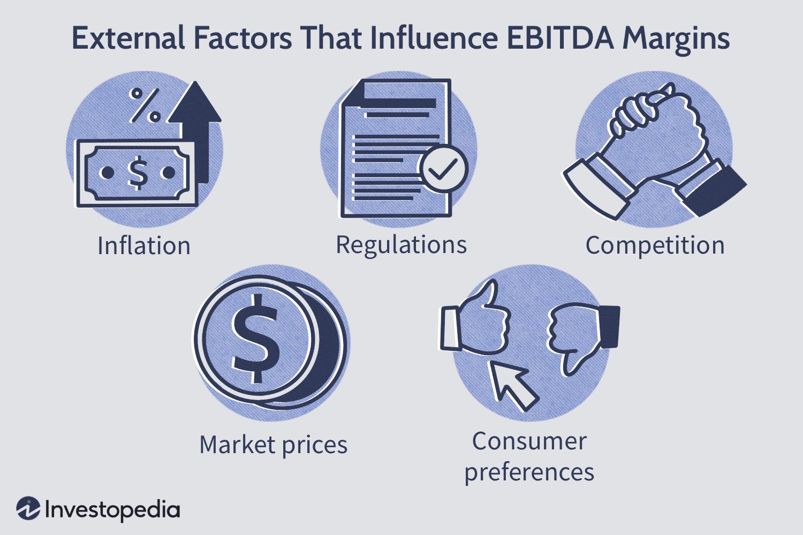

In an interconnected world, businesses rely on various financial metrics to evaluate their performance and growth potential. Among these, the EBITDA margin stands out as a vital indicator of a company's operational profitability. EBITDA, or Earnings Before Interest, Taxes, Depreciation, and Amortization, provides insight into a firm's core operational efficiency by excluding non-operational expenses and accounting decisions. The EBITDA margin is calculated by dividing EBITDA by total revenue and expressing it as a percentage, revealing how much of a company's revenue is converted into operational profit.

The significance of EBITDA margin lies in its ability to facilitate fair comparisons across companies and industries, focusing solely on operational performance. By stripping away extraneous factors such as financing costs and tax environments, it offers a streamlined view of profits purely derived from business operations.



In parallel, algorithmic trading has transformed the financial industry. This method uses sophisticated algorithms to analyze market data and execute trades at speeds and volumes unattainable by humans. The precision and speed offered by algorithmic trading have revolutionized traditional investment analysis, opening new avenues for data-driven decision-making in financial markets. 

This article explores the synergy between understanding external factors influencing EBITDA margins and leveraging algorithmic trading strategies. By integrating solid financial analysis with advanced trading techniques, investors can enhance their decision-making processes, refining their strategies in the ever-evolving financial landscape.

## Table of Contents

## Understanding EBITDA Margin

EBITDA, an acronym for Earnings Before Interest, Taxes, Depreciation, and Amortization, is a financial metric that offers a focused view of a company's operational efficiency and profitability. By excluding the effects of financing and accounting decisions, such as interest payments, tax liabilities, and the non-cash charges of depreciation and amortization, EBITDA provides a clearer picture of how a company performs from its core business operations alone.

The EBITDA margin is derived by expressing EBITDA as a percentage of total revenue, calculated using the formula:

$$
\text{EBITDA Margin} = \left( \frac{\text{EBITDA}}{\text{Total Revenue}} \right) \times 100
$$

This percentage reflects the proportion of revenue that remains after accounting for operational expenses, excluding costs related to capital structure, taxation, and asset devaluation. As such, it serves as an indicator of a company's profitability derived solely from its operational activities.

The primary advantage of using the EBITDA margin is its ability to facilitate fair comparisons between companies and industries. By stripping away financing and tax-related components, it allows for a more straightforward evaluation of operational performance. This is particularly useful when comparing companies within the same sector or conducting cross-industry analysis, where variations in capital structure or tax regimes could otherwise obscure comparative insights.

Moreover, by focusing on operational performance, the EBITDA margin aids in assessing the fundamental business health, efficiency, and scalability potential of a company. However, it is important to recognize its limitations, as the exclusion of interest, taxes, depreciation, and amortization means that it does not reflect the company’s cash flow or net profitability comprehensively. Consequently, while EBITDA margin is a valuable tool for comparing operational efficiency, it should be considered alongside other financial metrics for a full understanding of a company's financial standing.

## External Factors Influencing EBITDA Margins

Numerous external factors can significantly impact a company's EBITDA margins, affecting its operational profitability and competitive standing. Key among these factors are economic inflation or deflation, regulatory changes, competitive pressures, market price movements, and shifts in consumer preferences.

**Economic Inflation or Deflation**: Inflation typically leads to increased production costs, commodities, labor, and overheads. As costs rise, without a commensurate increase in prices, the EBITDA margins tend to shrink, reflecting decreased profitability. Conversely, deflation may lower these production costs, potentially leading to improved margins, provided that the company can maintain its pricing levels. For example, if inflation causes raw material costs to rise by 10% but a company can only raise its sale price by 5%, its EBITDA margin will diminish. The EBITDA margin can be mathematically represented as:

$$
\text{EBITDA Margin} = \left( \frac{\text{EBITDA}}{\text{Total Revenue}} \right) \times 100
$$

**Regulatory Changes**: Legislative or regulatory shifts can directly influence EBITDA margins through increased expenses related to compliance or changes in operational processes. For instance, an increase in the minimum wage can elevate labor costs, which may erode margins unless passed on to consumers through higher prices. Similarly, stringent environmental regulations might require additional capital investments or operational changes, increasing costs. Companies in heavily regulated sectors, such as finance or pharmaceuticals, may face significant compliance costs that impact their EBITDA.

**Competitive Pressures**: Intense competition can force companies to reduce prices to maintain market share, thereby affecting their EBITDA margins. A company might have to engage in discounting strategies or increase marketing expenditures to retain customers, both of which can compress margins. Conversely, a company with a distinctive competitive edge, such as exclusive technology or branding, might sustain higher pricing power and, thus, healthier margins.

**Market Price Movements**: Fluctuations in the prices of goods and services can directly affect profitability. For companies heavily reliant on specific commodities, such as manufacturing or energy sectors, changes in the prices of raw materials can significantly impact EBITDA margins. A sudden rise in the cost of oil, for instance, increases transportation and production costs, thereby squeezing margins.

**Shifts in Consumer Preferences**: Evolving consumer preferences require businesses to adapt to new demands, often at a cost. Failure to pivot can lead to reduced sales, affecting revenue and subsequently margins. On the other hand, companies that successfully innovate or capitalize on new trends may benefit from increased sales volumes or premium pricing, bolstering their EBITDA margins.

Understanding these external factors is crucial for companies to strategize effectively and safeguard their profitability metrics like EBITDA margins amidst a constantly changing business landscape.

## The Role of Financial Metrics in Investment Analysis

Financial metrics serve as essential tools for investment analysis, enabling investors to gauge a company's financial health and operational efficiency. Among these metrics, the EBITDA margin stands out by providing a measure of a company's operational profitability, excluding variables like interest, taxes, depreciation, and amortization. This focus on core operations allows investors to compare companies across different industries on a more level playing field, isolating the effects of operational management from financing and accounting decisions.

Beyond EBITDA margin, other key financial metrics include Return on Investment (ROI) and Return on Equity (ROE). ROI evaluates the efficiency of an investment by comparing the gain or loss relative to the investment cost. It is typically expressed as a percentage and is calculated using the formula:

$$
\text{ROI} = \left(\frac{\text{Net Profit}}{\text{Cost of Investment}}\right) \times 100
$$

ROI helps investors determine the profitability of their investments and is crucial for comparing the potential returns of various investment options.

ROE, on the other hand, measures a company's ability to generate profits from its shareholders' equity. It is expressed as:

$$
\text{ROE} = \left(\frac{\text{Net Income}}{\text{Shareholder's Equity}}\right) \times 100
$$

ROE provides insight into how effectively a company uses invested capital to create profits, reflecting the financial performance and managerial effectiveness from the perspective of equity investors.

When considered together, these metrics contribute to a comprehensive evaluation of a company's operational and financial performance. Through the lens of these metrics, investors can assess whether a company is efficiently utilizing its resources to generate profits and growth. This, in turn, informs strategic decisions, from asset allocation to risk management. Using these insights, investors can make informed decisions that align with their investment objectives, risk tolerance, and market conditions.

 to Algorithmic Trading

Algorithmic trading, often referred to as algo trading, represents a significant evolution in financial markets, leveraging computer algorithms to perform trades at a speed and [volume](/wiki/volume-trading-strategy) that surpass human capabilities. This form of trading relies on sophisticated mathematical models and formulas to scan financial markets for profitable trading opportunities, executing trades based on predefined criteria without direct human intervention.

One of the primary advantages of [algorithmic trading](/wiki/algorithmic-trading) is its ability to eliminate human error, as it strictly adheres to the set trading rules and parameters. This adherence ensures that trades are executed as per the strategy, regardless of emotional or psychological factors that may affect human traders. By doing so, algorithms can execute large orders in split seconds, capitalizing on even the slightest market movements that human traders might miss.

Strategies employed in algorithmic trading vary, but two common ones include trend-following and [arbitrage](/wiki/arbitrage). Trend-following strategies monitor price movements and trading volumes, identifying opportunities to buy or sell based on the observed trends. These strategies are coded to follow predictable patterns or signals, utilizing historical data to anticipate future price movements.

Arbitrage strategies, on the other hand, exploit price discrepancies across different markets or instruments. For instance, an algorithm may detect a temporary price difference in a financial instrument listed on multiple exchanges and execute trades to profit from the price disparity. These arbitrage opportunities often require high-speed execution and precise timing, making them well-suited for algorithmic trading.

Algorithmic trading systems typically analyze an extensive array of data, including market data, financial reports, economic indicators, and more, synchronized to identify optimal entry and [exit](/wiki/exit-strategy) points. Here's a simplified Python code snippet demonstrating a basic trend-following strategy using a moving average:

```python
import numpy as np
import pandas as pd

def simple_moving_average(prices, window):
    return prices.rolling(window=window).mean()

# Example data
data = pd.DataFrame({'Price': [100, 102, 104, 103, 102, 101, 100, 105, 107, 106]})

# Calculate moving average with a window of 3
data['SMA'] = simple_moving_average(data['Price'], 3)

# Basic condition: Buy if price is above SMA, sell if below
for index, row in data.iterrows():
    if index == 0:
        continue
    if row['Price'] > row['SMA']:
        print(f"Buy signal at index {index}, Price: {row['Price']}")
    elif row['Price'] < row['SMA']:
        print(f"Sell signal at index {index}, Price: {row['Price']}")
```

In this snippet, the simple moving average (SMA) is calculated for a series of prices. Buy signals are generated when the current price exceeds the SMA, and sell signals are generated when the price falls below the SMA.

The efficiency of algorithmic trading heavily depends on the quality of the underlying data and the robustness of the algorithms, necessitating continual refinement and [backtesting](/wiki/backtesting) to adapt to changing market conditions. As financial markets continue to evolve, algorithmic trading remains a cornerstone of modern trading strategies, providing traders with the tools to navigate complex markets with precision and speed.

## Integrating EBITDA Margin with Algorithmic Trading

Algorithmic traders can utilize EBITDA margins to identify companies exhibiting strong operational efficiency, thus informing their trading strategies. By targeting firms with high or improving EBITDA margins, these automated systems focus on candidates that demonstrate robust financial health, thereby enhancing trade precision.

Automated trading systems are capable of processing vast datasets to prioritize stocks based on specific financial metrics, such as EBITDA margins. The use of mathematical models and algorithms ensures that trades adhere to strict parameters, minimizing human error and optimizing decision-making processes. For example, an algorithm could be designed to filter companies with an EBITDA margin above a certain threshold, indicating superior operational performance.

```python
import pandas as pd

# Example DataFrame with company financial info
data = {'Company': ['A', 'B', 'C', 'D'],
        'EBITDA': [100, 200, 150, 300],
        'Revenue': [500, 800, 700, 1000]}

df = pd.DataFrame(data)

# Calculate EBITDA margin
df['EBITDA_Margin'] = (df['EBITDA'] / df['Revenue']) * 100

# Setting a threshold for filtering companies
threshold = 25

# Filtering companies with a high EBITDA margin
filtered_companies = df[df['EBITDA_Margin'] > threshold]
print(filtered_companies)
```

This snippet illustrates the selection of firms based on EBITDA margin thresholds, a process that can be dynamically integrated into larger algorithmic trading frameworks.

Furthermore, backtesting with historical data plays a crucial role in refining these strategies. It allows traders to simulate trades using past market data to ascertain the effectiveness of their algorithms. By incorporating historical EBITDA margin trends and other market signals, traders can improve the accuracy and reliability of their systems, optimizing both risk management and potential returns.

Successful integration also involves continual adjustments based on ongoing data inputs and market conditions. Balancing EBITDA margin analysis with algorithmic design enables traders to dynamically adapt to market fluctuations while maintaining a focus on financial robustness, ultimately enhancing overall trading performance.

## Case Studies and Real-world Applications

Successful investment funds have effectively integrated EBITDA margins within algorithmic trading strategies, focusing on companies that exhibit strong operational efficiency. By targeting firms with robust or improving EBITDA margins, these funds have enhanced their return on investments through the identification of fundamentally strong companies. This approach enables traders and investors to filter out weaker entities and focus on those with sustained profitability and operational performance.

In particular, several tech startups have pioneered the use of [machine learning](/wiki/machine-learning) to analyze trends in EBITDA margins. These startups continuously collect and evaluate vast datasets to predict movements in EBITDA margins. For instance, by employing machine learning algorithms, companies can classify and cluster data to spot subtle patterns and shifts in operational efficiency that traditional analysis might overlook. These models, trained on historical financial data, provide more precise insights into a company’s financial trajectory, enabling more dynamic trading decisions.

Machine learning techniques, such as neural networks and decision trees, have proven valuable in this context. They allow for the creation of predictive models that consider a multitude of variables impacting EBITDA margins. Here is a simple example of how a machine learning model might be implemented in Python using scikit-learn to predict EBITDA margins based on a dataset of financial indicators:

```python
from sklearn.model_selection import train_test_split
from sklearn.ensemble import RandomForestRegressor
from sklearn.metrics import mean_squared_error

# Assuming data is pre-loaded into a Pandas DataFrame 'df'
# Features include various financial metrics, target is 'ebitda_margin'
X = df.drop(columns=['ebitda_margin'])
y = df['ebitda_margin']

# Split data into training and testing sets
X_train, X_test, y_train, y_test = train_test_split(X, y, test_size=0.2, random_state=42)

# Initialize and train the model
model = RandomForestRegressor(n_estimators=100, random_state=42)
model.fit(X_train, y_train)

# Predict and evaluate the model
predictions = model.predict(X_test)
mse = mean_squared_error(y_test, predictions)
print(f'Mean Squared Error: {mse}')
```

These case studies illustrate the profound impact of combining financial analysis with algorithmic precision. Advanced analytics facilitate enhanced investment outcomes through the systematic identification of companies with solid financial fundamentals. As data analytics and algorithmic capabilities advance, integrating EBITDA margin analysis within algorithmic trading frameworks offers increasingly sophisticated solutions for optimizing trading strategies.

## Conclusion

The integration of EBITDA margin analysis within algorithmic trading frameworks provides a robust means for making informed investment decisions. By incorporating this financial metric, traders can enhance their focus on companies that exhibit operational efficiency. The marriage of EBITDA margin analysis with algorithmic trading allows for a thorough assessment of fundamental financial health, which can lead to optimized trading decisions.

Advances in AI and machine learning continue to shape this synergy, offering sophisticated solutions for data interpretation and trend identification. These technologies enable the automation of data analysis, allowing algorithms to rapidly process vast amounts of information and detect patterns that might elude human analysts. Machine learning models can adapt to new data and refine their predictive capabilities over time, thus enhancing the efficacy of trading strategies that incorporate EBITDA margins.

Staying informed about market dynamics and continuously evolving strategies enables investors to maintain a competitive edge in the financial ecosystem. The financial market is influenced by numerous variables, and being able to swiftly adjust strategies in response to these changes is crucial. Algorithmic trading systems, when combined with advanced analytics, provide the agility needed to respond to market shifts effectively, ensuring that investors can capitalize on favorable conditions and mitigate risks associated with [volatility](/wiki/volatility-trading-strategies).

Ultimately, the integration of EBITDA margin analysis within algorithmic trading not only enhances trading precision but also helps in identifying companies with solid operational fundamentals, thereby supporting sustainable investment practices. This approach aligns investment strategies with both technical and fundamental evaluations, fostering a comprehensive understanding of market opportunities.

## References & Further Reading

### References & Further Reading

To expand your understanding of EBITDA margins and their incorporation into algorithmic trading strategies, consider exploring the following resources:

1. **Industry Reports on Financial Metrics**:
    - **McKinsey & Company**: Their insights into operational efficiency and financial performance provide context for how companies use EBITDA margins to assess their profitability. Reports often highlight industry-specific benchmarks and trends.
    - **PwC's Global Annual Report**: This report tends to include comprehensive analyses on financial metrics, offering a broader view of EBITDA trends across different sectors.

2. **Academic Journals on Quantitative Trading**:
    - **The Journal of Finance**: Publishes peer-reviewed articles on financial markets and trading strategies. Articles often cover algorithmic trading's impact on market efficiency and investment performance.
    - **Quantitative Finance Journal**: Focuses on the application of mathematics in understanding market trends and optimizing trading strategies. It includes studies on how financial metrics like EBITDA can enhance algorithmic models.

3. **Books on Financial Metrics and Algorithmic Trading**:
    - **"Financial Metrics for Dummies" by Michael Taillard**: A practical guide to understanding key financial metrics, including EBITDA, and how they influence investment decisions.
    - **"Algorithmic Trading" by Ernie Chan**: This book offers practical guidance on implementing quantitative strategies. It provides insights into how financial metrics can play a role in algorithmic models.

4. **Analyses of Algorithmic Trading's Market Impact**:
    - **Market Structure Reports from BIS (Bank for International Settlements)**: These frequently address the role of high-frequency and algorithmic trading in modern financial markets, discussing both their efficiencies and potential risks.
    - **SEC (U.S. Securities and Exchange Commission) publications**: Provide regulatory perspectives on algorithmic trading, discussing its implications on market integrity and investor protection.

5. **Online Courses and Conferences**:
    - **Coursera and edX**: Offer courses taught by experts in financial modeling and algorithmic trading. These courses often include modules on trading strategies that incorporate financial metrics such as EBITDA margins.
    - **QuantCon**: An annual conference focused on quantitative trading strategies where analysts and traders explore the latest innovations in algorithmic trading.

Engaging with these resources will supply a well-rounded understanding of the mechanisms underpinning EBITDA margins and their influential role in crafting effective trading strategies. Additionally, staying abreast of the latest academic and industry research ensures a continual refinement of knowledge in an ever-evolving financial landscape.

