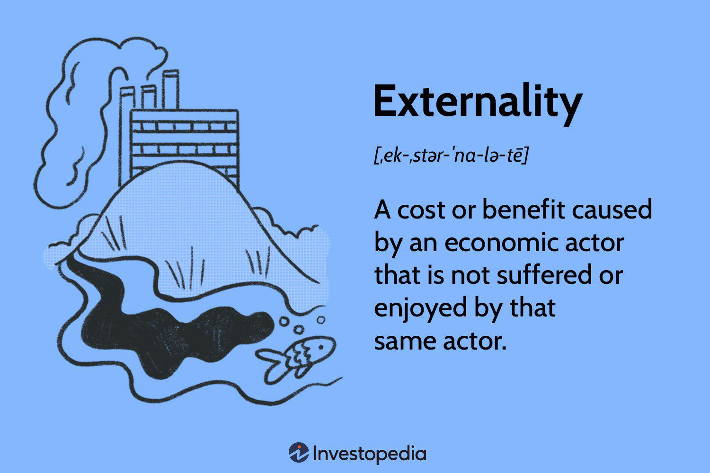

The concept of externalities is central to understanding market efficiencies and imperfections. In economics, externalities refer to costs or benefits experienced by a third party who did not choose to incur those costs or benefits. These externalities can be both positive and negative, influencing individuals and society in diverse ways.

Positive externalities occur when the actions of individuals or companies lead to benefits for others. For example, the widespread adoption of vaccinations reduces the spread of diseases, benefiting individuals who have not been vaccinated. Such externalities often result in societal advancements, promoting overall welfare beyond the immediate effects on direct participants.



Conversely, negative externalities impose unintended costs on third parties. Pollution from industrial production serves as a prime example; it affects the health and environment of communities that are not directly involved in the industrial activities. These negative impacts often lead to market failures, where the private costs borne by producers do not reflect the true social costs, resulting in overproduction of harmful goods.

In the rapidly evolving sphere of algorithmic trading, understanding these externalities is crucial for minimizing risks and maximizing returns. Algorithmic trading involves using automated and complex algorithms to execute orders in financial markets at high speeds. The practice can introduce both positive and negative externalities. On the positive side, it can enhance market efficiency and liquidity by facilitating quicker transaction executions and narrowing spreads. However, it can also lead to negative outcomes, such as increased market volatility and the potential for systemic risks if the algorithms behave unexpectedly.

This article explores the dynamics of positive and negative externalities in economics, their implications for algorithmic trading, and strategies to manage them for improved economic outcomes. By comprehensively understanding these unwarranted effects, economic actors can better navigate the complexities of trading environments and work towards creating more stable and equitable markets.

## Table of Contents

## Understanding Externalities in Economics

Externalities occur when the production or consumption of a good or service impacts a third party that is not directly involved in the transaction. These impacts can be either beneficial or detrimental, and they represent a significant challenge in economics because they often lead to market failures when not properly addressed. 

Positive externalities are benefits received by third parties who did not directly participate in an economic activity. For instance, education exemplifies a positive externality because it not only benefits the individual receiving the education but also society as a whole by contributing to a more informed and skilled workforce, which can lead to higher levels of innovation and productivity. Research and development serve as another example, where advancements benefit sectors beyond those directly involved in the original research or invention effort. These advantages accrue to society and contribute to collective advancement, often justifying government interventions such as subsidies or public funding to foster activities with positive externalities.

Conversely, negative externalities impose costs on third parties. Pollution is a classic example, where industrial activity leads to environmental degradation that affects the health and well-being of individuals and communities not involved in the polluting activity. These costs are frequently not reflected in the market price of the goods or services produced, leading to overconsumption or overproduction from society's standpoint. This discrepancy is a primary cause of market inefficiencies known as market failures, where the free market does not allocate resources in a socially optimal manner.

These externalities challenge economic efficiency because they lead to wasteful allocation of resources unless adequately addressed. Traditional economic markets operate under the assumption that all costs and benefits associated with a good or service are captured in the transaction price. Externalities break this assumption, requiring interventions to rectify the discrepancies. Mechanisms such as taxes, subsidies, regulations, or market-based solutions like tradable permits are employed to internalize externalities, aligning private incentives with social well-being to enhance overall market efficiency. 

Properly addressing externalities is crucial to minimizing the adverse effects of economic activities on third parties and ensuring that positive societal impacts are maximized. Through understanding these economic phenomena, policymakers can implement strategies that guide economic activities toward more sustainable and efficient outcomes.

## Positive Externalities and Their Economic Impact

Positive externalities occur when an economic activity produces benefits for third parties who are not directly involved in the transaction. These externalities enhance societal welfare, often leading to outcomes that surpass the private motivations of the individuals or entities initially engaged in the activity.

Education exemplifies a positive externality. When individuals pursue education, the benefits extend beyond personal advancement. An educated workforce contributes to higher productivity, fosters innovation, and enhances social cohesion. The collective knowledge and skills acquired by individuals lead to economic growth and improved standards of living for society as a whole. This spillover effect justifies public investment and subsidies to make education more accessible and reduce barriers to entry.

Similarly, research and development (R&D) activities generate positive externalities by pushing technological boundaries and innovation across various sectors. For instance, advancements in healthcare technologies borne out of R&D efforts not only benefit immediate users but also set off a chain reaction of benefits, such as improved public health, increased life expectancy, and reduced healthcare costs on a societal level. The ripple effect of technological innovation extends to other industries, jumpstarting new products, services, and economic opportunities.

Understanding the impacts of positive externalities is vital for policymakers who aim to encourage activities that offer broader societal benefits. This often involves implementing strategies such as subsidies, grants, or public funding aimed at reducing the cost and risk associated with activities bearing positive externalities. By aligning incentives with societal well-being, these policies help ensure that the beneficial impacts of such externalities are fully realized.

The management of positive externalities can include economic measures—like tax incentives for companies engaging in R&D—or social strategies—such as awareness campaigns to promote educational benefits. Effective policy formulation relies on meticulous analysis of potential externalities and their broader implications, ensuring resources are directed towards activities that enhance overall economic and social outcomes.

## Negative Externalities and Their Consequences

Negative externalities occur when economic activities impose unaccounted-for costs on third parties who are not directly involved in the transaction. These spillover effects can lead to significant market distortions and inefficiencies, as the full social cost of a good or service is not reflected in its market price. 

Pollution serves as a quintessential example of a negative externality. When industries produce goods, they may release harmful emissions into the air or water. These emissions create health risks for the community and degrade environmental quality, but the industries may not bear the costs associated with these adverse effects. Consequently, the market price of goods produced by polluting industries fails to account for the environmental and health costs, leading to overconsumption and resource misallocation.

The unchecked growth of negative externalities can exacerbate market inefficiencies, as the societal costs of economic activities may outweigh their private benefits. This discrepancy can be represented by the economic concept of external cost, which is the cost borne by third parties as a result of an economic transaction. The presence of external costs implies a divergence between private costs (borne by the producer) and social costs (total costs including externalities).

To address these market failures, economic interventions are necessary. Governments and policymakers employ various tools to internalize external costs and mitigate the adverse effects of negative externalities. One common approach is the implementation of taxes or levies, such as a carbon tax, which directly charges polluters for their emissions. This pricing mechanism encourages companies to reduce pollution and invest in cleaner technologies by aligning their private costs with the social cost of their activities.

In addition to taxes, regulatory measures play a crucial role in managing negative externalities. Regulations can set limits on the amount of pollution that firms are allowed to emit, creating an incentive for companies to innovate and adopt sustainable practices. Tradable permits, also known as cap-and-trade systems, provide another market-based solution. Under this system, a government issues a limited number of emissions permits and allows firms to buy and sell them. This creates a financial incentive for companies to reduce emissions below permitted levels, as they can profit from selling excess permits.

Through these interventions, policymakers aim to correct market imbalances and promote sustainable economic practices that account for the broader social costs associated with production and consumption activities. By internalizing negative externalities, the market can function more efficiently, aligning private incentives with the broader societal good.

## Algorithmic Trading and Externalities

Algorithmic trading, commonly known as algo trading, significantly interacts with externalities that arise both at a market-wide level and within specific trading strategies. Externalities in this context refer to the unintended consequences or impacts of trading activities on other market participants or the financial system as a whole, without these effects being fully reflected in market prices.

Positive externalities in [algorithmic trading](/wiki/algorithmic-trading) often manifest as improvements in market efficiency and [liquidity](/wiki/liquidity-risk-premium). Innovations in trading technology and strategies can lead to tighter bid-ask spreads, increased trading [volume](/wiki/volume-trading-strategy), and more accurate price discovery. These benefits can enhance overall market quality, making trading more accessible and cost-effective for all participants [1]. For example, the development of sophisticated algorithms can process vast amounts of data quickly, enabling more informed trading decisions and contributing to a more efficient allocation of resources across markets.

Conversely, negative externalities are a concern, particularly with high-frequency trading ([HFT](/wiki/high-frequency-trading-strategies)). The rapid execution of trades by high-frequency algorithms can contribute to increased market [volatility](/wiki/volatility-trading-strategies), as these systems react to and amplify small price movements. This volatility can lead to systemic risks, potentially destabilizing financial markets [2]. One notorious example of such a negative externality is the "flash crash" phenomenon, where abrupt price swings occur due to algorithmic trading errors or cascading sell-offs triggered by automated programs.

To address these externalities, traders and regulators must implement strategies that account for the broader impacts of algorithmic trading. This involves optimizing trading strategies to mitigate risks, such as employing advanced risk management protocols and ensuring algorithms operate within set parameters to avoid unintended market disruptions. Additionally, regulatory frameworks may introduce measures like circuit breakers, which temporarily halt trading during extreme market fluctuations, to contain systemic risks and promote stability.

Overall, managing the externalities in algorithmic trading requires a concerted effort from both market participants and regulators to balance the benefits of innovation with the need for robust risk management and market oversight.

References:
[1] Hendershott, T., Jones, C. M., & Menkveld, A. J. (2011). Does Algorithmic Trading Improve Liquidity? The Journal of Finance, 66(1), 1–33.
[2] Kirilenko, A. A., Kyle, A. S., Samadi, M., & Tuzun, T. (2017). The Flash Crash: High‐Frequency Trading in an Electronic Market. The Journal of Finance, 72(3), 967-998.

## Strategies to Mitigate Externalities in Trading

Proper management of externalities can enhance the efficiency and stability of financial markets. In the context of algorithmic trading, mitigating the adverse effects while amplifying the positive ones is crucial for maintaining market health.

One strategy to reduce negative externalities in trading is the implementation of algorithmic risk controls. These controls are designed to manage and minimize the risk of events like flash crashes. Flash crashes occur when a large number of orders are executed within a very short time frame, often due to algorithms, leading to dramatic drops in asset prices. Risk controls can include measures such as dynamic throttling of order execution speed, monitoring trading behaviors, and setting up automatic kill switches that deactivate trading systems when unusual patterns are detected.

For example, an algorithm might include a safeguard like the following in Python:

```python
def check_market_impact(order_size, market_volume, threshold=0.05):
    market_impact = order_size / market_volume
    if market_impact > threshold:
        return "Reduce order size or delay execution"
    return "Execute order"

# Example usage
order_size = 1000
market_volume = 50000
print(check_market_impact(order_size, market_volume))
```

This simple function checks whether an order is likely to have a significant impact on the market, advising adjustments if necessary.

Transaction taxes, commonly known as Tobin taxes, on financial trades can also serve as a deterrent against excessive volatility. By imposing a small fee on each trade, these taxes aim to reduce the frequency of speculative trading and encourage long-term investment, thus stabilizing markets. Similarly, circuit breakers act as temporary halts in trading when extreme volatility or price deviations occur, allowing time for information dissemination and trader reassessment.

Encouraging best practices and promoting transparency in algorithmic trading platforms are fundamental for aligning market activities with broader economic and social goals. Transparent algorithms ensure that participants understand the mechanisms underlying their trades, fostering trust and cooperation in the market. Moreover, implementing industry-wide standards for these algorithms can prevent the formation of systemic risks, as well-coordinated systems are less likely to crash in unison.

To sum up, addressing the externalities in trading requires a focused approach that combines algorithmic controls, policy interventions, and transparency. By doing so, traders and regulators can work toward a more stable and efficient market environment.

## Conclusion

Understanding and managing externalities is crucial in economics and specifically in algorithmic trading. Algorithmic trading, with its rapid decision-making facilitated by sophisticated models, has significant implications for externalities, both positive and negative. Addressing these externalities requires a balanced approach combining both market-based solutions and regulatory interventions. Market-based solutions, such as implementing transaction taxes, can help internalize external economic effects by making traders financially accountable for the market impacts they generate. Similarly, employing algorithmic risk controls can prevent negative externalities such as flash crashes that disrupt market stability.

Regulatory interventions also play a vital role. Regulations can ensure transparency and enforce standards that minimize harmful externalities. For example, circuit breakers can be implemented to halt trading temporarily in times of extreme volatility, which often results from algorithmic errors or unexpected market conditions. Combining these strategies ensures a comprehensive approach to mitigating risks while fostering innovations that contribute positively to market dynamics.

By internalizing these externalities, economic actors can achieve more equitable and efficient market outcomes. Internalization leads to the alignment of private incentives with societal goals, promoting decision-making that considers broader economic impacts. This alignment encourages innovation and trading practices that benefit more than just the immediate parties involved, ultimately facilitating a healthier and more balanced market ecosystem.

Continued research and adaptation are essential in the face of evolving market dynamics to minimize negative externalities and amplify positive ones. As technologies and market conditions change, ongoing analysis and modification of both algorithmic strategies and regulatory policies are necessary to maintain market stability and efficiency. Incorporating new insights and technologies will further enable the mitigation of risks posed by algorithmic trading and enhance the overall benefits derived from market activities.

## References & Further Reading

[1]: Hendershott, T., Jones, C. M., & Menkveld, A. J. (2011). ["Does Algorithmic Trading Improve Liquidity?"](https://onlinelibrary.wiley.com/doi/full/10.1111/j.1540-6261.2010.01624.x) The Journal of Finance, 66(1), 1–33.

[2]: Kirilenko, A. A., Kyle, A. S., Samadi, M., & Tuzun, T. (2017). ["The Flash Crash: High‐Frequency Trading in an Electronic Market."](https://www.jstor.org/stable/26652722) The Journal of Finance, 72(3), 967-998.

[3]: ["Advances in Financial Machine Learning"](https://www.amazon.com/Advances-Financial-Machine-Learning-Marcos/dp/1119482089) by Marcos Lopez de Prado

[4]: Coase, R. H. (1960). ["The Problem of Social Cost."](https://www.jstor.org/stable/10.1086/674872) Journal of Law and Economics, 3, 1-44.

[5]: Pigou, A. C. (1920). ["The Economics of Welfare."](http://files.libertyfund.org/files/1410/Pigou_0316.pdf) Macmillan and Co., Limited. 

[6]: ["Quantitative Trading: How to Build Your Own Algorithmic Trading Business"](https://github.com/LucindaYa/quant-resources/blob/master/Quantitative%20Trading%20How%20to%20Build%20Your%20Own%20Algorithmic%20Trading%20Business.pdf) by Ernest P. Chan