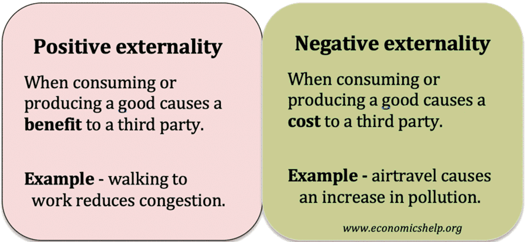

## Table of Contents

## What are externalities in economics?

Externalities in economics are the effects of a product or activity on people who are not directly involved in it. These effects can be positive or negative. For example, if a factory pollutes a river, it creates a negative externality because it harms people who use the river. On the other hand, if someone plants a beautiful garden that makes the neighborhood look nicer, it creates a positive externality because it benefits the community.

Governments and businesses often try to manage externalities. For negative externalities, they might use taxes or regulations to reduce harmful activities. For example, a tax on pollution can encourage factories to pollute less. For positive externalities, governments might provide subsidies or incentives to encourage more of the beneficial activity. Understanding externalities helps us see the full impact of economic decisions and find ways to make things better for everyone.

## What is the difference between positive and negative externalities?

Positive externalities happen when an action by someone benefits others who are not directly involved. For example, if you plant a garden in your yard, it might make your neighborhood look nicer. This makes everyone in the neighborhood happier, even though they didn't help plant the garden. Governments might encourage these good actions by giving rewards or subsidies to people who do them.

Negative externalities occur when an action by someone harms others who are not directly involved. For instance, if a factory pollutes a river, it can harm people who use the river for drinking or fishing. They didn't cause the pollution, but they suffer from it. To deal with this, governments might use taxes or rules to make the factory pollute less, helping to protect the community.

## Can you provide an example of a positive externality?

Imagine you decide to get a flu shot. Not only does this protect you from getting sick, but it also helps keep the people around you safe. When fewer people get the flu, it's less likely to spread to others in your community, like your family, friends, and coworkers. This is a positive externality because your decision to get vaccinated benefits others who didn't even have to do anything.

In another example, think about a homeowner who decides to fix up their house and plant a beautiful garden. The house and garden not only make the homeowner happy but also make the whole neighborhood look nicer. Neighbors might feel prouder of where they live, and the area could become more attractive to visitors. This is another positive externality because the homeowner's efforts improve the community without the neighbors having to lift a finger.

## Can you provide an example of a negative externality?

Imagine a factory that makes cars. The factory uses a lot of energy and releases smoke into the air. This smoke is bad for the air quality in the town where the factory is located. People in the town start to have more breathing problems because of the polluted air. They didn't choose to have the factory there, but they are affected by its pollution. This is a negative externality because the factory's actions harm the community.

Another example is when someone decides to play loud music late at night. The person playing the music might enjoy it, but their neighbors can't sleep because of the noise. The neighbors didn't choose to listen to the music, but they are disturbed by it. This is another negative externality because the person's choice to play loud music affects others in a bad way.

## How do externalities affect market outcomes?

Externalities can make markets work differently than they would if everyone only thought about themselves. When there's a negative externality, like pollution from a factory, the market might make too much of the product because the factory doesn't pay for the harm it causes. The cost of pollution is passed onto the community, so the factory can keep making cars without worrying about the air quality. This means the market ends up with more cars than it would if the factory had to pay for the pollution.

On the other hand, positive externalities can lead to less of a good thing being made. For example, if someone gets a flu shot, it helps the whole community by reducing the spread of the flu. But the person only thinks about their own health, not the community's. So, fewer people might get flu shots than would be best for everyone. This means the market doesn't make as many flu shots as it should, because the benefits to others aren't counted in the price.

## What are some common sources of externalities?

Common sources of externalities include factories and cars that pollute the air and water. When a factory releases smoke or chemicals into the environment, it can make the air dirty and harm people's health. Cars also release exhaust fumes that contribute to air pollution. These activities create negative externalities because the people who own the factories and cars don't pay for the harm they cause to others.

Another source of externalities comes from activities that benefit the community, like education and vaccinations. When someone gets an education, they become more knowledgeable and might contribute more to society. This helps everyone, not just the person who got educated. Similarly, when someone gets vaccinated, it reduces the spread of diseases, protecting others in the community. These are positive externalities because the benefits go beyond the individual who took the action.

Lastly, everyday actions like playing loud music or smoking in public spaces can also be sources of externalities. Playing loud music can disturb neighbors and affect their quality of life, creating a negative externality. Smoking in public can expose others to secondhand smoke, which is harmful to their health. These examples show how even small actions can have big impacts on others, either positively or negatively.

## How can governments address negative externalities?

Governments can address negative externalities by using taxes and regulations. For example, they might put a special tax on factories that pollute the air or water. This tax makes it more expensive for the factory to pollute, so they might decide to pollute less or find a cleaner way to make their products. By doing this, the government makes sure that the factory pays for the harm it causes to the community.

Another way governments can deal with negative externalities is by setting rules and limits. They might create laws that say how much pollution is allowed or where factories can be built. For instance, a government might say that factories can't be built near schools or homes to protect people from pollution. These rules help to reduce the harm that negative externalities cause and make sure that businesses think about the impact of their actions on others.

## What policies can be used to encourage positive externalities?

Governments can encourage positive externalities by giving subsidies or rewards. For example, they might give money to people who get vaccinated against the flu. This makes it easier for people to get the shot, which not only protects them but also helps keep others safe from the flu. By offering these rewards, the government can make sure more people do things that benefit the whole community.

Another way to encourage positive externalities is through public education and awareness campaigns. If people know that getting an education or planting a garden can make their neighborhood better, they might be more likely to do it. Governments can run ads or programs to let people know about these benefits. This helps to increase the good things people do that help others without them having to pay for it directly.

## What is the concept of a 'Coase Theorem' in relation to externalities?

The Coase Theorem is an idea in economics that says if people can talk to each other and make deals easily, they can solve problems caused by externalities without needing help from the government. For example, if a factory's smoke bothers a nearby farmer, the factory and farmer could talk and agree on a solution. Maybe the factory pays the farmer for the harm, or the farmer pays the factory to reduce the smoke. As long as they can negotiate freely, they can find a way to make things better for both of them.

The important thing about the Coase Theorem is that it works best when the cost of making a deal is low and people know who is causing the problem and who is being affected. But in real life, it's not always easy for people to talk and make deals. Sometimes, there are too many people involved, or it's hard to figure out who should pay whom. That's why, even though the Coase Theorem sounds good in theory, governments often need to step in with laws and taxes to manage externalities when people can't solve them on their own.

## How do externalities impact global economies?

Externalities can have a big impact on global economies because they affect how countries trade and work together. When a country pollutes the air or water, it might harm other countries too. For example, if a factory in one country releases chemicals into a river that flows into another country, the pollution can hurt people and businesses there. This can lead to tension between countries and affect international trade. Countries might put up trade barriers or demand that the polluting country pay for the damage. This can slow down the global economy because it makes it harder for countries to work together and trade freely.

On the other hand, positive externalities can help global economies grow. When one country makes a new technology or medicine that benefits everyone, it can lead to more trade and cooperation. For example, if a country develops a new vaccine and shares it with others, it can help keep people healthy all over the world. This can make the global economy stronger because healthy people can work more and spend more. But to make sure these positive externalities help everyone, countries need to work together and share the benefits fairly. If they don't, some countries might miss out on the good things that others are doing.

## What are the challenges in measuring the impact of externalities?

Measuring the impact of externalities can be really hard because it's tough to put a number on things that don't have a clear price tag. For example, how do you measure the cost of dirty air from a factory? It's not just about how much it costs to clean up the air, but also about the health problems people might get from breathing it. These health problems can be different for everyone, and it's hard to know exactly how much they cost. Plus, some effects might not show up right away, like long-term health issues, which makes it even trickier to measure.

Another challenge is figuring out who is affected by the externality and how much. When a factory pollutes a river, it might harm people who live nearby, but also people who live far away if the river flows through different areas. It's hard to keep track of all these people and measure how each one is affected. And sometimes, the effects can be really small for each person but add up to a big problem when you look at everyone together. This makes it tough to decide how much the factory should pay or what rules should be made to fix the problem.

## Can you discuss any advanced economic models that incorporate externalities?

One advanced economic model that incorporates externalities is the Computable General Equilibrium (CGE) model. This model tries to look at the whole economy and see how different parts are connected. It can show how a factory's pollution might affect not just the people nearby, but also the prices of goods and the jobs in different industries. By putting in lots of data about the economy, the CGE model can help us understand how big the impact of an externality is and what might happen if we try to fix it. It's like a big puzzle where all the pieces fit together, and changing one piece can change the whole picture.

Another model is the Integrated Assessment Model (IAM), which is often used to study things like climate change. This model mixes economics with science to see how our actions affect the environment and how that, in turn, affects the economy. For example, it can show how burning fossil fuels leads to more CO2 in the air, which makes the planet warmer and changes how farmers can grow food. The IAM helps us figure out the best ways to reduce these negative externalities, like using less fossil fuel or finding new ways to make energy. It's a powerful tool because it lets us see the big picture and plan for the future.

## References & Further Reading

[1]: Hendershott, T., Jones, C. M., & Menkveld, A. J. (2011). ["Does Algorithmic Trading Improve Liquidity?"](https://onlinelibrary.wiley.com/doi/full/10.1111/j.1540-6261.2010.01624.x) The Journal of Finance, 66(1), 1–33.

[2]: Kirilenko, A. A., Kyle, A. S., Samadi, M., & Tuzun, T. (2017). ["The Flash Crash: High‐Frequency Trading in an Electronic Market."](https://www.jstor.org/stable/26652722) The Journal of Finance, 72(3), 967-998.

[3]: ["Advances in Financial Machine Learning"](https://www.amazon.com/Advances-Financial-Machine-Learning-Marcos/dp/1119482089) by Marcos Lopez de Prado

[4]: Coase, R. H. (1960). ["The Problem of Social Cost."](https://www.jstor.org/stable/10.1086/674872) Journal of Law and Economics, 3, 1-44.

[5]: Pigou, A. C. (1920). ["The Economics of Welfare."](http://files.libertyfund.org/files/1410/Pigou_0316.pdf) Macmillan and Co., Limited. 

[6]: ["Quantitative Trading: How to Build Your Own Algorithmic Trading Business"](https://github.com/LucindaYa/quant-resources/blob/master/Quantitative%20Trading%20How%20to%20Build%20Your%20Own%20Algorithmic%20Trading%20Business.pdf) by Ernest P. Chan