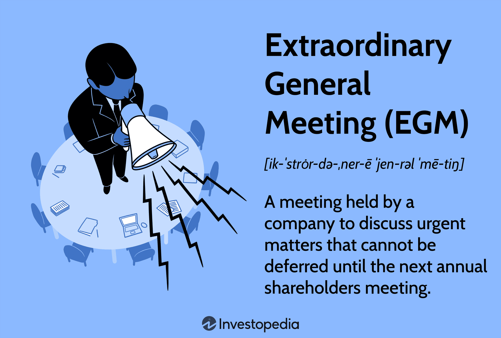

In corporate governance and finance, meetings are pivotal to decision-making processes, guiding the strategic direction of organizations. Among these, the Annual General Meeting (AGM) and Extraordinary General Meeting (EGM) hold particular importance, serving as platforms for critical discussions and shareholder engagement. AGMs are traditionally conducted once a year to review a company’s performance, discuss financial statements, approve dividends, and elect board members. In contrast, EGMs are convened as needed to address urgent matters that cannot wait until the next AGM, such as mergers or significant policy changes.

The landscape of these corporate meetings is increasingly influenced by technological advancements, with algorithmic trading (algo trading) playing a transformative role in financial markets. Algo trading employs sophisticated computerized systems to execute trades at high speeds based on mathematical models, offering benefits like improved market liquidity and reduced transaction costs.

The interplay between AGMs, EGMs, and algo trading is becoming more pronounced as technology integrates into corporate strategies and financial decision-making. This article explores how these components interact and shape the corporate landscape, highlighting the impact of algo trading on shareholder meetings and strategic initiatives. Understanding this relationship is crucial, as it unveils the evolving dynamics of corporate governance and opens new pathways for strategic development.

## Table of Contents

## Understanding Annual General Meetings (AGM)

Annual General Meetings (AGMs) serve as pivotal events in the corporate calendar, providing a structured forum for shareholders to convene and assess a company's past performance while charting the course for its future. Typically held once a year, these meetings offer a platform for discussing key aspects of corporate governance and strategy.

Central to the AGM is the presentation of the company's financial statements. Shareholders scrutinize these documents to understand the company's financial health and operational success. This includes examining profit and loss statements, balance sheets, and cash flow statements. Such transparency is crucial for fostering trust and ensuring accountability among corporate leadership.

Dividends, another core subject of AGMs, are discussed in detail. Shareholders eagerly anticipate updates on dividend payouts, as these reflect the company's profitability and cash flow status. The meeting often addresses proposed dividend distributions, enabling shareholders to evaluate the return on their investments and express their approval or dissent through voting.

AGMs also serve as an electoral platform for selecting the board of directors. Shareholders can exercise their voting rights to either re-elect current board members or introduce new candidates. This democratic process ensures that the board represents the interests of the shareholders and contributes effectively to the strategic direction of the company.

In more recent times, the integration of technology into AGMs has gained traction. Discussions around [algorithmic trading](/wiki/algorithmic-trading), or algo trading, are increasingly relevant. Algo trading refers to the use of computer algorithms to execute trading strategies at high speed and [volume](/wiki/volume-trading-strategy). During AGMs, the implications of such technologies on the company's strategies and market operations can be assessed. Shareholders are presented with insights on how algo trading might affect the company's competitive advantage, market positioning, and overall financial strategy.

For companies keen on staying ahead, AGMs can explore how technological advancements, including algo trading, can be harnessed to optimize operations and enhance shareholder value. The adoption of such technologies can lead to improved decision-making processes, more efficient market transactions, and better financial outcomes. As technology continues to evolve, the discussion of its impacts and integration within corporate strategy becomes a critical component of AGMs.

In summary, AGMs are indispensable gatherings for discussing financial health, strategic planning, board elections, and technological advancements, such as algo trading, allowing shareholders to engage actively with the company's future direction.

## What Are Extraordinary General Meetings (EGM)?

Extraordinary General Meetings (EGMs) serve as a vital organizational tool leveraged by corporations to address urgent or special matters requiring immediate attention, which cannot be postponed until the next Annual General Meeting (AGM). The calling of an EGM often arises from pressing circumstances such as mergers, acquisitions, or significant policy changes that necessitate shareholder approval or input.

The procedures and regulations governing EGMs differ notably from those of AGMs. EGMs often operate under different rules, offering a degree of flexibility in the organizational process—chiefly, a shorter notice period may be required to convene these meetings, allowing corporations to respond swiftly to emergent issues. This immediacy is pivotal for enacting timely decisions that could significantly influence the company's strategic trajectory.

The strategic role of EGMs is not merely procedural but also substantive, as these gatherings provide a platform to tackle issues quintessentially linked to a company's growth, stability, and market position. In this environment, insights from algorithmic trading (algo trading) can add substantial value. Algo trading, which involves using automated systems to execute transactions based on pre-defined criteria, can furnish valuable market data and predictive analytics, aiding in the decision-making processes during EGMs.

By integrating insights derived from algo trading, companies can enhance the robustness of their strategies discussed during EGMs. For example, algorithmic tools can analyze vast market datasets to forecast trends, assess risks, and inform shareholders on potential market developments. This approach not only improves the quality of deliberations at EGMs but also aligns corporate decisions with real-time market intelligence, thus potentially safeguarding and enhancing shareholder interests.

In conclusion, the infusion of algo trading insights into EGMs can redefine how corporations approach urgent and pivotal decisions, providing a competitive edge in rapidly changing financial markets.

## Algo Trading: The Modern Approach to Financial Markets

Algorithmic trading, or algo trading, represents a significant shift in how financial markets operate. It employs computerized systems to execute trades at speeds and efficiencies that surpass human capabilities. At its core, algo trading relies on advanced mathematical models and automated processes. These systems compute optimal trading strategies by analyzing vast datasets, ensuring that trades are executed under predefined parameters without human intervention.

The advantages of algo trading are numerous. Enhanced market [liquidity](/wiki/liquidity-risk-premium) is one of the most significant benefits. By constantly placing buy and sell orders, algorithmic trading helps to ensure that markets remain liquid, making it easier for investors to enter and [exit](/wiki/exit-strategy) positions without causing drastic price impacts. Furthermore, the cost-per-transaction is generally reduced due to higher speed and volume of trading, alongside the negation of human error that often accompanies manual trading. This efficiency makes algorithmic trading an attractive option for institutional investors and hedge funds, who manage large volumes of transactions and seek optimal execution strategies.

In recent years, algo trading has become prevalent among large financial entities due primarily to its ability to process trades at lightning speed. For instance, high-frequency trading ([HFT](/wiki/high-frequency-trading-strategies)) is a subset of algorithmic trading characterized by executing a large number of orders at extremely fast speeds, often in fractions of a second. This phenomenon utilizes intricate algorithms to identify and capitalize on small price discrepancies or market inefficiencies that exist momentarily.

The role of algo trading extends beyond transactional benefits; it influences corporate strategies and shareholder meetings significantly. Companies employing algo trading strategies gain insights into market trends and investor behaviors, which can shape financial strategies and corporate decisions. During shareholder meetings, such as Annual General Meetings (AGMs) and Extraordinary General Meetings (EGMs), these insights can guide discussions on financial performance and strategic planning. The integration of algo trading data into corporate strategies not only aids in navigating complex market environments but also ensures that corporate decisions are backed by comprehensive data analysis.

Overall, algo trading has redefined the landscape of financial markets, creating a competitive edge for companies leveraging its capabilities. As automated trading systems continue to evolve, their impact on corporate strategies and governance will likely increase, highlighting the necessity for companies and investors to adapt to these technological advancements.

## How AGMs and EGMs Interact with Algo Trading

Annual General Meetings (AGMs) and Extraordinary General Meetings (EGMs) serve as crucial platforms where shareholders and executives converge to steer the direction of a corporation. The advent of algorithmic trading, commonly known as algo trading, has introduced new dynamics into these conventional meetings. The integration of algo trading into AGMs and EGMs emerges as a topic of increasing relevance.

AGMs and EGMs enable discussions centered around the adoption of emerging technologies, such as algo trading. This technology utilizes sophisticated algorithms to execute trades at unprecedented speeds and frequencies, yielding data that can profoundly influence corporate strategy. By harnessing this data, companies can tailor their approaches to align with current market trends and demands. Discussions on how to integrate algo trading are, therefore, pivotal aspects of these meetings.

The potential for algo trading to shape decision-making processes within AGMs and EGMs lies primarily in its automation and data analysis capabilities. By automating trading processes, algorithmic models minimize human error, thus ensuring more accurate forecasts of market behavior. This precision is invaluable to corporate meetings, where data-driven decision-making is essential. As companies present their performance metrics and future strategies, insights from algo trading can substantiate projections and reinforce confidence among shareholders and executives.

Furthermore, insights derived from algo trading can guide substantive financial discussions during AGMs and EGMs. For example, trends identified through algorithmic analysis can highlight potential risks or opportunities in the market, allowing companies to adjust their strategies accordingly. The ability to predict market fluctuations with greater accuracy means that financial proposals presented at meetings can be more aligned with future market conditions, thus optimizing shareholder value.

The use of trading algorithms also raises considerations regarding shareholder interests and corporate strategies at AGMs and EGMs. While the benefits of incorporating algorithmic insights are significant, there are implications for shareholder interests that must be addressed. For example, the increased reliance on automated systems may necessitate enhancing security measures to safeguard sensitive financial data, thus requiring consensus on budget allocations for technology investment.

In summary, the interaction between AGMs, EGMs, and algo trading underscores a transformative period in corporate governance. These meetings provide a strategic venue for deploying technology-driven insights to refine corporate tactics and ensure sustained competitiveness in the evolving financial landscape.

## Legal and Regulatory Considerations

Both Annual General Meetings (AGMs) and Extraordinary General Meetings (EGMs) operate within a sphere of stringent regulatory oversight, aimed at ensuring compliance, transparency, and the protection of shareholder interests. As technology has evolved, particularly with the advent of algorithmic trading (algo trading), regulatory bodies worldwide have continually adapted to manage the challenges and risks posed by these advancements.

Algo trading involves the use of complex algorithms to execute trades with precision and speed. This innovation, while offering numerous benefits such as increased market efficiency and reduced transaction costs, also introduces potential risks, including market manipulation and systemic anomalies. Consequently, financial regulators have had to establish guidelines that govern the practice of algo trading to safeguard market integrity.

Integrating algo trading insights into AGM and EGM discussions necessitates a nuanced understanding of associated legal implications. Primarily, these insights must be compliant with existing securities regulations to ensure that any strategic advice drawn from algo trading data does not infringe upon fair trading practices. This requirement is harmonized by frameworks such as the European Union's Markets in Financial Instruments Directive II (MiFID II) and the United States' Securities and Exchange Commission (SEC) regulations, which enforce stringent reporting and transparency standards.

During AGMs and EGMs, companies are required to disclose pertinent information that may affect shareholder decisions, including any strategic initiatives involving algo trading. This transparency is crucial not only to comply with legal mandates but also to maintain shareholder trust. The regulations also demand that discussions during these meetings consider the potential effects of algo trading on shareholder value, ensuring that any technological adoption aligns with the best interests of the shareholders.

Regulations serve a critical role in ensuring that the integration of algo trading practices within corporate decision-making processes does not compromise ethical standards. For instance, automated trading systems must be monitored to prevent unintended market abuse, such as spoofing or insider trading, which could lead to regulatory sanctions and reputational damage.

Looking forward, companies face the ongoing challenge of adapting to evolving regulations that aim to keep pace with rapid technological advancements in trading technologies. Compliance requirements will likely become more stringent, emphasizing risk management and ethical considerations in the deployment of algorithmic systems. Thus, organizations must not only invest in robust compliance programs but also foster a corporate culture that prioritizes ethical trading practices to thrive in a tech-driven market environment.

## Future Trends and Considerations

Predicting future trends at the intersection of Annual General Meetings (AGMs), Extraordinary General Meetings (EGMs), and algorithmic trading (algo trading) involves understanding how technology continues to reshape corporate governance and financial strategies. One of the most significant shifts anticipated is the increasing role of technology in corporate governance and decision-making processes. Technological advancements are expected to facilitate more efficient and data-driven decision-making, enabling companies to leverage real-time insights during AGMs and EGMs.

Advancements in trading algorithms promise to revolutionize financial discussions at corporate meetings. These algorithms allow for the rapid analysis of vast datasets, providing insights into market trends, risk assessments, and investment strategies. Such capabilities enable companies to predict market movements more accurately and adjust their strategies proactively. As a result, algo trading insights are likely to play a more prominent role in shaping the agenda and discussions during AGMs and EGMs.

Companies that seek to integrate algo trading insights into their strategic planning must consider several factors. Firstly, there is a need to invest in robust IT infrastructure capable of handling complex computational tasks and large datasets. This infrastructure should support real-time data processing and analysis, which is crucial for decision-making. Secondly, companies must develop the skill sets necessary to understand and interpret algo trading outputs effectively. This involves training corporate leaders and decision-makers to comprehend the technical aspects of these insights.

Potential challenges and opportunities await shareholders and corporate leaders as technology becomes more integrated into corporate governance. One challenge is navigating the regulatory landscape, which must evolve to address the complexities introduced by automated trading systems. Ensuring compliance with regulations designed to protect market integrity and shareholder interests will be vital.

On the opportunity side, companies that successfully integrate algorithmic insights into their strategic planning could gain a competitive edge. They may benefit from enhanced agility, allowing them to respond swiftly to market changes, optimize investment strategies, and improve shareholder value. Moreover, as algorithmic tools become more sophisticated, the potential for cost reduction through improved efficiency and minimized errors presents substantial advantages.

Overall, as AGMs, EGMs, and algo trading continue to evolve, companies that embrace technological advancements and adapt their strategies accordingly are likely to remain at the forefront of the dynamic corporate landscape.

## Conclusion

The conclusion draws together essential insights discussed throughout the article, focusing on the interplay between Annual General Meetings (AGMs), Extraordinary General Meetings (EGMs), and algorithmic trading. Understanding this relationship is crucial as it forms the foundation for effective corporate governance and strategic decision-making. Algo trading, with its ability to process vast quantities of data and execute trades at lightning speed, offers a mix of opportunities and challenges for corporate meetings. Integrating these insights into AGMs and EGMs allows companies to harness improved data analytics for strategic and tactical benefits.

However, the integration of algo trading into corporate meetings is not without its challenges. It requires careful consideration of legal and regulatory frameworks to ensure compliance and protect shareholder interests. The evolving nature of regulations surrounding automated trading adds a layer of complexity, necessitating companies to stay abreast of the latest legal landscapes.

Technological advancements continue to reshape corporate governance. Therefore, it's imperative for organizations to encourage further exploration and discussion on how these technologies, including algo trading, impact corporate strategies and governance. By embracing technological progress, companies can maintain a competitive edge and respond effectively to dynamic market environments.

Adapting to technological advancements is not merely advantageous but essential. Companies that remain receptive to integrating modern trading strategies into their corporate frameworks are better positioned to thrive amidst rapid technological changes. Thus, fostering a culture of continuous adaptation and learning will enable organizations to leverage the full spectrum of benefits that technology offers, ensuring sustained growth and strategic agility.

## References & Further Reading

[1]: Shleifer, A., & Vishny, R.W. (1997). ["A Survey of Corporate Governance."](https://onlinelibrary.wiley.com/doi/abs/10.1111/j.1540-6261.1997.tb04820.x) National Bureau of Economic Research.

[2]: Gomber, P., Arndt, B., Lutat, M., & Uhle, T. (2011). ["High-Frequency Trading."](https://papers.ssrn.com/sol3/papers.cfm?abstract_id=1858626) Markets and Technical Infrastructure, Research Papers in Economics No. 1860085.

[3]: Johnson, B., & Zhao, D. X. (2012). ["Market Liquidity and Flow-Driven Risk."](https://academic.oup.com/rfs/article/24/3/721/1591278) Journal of Financial Markets.

[4]: Vayanos, D., & Wang, J. (2012). ["Theories of Liquidity."](https://personal.lse.ac.uk/vayanos/Papers/TOL_FNT12.pdf) Foundation and Trends in Finance.

[5]: Hendershott, T., Jones, C. M., & Menkveld, A. J. (2011). ["Does Algorithmic Trading Improve Liquidity?"](https://onlinelibrary.wiley.com/doi/full/10.1111/j.1540-6261.2010.01624.x) Journal of Finance.

[6]: Harris, L. (2003). ["Trading and Exchanges: Market Microstructure for Practitioners."](https://academic.oup.com/book/52292) Oxford University Press. 

[7]: Hasbrouck, J., & Saar, G. (2013). ["Low-Latency Trading."](https://papers.ssrn.com/sol3/papers.cfm?abstract_id=1695460) Journal of Financial Markets.