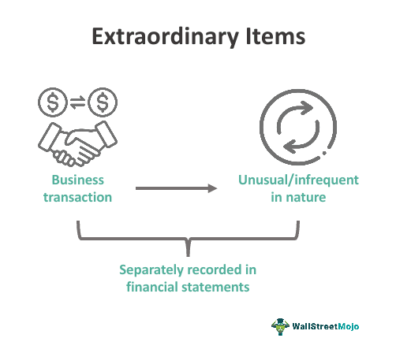

Financial reporting and extraordinary items are pivotal to corporate finance and investment. They offer critical insights into a company's financial health, enabling investors, analysts, and stakeholders to make informed decisions. Historically, the classification of extraordinary items has been contentious, often leading to debates over their relevance and impact on financial statements. Such items were once considered unusual and infrequent, warranting separate disclosure to provide a clearer view of a company’s routine profitability. However, contemporary accounting practices have largely eliminated this classification, reflecting a move towards simplification and improved transparency.

Algorithmic trading, which relies on precise and comprehensive financial data, underscores the importance of understanding these aspects of financial reporting. Such trading strategies use complex mathematical models and algorithms to execute orders at speeds and volumes that are impossible for human traders to achieve. The availability of accurate and detailed financial data, including nuanced understanding of extraordinary items, can significantly enhance these algorithms, providing a competitive edge in financial markets.



This article examines the intersection of financial reporting, extraordinary items, and algorithmic trading. It aims to provide a comprehensive understanding of their roles and implications, illustrating how they integrate into modern trading strategies. Through this exploration, readers will gain insights into the evolving landscape of financial reporting and its critical importance in the context of algorithmic trading.

## Table of Contents

## Understanding Financial Reporting

Financial reporting is a critical component of corporate governance and economic systems, serving as the primary medium through which companies communicate their financial performance and condition to stakeholders. This process involves the preparation and disclosure of financial statements, which are essential for making informed investment and business decisions. The three fundamental components of financial statements are the Income Statement, Balance Sheet, and Cash Flow Statement.

The Income Statement, also known as the Profit and Loss Statement, details a company’s revenues, expenses, and profits over a specific period. It reflects the company’s operational efficiency and profitability, providing insights into its core operating activities. The formula for calculating net income, a key figure from the Income Statement, is as follows:

$$
\text{Net Income} = \text{Total Revenue} - \text{Total Expenses}
$$

The Balance Sheet presents a snapshot of a company’s financial position at a specific point in time, highlighting assets, liabilities, and shareholders’ equity. This statement is pivotal for assessing a company’s [liquidity](/wiki/liquidity-risk-premium), financial health, and capital structure. The fundamental accounting equation governing the Balance Sheet is:

$$
\text{Assets} = \text{Liabilities} + \text{Shareholders' Equity}
$$

The Cash Flow Statement, meanwhile, offers a detailed account of the cash inflows and outflows from operating, investing, and financing activities. This statement is indispensable for evaluating a company’s cash management practices and financial flexibility.

Financial reporting is governed by regulatory standards such as Generally Accepted Accounting Principles (GAAP) in the United States and the International Financial Reporting Standards (IFRS) used in many other countries. These standards aim to ensure that financial statements are consistent, transparent, and comparable across industries and regions. Compliance with these standards underpins the reliability of financial reports, enabling stakeholders to compare financial data and make sound economic decisions.

In addition to ensuring transparency, financial reporting plays a significant role in strategic planning and risk management. Companies utilize financial reports to assess past performance, identify trends, and formulate future business strategies. For risk management, comprehensive financial analysis allows firms to identify potential financial risks and implement measures to mitigate them.

By adhering to rigorous standards and providing critical financial information, financial reporting bolsters market confidence, facilitates capital allocation, and supports effective oversight and regulation in the corporate sector.

## Extraordinary Items in Financial Statements

Extraordinary items were historically distinct components in financial statements, representing events that were both unusual and infrequent in nature. Their separate disclosure was essential for stakeholders to understand and measure a company's core profitability accurately. Such items included natural disasters or expropriation losses which were not expected to recur in the ordinary [course](/wiki/best-algorithmic-trading-courses) of business.

The Financial Accounting Standards Board (FASB) introduced a significant update in 2015 that abolished the classification of extraordinary items. This decision was made to simplify financial reporting. By eliminating this category, the FASB aimed to reduce complexity and enhance the comparability of financial statements, making it easier for investors and analysts to interpret a company's financial health.

Prior to the 2015 update, extraordinary items had been explicitly outlined in financial statements as distinct line items. The main rationale for this separation was the potential substantial impact these items could have on profitability metrics. Without proper disclosure, financial analysis could misconstrue the underlying performance or recurring profitability of a business.

With the removal of this classification, the treatment of such items has shifted. Now, rather than appearing as separate line items, they are included within the narrative notes of financial statements. This change aligns with the broader effort to improve transparency and the comparability of financial information across companies. By integrating the details of what would previously have been considered extraordinary items into the comprehensive narrative, stakeholders gain a clearer, more holistic view of a company's operational environment and the nonrecurring events that influence its profitability. This shift underscores a modern approach to financial transparency and standardization, crucial for well-informed decision-making in financial markets.

## Nonrecurring Items and Their Significance

Nonrecurring items are financial events that, while significant, do not happen regularly and thus are distinguished from a company’s core operational activities. These items, unlike extraordinary items, do not meet the criteria of being both unusual and infrequent but still warrant separate reporting due to their potential impact on a company's financial statements. Common nonrecurring items include asset sales, restructuring costs, impairment losses, and litigation settlements.

Asset sales can lead to gains or losses that significantly influence financial statements. For example, selling a division of a company might result in a considerable one-time profit, which would appear in the financial period in which the sale occurs. Without identifying these as nonrecurring, the financial performance might appear inflated, thereby misleading stakeholders regarding the company’s ongoing profitability.

Restructuring costs are another form of nonrecurring item. These costs arise when a company undergoes significant organizational changes aimed at improving efficiency or reducing costs. Although such changes are necessary for long-term financial health, they might substantially affect short-term financial results, impacting net income and earnings per share (EPS). For stakeholders, recognizing these impacts as nonrecurring provides clarity on the company’s operational performance exclusive of these adjustments.

Impairment losses occur when an asset's market value drops below its carrying amount on the balance sheet, requiring a write-down to reflect the new value. Such losses, while not occurring frequently, can distort a company’s annual profit metrics if not reported as nonrecurring. Similarly, litigation settlements, whether favorable or adverse, can introduce significant one-time effects on financial performance.

The precise identification and transparent reporting of nonrecurring items are crucial for evaluating a company's genuine financial health. Their inclusion in reported financial metrics like net income or EPS can inflate or deflate these figures, leading to potential misinterpretations of a company's financial condition. For investors and analysts, understanding whether these items are likely to recur is essential for accurate forecasting and valuation.

Transparent reporting of nonrecurring items enhances the credibility of financial statements. By distinguishing these events from regular business operations, companies facilitate accurate financial analyses and informed decision-making. This transparency aids analysts in conducting adjustments to financial statements, allowing for more precise evaluation of a company's performance.

To automate the adjustment for nonrecurring items in financial analysis, one might use Python with libraries like pandas for data manipulation. For example, analysts can segregate nonrecurring items from regular income using:

```python
import pandas as pd

# Sample data representation
data = {'Income': [1000, 1200, 1100], 'Nonrecurring Gain': [200, 0, 100],
        'Nonrecurring Loss': [0, 100, 0]}

df = pd.DataFrame(data)

# Adjusted Income calculation removing nonrecurring items
df['Adjusted Income'] = df['Income'] - df['Nonrecurring Gain'] + df['Nonrecurring Loss']
print(df)
```

This approach ensures a clearer view of operational performance, independent of nonrecurring events, supporting strategic decision-making and investment assessments.

## Algorithmic Trading and Financial Reports

Algorithmic trading utilizes computer algorithms to execute trades based on predefined criteria, transforming financial markets by enabling faster and more efficient trading activities. Central to the efficacy of these algorithms is the data they process, primarily sourced from financial reports. These reports provide critical insights into a company’s financial health, influencing trading decisions and strategy formulations within these algorithms.

A thorough understanding of extraordinary and nonrecurring items within these financial reports is crucial for developing robust trading algorithms. Extraordinary items, which were once recognized separately in financial statements for their unusual and infrequent nature, have now been integrated into comprehensive financial disclosures. This integration demands that algorithms discern these items to accurately assess a company’s operational performance rather than being skewed by nonrecurring events. For instance, if a company's net income includes a significant nonrecurring gain from an asset sale, the algorithm must adjust for this to evaluate the company's performance accurately.

Traders and algorithm developers rely heavily on accurate financial insights to optimize strategies and predict market trends. Such insights enable algorithms to adapt to varying market conditions and refine their trading logic. The integration of [machine learning](/wiki/machine-learning) has markedly enhanced these capabilities, allowing algorithms to learn from vast datasets, identify patterns, and make informed predictions. Real-time data processing further augments the effectiveness of these algorithms, equipping them to respond to market changes instantaneously.

Here's a simple Python example illustrating how algorithms might adjust net income calculations by excluding nonrecurring items:

```python
def adjusted_net_income(net_income, nonrecurring_gains, nonrecurring_losses):
    return net_income - nonrecurring_gains + nonrecurring_losses

# Example usage
net_income = 500000
nonrecurring_gains = 20000
nonrecurring_losses = 10000

adjusted_income = adjusted_net_income(net_income, nonrecurring_gains, nonrecurring_losses)
print(f"Adjusted Net Income: {adjusted_income}")
```

Machine learning models, such as regression analysis, can further refine trading strategies by predicting future stock prices based on adjusted financial metrics, past performance, and market conditions.

The confluence of precise financial reporting and advanced [algorithmic trading](/wiki/algorithmic-trading) methodologies holds significant promise for traders seeking a competitive edge in rapidly evolving financial markets.

## Impact on Trading Strategies

The presence of extraordinary and nonrecurring items in financial reports can significantly impact trading strategies, especially those driven by algorithmic systems. These items have the potential to distort key financial metrics such as earnings per share (EPS) and net income, which are often integral inputs for trading algorithms.

### Adjustments for Accurate Operational Performance Assessment

To address these distortions, trading algorithms must incorporate mechanisms to adjust for or exclude the effects of extraordinary and nonrecurring items. This ensures that the operational performance assessment is reflective of the underlying economic reality rather than skewed by irregular events. For instance, an algorithm might be programmed to smooth earnings by excluding one-time events, providing a clearer view of a company's consistent performance.

### Requirement for Seasoned Financial Analysis

Algorithmic trading strategies must emulate advanced financial analysis techniques to understand the implications of these items. A sophisticated algorithm may, for example, use a time-series analysis to differentiate persistent financial trends from temporary anomalies caused by extraordinary or nonrecurring items. By applying techniques such as moving averages or exponential smoothing, algorithms can achieve a more accurate assessment of financial health.

```python
import pandas as pd
import numpy as np

# Example: Calculate the adjusted earnings excluding nonrecurring items
def calculate_adjusted_earnings(data):
    """
    Calculate adjusted earnings by excluding nonrecurring items.
    :param data: DataFrame with columns for net income and nonrecurring items
    :return: Series of adjusted earnings
    """
    adjusted_earnings = data['Net Income'] - data['Nonrecurring Items']
    return adjusted_earnings

# Sample data
data = pd.DataFrame({
    'Net Income': [100, 120, 110, 150],
    'Nonrecurring Items': [5, 10, 0, 20]
})

adjusted_earnings = calculate_adjusted_earnings(data)
print(adjusted_earnings)
```

### Significance of Real-world Data Processing and Case Studies

The integration of real-world data processing and targeted case studies is crucial for validating the impact of financial data adjustments. Using historical data, trading algorithms can back-test their adjusted strategies to measure performance improvements and determine reliability. This helps in understanding the broader market impact when unexpected financial items appear on financial statements.

By leveraging machine learning techniques, such as regression models or neural networks, algorithmic systems can further enhance their capability to analyze complex datasets. These models can identify hidden patterns and recognize the potential future occurrence of extraordinary and nonrecurring items, thus adapting trading strategies proactively.

The careful assessment and handling of extraordinary and nonrecurring items, supplemented by case study insights and advanced computational methods, enable algorithms to maintain robustness and effectiveness in their trading strategies. Accurate financial data interpretation thus remains a cornerstone for traders seeking to thrive in dynamic financial markets.

## Conclusion

The intersection of financial reporting, extraordinary items, and algorithmic trading signifies the critical importance of precise financial analysis. This intersection demands a thorough understanding of detailed financial data as it plays a pivotal role in shaping investment strategies and making informed trading decisions. Accounting practices have evolved over time, with significant strides toward ensuring clarity and transparency in financial reporting. These improvements facilitate investors and firms in gauging the financial health and operational performance of companies more accurately.

Algorithmic trading, increasingly prevalent in modern financial markets, relies substantially on accurate data interpretation for crafting effective trading strategies. The precision with which financial data is analyzed and interpreted directly influences the performance and reliability of trading algorithms. As such, market players must consider all aspects of financial reporting, including extraordinary and nonrecurring items, as these elements can significantly alter perceived profitability and financial stability.

A deep understanding of financial nuances, like extraordinary items, equips traders with a significant advantage in financial markets. This understanding enables them to filter out or adjust for non-operational influences on reported earnings, leading to more accurate assessments of a company's recurring financial performance. Such insights become indispensable when designing trading algorithms that need to simulate seasoned financial analysis to fulfill their investment objectives efficiently.

The continued advancement of technology promises enhanced capabilities in interpreting complex financial data. With the rise of machine learning, [artificial intelligence](/wiki/ai-artificial-intelligence), and real-time data processing, the accessibility and analysis of intricate financial information have become more sophisticated. These advancements hold the potential to refine algorithmic trading strategies further, allowing traders to harness vast amounts of financial data with improved precision and agility, thus paving the way for more robust and informed decision-making processes in the turbulent financial landscape.

## References & Further Reading

1. **Academic Papers**:
   - Ball, R., & Brown, P. (1968). "An Empirical Evaluation of Accounting Income Numbers." *Journal of Accounting Research*. This seminal paper assesses the usefulness of accounting income numbers and highlights the influence of financial reporting on investment decisions.
   - Lo, A. W., & MacKinlay, A. C. (1997). *The Econometrics of Financial Markets*. Princeton University Press. This book provides a comprehensive overview of econometric techniques pertinent to financial market analysis, including applications in algorithmic trading.

2. **Industry Reports**:
   - PwC (2021). *Global Financial Markets Liquidity Study*. An in-depth examination of liquidity across global financial markets, this report provides useful insights into how financial reporting impacts liquidity and market dynamics.
   - Deloitte (2020). *Algorithmic Trading: The Future of Trading Strategies*. This report analyzes the growing role of algorithmic trading, emphasizing the importance of precise financial data for developing effective trading algorithms.

3. **Financial Standards Documentation**:
   - Financial Accounting Standards Board (FASB) (2015). *Accounting Standards Update (ASU) 2015-01: Simplifying Income Statement Presentation by Eliminating the Concept of Extraordinary Items*. This document outlines the changes that eliminated the classification of extraordinary items, promoting a clearer and more simplified presentation of financial statements.
   - International Financial Reporting Standards (IFRS). *IFRS 9: Financial Instruments*. This standard provides guidelines on how entities should classify and measure financial assets, contributing to the consistency and transparency essential in financial reporting.

4. **Books**:
   - Hull, J. C. (2021). *Options, Futures, and Other Derivatives*. Pearson. Hull's textbook is a key resource for understanding the derivatives market, where algorithmic trading plays a significant role.
   - Aldridge, I. (2009). *High-Frequency Trading: A Practical Guide to Algorithmic Strategies and Trading Systems*. Wiley. This book offers a practical guide to implementing algorithmic trading strategies, along with detailed examinations of the relevant financial strategies and their underpinnings.

5. **Online Courses & Resources**:
   - Coursera. "Financial Markets" by Robert Shiller, Yale University. This online course offers foundational insights into financial markets, with segments dedicated to financial statements and trading strategies.
   - Khan Academy. "Accounting and Financial Statements". This series of free online modules covers basic to advanced concepts in financial reporting, serving as a useful primer for those interested in the field.

These resources provide a broad spectrum of information and analysis on financial reporting, extraordinary items, and their implications for algorithmic trading, equipping readers with diverse perspectives and tools for further exploration.

