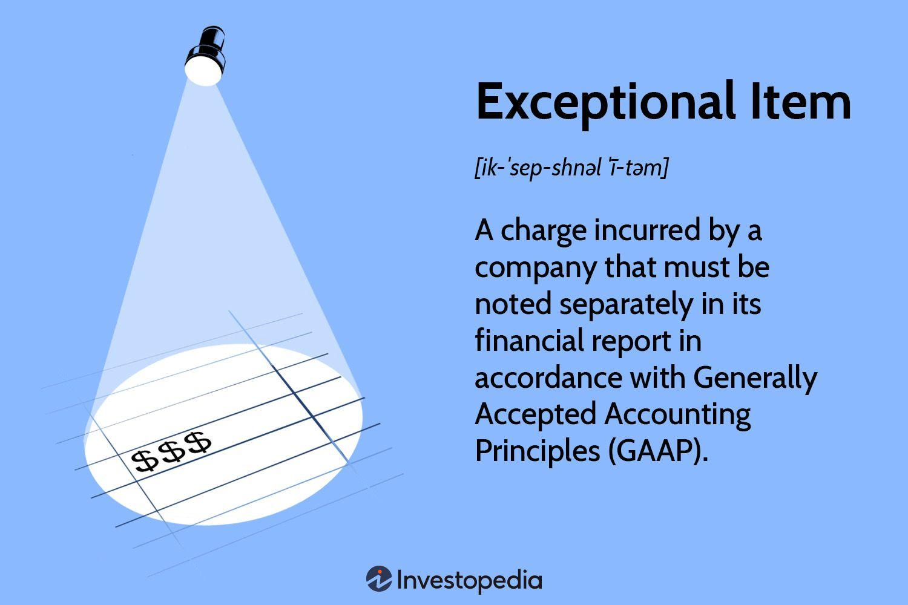

## Table of Contents

## What are extraordinary items in accounting?

Extraordinary items in accounting are unusual and rare events that affect a company's financial statements. These events are not expected to happen often and are different from the company's normal business activities. For example, a natural disaster like a hurricane damaging a company's factory could be an extraordinary item.

When a company reports its earnings, it lists extraordinary items separately on the income statement. This helps investors and analysts understand the company's regular performance without the impact of these rare events. By separating these items, it's easier to see how well the company is doing in its normal operations.

## How are extraordinary items different from regular business activities?

Extraordinary items are things that don't happen very often and are not part of a company's normal work. For example, if a company usually makes cars, an extraordinary item might be a big lawsuit that they have to pay for. This is different from regular business activities, like selling cars or paying for the materials to make them. Regular business activities are what the company does every day to make money and keep running.

When a company writes down its earnings, it keeps extraordinary items separate from the regular stuff. This helps people who look at the company's money see how well it's doing without the unusual events getting in the way. If a company had a big loss because of a flood, but it's still selling lots of products, separating the flood loss helps show that the business is actually doing okay in its normal work.

## Can you provide examples of extraordinary items?

Extraordinary items are things that don't happen often and are not part of a company's everyday work. For example, if a big earthquake damages a company's factory, that's an extraordinary item. It's not something the company expects to happen regularly, and it's not part of their normal business, like making and selling products.

Another example of an extraordinary item could be a huge lawsuit that a company has to pay for. If a company gets sued for something that's not related to their usual business activities, and they have to pay a lot of money, that's an extraordinary item. It's different from regular costs like paying employees or buying materials.

These examples show how extraordinary items are rare and unusual events that can affect a company's money, but they are not part of the company's normal work. By keeping these items separate on financial statements, it helps people see how well the company is doing in its regular business without the impact of these unusual events.

## What criteria must an event meet to be classified as an extraordinary item?

For an event to be classified as an extraordinary item, it must be both unusual and infrequent. This means the event should not be something that happens often, and it should not be part of the company's normal business activities. For example, if a company usually makes cars, a big earthquake damaging their factory would be unusual and infrequent, making it an extraordinary item.

The event also needs to be clearly different from the company's regular operations. This helps to show that the event is not something the company expects or plans for in its normal business. For instance, a large lawsuit that a company has to pay for, which is not related to their usual business, would meet this criterion. By keeping these events separate on financial statements, it helps people understand the company's regular performance without the impact of these rare events.

## How should extraordinary items be reported on financial statements?

Extraordinary items should be reported separately on a company's income statement. This means they are listed away from the regular earnings and expenses. By doing this, it helps people see how the company is doing in its normal business without the impact of these rare events. For example, if a company had a big loss because of a flood, but it's still selling lots of products, showing the flood loss separately helps show that the business is actually doing okay in its normal work.

When a company reports extraordinary items, it usually includes a note or explanation in the financial statements. This note tells people what the extraordinary item is and why it's being reported separately. It might say something like, "The company had to pay a large amount due to a lawsuit that was not related to our normal business activities." This helps everyone understand the unusual event and how it affected the company's money.

## What is the impact of extraordinary items on a company's net income?

Extraordinary items can have a big effect on a company's net income. If a company has to pay a lot of money because of an unusual event, like a big lawsuit or a natural disaster, it can make their net income go down a lot. For example, if a company usually makes a profit of $1 million, but then they have to pay $500,000 because of a flood, their net income for that year would be only $500,000.

By reporting extraordinary items separately, it helps people see the company's regular performance more clearly. If the company's net income is lower because of an extraordinary item, people can still see how well the company is doing in its normal business. This is important because it shows that the company might still be doing well, even if their net income looks lower because of the unusual event.

## How have accounting standards for extraordinary items changed over time?

The rules for reporting extraordinary items have changed over time. Before, companies could list many unusual events as extraordinary items on their financial statements. This made it hard for people to understand how well the company was doing in its normal business. But in 2015, the Financial Accounting Standards Board (FASB) changed the rules. They said that companies in the U.S. can't use the term "extraordinary items" anymore. This was to make financial statements clearer and easier to understand.

Now, instead of calling something an extraordinary item, companies have to explain any unusual events in the notes to their financial statements. They still have to show how these events affect their money, but they can't use the special category of extraordinary items. This change helps people see the company's regular performance more clearly, without getting confused by unusual events. It makes it easier to understand how well the company is doing in its normal business.

## What is the difference between extraordinary items and unusual or infrequent items?

Extraordinary items used to be a special category in accounting for events that were both unusual and infrequent. They were things that didn't happen often and weren't part of a company's normal business. For example, a big earthquake damaging a factory could be an extraordinary item. These items were reported separately on the income statement so people could see the company's regular performance without the impact of these rare events.

But in 2015, the rules changed. Now, companies can't use the term "extraordinary items" anymore. Instead, they have to report any unusual or infrequent events in the notes to their financial statements. Unusual or infrequent items are still events that don't happen often or are not part of the company's normal work, like a big lawsuit or a natural disaster. The difference is that these items are not given a special category on the income statement, making the financial statements simpler and clearer for everyone to understand.

## How do extraordinary items affect financial ratios and analysis?

Extraordinary items can change the way financial ratios and analysis look. If a company has a big loss because of an unusual event, like a flood, it can make their net income lower. This can affect ratios like the profit margin, which shows how much profit the company makes from its sales. If the profit margin looks lower because of the extraordinary item, it might make the company seem less profitable than it really is in its normal business. By reporting these items separately, analysts can adjust the financial ratios to see the company's regular performance more clearly.

For example, if a company usually makes a profit of $1 million but has to pay $500,000 because of a lawsuit, their net income for that year would be only $500,000. This lower net income would make financial ratios like return on assets (ROA) or return on equity (ROE) look worse. But if analysts know about the extraordinary item, they can take it out of their calculations to get a better idea of how well the company is doing in its normal operations. This helps them make more accurate decisions about the company's financial health and performance.

## What are the tax implications of extraordinary items?

When a company has an extraordinary item, it can affect how much tax they have to pay. If the extraordinary item is a big loss, like from a natural disaster, it can lower the company's taxable income. This means they might have to pay less tax that year. But if the extraordinary item is a big gain, like winning a lawsuit, it can increase their taxable income, and they might have to pay more tax.

The tax rules can be different depending on the country and the type of extraordinary item. In some places, companies can [carry](/wiki/carry-trading) forward losses from extraordinary items to future years to reduce their tax bill later. This helps them manage their taxes better over time. It's important for companies to understand these rules so they can plan their taxes correctly and make the most of any tax benefits they might get from extraordinary items.

## How do companies disclose extraordinary items in their financial notes?

When a company has an extraordinary item, they have to tell people about it in the notes to their financial statements. These notes are like extra information that comes with the main financial reports. They explain what the extraordinary item is, why it happened, and how it affected the company's money. For example, if a company had to pay a lot of money because of a big lawsuit, they would say in the notes that this was an unusual event and not part of their normal business.

The notes help people understand the company's financial situation better. They show how the extraordinary item changed the company's earnings for that year. By reading these notes, investors and analysts can see the company's regular performance without the impact of the unusual event. This makes it easier for them to decide if the company is doing well in its normal business, even if there was a big loss or gain from something unusual.

## What are the challenges and controversies associated with identifying and reporting extraordinary items?

Identifying and reporting extraordinary items can be tricky because it's hard to decide what counts as unusual and infrequent. Companies might want to call something an extraordinary item to make their regular earnings look better. But if too many things are called extraordinary, it can confuse people who are trying to understand the company's financial health. Before the rules changed in 2015, companies could use the term "extraordinary items" a lot, which made it hard for investors to see the company's real performance.

There have been controversies about whether companies were using the extraordinary items category to hide bad news or make their financial statements look better. Some people thought that companies were calling too many things extraordinary, which made it hard to trust the financial reports. When the rules changed and the term "extraordinary items" was taken away, it was to make financial statements clearer and easier to understand. Now, companies have to explain any unusual events in the notes to their financial statements, which helps everyone see the company's regular performance more clearly.

## What is Understanding Financial Reporting?

Financial reporting is a critical component of corporate governance and economic systems, serving as the primary medium through which companies communicate their financial performance and condition to stakeholders. This process involves the preparation and disclosure of financial statements, which are essential for making informed investment and business decisions. The three fundamental components of financial statements are the Income Statement, Balance Sheet, and Cash Flow Statement.

The Income Statement, also known as the Profit and Loss Statement, details a company’s revenues, expenses, and profits over a specific period. It reflects the company’s operational efficiency and profitability, providing insights into its core operating activities. The formula for calculating net income, a key figure from the Income Statement, is as follows:

$$
\text{Net Income} = \text{Total Revenue} - \text{Total Expenses}
$$

The Balance Sheet presents a snapshot of a company’s financial position at a specific point in time, highlighting assets, liabilities, and shareholders’ equity. This statement is pivotal for assessing a company’s [liquidity](/wiki/liquidity-risk-premium), financial health, and capital structure. The fundamental accounting equation governing the Balance Sheet is:

$$
\text{Assets} = \text{Liabilities} + \text{Shareholders' Equity}
$$

The Cash Flow Statement, meanwhile, offers a detailed account of the cash inflows and outflows from operating, investing, and financing activities. This statement is indispensable for evaluating a company’s cash management practices and financial flexibility.

Financial reporting is governed by regulatory standards such as Generally Accepted Accounting Principles (GAAP) in the United States and the International Financial Reporting Standards (IFRS) used in many other countries. These standards aim to ensure that financial statements are consistent, transparent, and comparable across industries and regions. Compliance with these standards underpins the reliability of financial reports, enabling stakeholders to compare financial data and make sound economic decisions.

In addition to ensuring transparency, financial reporting plays a significant role in strategic planning and risk management. Companies utilize financial reports to assess past performance, identify trends, and formulate future business strategies. For risk management, comprehensive financial analysis allows firms to identify potential financial risks and implement measures to mitigate them.

By adhering to rigorous standards and providing critical financial information, financial reporting bolsters market confidence, facilitates capital allocation, and supports effective oversight and regulation in the corporate sector.

## References & Further Reading

1. **Academic Papers**:
   - Ball, R., & Brown, P. (1968). "An Empirical Evaluation of Accounting Income Numbers." *Journal of Accounting Research*. This seminal paper assesses the usefulness of accounting income numbers and highlights the influence of financial reporting on investment decisions.
   - Lo, A. W., & MacKinlay, A. C. (1997). *The Econometrics of Financial Markets*. Princeton University Press. This book provides a comprehensive overview of econometric techniques pertinent to financial market analysis, including applications in algorithmic trading.

2. **Industry Reports**:
   - PwC (2021). *Global Financial Markets Liquidity Study*. An in-depth examination of liquidity across global financial markets, this report provides useful insights into how financial reporting impacts liquidity and market dynamics.
   - Deloitte (2020). *Algorithmic Trading: The Future of Trading Strategies*. This report analyzes the growing role of algorithmic trading, emphasizing the importance of precise financial data for developing effective trading algorithms.

3. **Financial Standards Documentation**:
   - Financial Accounting Standards Board (FASB) (2015). *Accounting Standards Update (ASU) 2015-01: Simplifying Income Statement Presentation by Eliminating the Concept of Extraordinary Items*. This document outlines the changes that eliminated the classification of extraordinary items, promoting a clearer and more simplified presentation of financial statements.
   - International Financial Reporting Standards (IFRS). *IFRS 9: Financial Instruments*. This standard provides guidelines on how entities should classify and measure financial assets, contributing to the consistency and transparency essential in financial reporting.

4. **Books**:
   - Hull, J. C. (2021). *Options, Futures, and Other Derivatives*. Pearson. Hull's textbook is a key resource for understanding the derivatives market, where algorithmic trading plays a significant role.
   - Aldridge, I. (2009). *High-Frequency Trading: A Practical Guide to Algorithmic Strategies and Trading Systems*. Wiley. This book offers a practical guide to implementing algorithmic trading strategies, along with detailed examinations of the relevant financial strategies and their underpinnings.

5. **Online Courses & Resources**:
   - Coursera. "Financial Markets" by Robert Shiller, Yale University. This online course offers foundational insights into financial markets, with segments dedicated to financial statements and trading strategies.
   - Khan Academy. "Accounting and Financial Statements". This series of free online modules covers basic to advanced concepts in financial reporting, serving as a useful primer for those interested in the field.

These resources provide a broad spectrum of information and analysis on financial reporting, extraordinary items, and their implications for [algorithmic trading](/wiki/algorithmic-trading), equipping readers with diverse perspectives and tools for further exploration.

