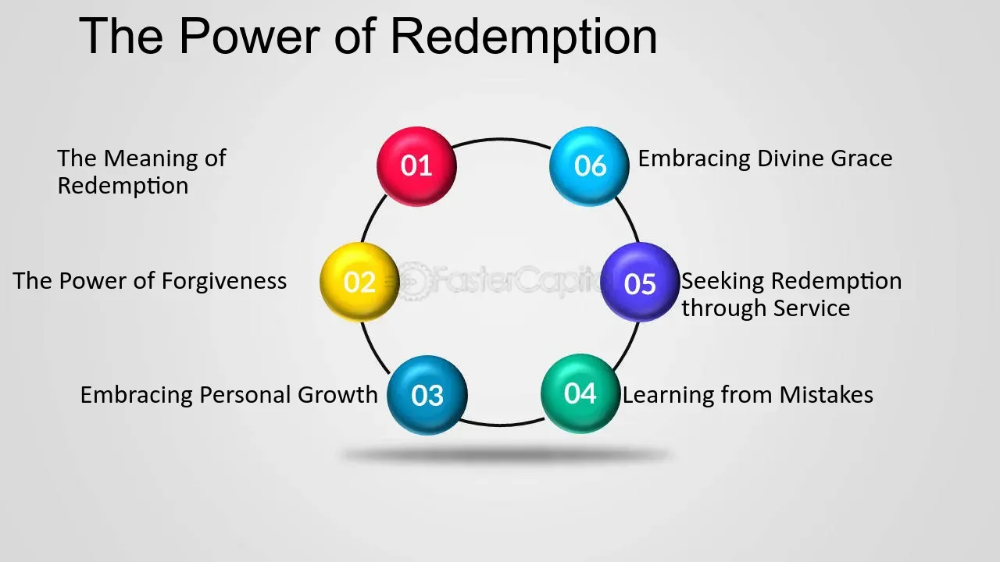

## Table of Contents

## What is extraordinary redemption?

Extraordinary redemption is when a company pays back a bond or loan earlier than planned. This usually happens because of special events, like if the company gets a lot of money from selling something big or if there are changes in the law that affect the loan.

Companies might choose to do this to save money on interest or to get rid of debt quickly. But, it can be a surprise for the people who lent the money, because they were expecting to get interest payments for a longer time. So, the loan agreement often has rules about how and when an extraordinary redemption can happen.

## How does extraordinary redemption differ from regular redemption?

Extraordinary redemption and regular redemption are ways a company can pay back money it borrowed, but they happen for different reasons. Regular redemption is when a company pays back a bond or loan on the date that was planned from the start. It's like paying back a loan on time, as agreed. This is what usually happens and everyone expects it.

Extraordinary redemption is different because it happens earlier than planned and usually because something special or unexpected happens. For example, if a company sells a big part of its business and gets a lot of money, it might use that money to pay back the loan early. This can be good for the company because it can save on interest, but it might not be good for the people who lent the money because they were expecting to get interest payments for longer.

## What are the typical triggers for extraordinary redemption?

Extraordinary redemption happens when a company decides to pay back a loan or bond earlier than planned because of special events. One common reason is if the company gets a lot of money unexpectedly, like from selling a big part of their business or getting a big payment. This extra money can be used to pay off the debt early, which can save the company money on interest.

Another reason for extraordinary redemption is if there are changes in the law or regulations that affect the loan or bond. For example, if new rules make it harder or more expensive for the company to keep the loan, they might choose to pay it back early. This helps them avoid future problems or costs.

Sometimes, extraordinary redemption can also happen if the company merges with another company or if there are big changes in how the company is run. These events can make it a good idea for the company to pay back the debt early, even if it wasn't part of the original plan.

## Can you provide examples of events that might lead to extraordinary redemption?

One example of an event that might lead to extraordinary redemption is when a company sells a big part of its business. Imagine a company that owns a lot of factories decides to sell one of them for a lot of money. With this extra money, the company might choose to pay back a loan early, even though they didn't plan to do that before. This can save them money because they won't have to pay as much interest on the loan.

Another event could be a change in the law that affects the loan or bond. For example, if the government makes new rules that make it harder or more expensive for the company to keep the loan, the company might decide to pay it back early. This helps them avoid future problems or costs that come with the new rules.

Lastly, if a company merges with another company, this can also lead to extraordinary redemption. When two companies join together, they might have more money or different financial plans. As a result, they might decide to pay back a loan early to clean up their finances and start fresh with the new company structure.

## Who typically initiates the process of extraordinary redemption?

The company that borrowed the money usually starts the process of extraordinary redemption. They might decide to do this if they get a lot of money from selling something big, like a factory, or if there are changes in the law that make keeping the loan harder or more expensive. When the company decides it's a good idea to pay back the loan early, they start the process.

The people who lent the money, like banks or investors, don't usually start the process of extraordinary redemption. They might not like it because they were expecting to get interest payments for longer. But, the loan agreement often has rules about how and when an extraordinary redemption can happen, so the company has to follow those rules when they decide to pay back the loan early.

## What are the legal and contractual considerations for extraordinary redemption?

When a company wants to do an extraordinary redemption, they need to look at the legal and contractual rules that were set up when they got the loan or bond. These rules are written in the loan agreement, and they tell the company how and when they can pay back the money early. The agreement might say that the company needs to give the lenders a certain amount of warning before they can do an extraordinary redemption. It might also say that the company has to pay a special fee for paying back the loan early, to make up for the interest the lenders were expecting to get.

Sometimes, the law can affect whether a company can do an extraordinary redemption. For example, if the government makes new rules that change how loans work, the company might have to pay back the loan early to follow the new rules. The company needs to make sure they understand these laws and follow them correctly. If they don't, they could get into legal trouble or have to pay fines. So, it's important for the company to talk to their lawyers and make sure they are doing everything right before they start the process of extraordinary redemption.

## How does extraordinary redemption affect bondholders?

When a company does an extraordinary redemption, it pays back a bond earlier than planned. This can be bad for bondholders because they lose out on the interest they were expecting to get until the bond was supposed to be paid back. Bondholders might have been counting on that interest money to help them pay their bills or save for the future. So, when the bond gets paid back early, they might need to find another way to make up for the lost interest.

On the other hand, if the bondholders get their money back early, they can use it to buy new bonds or invest in other things. This can be good if they find a new investment that pays more interest than the old bond. But it can also be hard because finding a good new investment might take time and effort. So, extraordinary redemption can be a mixed bag for bondholders, with both good and bad effects depending on what they do with the money they get back early.

## What are the financial implications of extraordinary redemption for issuers?

When a company does an extraordinary redemption, it means they are paying back a loan or bond earlier than they planned. This can be good for the company because it saves them money on interest. If they got a lot of money from selling something big or if the law changed and made the loan more expensive, paying it back early can help them keep more money in their pocket. It also helps clean up their finances, which can make it easier for them to borrow money again in the future.

But, doing an extraordinary redemption can also have some downsides for the company. They might have to pay a special fee for paying back the loan early, which can eat into the money they save on interest. Also, if they paid back the loan because they sold something big, they might not have that thing to make money anymore. So, they need to be careful and make sure that paying back the loan early is really the best choice for their financial health.

## How is the redemption price determined in cases of extraordinary redemption?

When a company does an extraordinary redemption, the price they have to pay to pay back the bond or loan early is usually written in the loan agreement. This price is called the redemption price. It can be the full amount of the loan plus any interest that has built up until the day they pay it back. Sometimes, the redemption price also includes a special fee for paying back the loan early. This fee is to make up for the interest the lenders were expecting to get if the loan had been paid back on the original date.

The exact redemption price can change depending on the terms in the loan agreement. For example, if the company sold a big part of their business and got a lot of money, the redemption price might be just the amount they borrowed plus any interest up to that day. But if they are paying back the loan because of a change in the law, the redemption price might also include a fee to cover the costs the lenders have because of the early payment. The company needs to look at the loan agreement carefully to know exactly what they have to pay for an extraordinary redemption.

## What are the tax implications of extraordinary redemption for investors?

When a company does an extraordinary redemption, it can affect the taxes that investors have to pay. If investors get their money back early, they might have to pay taxes on the interest they earned up to that point. The interest they got from the bond is usually considered taxable income, so they need to report it on their tax return. This can be a surprise for investors because they were expecting to get the interest over a longer time, and now they have to pay taxes on it all at once.

Also, if the redemption price includes a special fee for paying back the loan early, that fee might be treated differently for tax purposes. Sometimes, this fee can be seen as a capital gain or loss, depending on what the investor paid for the bond originally. This means the investor might have to pay more taxes or might get a tax break, depending on whether they made or lost money on the bond. It's important for investors to talk to a tax advisor to understand exactly how an extraordinary redemption will affect their taxes.

## How can investors protect themselves against the risks associated with extraordinary redemption?

Investors can protect themselves against the risks of extraordinary redemption by carefully reading the bond's terms and conditions before buying it. The bond agreement will tell them if the company can pay back the bond early and what the rules are for doing that. If investors know that an extraordinary redemption might happen, they can decide if they are okay with that risk or if they want to invest in a different bond that doesn't have that risk.

Another way investors can protect themselves is by diversifying their investments. This means they should not put all their money into one bond or one type of bond. If they spread their money across different bonds and other investments, the impact of an extraordinary redemption on one bond won't hurt their whole investment plan. By having a mix of investments, they can lower the risk that comes with any single bond being paid back early.

## What are some case studies or historical examples of extraordinary redemption in action?

One example of extraordinary redemption happened with the energy company Enron in 2001. Enron was in big financial trouble and decided to sell off some of its assets to get money. They used this money to pay back some of their bonds early, which is an extraordinary redemption. This was a surprise to the bondholders because they were expecting to get interest payments for a longer time. The early redemption was part of Enron's efforts to manage its debt as it faced bankruptcy, and it showed how extraordinary redemption can be used in tough financial situations.

Another example is when the pharmaceutical company Pfizer bought its competitor Wyeth in 2009. As part of the deal, Pfizer had to pay back some of Wyeth's bonds early. This was an extraordinary redemption because the bonds were supposed to be paid back later, but the merger changed the plan. The bondholders got their money back earlier than expected, which meant they lost out on future interest payments. This case shows how mergers and acquisitions can lead to extraordinary redemption and affect the people who lent the money.

## References & Further Reading

[1]: ["Options, Futures, and Other Derivatives"](https://www.amazon.com/Options-Futures-Other-Derivatives-10th/dp/013447208X) by John C. Hull

[2]: ["Fixed Income Securities: Tools for Today's Markets"](https://www.amazon.com/Fixed-Income-Securities-Markets-Finance/dp/1119835550) by Bruce Tuckman and Angel Serrat

[3]: Chaboud, A. P., Chiquoine, B., Hjalmarsson, E., & Vega, C. (2014). ["Rise of the Machines: Algorithmic Trading in the Foreign Exchange Market."](https://www.jstor.org/stable/43612951) Journal of Finance, 69(5), 2045-2084.

[4]: Brogaard, J., Hendershott, T., & Riordan, R. (2014). ["High-Frequency Trading and Price Discovery."](https://academic.oup.com/rfs/article-abstract/27/8/2267/1582754) The Quarterly Journal of Economics, 129(4), 1547-1621.

[5]: López de Prado, M. (2018). ["Advances in Financial Machine Learning"](https://www.amazon.com/Advances-Financial-Machine-Learning-Marcos/dp/1119482089) by Marcos Lopez de Prado

[6]: ["The Handbook of Fixed Income Securities"](https://www.amazon.com/Handbook-Fixed-Income-Securities-6th/dp/0071358056) by Frank J. Fabozzi

[7]: ["Algorithmic Trading and DMA: An Introduction to Direct Access Trading Strategies"](https://archive.org/details/algorithmictradi0000john) by Barry Johnson