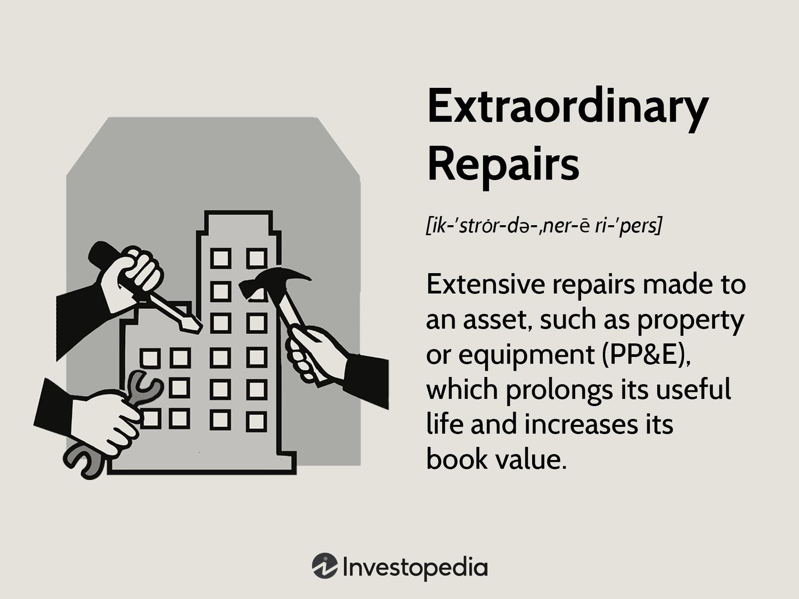

In today's dynamic financial landscape, factors such as asset maintenance, capital improvements, and algorithmic trading are vital in enhancing financial efficiency. These components are key to managing assets effectively and ensuring that investments yield maximum returns. This article will examine the concepts of extraordinary repairs, asset maintenance, and capital improvements, and explore their interaction with algorithmic trading.

Extraordinary repairs, which are substantial expenses aimed at extending an asset’s life, must be distinguished from regular maintenance. Understanding these nuances helps businesses decide when to capitalize on such expenses, thereby enhancing the book value of their assets. Asset maintenance involves regular upkeep necessary for the long-term functionality of assets, presenting immediate impacts on financial statements, and influencing broader financial strategies.



Capital improvements present another facet by involving significant enhancements that boost an asset’s value and efficiency. Unlike routine maintenance or extraordinary repairs, these upgrades often necessitate careful planning and resource allocation for long-term benefits. Each of these areas serves as a potential avenue for business optimization, especially in asset-heavy sectors.

Algorithmic trading utilizes computer algorithms to execute trades, optimizing investment strategies through data-driven decisions. By integrating these algorithms, businesses can analyze maintenance costs, capital improvements, and extraordinary repairs, thereby forecasting potential returns with greater precision. This process minimizes human error while enhancing the overall strategic approach to asset management.

For financial managers and investors, mastering these elements is crucial for maximizing returns and sustaining growth. As the financial world continues to evolve, businesses must embrace these strategies to maintain a competitive edge and ensure enhanced asset performance. Through this comprehensive examination, we will uncover the critical significance of these concepts in the modern finance environment.

## Table of Contents

## Understanding Extraordinary Repairs

Extraordinary repairs are significant expenditures incurred by businesses to extend the life and functionality of an asset beyond its original capacity. Unlike routine maintenance, which primarily focuses on preserving the current operational status of an asset, extraordinary repairs enhance and prolong the asset’s utility and efficiency. Consequently, these repairs are capitalized rather than expensed, influencing the asset's book value and the financial statements over several periods.

The decision to undertake extraordinary repairs is often guided by a cost-benefit analysis that weighs the expense of the repair against the potential benefits of extending the asset’s service life. For example, determining whether to replace a piece of equipment or upgrade its major components involves assessing the financial implications of extending its usability versus acquiring a new asset. This strategic decision-making aims to enhance long-term value and reduce the need for frequent asset replacements.

Capitalizing extraordinary repairs has significant accounting implications. Instead of expensing the costs in the current financial period, these expenses are added to the asset’s value on the balance sheet, thereby increasing the asset’s book value. This capitalization allows businesses to depreciate the repair costs over the remaining useful life of the asset. The following formula represents how to adjust the depreciation schedule:

$$
\text{New Annual Depreciation Expense} = \frac{\text{Original Cost} + \text{Cost of Repairs}}{\text{Revised Remaining Useful Life}}
$$

For example, consider a delivery truck with an original cost of $50,000 and a remaining useful life of 5 years. If an engine replacement costing $10,000 is classified as an extraordinary repair, the cost is capitalized. Assuming the repair extends the truck's useful life by another 3 years, the new annual depreciation expense becomes:

$$
\text{New Annual Depreciation Expense} = \frac{50,000 + 10,000}{8} = 7,500
$$

Historically, significant repairs or replacements, such as an engine rebuild for vehicles, substantial structural work on buildings, or major updates to machinery, are categorized as extraordinary repairs. These examples highlight the focus on prolonging asset effectiveness and improving operational capabilities, providing strategic financial tools for firms to enhance asset utility without immediate cash outflows reflected in operating expenses. Understanding and effectively managing extraordinary repairs are vital for businesses aiming to optimize asset performance and extend operational efficiency.

## The Role of Asset Maintenance

Asset maintenance is a fundamental practice essential for ensuring that assets remain operational and continue to provide value over their expected lifespan. It involves regular inspections, servicing, and necessary updates to keep equipment, machinery, and other valuable resources in optimal condition. By focusing on maintenance, businesses aim to prevent breakdowns and extend the life of their assets.

Distinct from extraordinary repairs, asset maintenance costs are expensed immediately, impacting the financial statements within the current accounting period. This means that the expenditures are recorded as part of the operating expenses and do not enhance the asset’s book value. Instead, these costs ensure that the asset performs at its intended efficiency level, avoiding more substantial and potentially disruptive repairs in the future.

A well-structured maintenance strategy can significantly reduce the need for extraordinary repairs, resulting in cost savings for the business. By catching potential issues early through regular checks and minor repairs, companies can avoid the more significant expenses associated with critical failures and asset downtimes. This proactive approach to asset management not only conserves financial resources but also minimizes operational disruptions.

Typical maintenance activities include tasks such as lubricating machinery, replacing worn parts, checking fluid levels, and ensuring software updates for technological equipment. These routine actions help to identify signs of wear and tear that, if left unaddressed, could lead to major repair needs. Consistent maintenance is especially important for companies that operate within asset-heavy industries, such as manufacturing, where machinery and equipment are critical to production.

For businesses operating within tight budget constraints, effective asset maintenance can be a crucial strategy for balancing cost with operational efficiency. By prioritizing regular upkeep, firms can better allocate their financial resources, enhancing their ability to invest in other strategic areas while maintaining reliable asset performance. Ultimately, the commitment to ongoing maintenance creates a stable foundation for sustainable business operations and long-term asset utilization.

## Capital Improvements and Their Impact

Capital improvements are significant modifications made to an asset, designed to enhance its value, functionality, or efficiency. These improvements stand apart from routine maintenance, as they are anticipated to provide benefits over an extended period and are therefore capitalized. This means they are reported as fixed assets on the company's balance sheet, allowing the cost of improvements to be spread over the asset's useful life through depreciation. This differs from routine maintenance costs, which are expensed in the period incurred.

The benefits of capital improvements are manifold. By investing in building extensions, organizations can increase their operational capacity. Technological upgrades can enhance productivity and efficiency, translating into cost savings and increased profitability in the long run. Renovations, meanwhile, can significantly boost a company's compliance with evolving regulations and improve the workplace environment, thus enhancing employee satisfaction.

An essential element to consider in capital improvements is their potential to impact a firm's financial ratios and overall financial health. For example, an increase in fixed assets may affect the asset turnover ratio, a measure of the company’s ability to generate sales from its assets:

$$
\text{Asset Turnover Ratio} = \frac{\text{Net Sales}}{\text{Average Total Assets}}
$$

A higher asset turnover ratio is often desirable as it indicates efficient use of assets. Thus, businesses aiming for long-term gains should strategically plan capital improvements to optimize resource allocation. By doing so, they can ensure that such investments yield returns that justify the initial capital outlay.

Incorporating capital improvements also requires thoughtful financial and strategic planning. Understanding the potential impact of these changes allows businesses to make informed decisions about resource allocation. This strategic foresight is crucial for maintaining a competitive edge and ensuring sustained growth. As businesses evolve alongside technological advancements and regulatory requirements, capital improvements become pivotal in maintaining relevance and achieving long-term organizational success.

## Integrating Algorithmic Trading

Algorithmic trading employs sophisticated computer algorithms to automate the execution of trades based on predefined criteria or real-time market data. This method significantly enhances the efficiency of trading operations, allowing for quick and precise decision-making that minimizes human intervention and the potential for error.

Incorporating [algorithmic trading](/wiki/algorithmic-trading) into asset management strategies provides a comprehensive understanding of various financial variables such as asset maintenance costs, capital improvements, and extraordinary repairs. By analyzing these factors, algorithms can generate more accurate forecasts of returns, leading to improved investment decisions. For instance, if significant extraordinary repairs on assets are anticipated, an algorithm can adjust dynamically to such input, optimizing the trading strategy to mitigate risks or capitalize on anticipated downtimes.

The core advantage of algorithmic trading is its ability to process vast amounts of data at lightning speed, identifying patterns and executing trades far quicker than any human trader. This rapid execution is crucial, particularly in volatile markets where time is of the essence. Algorithms can respond instantaneously to market changes, ensuring that trading strategies are both reactive and proactive.

Furthermore, financial institutions deploy algorithmic trading to fine-tune portfolio management, enhancing their competitive edge. By leveraging a mix of historical data and real-time inputs, algorithms can continuously optimize asset allocations and hedging strategies. For instance, a Python-based trading algorithm might use libraries like `pandas` and `numpy` for data handling, combined with `scikit-learn` for predictive modeling:

```python
import pandas as pd
import numpy as np
from sklearn.linear_model import LinearRegression

# Sample data loading and preprocessing
data = pd.read_csv('market_data.csv')
X = data[['asset_maintenance_cost', 'capital_improvement', 'extraordinary_repair']]
y = data['returns']

# Training a model
model = LinearRegression().fit(X, y)

# Predicting future returns
future_data = {'asset_maintenance_cost': [5000], 'capital_improvement': [15000], 'extraordinary_repair': [7000]}
future_df = pd.DataFrame(future_data)
predicted_returns = model.predict(future_df)
```

Such integration not only enhances the trading decisions but also aligns closely with the broader financial strategies, ensuring that asset management is dynamic and responsive. As financial markets and technologies evolve, algorithmic trading remains a pivotal component in sustaining the competitive posture of financial entities.

## Conclusion

Incorporating extraordinary repairs, asset maintenance, and capital improvements is a vital strategy for extending the lifespan and enhancing the value of assets within any organization. By employing extraordinary repairs, companies can significantly extend the useful life of their assets beyond the original expectations, thereby maximizing returns on investments. Asset maintenance plays a crucial role in ensuring that equipment and facilities operate efficiently, mitigating potential downtime and reducing the need for costly repairs. Capital improvements, meanwhile, add substantial value by upgrading or enhancing asset capabilities, thus driving higher productivity and ensuring alignment with evolving industry standards.

Algorithmic trading serves as a robust complement to these asset management strategies. By leveraging data-driven insights and automated trade execution, algorithmic trading can optimize decision-making, minimize human error, and enhance operational efficiency. For instance, algorithms can process extensive datasets pertaining to asset conditions, maintenance schedules, and capital improvements to predict optimal asset utilization and investment opportunities. This technological integration ensures that companies can swiftly and accurately respond to market dynamics, a critical capability in today's fast-paced financial environment.

Together, the strategic application of extraordinary repairs, asset maintenance, capital improvements, and algorithmic trading forms an integrated framework. This approach enables businesses to sustain growth, heighten asset performance, and ultimately achieve competitive advantage. As financial landscapes are constantly evolving, it is imperative for businesses to adapt by comprehensively understanding and effectively implementing these strategies. Embracing these concepts equips companies with the tools necessary to navigate and thrive in an increasingly competitive market.

## References & Further Reading

[1]: Bergstra, J., Bardenet, R., Bengio, Y., & Kégl, B. (2011). ["Algorithms for Hyper-Parameter Optimization."](https://dl.acm.org/doi/10.5555/2986459.2986743) Advances in Neural Information Processing Systems 24.

[2]: ["Advances in Financial Machine Learning"](https://www.amazon.com/Advances-Financial-Machine-Learning-Marcos/dp/1119482089) by Marcos Lopez de Prado

[3]: ["Evidence-Based Technical Analysis: Applying the Scientific Method and Statistical Inference to Trading Signals"](https://www.amazon.com/Evidence-Based-Technical-Analysis-Scientific-Statistical/dp/0470008741) by David Aronson

[4]: ["Machine Learning for Algorithmic Trading"](https://github.com/stefan-jansen/machine-learning-for-trading) by Stefan Jansen

[5]: ["Quantitative Trading: How to Build Your Own Algorithmic Trading Business"](https://www.amazon.com/Quantitative-Trading-Build-Algorithmic-Business/dp/1119800064) by Ernest P. Chan